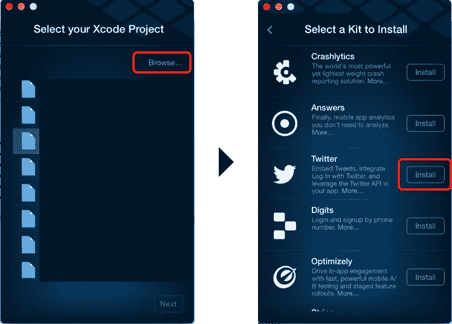
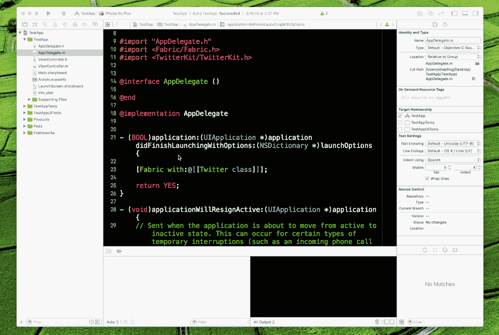

# 如何使用 React Native 和 Fabric 进行单点登录

> 原文：<https://medium.com/hackernoon/how-to-single-sign-on-with-react-native-and-fabric-6fec9de6765a>

最近我开始为 iOS 开发一个移动应用，这要感谢 [React Native](https://hackernoon.com/tagged/react-native) 👻。由于大部分事情都是新的，我想我会在弄清楚每一件事情的同时写下我的心得。

这是这个系列的第一篇文章，希望我能在下面写更多。

# 什么

在这里，我将谈谈我是如何用 React Native 实现单点登录的。

# 为什么

个性化服务是任何[应用](https://hackernoon.com/tagged/application)的一个重要方面。这可以通过要求用户进行身份验证来实现。有几种方法可以做到这一点:

## 1.Web 视图

Web view 是一种在应用程序中打开浏览器并要求用户提供凭据以进行身份验证的方式，然后在完成后将用户重定向回应用程序。

这个方法对我来说实现起来很快，我遵循了官方文档[中的指南。](https://facebook.github.io/react-native/docs/webview.html)

## 2.单点登录(SSO)

SSO 是允许用户使用一组登录凭证(例如，名称和密码)来访问多个应用的服务。该服务针对用户有权访问的所有应用程序对最终用户进行身份验证，并在用户在同一会话期间切换应用程序时消除进一步的提示。欲了解更多信息，您可以点击[这里](http://searchsecurity.techtarget.com/definition/single-sign-on)

# 怎么

像每个人一样，首先我开始寻找关于如何做的指南，我确实找到了一些，有些对于 xcode 来说太具体了，有些需要手动修改。但最后我还是算出了，这里我将解释我是如何实现它的。

## 1.创建 React 应用

当您运行`react-native run-ios`时，您应该会看到下面的屏幕

## 2.将 Fabric 安装到应用中

如果您还不是会员，请前往[https://get.fabric.io/](https://get.fabric.io/)注册并下载 SDK。

登录 SDK 后，选择您的 xcode 项目，然后选择 Twitter 工具包进行安装，并按照应用程序中给出的说明进行操作

转到 [Twitter Apps](https://apps.twitter.com/) 创建您的应用程序，以便您可以获取 API 密钥和密码。

如下图所示，更新 Fabric 下 xcode 项目中的键。

或者你可以直接从`info.plist`更新。

## 3.使用 Twitter 按钮添加登录

我添加了以下代码来创建一个新的按钮，单击该按钮将触发登录

## 4.公开 SSO 模块

因为 React Native 还没有 SSO 模块，所以我需要在 Native 中实现它，并从 JavaScript 访问它。

打开`SSOExample.xcodeproj`，在`Libraries`下添加 2 个新文件。

`***TwitterSignin.h***`T15 这是一个实现`RCTBridgeModule`协议的头文件。如果你想知道，RCT 是 ReaCT 的缩写。

`*TwitterSignin.h*`

`***TwitterSignin.m***`T16 这是一个 Objective-C 文件。除了实现`RCTBridgeModule`协议，该类还必须包含`RCT_EXPORT_MODULE()`宏。这需要一个可选的参数，该参数指定了 JavaScript 代码中可以访问的模块的名称。如果不指定名称，JavaScript 模块名称将与 Objective-C 类名匹配。

因为 React Native 在一个单独的串行 GCD 队列上调用本机模块方法，这可能会改变，所以我想指定只使用主线程。这是使用`- (dispatch_queue_t)methodQueue`完成的。

TwitterSignin.m

React Native 不会将`TwitterSignin`的任何方法暴露给 JavaScript，除非被明确告知这样做。这是使用`RCT_EXPORT_METHOD()`宏完成的:

`TwitterSignin.m`

这里我们创建了一个方法`logIn`，它将回调作为参数，当登录完成时，无论成功还是失败，回调都会被触发。

要了解更多信息，您可以访问官方指南[这里](https://facebook.github.io/react-native/docs/native-modules-ios.html)。

## 5.从 JavaScript 触发

现在，当点击登录按钮时，我触发了上面创建的`logIn`方法。

使用`react-native`中的`NativeModules`访问`LogIn`方法。

感谢您的阅读，如果您喜欢这篇文章，请点击“推荐”或在下面写一个回复。你可以在推特上联系我 [@narendra_shetty](https://twitter.com/narendra_shetty) 。

我写的其他文章:

 [## 我如何为移动网络建立一个超快的优步克隆

### 这篇文章是关于我对性能技术的学习，这些技术用于使优步移动网络尽可能快地反应。

hackernoon.com](https://hackernoon.com/how-i-built-a-super-fast-uber-clone-for-mobile-web-863680d2100f)  [## 我是如何学习冗余概念的

### 所以在过去的几个月里，Javascript 社区中有很多关于 React 和 Redux 的争论。每个人都…

众包工程](https://crowdfire.engineering/redux-explained-in-4-simple-steps-12266c39b72f)  [## 我们如何为 Chrome 构建最快的扩展

### 我们一直想找到一种方法，随时随地分享任何东西。我们的想法是让一些东西…

众包工程](https://crowdfire.engineering/how-we-built-the-fastest-extension-for-chrome-65d695972dee) 

> [黑客中午](http://bit.ly/Hackernoon)是黑客如何开始他们的下午。我们是 [@AMI](http://bit.ly/atAMIatAMI) 家庭的一员。我们现在[接受投稿](http://bit.ly/hackernoonsubmission)，并乐意[讨论广告&赞助](mailto:partners@amipublications.com)机会。
> 
> 如果你喜欢这个故事，我们推荐你阅读我们的[最新科技故事](http://bit.ly/hackernoonlatestt)和[趋势科技故事](https://hackernoon.com/trending)。直到下一次，不要把世界的现实想当然！

