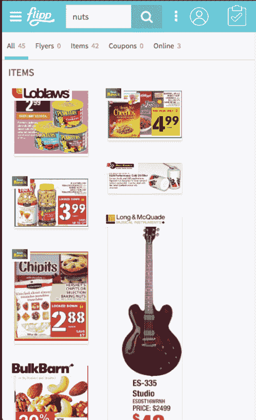
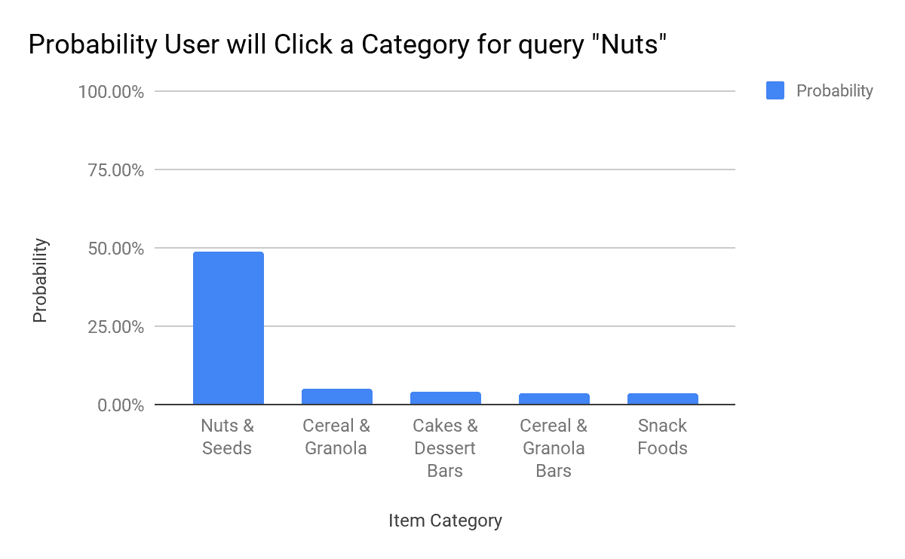
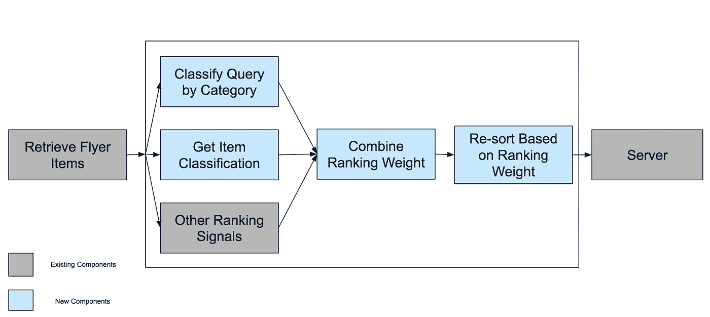
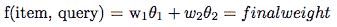
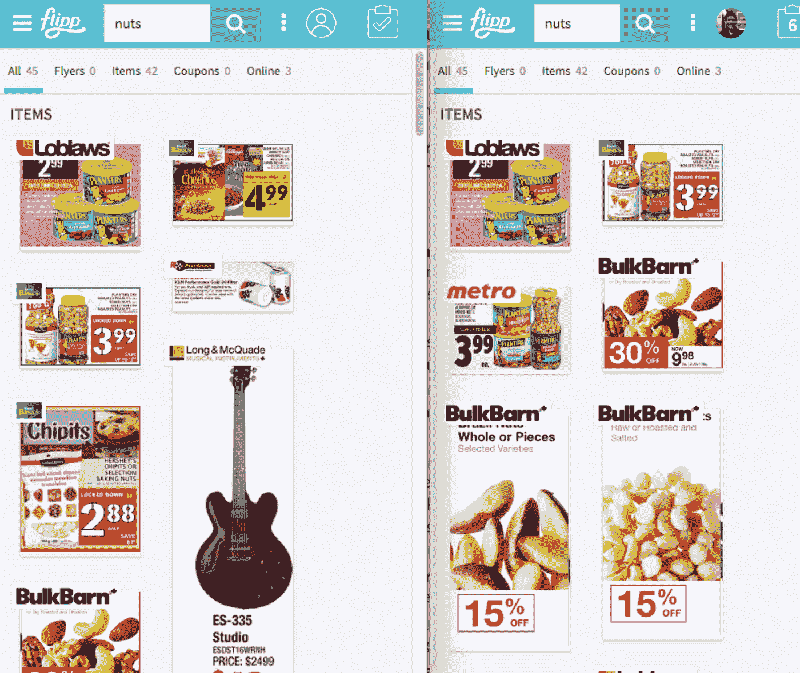

# 如何解决复杂问题:用简单模型测试解决方案

> 原文：<https://medium.com/hackernoon/how-to-solve-complex-problems-test-solutions-with-simple-models-66967dc56e32>

谈到数据科学，在生产中测试你牵强的想法可能会令人生畏。当你处在一个快节奏的环境中，比如 Flipp，想法总是在酝酿，新项目总是在开始，这就特别困难。在探索 Flipp 测试新想法的方法时，我们将看看如何构建简单的模型来解决一些困难的问题。

让我们举一个 Flipp 搜索团队的例子:

# 找出问题所在

搜索引擎的根本目标是满足用户的信息需求。在 Flipp，用户的信息需求是找到符合他们意图的产品交易。所以真正的挑战是理解用户在输入搜索查询时想要找到什么。

经典搜索引擎使用用户查询输入的关键字来检索结果。这些经典系统基于关键词统计对相关结果进行排名。当 Flipp 试图建立一个世界级的搜索引擎时，这可能是一个问题。例如:

单词通常有多种含义，比如单词“nuts”可以指食物或硬件紧固件。其次，产品交易经常在描述中使用另一种产品的关键词，比如当谷物含有“坚果”时。

我们提出的解决这个搜索问题的方案需要两个阶段。首先，你必须学会预测用户搜索时的意图。然后你用这种洞察力来建立一个生产系统。

# 制作简单的模型

对我们团队来说，一个特别有趣的事件是搜索命中。这是指用户在运行查询后点击搜索结果。用户实际上是在告诉我们他们在找什么。

Flipp 传单上的每一件物品都标有类别。我们有超过 5000 个类别可供选择！因此，当用户点击一个搜索结果时，用户能够含蓄地告诉我们他们正在寻找的类别。如果我们为每个查询收集了足够多的事件，我们最终可以确定用户最有可能选择哪个类别。

例如，如果用户搜索“坚果”，用户点击某个类别的概率可以很容易地确定(50%的情况下，用户会点击标记为“坚果和种子”的项目)。

通过这个非常简单的模型，我们能够预测搜索查询的意图。这样一个简化的基本系统有一些明显的缺陷(比如无法预测 Flipp 从未见过的查询)，但是我们稍后会解决这些问题。

# 利用“简单”的想法

下一步是建立一个系统，然后可以使用这个模型进行一些实时预测。这是 [*top-k* *检索*](https://link.springer.com/chapter/10.1007/978-3-642-00887-0_74) 的经典案例。在 Flipp，搜索分两个阶段进行:

1.  使用搜索引擎检索文档。Flipp 使用 Apache Solr 作为我们的主要搜索引擎。
2.  基于外部模型对前 k 个结果进行重新排序。

在这个实现中，我们决定在第 2 阶段解决这个问题。下面的系统图显示了搜索工作的两个阶段。首先，检索传单项目。然后将数据传递给第二个系统，第二个系统首先识别所有检索到的商品的商品类别以及如上所述的基于查询的模型。

然后，它会查看模型中的其他信号，如项目受欢迎程度。然后将这些信号组合成一个线性模型。基于线性模型给每个项目一个新的排序权重。然后，基于新计算的权重对最终列表进行重新排序。

计算每个项目权重的最简单方法是将每个信号量化为一个数值。然后，我们对每个数值进行加权求和来计算单个项目的分数，这决定了最终用户将看到的结果的顺序。在这种情况下，我们可以查看表示查询意图和商品类别的信号。我们称之为类别策展得分，它使用以下公式:

*其中θ1 是一种特性的值，θ2 是另一种特性的值。w1 是第一个特征的权重，w2 是第二个特征的权重*

由于每个项目都有一个类别，我们可以查找用户在查询中点击该类别的概率。例如，假设一袋花生被贴上“坚果和种子”的标签如果查询是“nuts”，用户点击该类别的概率是 50%。然后，在给定查询的情况下，我们说该项目的类别监管得分是 0.5。然后我们计算这个项目和其他一些信号的最终得分。简单吧？

为了验证排名模型的成功，我们进行了 A/B 测试。在这种情况下，A/B 测试允许我们调整模型的变化，以便看到我们的指标的显著提升。下图是一个示例，显示了用户在使用(左侧)和不使用(右侧)简单模型的情况下会看到什么。显然，正确的方法更善于把有用的结果放在列表的最前面。如果没有这个模型，你将会得到像谷类食品、吉他和巧克力片这样的物品，而不是真正的坚果。

# Flipp 的数据哲学

如上所述，我们选择的模型几乎…太简单了。预测查询类别的更好方法是使用更先进的模型，如朴素贝叶斯或[，甚至是神经网络](http://people.cs.pitt.edu/~hashemi/papers/QRUMS2016_HBHashemi.pdf)。

然而，更先进的技术需要时间来构建，并且在将想法投入生产时会带来更多的复杂性。例如，即使训练一个语言模型也更具挑战性，尤其是与简单地查找历史数据相比。

当基础设施都不存在时，建立一个用复杂的机器学习模型进行实时预测的生产系统也会困难得多。正如任何实验项目一样，总有失败的可能。复杂解决方案的失败成本远远高于简单解决方案的成本。(换句话说，为什么要花三个月而不是一周来验证一个想法？)

通过整体思考，我们能够优化风险和回报之间的权衡。简单的模型允许低风险和快速验证想法。在这种情况下，预测模型(实际上只是概率分布)在改善搜索结果方面是成功的。随着利益相关者的认同，企业能够投资于更复杂的模型。

在这种情况下，我们可以寻找更好的方法来预测查询，比如使用神经网络，如上所述。我们也可以利用更高级的建模方法，比如学习排序来建立一个更好的搜索结果排序方法。

你好！我叫 Faizan，是 Flipp 的一名数据工程师。[*Christopher Ngan*](https://www.linkedin.com/in/christopher-ngan-72521152/?ppe=1)*和我一起写了这个帖子。如果你对彻底改变人们买东西的方式感兴趣，看看我们的* [*工程博客*](http://eng.flipp.com/) *和* [*我们目前的招聘信息*](https://corp.flipp.com/jobs) *。*