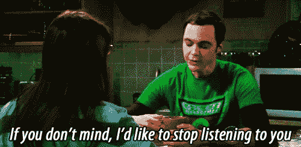
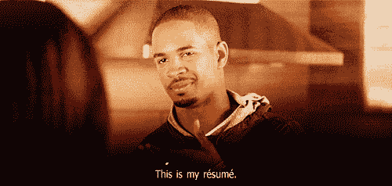
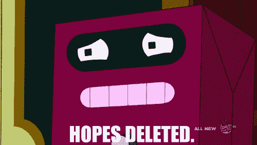
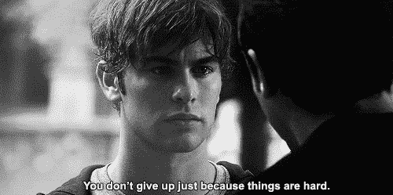
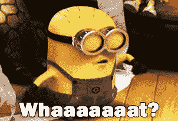

# 如何在招聘季保持冷静

> 原文：<https://medium.com/hackernoon/how-to-stay-calm-during-recruitment-season-internships-in-tech-7944839bf7c9>

我们都知道招聘季压力非常大。在网上寻找实习机会的过程可能会让人不知所措，当你看到你想申请的职位时，你可能已经在准备你的简历和求职信了。

我正试图找到一份与我的职业目标尽可能一致的*暑期实习，最好是在一家能够给我很好的[指导](https://hackernoon.com/tagged/mentoship)的[科技](https://hackernoon.com/tagged/tech)公司。拒绝是很难的，几次拒绝之后，你开始对自己的决定缺乏信心，谁知道呢，你甚至会开始怀疑自己作为候选人的能力。*

*选择一项技能成为这方面的大师如果你发现自己在一年中的这个时候出现在我的社交圈里，你就会知道我所能谈论的就是招聘。当我没有得到面试/工作机会时，那就是谈话变得真正有趣的时候。*

**

*对于那些向我咨询科技实习的朋友，我的最佳建议一直是选择一项技能，无论是编码、设计、展示、销售等等。，并得到 ***真正擅长的*** 。建立一个文件夹，记录演示文稿，无论你选择如何推销自己，都要做好备份的准备；在你申请**和** **之前，尤其是**一旦你得到面试机会。这样做会让你成为一个有吸引力的候选人。*

***激情。事关重大。面试官喜欢听到你对某事充满热情。任何事情。我曾经面试过一个商业分析师的职位，我所能谈论的就是我有多么热爱设计。我收到邀请了。总是对你面试的公司进行研究，阅读最近的公司新闻。学习领导原则和使命陈述，因为这向雇主展示了你对了解他们业务的热情。对我来说，我的激情一直是设计。我专攻 UX，涉足视觉设计。我瞬间爱上了我在高中学习的第一门图形设计课程。在商学院呆了两年后，我参加了一次留学旅行，这次旅行彻底改变了我的观点，现在我是人机交互的双学位。无论你的激情是什么，确保你卖掉它，并且做好它。***

**

*被拒是这个过程的一部分
今年夏天，我雄心勃勃地寻找工作，我想我申请了大约 20 多份实习工作。从海湾到我在西雅图的家，我想我是太急于在 招募开始之前就得到*了。我想有所准备总是好的，但不幸的是，我只收到了少量的电子邮件，我最终不得不继续前进。**

**

*这是整个过程中最困难的部分；处理情绪。不可否认，在申请一个职位之前就让自己紧张会增加不必要的压力。所以干脆**不做**。不要忘记展现你从一开始就知道的自信。招聘人员和面试官在几英里之外就能嗅到自信(和恐惧)。*

*即使你想放弃，也要坚持尝试*

**

*努夫说。即使你认为你搞砸了一次面试，也要记住总会有更多的机会。并且*总是*尽可能多地写下你能从你的采访中记起的东西。反思它们(不管它们是否进展顺利)将会非常有帮助。请记住，无论提供给你什么职位*都是* *而不是**也不会是你的最后一份工作。**

*学会珍惜自己的时间 10 月初，我收到了几份工作邀请，但由于时间和学业的限制，我无法离开学校去另一个州实习 6 个月。开学一段时间后，我终于意识到我有能力获得我想要的实习机会，尽管我被拒绝的次数比我想承认的还要多。一旦我开始接受采访，我真的很兴奋，并开始建立一个小势头。他们是我认为我没有机会得到的职位，因为许多其他公司拒绝了我的同一个职位。我最终发现自己拒绝了邀请，只是为了让那些公司改变我的想法。*

**

*明白只要你拥有一项技能或者对某事有强烈的热情，你就能得到那份工作/实习。*

*不要误解我的意思，成功没有秘密的公式，但是我可以告诉你，有时候我以为我搞砸了面试，其实我没有。雇主希望看到你对自己的工作有信心(也就是你了解自己)。随时准备支持你在简历中说过的话，因为面试官总是在测试你到底有多真实。我没有太多技术/编码面试的经验，但我至少可以说，对于设计，面试官希望在设计挑战中进入你的大脑。**就让他们这样吧。**他们想知道的是，除了分析我的思维过程之外，我是否能做出设计决策(**在设计界非常重要**)。所以我给你的建议是，在你的决定背后要有一个理由。而且说实话，我觉得这几乎适用于你能应聘的每一个角色，不仅仅是设计。*

**

*祝你好运！*

*更新:我将于今年夏天加入谷歌，在加州山景城做 UX 设计实习生！*

******

> *[黑客中午](http://bit.ly/Hackernoon)是黑客如何开始他们的下午。我们是阿妹家庭的一员。我们现在[接受投稿](http://bit.ly/hackernoonsubmission)并乐意[讨论广告&赞助](mailto:partners@amipublications.com)机会。*
> 
> *如果你喜欢这个故事，我们推荐你阅读我们的[最新科技故事](http://bit.ly/hackernoonlatestt)和[趋势科技故事](https://hackernoon.com/trending)。直到下一次，不要把世界的现实想当然！*

**

*[https://upscri.be/hackernoon/](https://upscri.be/hackernoon/)*