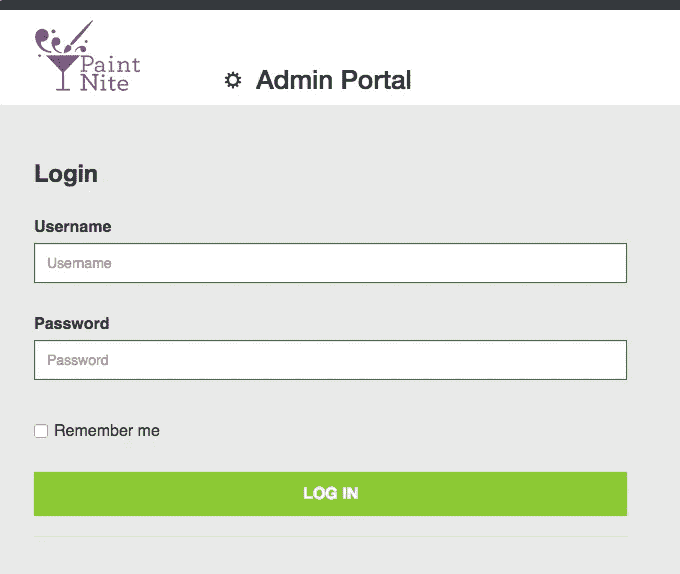
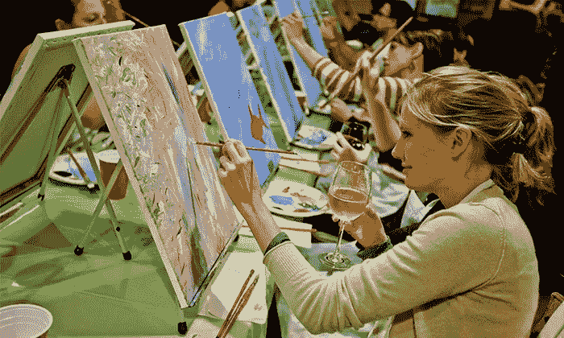
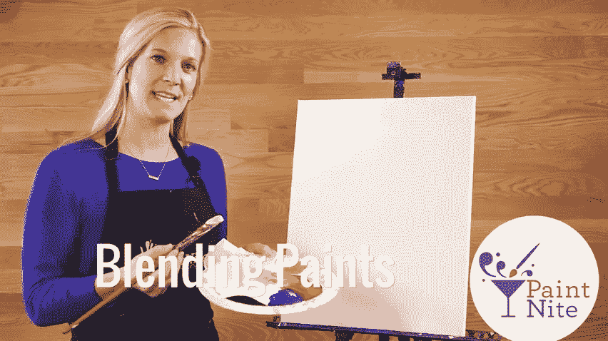
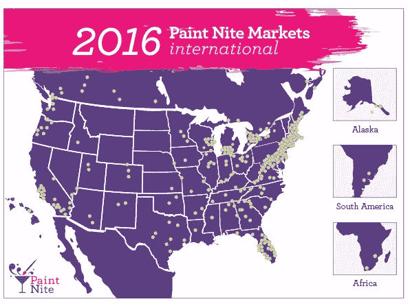
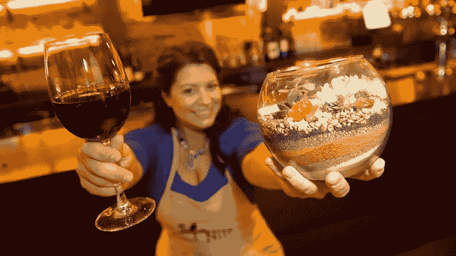

# 如何一年增长 3000%不乱

> 原文：<https://medium.com/hackernoon/how-to-stay-creative-when-growing-3000-a-year-44043dc7b3f5>

*由* [*帕鲁尔辛格*](https://twitter.com/parulia) *负责人*

当 Kate Keough 以首席运营官的身份加入 Paint Nite 时，这个 10 人的活动初创公司成功地结合了莫奈、梅洛和一个资本高效的商业模式，但在组织方面几乎没有什么。当她本月早些时候离开时，该公司已有 100 多名员工，活跃在 1，600 个城市，举办 6，300 场活动，每月为 200，000 名客户提供服务，每年创造 6500 万美元的收入，更不用说 600 万件艺术品的创作了！考虑到资本效率公司直到她上任两年后才筹集到任何风险投资，这一成就更加令人印象深刻。

Kate Keough

在凯特担任首席运营官期间，公司增长了 3000%。我们请她策划了一个回顾展，展示她对初创公司的最佳管理建议，这些建议也希望在一张巨大的画布上留下印记，但不要洒太多颜料。

# 学会对好主意说不

凯特的秘密不是像杰森·布拉克那样把所有东西都扔向墙壁，而是拥抱马克·罗斯科的极简主义。对于那些不喜欢抽象表现主义的人来说，快速发展意味着少做。

例如，Paint Nite 的竞争优势之一是，他们允许自由艺术家以批发价为他们的活动购买颜料、画笔和画布。这是一个伟大的包，除了基奥说，“门户是垃圾，它打破了所有的时间；它是建立在 Excel 表格上的，一塌糊涂。”

早期，她的团队成员恳求凯特让他们重新设计网站。毕竟，修复广泛使用的门户是一个简单而耗时的过程。基奥一贯拒绝这些请求。“尽管有缺点，但它为被许可方节省了数百美元，总而言之，它是有效的，”她说。

Plain, but effective.

Paint Nite 团队决定将宝贵的工程资源集中在能够对底线产生影响的项目上，而不是投入时间来修复这个不优雅但功能完善的网站。该团队三次重新设计了结账流程，不断调整算法以帮助客户找到活动，并不断改进工具，为艺术家提供活动体验分析。当然，艺术家们可能会对内部平台的 UX 感到沮丧，但是保持班级满员并为艺术家提供如何改进班级的反馈，是 Paint Nite 提供的最重要的价值。

这不是一次性的决定。听起来很美好，但多余的想法，如基于网络的课程，被无情地拒绝了，所以每个人都专注于公司的关键使命，将人们聚集在一起，支持 PaintNite 的非凡增长。

# 学会对坏习惯说不

当 Keough 第一次加入 Paint Nite 时，位于自助洗衣店楼上的办公室没有指定的桌子，没有会议室，足球有规律地在工作区内移动。

没有真正的头衔，没有工作描述，也没有任何形式的正式手续——一个人自称为“优秀猴子”。“此外，人们也不太清楚什么才是合适的办公室谈话。柯夫立即草拟了一份组织结构图，填写了人力资源指导方针，更重要的是，执行了这些方针。

基奥还小心翼翼地保存和加强文化中的健康部分，使尼特涂料独一无二。员工敬业、精力充沛，每天会花 12-15 个小时工作——这种热情是一家初创公司的超级力量——但一定要重新组织午餐和有趣的活动，将整个团队聚集在一起。她通过形成一种文化来平衡这种激烈的竞争，在这种文化中，管理层分享所有关键指标，包括好的和坏的，并定期跟踪员工的参与度。她还带头发起了一项“核心价值观运动”，这听起来有点无聊，但实际上有助于团结团队。

# 聪明的商业模式是最好的增长黑客

“油漆和 sip”产品类别在油漆 Nite 成立之前就已确立。这家初创公司的创新是将传统的特许经营模式转变为公司不雇佣教师、不拥有教室的模式。他们基本上是把 AirBnB 剧本应用到艺术课上，创作了一部杰作。Paint Nite 把钱放进了苦苦挣扎的艺术家的口袋，为酒吧提供了在萧条的夜晚涌入的买家，并给顾客带来了独特的创作体验——他们很乐意在脸书上分享这种体验，从而带来了更多的推荐。

虽然这些考虑都很明智，但 Nite 采用的售前模式是 pièce de réresistance。通过预售门票，该公司拥有源源不断的非稀释性营运资本，可用于进一步增长的再投资。许多初创公司认为，他们可以通过一系列增长黑客来获得成功，但最划算的方法来自于从一开始就正确设计商业模式。

# 没有什么能打败 face time——体验，而不是应用

It’s not enough to build a community, it also needs to be nurtured and trained.

Paint Nite 取得的最令人印象深刻的成就之一是招募了数百名自由职业艺术教师，其中大多数人从未经营过企业，并将他们变成了增长的引擎。

“随着我们的不断发展，我们投资了‘Paint Nite Palooza’，这是一个我们最初每年提供 4 次的会议。这可能看起来很多，但早期是我们增长曲线的高峰期，因此面对面的时间尤为宝贵。”

这些聚会让 Paint Nite 展示了他们是如何致力于艺术家的成功，同时还建立了创意导师之间的友谊。

凯特说:“艺术家之间的友谊促成了一个高度参与的在线社交社区——艺术家们会互相帮助，提供他们认为有效的提示和技巧，当他们看到其他人的热心时，这种情况就开始像滚雪球一样。”“这就是为什么我相信我们的活动在竞争中脱颖而出——我们的艺术家举办的活动将数百名其他人的集体想法和反馈付诸实践。”

# 学会爱上垃圾火的味道

一年增长 3000%的严酷事实是，事情很少会变得美好。一路走来，成功看起来可能相当可怕。“当你增长如此之快时，可能会变得一团糟，”基奥说。“我会向我的团队解释说，我们在一个有 100 个垃圾桶着火的房间里，房间变得烟雾弥漫，但如果我们可以忽略一切，只扑灭三个最具影响力的火灾，呼吸就会容易得多。”

# 大数据是一种奢侈

创业公司通常希望数据支持他们的决策，但在早期，可靠的数字很少。“当你开始时，年复一年的趋势是如此奢侈，”基奥说。“有时没有任何数据，你必须明白，你将在灰色地带经营一段时间。”

基奥的建议？挑一个方向，测试一下。衡量它，要么培养它，要么抛弃它。在大多数情况下，无论如何你都会有十个其他的想法。“我不相信多任务处理。”

# 不是每个人都想扩大规模

对于积极性很高的企业家来说，一个挑战是学会理解有时人们不想超越某一点。

“我是一个非常有抱负的人，我真的试图看到人们最好的一面，并思考如何推进他们的职业生涯，”基奥说。“但并不是每个人都希望如此。”创始人需要意识到，有些人只是想要一份工作，或者处于无法像创始人和资深员工一样做出牺牲的阶段。好的组织知道如何创造性地利用这个人才库。

# 利润率就是营销

当 Plant Nite，一个专注于制作玻璃器皿的 paint nite 衍生产品推出时，价格保持在低水平，但该团队没有看到他们与 Paint Nite 一样的牵引力飙升。“随着我们做更多的挖掘，结果是艺术家没有足够的利润来证明所做的努力——考虑到植物比油漆更昂贵、更脆弱，需要更密集的库存管理，”凯特说。“一旦我们调整门票经济，以更好地补偿我们的艺术家的时间和精力，我们发现这个概念急剧起飞。”

# 行动不一定很无聊

人们很容易认为，增加对运营的关注会让你随心所欲的创业公司的能量消耗殆尽，但对 Paint Nite 来说，情况并非如此。事实上，系统化他们的流程使得引入新的服务成为可能，比如 Plant Nite，自去年推出以来增长了 800%。这次交易是对供应链的挑战，交易的是不会消亡的颜料和画布，而植物和玻璃要脆弱得多。就像福楼拜说的，“在生活中要稳重，要井井有条，这样在工作中才能激烈，才能有独创性。”