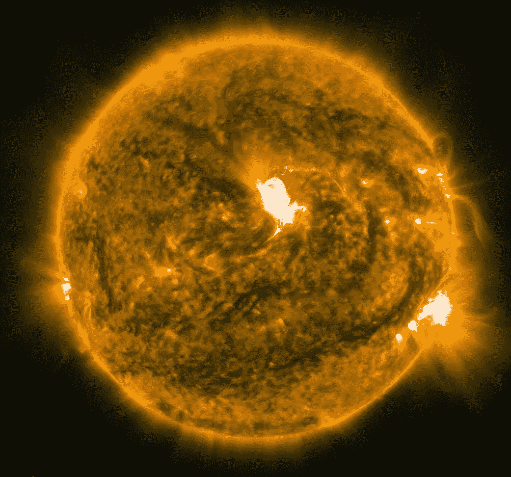

# 如何阻止太阳风暴

> 原文：<https://medium.com/hackernoon/how-to-stop-a-solar-storm-f6f6e8a0ebf0>

## 以及为什么我们至少应该考虑尝试。

A mid-sized solar flare — June 2015 — NASA/SDO

卡林顿事件发生在 1859 年 9 月 1 日和 2 日。这种影响持续了两天多。太阳爆发了一次耀斑，并以异常高的速度向地球飞来。当它到达时，它导致了远在赤道附近的极光，而不是符合现状的——至少接近哥伦比亚国家。美丽的灯光令人愉快，但伴随着地球表面的磁性拳头却不愉快。现存的唯一的电气系统是电报线，但那已经足够了。两个大陆的通讯系统在几个小时内就被摧毁了。

想象一下像那样的地磁风暴会给我们今天的文明带来什么。2013 年，一家名为伦敦劳埃德的保险组织与大气与环境研究公司合作，研究并撰写了太阳风暴破坏美国电网的可能成本。他们估计，一场卡灵顿级别的灾难将造成 0.6 至 2.6 万亿美元的损失，并使 2000 万至 4000 万人断电，断电时间短则 16 天，长则两年。

2017 年 1 月 10 日，《太空天气》杂志发表了一篇论文，估计了未来十年内发生另一场类似卡林顿事件的风暴的概率。作者 Pete Riley 和 Jeffrey Love 提出了两个数字，对应于处理这个问题的两种不同方式。他们的第一个预测是有 3.0%的可能性。他们的第二次机会是 20.3%。我们将取这两个预测的平均值，向作者道歉，并假设十年内发生卡林顿事件级地磁暴的概率约为 12%。

这个数字高得令人担忧。像我们的基准这样强大的风暴是罕见的，但更弱的风暴也是可能的，我们无法防御它们中的任何一个。在我们目前的情况下，没有办法从源头上阻止这些风暴，也没有办法阻止它们破坏网络，也没有办法阻止它们。

等等，退后。

也许有一种方法可以保护我们免受另一场卡林顿事件的影响，阻止另一场如此强度的风暴。2017 年初，在美国宇航局的行星科学愿景 2050 研讨会上，一个团队[做了一个演示](https://www.hou.usra.edu/meetings/V2050/pdf/8250.pdf)，描述了他们关于给火星一个磁场的研究。他们的想法是在火星-太阳 L1(Langrange point 1——向心加速度、火星引力和太阳引力全部抵消的地方)放置一块磁铁，由此产生的磁尾将覆盖火星，保护它免受太阳辐射出的粒子流的影响。

同样的概念也适用于地球。一艘位于日地 L1 点的磁力船可以保护我们的星球和我们的电网免受最大规模的自然灾害，节省数万亿美元，并可能挽救成千上万人的生命。这不会是一个简单的项目；这需要投入大量的时间和金钱，但回报是值得的。

我们将拥有平和的心态，我们将在追求自身安全的过程中获得丰富的知识，我们将拥有一个免受威胁的世界。