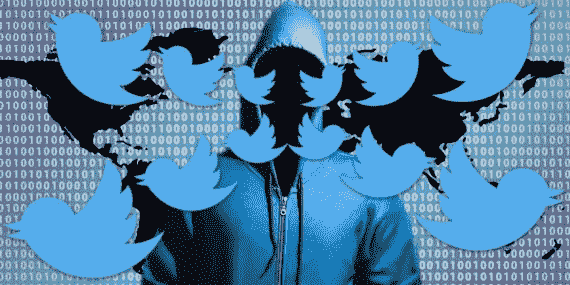
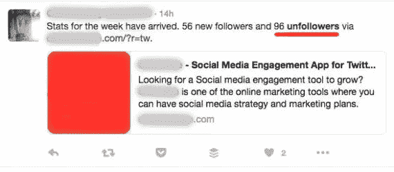

# 如何停止在你的 Twitter 账户上发布应用广告

> 原文：<https://medium.com/hackernoon/how-to-stop-apps-advertising-on-your-twitter-account-7b653a8c2308>

是否有第三方应用程序劫持了你的 Twitter 帐户，并在你的推文中秘密插入链接？我将向你展示如何阻止应用程序在你的 Twitter 账户上做广告，并杜绝那些不想要的推文。

上周，我演示了如何将自己从别人的 Twitter 列表中删除。本周我深入研究了 Twitter 上的另一个烦恼，并帮助你在六秒钟内解决它。

> [*有没有第三方 app 劫持了你的 Twitter 账号，正在偷偷往你的推文中插入链接？？？*](http://twitter.com/intent/tweet?text=Has%20a%20third-party%20app%20hijacked%20your%20Twitter%20account%20and%20is%20secretly%20inserting%20links%20into%20your%20tweets%3F%3F%3F%20%236sectech%20http%3A%2F%2Fwww.vintuitive.com%2Fhow-to-stop-apps-advertising-on-your-twitter-account%2F)

# 你的时间线上出现了不是你发的推文

您的关注者从您的帐户收到看起来像垃圾邮件的推文。这不是你想在推特上谈论的那种事情。

第三方应用发布的推文，显示本周有多少人没有关注你，以及他们网站的链接。

其中一些例子是告诉你的关注者本周有多少人没有关注你，或者你如何通过使用特定的服务或其他形式的广告获得更多关注者的推文。那些在 Twitter 上关注你的人可能会认为这有点垃圾。

# 冒名顶替者的推文可能包含欺诈链接！

一些第三方应用的推文会屏蔽你推文中的链接，在你不知情的情况下用自己的链接替换掉。

通常这些链接做的最糟糕的事情就是通过你的账户推广他们的服务。但是没有什么可以阻止你授权的任何服务插入指向恶意网站的链接。你不知道他们的系统有多安全，通过授予他们访问权限，你也向任何有能力入侵他们系统的人开放了你的账户。

# 取消他们对您的 Twitter 帐户的访问权限

谢天谢地，解决方案很简单。你可以放松，没有人侵入你的推特账户并劫持它。相反，你在过去的某个时候注册了一项服务，该服务要求你向他们提供你的 Twitter 账户。

大多数情况下这是完全可以的，但是在授权他们使用你的账户之前，最好了解每个服务是做什么的。

你可以也应该撤销这个第三方应用对你 Twitter 账户的访问。[下面是怎么做的:](https://vine.co/v/5qbtgZKg0jz)

1.  点击你的**头像**
2.  点击**设置**
3.  点击**应用**
4.  向下滚动，直到找到应用程序
5.  点击**撤销访问权限**

偶尔浏览一下这些应用程序，撤销对你不再使用的任何服务的访问。如果您撤销对您想要继续使用的内容的访问权限，您可以撤销撤销访问权限操作，或者在该应用程序提示时简单地再次提供访问权限。

在 Twitter 支持页面上阅读更多关于[连接或撤销第三方应用](https://support.twitter.com/articles/76052)的信息。

查看 [Vine 视频](https://vine.co/v/5qbtgZKg0jz)或 [Instagram 视频。](https://www.instagram.com/p/BI4UkQkj4qD/)

# 每周在 Periscope 上观看 6 秒技术直播

每周五上午 9:30 在 AEST 的 Periscope 与我一起参加六秒科技 的 [*现场秀，其中每个技巧都与额外的相关技巧进行了讨论。问一些关于这个技巧和其他技巧的问题，为以后的剧集提供你自己的技巧和建议，并结识对相同话题感兴趣的其他人。更多信息请参见*](http://www.vintuitive.com/periscope/)*[直播页面](http://www.vintuitive.com/live-streaming/)。*

> 每周五上午 9:30 在 AEST 的 Periscope 和我一起观看六秒科技的现场表演。

# 需要社交媒体方面的帮助吗？

Vintuitive 为任何想学习使用在线工具提高工作效率的技能以及如何利用社交媒体推广业务的人提供一对一的培训。

更多信息，请联系 vintutive。

*本文原本* [*出现在 Vintuitive 上。*](http://www.vintuitive.com/how-to-stop-apps-advertising-on-your-twitter-account/)