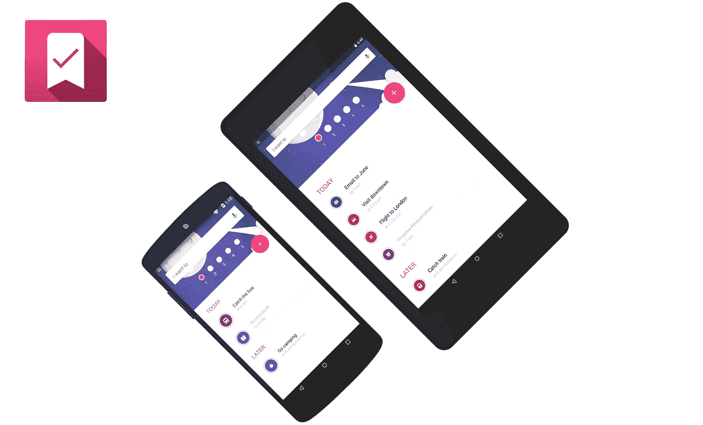

# 如何停止拖延，开始生活

> 原文：<https://medium.com/hackernoon/how-to-stop-procrastinating-and-start-living-ad234cf02006>

我的名字叫**拉胡尔**，我自己也是**一个非常拖拉的人**。嗯，坦率地说，我现在仍然是，但是我已经把我的拖延程度降低到了最低的**。**

你看**拖延就像重力**，轻轻一推，你就会发现自己处于一种**无休止的情绪**中，什么也不做，只是浪费你宝贵的时间。我们被分心的事物所包围，难怪我们发现自己如此频繁地刷新我们的脸书反馈，而不是做那些在我们的生活中真正重要的、会让我们的生活变得更好的事情。

拖延是我们生活中许多问题的根源。我们每天都有各种各样的事情要做，不按时做这些事情会导致无法实现我们的目标，并在我们的头脑中积累压力，从而导致一些健康问题。

所以，如果我们不是在应该工作的时候拖延，而是真正完成工作，然后找时间享受生活中不同的乐趣，比如与家人和朋友共度美好时光，去旅游，看新电影或做其他我们渴望的事情。

嗯，这并不容易，但是**绝对值得一试**。

根据像布莱恩·特雷西这样的任务和时间管理专家的说法，对抗拖延症的最好方法之一就是在你一天开始的时候就列出你一天需要做的事情。

就这样吗？有什么大不了的？

这种技术只有一个缺点。仅仅在一张纸上记下你需要做的事情是没有用的。你还需要根据任务的紧急程度和优先顺序对其进行分类，这就是通常所说的**时间管理**的 **ABC 技术**。

所以基本上克服拖延症的第一步会导致拖延症本身，因为整理清单需要时间和工作，谁现在有时间做所有这些事情。我们都是忙碌的人，在忙碌的生活中东奔西跑。

谢天谢地，有一款应用可以解决这个问题，它叫做 [**Ledo**](https://play.google.com/store/apps/details?id=com.ledo.ledoapp) 。

目前 Ledo 只适用于 **Android 设备**，所以如果你没有使用任何 Android 设备，很抱歉，你现在必须自己做这些脏活。

# 如何用 Ledo 排序你的待办事项？

事实上，它非常容易和舒适。

只需 [**在你的安卓设备(*手机或平板电脑*)上从 Google Play**](https://play.google.com/store/apps/details?id=com.ledo.ledoapp) 下载 Ledo 应用并启动它。

您将看到一个白色文本框，上面写着“**我想**”。这是你添加你要做的事情的地方。

所以，只要输入你需要做的事情，到你需要做的时候，就像你在一张纸上写字一样。比方说，

**在下午 5:30 前准备好演示幻灯片**

**下午 3 点接杰米放学**

**晚上 9:30 和朋友聚会**

**明天上午 10:25 飞往伦敦的航班**

这个应用程序需要的另一件事是，你给每个任务一个优先级或重要性**，从 1 到 5 递增**。还记得 ABC 技术吗？它**要求每个任务有一个重要性**对吗？

那都是乡亲们！

现在你可以专注于你需要做的事情，Ledo 会自动整理你的任务，并通过通知和自动提醒来指导你一整天。

你可以在你的 Android 设备的通知部分看到你现在需要做的任务，以及你还有多少时间来完成这个任务。

如果你很忙，完全忘记了你必须在特定的时间去某个地方或做某事，该怎么办？

你不用担心，Ledo 会提前 30 分钟提醒你必须完成任务。

> 如果拖延症是一种疾病，那么 Ledo 就是治疗方法。

现在你已经迈出了战胜拖延症的第一步，是时候按照应用程序建议的顺序做所有你需要做的事情**了，并且**停止花费时间做其他不必要的事情**，例如每 10 分钟左右查看一次你的**脸书**新闻。**

我知道你可能会觉得开始时很想做简单有趣的任务，而把困难的任务推迟到以后，但是困难和重要的任务实际上会给你的生活带来变化，并且在完成后会给你一种满足感。**自己试试！**

相信我，如果你有**堆积如山的未完成的工作等着你，这肯定会影响你生活的平衡。所以，按时完成任务是个好习惯，这样你才能享受生活。**

不要被你每天需要做的事情清单所累，像超级英雄一样把它们从你的清单上划掉，腾出时间做你想做的真实的你。

你不会有两次生命，**停止拖延**，开始让这一生**精彩**。

干杯！

*图片来源:* [*A-PA*](https://www.flickr.com/photos/78362519@N03/14910889069)