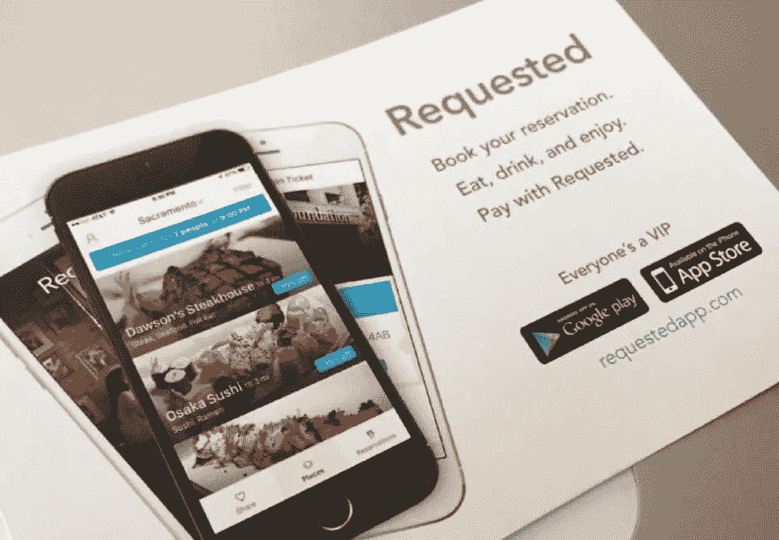
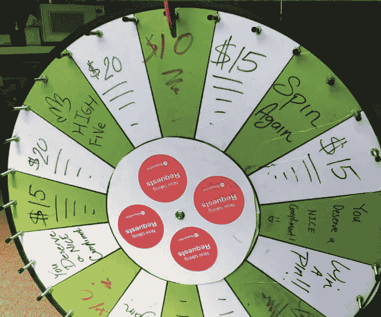

# 如何去街队

> 原文：<https://medium.com/hackernoon/how-to-street-team-de764b71efd7>

对不起我撒谎了。我不知道如何街头队。但是我有一个惊人的资源，它提供了一些关于如何招募团队、收集材料和执行的实用信息。

参考资料是《创业》第 599 集[的联合创始人桑尼·马约巴(Sonny Mayugba)在本周](http://requestedapp.com/)[后半部分要求](http://thisweekinstartups.com/launch-scale-thumbtack-requested/)(27:40 开始；前半部分也不错，主角是图钉的创始人马可·萨帕科斯塔。

这篇文章将解释 Mayugba 用来开发他的应用程序的街头团队策略。后半部分将给出我的应用程序 [Munday](http://www.munday.xyz) 的一些背景，以及它所面临的独特环境。

我将通过为我自己的应用程序实现相关的建议来测试一些给定的策略。在接下来的文章中，我会比较和对比我用来吸引注意力的策略。

## 第一步:制定一个无薪市场实习计划

Mayugba 的街头团队招募策略围绕着招募大学生并让他们以实习生的身份投入工作。

该计划应该看起来像任何其他营销协调员的工作，并确保明确界定的角色。实习生将在公共场合与潜在用户互动；你不想要温顺或内向的性格类型。

获得相关大学的批准是很重要的，因为这样实习生才能获得大学学分。如果没有大学学分，实习对实习生来说就没什么价值了(尤其是当你做的事情没有报酬的时候)。所以去找大学就业中心和实习经理谈谈吧。如果你的创业是合法的，它应该被批准。如果你能负担得起，就让这个项目付费。

根据他的经验，Mayugba 强调实习期应该持续 90 天，每周 12 小时。这有助于确保招聘到忠诚的实习生。他还建议让实习生成为你 DNA 的一部分。他们应该和你一样了解你的产品。

## 第二步:收集营销材料

**信息/优惠券卡**
Mayugba 建议 [PsPrint](https://www.psprint.com/) 制作 4x6、全彩、双面和光滑的明信片供实习生分发。这些卡片应该用几句话解释你的服务/产品，并有一幅关于它的图片。他以每张 3.7 美分的价格买了 8000 张卡片——大约 320 美元。

请求的是市场。他们需要建立一个餐馆网络，然后让人们通过应用程序预订。Mayugba 制作了[销售套件](http://imgur.com/WB2v0F6)和[优惠券或‘促销商业卡’](http://i.imgur.com/KjO7lub.jpg)，提供一些**金钱奖励**，这有助于吸引用户。

Requested 采用了类似 PayPal、优步和其他公司的货币激励策略。在 PayPal 成立之初，该公司向用户支付 10 美元进行注册；优步向获得推荐的用户付费。重要的是给用户提供一些尝试你的服务的动机。

Mayugba 强调购买优质衬衫的重要性；他在 Medium 上引用了约书亚·贝尔的文章[“你 4 美元的 t 恤让你损失了几百万”](/art-marketing/your-4-t-shirt-is-costing-you-millions-829bf4a7e440#.opznqum1g)。

如果可能，尝试使用本地丝网打印机。它把钱留在本地，如果有事件发生，本地的印刷商可以比远处的印刷店更快地把衬衫送到。

最后推荐的营销材料是一个纺车。它需要被干擦，所以这些值可以被改变。以下是马约巴对他们的评价:

*【纺车】完全吸引注意力。每个人——我不在乎你是不是世界上最酷的潮人——每个人都想纺车。他们喜欢咔嗒声，这让多巴胺激增——我不知道这是什么，但纺车让人开心。”*

[它们大约在 80-150 美元之间，可以在亚马逊上买到。](http://www.amazon.com/Tabletop-Editable-Spinning-Carnival-Fortune/dp/B00LNUAG8C/ref=sr_1_14?ie=UTF8&qid=1450137318&sr=8-14&keywords=dry+erase+spinning+board)(虽然图中找不到确切的。)

[这是我买的主板](http://www.amazon.com/Spinning-Inches-Tabletop-Customize-Template/dp/B00EBCLX1S/ref=sr_1_sc_1?ie=UTF8&qid=1453583368&sr=8-1-spell&keywords=30+inch+spinboard)。

如果你选择这样做，对奖励要有创造性，试着以某种方式让他们笑或开心。请注意被请求团队使用的一些奖品。(“你应该得到赞美”——或者简单的击掌。)

这些都是你与之互动的潜在用户，创造一个有趣的第一印象将有助于说服他们尝试服务/产品。

## 执行

街头团队的执行是以有意义的方式吸引你的客户，目的是与你的品牌建立长期的情感联系。

没有任何一种方法可以吸引用户。一家公司的问题和环境对另一家公司来说是不一样的。但是有一个逻辑思维过程，任何人都可以通过它来解决自己独特的任务。

首先要思考的任务是街道队应该派遣到哪里。

找出在你的目标区域人们通常在哪里通勤。它可能是热门的餐馆区或一些特殊的标志性的地方。

确定接收大量流量的特定地点或单个位置。这样的例子可以是街角、公共汽车站或火车站。

利用任何一种特殊的聚会、节日、音乐会或吸引很多人的年度活动。Requested 利用苹果 9 月 25 日发布 iPhone 6s 的机会，发放了数百张 15 美元的优惠券。

如果什么都没有发生，那就举办你自己的派对吧。Requested 在整合了他们的应用程序的餐馆里举办派对，以便向人们宣传并教育他们。穿着随意的代表告诉顾客，如果他们注册，他们的支票将被扣除 15 美元。

Mayugba 建议给实习生具体的工作时间参数、要完成的目标和开场白。例如，让他们出现在[插入位置]并从上午 11 点工作到下午 1 点。对于 Requested，他们的目标是让人们了解他们的服务是什么，看看他们是否能让他们下载应用程序并进行预订。

一项挑战是建立一个餐馆网络来整合该应用程序。这是一个耗时的过程，因为它需要与每个餐厅进行面对面的交流。他们是这样解决问题的:

“我们派了一个团队在这些街道上走来走去，并说，‘我希望这些(销售工具包)在萨克拉门托这三个社区的每一条街道上的每一个餐厅、酒吧和咖啡馆的每一个总经理和每一个老板的手中。’"

采用这种策略，他们每天会收到 12 条线索，其中 3 条是热情线索，1 条是成交线索。

更多信息请查看他们的 [PowerPoint 演示文稿](http://requestedapp.com/scale/)。

# 个人考虑

举个例子，在过去的一年里，我一直在开发一款名为 [Munday](http://www.munday.xyz) 的媒体分享应用。

它帮助解决的问题是在本地和更大的地理区域获得影响力、观众或存在。该应用程序通过提供一个没有追随者/跟随动态的平台来实现这一点，而是依赖于用户的位置。

关键是，用户不需要像在 Instagram 或 Twitter 上那样积累粉丝，他们可以立即融入周围的人。他们的内容由社区通过一个上/下投票系统进行投票。我认为它是 Instagram 和 Reddit 的综合体，因为它的重点是分享图片、视频和链接。

我们将于明天(1/22/16)重新发布该应用程序，并实施重大更改。从开发到获取用户的转变正在发生。所以马约巴说的很多话都和我的立场有关。

我的起步环境和马约巴不一样。我是佛罗里达州立大学的大四学生，将在塔拉哈西地区获得用户。

酒吧、健身房和校园是我的目标区域。一个策略是找到企业主并达成交易。如果他们下载了这个应用程序，就可以从顾客的账单上减去 5 美元，或者在健身房得到一杯免费的奶昔。

我计划招募实习生，并通过在 FSU 尽可能多的班级前做简短的演讲来传播消息。大学中心也可能在招聘实习生方面发挥作用。但是我不确定是否有可能以学生的身份雇佣学生作为实习生。

不管怎样，我会继续跟进我用来扩大 Munday 应用用户群的策略。

> [黑客中午](http://bit.ly/Hackernoon)是黑客如何开始他们的下午。我们是 [@AMI](http://bit.ly/atAMIatAMI) 家庭的一员。我们现在[接受投稿](http://bit.ly/hackernoonsubmission)，并乐意[讨论广告&赞助](mailto:partners@amipublications.com)机会。
> 
> 如果你喜欢这个故事，我们推荐你阅读我们的[最新科技故事](http://bit.ly/hackernoonlatestt)和[趋势科技故事](https://hackernoon.com/trending)。直到下一次，不要把世界的现实想当然！

