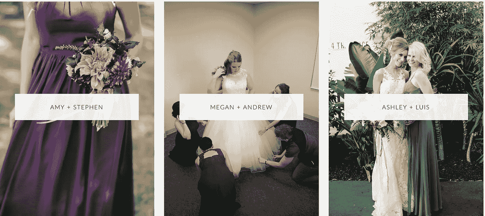
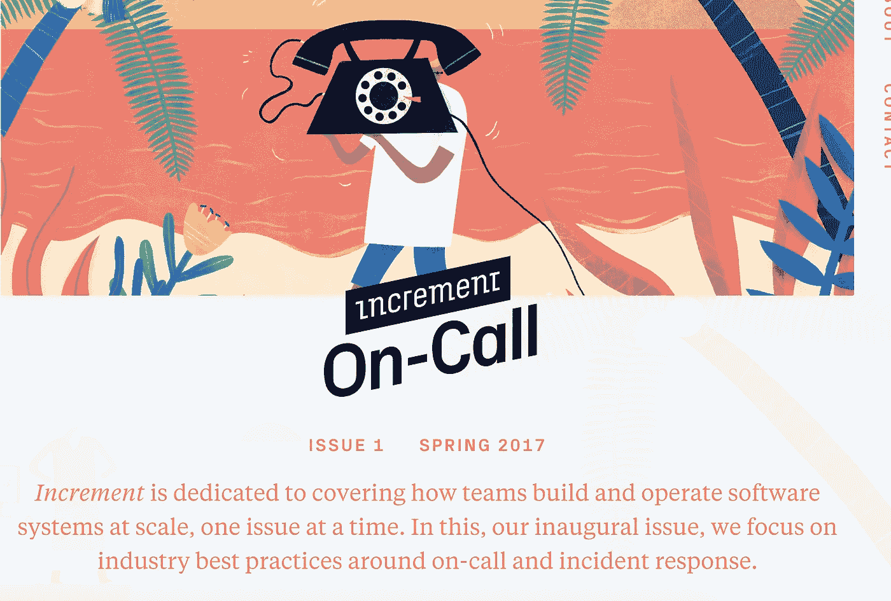

# 如何讲述你公司的故事

> 原文：<https://medium.com/hackernoon/how-to-tell-your-companys-story-c38ee2c4563b>

## 真实、诚实、透明

*大家好，我是* [*乔丹*](http://www.jordangonen.com/) *，我喜欢帮助人们思考&发展他们的产品。希望这有所帮助！你可以在*[*Twitter*](https://twitter.com/jrdngonen)*或者我的* [*简讯*](http://club.us12.list-manage.com/subscribe?u=33abd04e48f571697191f430b&id=54d299efcf) *:)* 上找到我

我喜欢故事。我喜欢听故事。我喜欢分享故事。现在是 2017 年——我喜欢在我的 Snapchat 和 Instagram 上看到他们。

我每天都在我的博客和时事通讯上写故事。我每天都会阅读在 Twitter 或 Medium 上找到的故事。我每天都从我的朋友和同事那里听到故事。

我喜欢故事。

产品也是故事！

创作者制造产品是为了传达和传递信息。产品的类型决定了故事传播的媒介。

一些产品故事是体验→像虚拟现实耳机或使用 iPhone。

有些是令人着迷和上瘾的，比如脸书新闻和社交媒体。

我认为今天最好的品牌，真的很擅长创造故事，让他们的顾客相信。消费者的注意力是有限的——我们可以发现，他们倾向于把注意力花在那些能引起他们共鸣的品牌身上。最好的公司认识到这一点，并一直在优化，以提高客户体验。他们被顾客迷住了。就像一个优秀的电影制作人一样，他们痴迷于构思完美的故事来传达给他们的客户。

这听起来不错，也有点戏剧性和浪漫，那么你能做些什么来围绕你的产品/公司创造一个故事呢？

要开始讲述这个故事，你可以做很多事情。我能想到的最直接、最容易实现的事，就是几乎每个人都可以开始做的事，如果他们想做的话，那就是写博客。

今天有如此多的平台开始创作内容，点击发布，没有任何理由不开始。

由于每个人和他们的家人都在创建博客，所以你需要确保你的博客与众不同。你是怎么做到的？

首先，你要为一个目的优化，有一个目标。你可能想为小众读者写作。你可能想记录你创建公司的历程。你可能想写关于金融的文章，并邀请客座博主。你可能想自己写每一行。

不管是什么——画出来。有叙述。有计划。围绕您的工作流程创建一个流程，并寻找您和您的团队可以采取的战术步骤来启动和运行该流程。

更重要的是，你需要找到对你的观众真实的方式。你对时间和资源的投资不应该是为了引诱你的观众购买你的产品。

这是对人的投资。记住:真实的人会阅读你的博客。与他们感同身受，站在他们的角度思考…他们想读什么？你的故事有什么独特之处？他们为什么要关心？他们能从中获得什么价值？

很少有公司/产品能够回答这些问题..更少的人能做好这件事。

# 我为你收集了一些灵感来源:

如今许多公司都有博客，但很少有人讲述真实透明的故事。大多数博客是用来销售的，而不是与客户建立关系。这些博客赌的是短期销售的关系。

以下是我最喜欢的一些公司博客的例子，其中包含了经过深思熟虑的叙述和客户故事:

## [懈怠](https://slackhq.com/)

[https://slackhq.com/](https://slackhq.com/)

## [阿扎兹博客](https://www.azazie.com/blog)

[https://www.azazie.com/blog](https://www.azazie.com/blog)

## [从条纹开始增加](https://increment.com/)

[https://increment.com/](https://increment.com/)

## [REI](http://blog.rei.com/)

[http://blog.rei.com/](http://blog.rei.com/)

长期优化会有回报……只有在长期内。不要*不要*期望看到关系建立的短期结果。

事实是，无论你是大公司还是小公司，你的叙述和客户之旅都很重要。

> 非常感谢你的阅读！我的名字是[乔丹·戈宁](http://www.jordangonen.com/)我每天都写博客。如果你能:
> 
> **>** [**在推特上关注我**](https://twitter.com/jrdngonen) **<**
> 
> 如果您有任何问题，请发送电子邮件至 gmail dot com！非常感谢！