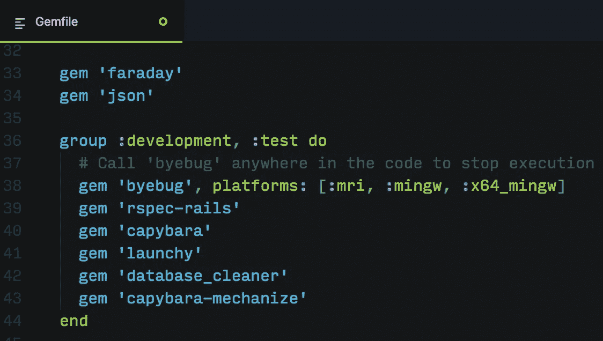
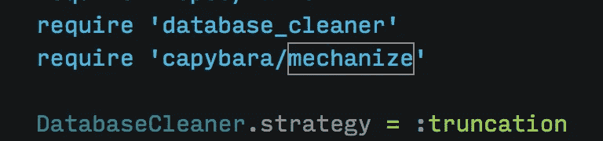
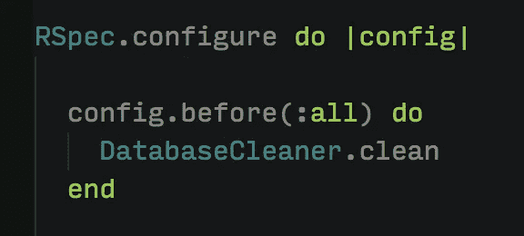
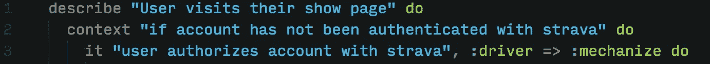
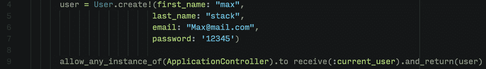
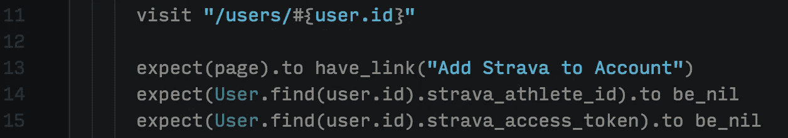
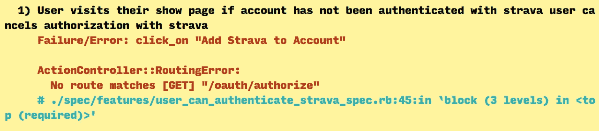
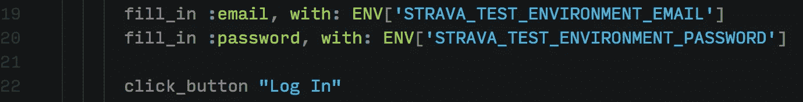
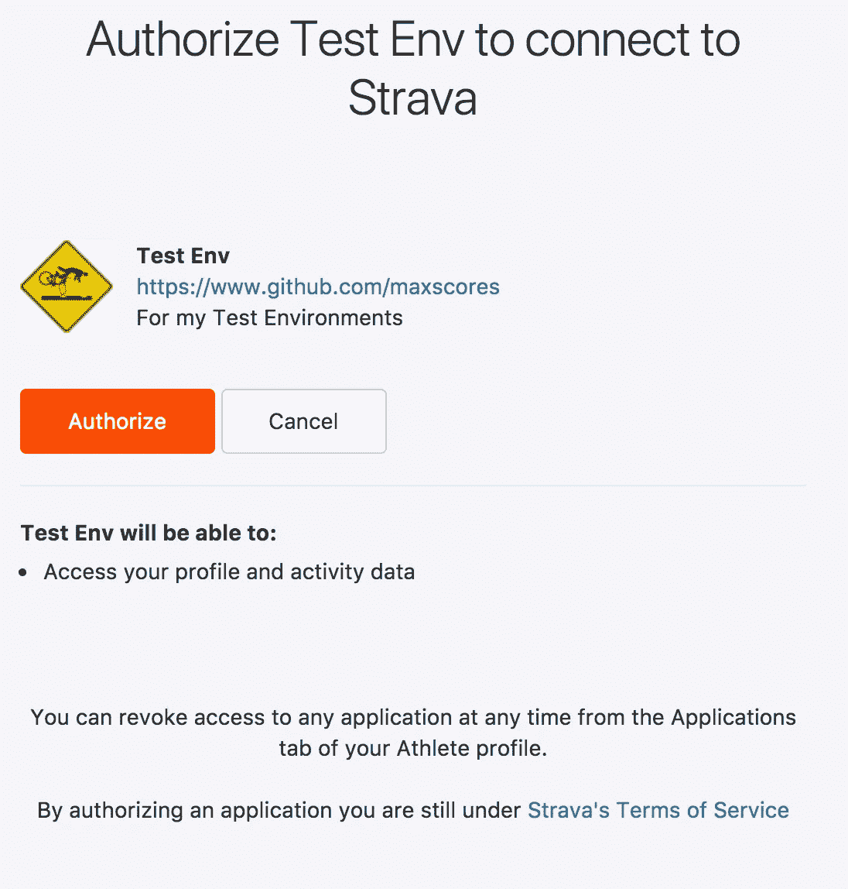
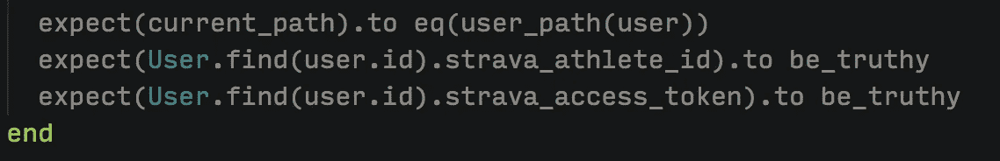

# 如何在 Rails 中测试 API 认证

> 原文：<https://medium.com/hackernoon/how-to-test-api-authentication-in-rails-2804fd31a1ea>

本周我放假，我的一个目标是熟悉 Strava API。 [Strava](http://www.strava.com) 是我选择的社交媒体，它也保存了运动员的大量数据，这使得它成为构建应用程序的有趣数据源。关于 [Strava](https://hackernoon.com/tagged/strava) API 最好的部分是他们的文档有多好。它组织得很好，提供了通用的 curl 示例，并以一种清晰的方式描述了 API 交互，这对于像我这样的初学者来说很容易理解。

我想构建的第一个功能是允许用户在我的应用程序上创建一个帐户，然后允许他们在 Strava 上用自己的个人资料验证该帐户。此外，我需要想出如何测试这个过程。我已经用 Faraday 通过命令行访问了 API，但是生产应用程序需要一个完整的测试套件。在我们开始测试之前，让我们看一下 Strava API 认证流程。

## Strava 认证流程

[API 文档很好地概括了](https://strava.github.io/api/v3/oauth/)流程:

1.  将用户重定向到 Strava 身份验证 URL 以登录并查看授权页面。在 url 中传递一些参数来标识应用程序，并给 Strava 一个 URL 来重定向回。
2.  如果用户授权该应用程序，那么 Strava 使用提供的 url 重定向回该应用程序，并传递一个代码作为参数。如果用户取消授权，他们仍然会被重定向回应用程序，但不会得到一个代码。
3.  然后，应用程序必须获取该代码，以及应用程序 ID 和应用程序秘密令牌，然后将其发送回 Strava。
4.  如果代码、应用 ID 和应用密码令牌都有效，那么 Strava 将返回一个用户身份验证令牌以及用户的基本配置文件。
5.  然后，我的应用程序将用户认证令牌和 Strava 配置文件 ID 保存在用户配置文件中。

## 测试环境设置

确保测试环境数据库已经设置好(我使用的是 PostreSQL ),并且已经迁移。这些是我用来联系 API 和运行我的测试套件的 gems:

*   [Faraday](https://github.com/lostisland/faraday) —为我创建 API 调用，并管理我需要传递给 API 的附加参数
*   [JSON](https://github.com/flori/json) —将来自 API 的 JSON 响应解析成 OpenStruct 对象，以允许使用基本的 Ruby 实例方法访问响应
*   [Byebug](https://github.com/deivid-rodriguez/byebug) —命令行调试工具(默认为 rails)
*   [RSpec-Rails](https://github.com/rspec/rspec-rails) —针对 Rails 的 RSpec 测试框架
*   水豚——功能测试工具，允许我像用户一样与我的网站互动
*   [Launchy](https://github.com/copiousfreetime/launchy) —为了调试，我可以使用“保存并打开页面”来查看水豚看到的内容
*   [Database_Cleaner](https://github.com/DatabaseCleaner/database_cleaner) —让我为每个测试条件重置我的数据库
*   [Capybara-Mechanize](https://github.com/jeroenvandijk/capybara-mechanize)——很酷的 gem，它允许 Capybara 访问我的应用程序之外的外国页面

这些都存在于我的 gem 文件中。主宝石名单里有法拉第和 JSON。其他一切都在我的开发和测试团队中:



`database_cleaner`和`capybara-mechanize`宝石需要一点配置才能正常工作，所以在我的`rails_helper.rb`文件中我添加了以下几行:



## 测试脚本设置

此时，我的应用程序允许用户用他们的名字、电子邮件和密码创建一个新帐户。此外，用户需要登录才能将 Strava 添加到他们的帐户，他们只能从他们的个人用户/展示页面添加。让我们一行一行地检查测试设置，以展示我是如何做事情的。

## 第 1–3 行:



除了第 3 行，这些是基本的描述/上下文块。在这里我指定了我希望水豚使用的驱动程序。默认情况下，Capybara 使用机架驱动程序，不允许测试套件访问任何外部域。通过包含 capybara-mechanize gem，我现在可以指定驱动程序为 mechanize，它允许 capybara 访问外部域。这很有用，因为默认驱动程序在大多数情况下都很好，我不知道使用 mechanize 驱动程序会对我的测试套件的其余部分产生什么样的副作用。

## 第 4–9 行:



创建一个基本的用户配置文件，并将`current_user`模仿成这个配置文件，这里没有什么特别的。注意，我用的是`create!`而不是`create`。这样，如果`create`失败，我会得到一条错误消息。

## 第 11–15 行:



转到这个用户的显示页面，并期待看到一个链接到`“Add Strava to Account”`。这是 Strava 身份验证流程中的第 1 步。此外，我正在演示用户没有`strava_athlete_id`或`strava_access_token`。这些验证也可以属于用户模型测试，但是我把它们放在这里只是为了确保一切都按预期工作。

## 第 17–18 行:


点击链接到`“Add Strava to Account”`。这会把我送到[https://www.strava.com/oauth/token](https://www.strava.com/oauth/token)。如果我没有使用 mechanize，我会得到下面的错误消息。Capybara 忽略协议和域，然后期望/oauth/token 的路由出现。



我可以在这里使用 Launchy，通过在第 18 行插入'`save_and_open_page`'来查看水豚点击`‘Add Strava to Account’`后看到的内容。结果我被重定向到了斯特拉发的登录页面。我需要登录我的帐户，以便水豚通过授权过程。


## 第 19–22 行:



水豚的方法仍然适用于外部网站，可以与这些网页互动。我查看了登录页面，以了解 strava 是如何命名电子邮件和密码字段的。接下来，我在终端中设置环境变量，为我的测试环境存储我的电子邮件/密码组合。这很重要，因为当我在这里或 github 上发帖时，我不想在互联网上到处张贴我的测试环境证书。这些可以通过终端中的导出命令来设置。

```
export STRAVA_TEST_ENVIRONMENT_EMAIL=test@email.com
export STRAVA_TEST_ENVIRONMENT_PASSWORD=12345
```

## 第 24 行:


在第 22 行提交了登录凭证后，我在第 23 行放置了另一个“save_and_open_page ”,以查看我被重定向到了哪里(见下页)。我看到我现在在授权页面，所以我想让水豚点击“授权”。这是 Strava 认证流程的第 2 步。



## 第 26–29 行:



这是我的应用程序在引擎盖下施展小魔法并执行 Strava 认证流程中的步骤 3–5 的地方。最终结果是，我希望被重定向回用户显示页面，用户现在已经保存了他们的`strava_athlete_id` & `strava_access_token`。这里需要注意的一点是，我最初调用的是`user.strava_athlete_id`而不是`User.find(user.id).strava_athlete_id`，尽管用户保存了凭证，我的测试还是失败了。结果是，`user`仍然与我在第 4 行分配给它的用户的状态相关联，所以我需要直接从数据库中提取用户。

## 结论


这可能是我写过的最长的测试脚本，但是当我测试一个有如此多用户交互的过程时，这是意料之中的。如果有更好的方法来测试这个过程，请在评论中告诉我。搞清楚这个测试花了我很长时间，我不愿意承认，所以如果有一个更简单的方法来做，我会全力以赴。