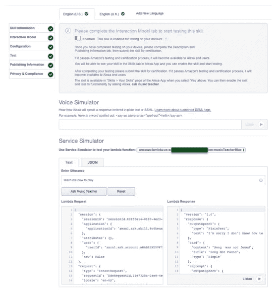
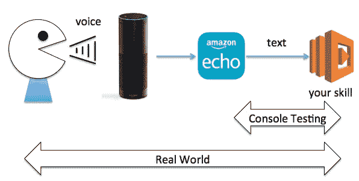
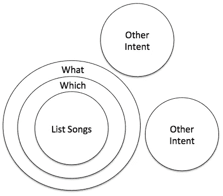
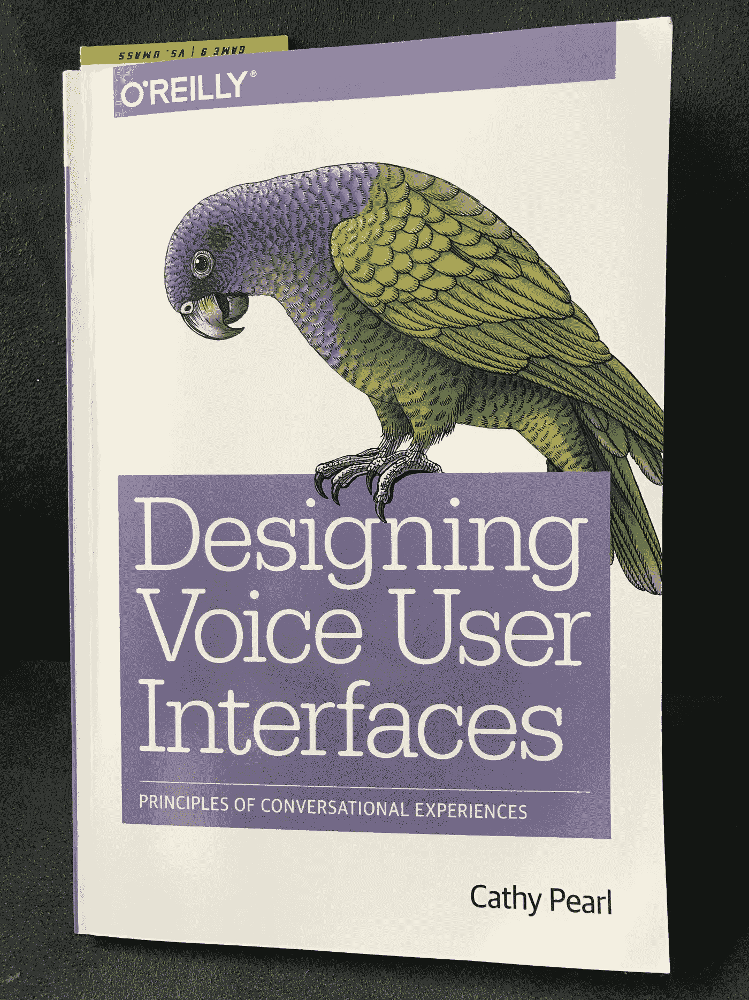

# 如何测试语音应用非常困难

> 原文：<https://medium.com/hackernoon/how-to-test-voice-apps-is-remarkably-difficult-9684c6102bd1>


在过去的一年里，我一直在创作 Alexa 技能，并被亚马逊评为 Alexa 冠军。在这段时间里，我犯了很多错误，所以请从我的错误中吸取教训！

为亚马逊 Alexa 创作语音应用程序专注于用户流和开发响应。这是一个很好的起点，但是不要忘记包括一些早期的测试周期来验证你的设计。花时间测试你的声音，而不仅仅是传统的基于文本的信息。测试语音应用是一个巨大的挑战——原因如下。

# 测试语音应用！=测试移动/网络应用

有许多不同类型的测试——单元、系统、集成、性能、耐久性等。这些都延续到了语音领域，但仍有挑战需要准备。

## 挑战#1 —标准工具是基于文本的

如果你不熟悉测试 Alexa 技能，基本测试从使用控制台开始。这很棒，虽然开始引导你走上一条熟悉的路，你需要快速离开。如果你不熟悉的话，这里有一个控制台的截图。



该工具有助于测试尝试任何 RESTful API 的基本请求-响应模型。不幸的是，这不是一个完整的模拟，因为它使用的是文本和应用程序的后端。这适用于单元测试，但并不意味着可以发布了。



在过程的早期使用你的声音来执行测试。可以把它看作是对所涉及的不同层次的[技术](https://hackernoon.com/tagged/technology)的一种集成测试。记住，没有人会用你的技巧来处理文本。因此，虽然控制台是一种简单的入门方式，但它并不是真实世界的真实代表。

## 挑战 2 —语音生成的输入数据产生了无限的测试案例

构建语音应用程序需要借助强大的机器[学习](https://hackernoon.com/tagged/learning)功能将语音转换为文本。能够利用这种能力是令人兴奋的，但这是一种不同于依赖键盘、鼠标或触摸屏的模式。我们来探究一下原因。

Web 有下拉框、单选按钮、自由文本等。由键盘和鼠标驱动。Mobile 也有类似的功能，以及在像素帧上跟踪手指位置的能力。这些模式中的每一个都有有限数量的排列，所以完全的测试覆盖是可能的。

像 Alexa 这样的语音平台的框架从意图模型开始。该模型映射了语音调用的所有可能结果。发布技能会将模型加载到平台中。这允许 Alexa 机器学习在运行时根据语音请求挑选最可能的意图。然后，在将数据传递给 API 之前，请求被翻译成文本。这里有一个意图模型的例子。

```
{
  “intents”: [
    {
      “intent”: “PlayNote”,
                “slots”: [
                  {
                    “name”: “Note”,
                    “type”: “LIST_OF_NOTES”
                  }
                ]
    },
    {
      "intent": "TeachSong",
                "slots": [
                  {
                    "name": "SongTitle",
                    "type": "LIST_OF_SONGS"
                  }
                ]
    },
    {
      "intent": "ListSongs"
    },
    {
      "intent": "Help"
    }, ...
  ]
}
```

对于变量，槽包含在响应中解析出来的意图中。还包含关于可能的时隙值以及应该触发每个意图的不同话语的信息。现在请记住，这些自定义插槽并没有将数据强制转换为模式——它们只是用来训练最有可能听到的内容的机器学习模型。如果用户明确要求一个没有拼写出来的值，它仍然可以将它传递给 API。例如，如果有人要求弹奏音符“升 T”(任何钢琴键盘上都没有的东西)，最好编写异常处理来涵盖这种情况。

与触摸世界和移动设备类似，当向用户提供一个带有几个按钮的屏幕时，如果用户错过了按下其中一个按钮，只是点击了灰色空间，什么都不会发生。GUI 框架加强了精确性，并限制了潜在测试场景的数量。声音不一样。由于这个原因，用户行为的变化是无限的，因为没有约束，而是声音被翻译成文本，静态模型形成请求将流入的意图。

好的——现在准备好吃红色药丸了吗？试着通过咳嗽、手机铃声或其他非语言声音来测试你的技能。这些也是会话期间可能出现的潜在音频请求。你的技能将如何处理它？它会抛出异常吗？更好的是，如果你正在开会，你的技巧有多宽容？

语音应用程序需要像点击浏览器“返回箭头”这样的东西来处理这种现实情况。我还没有看到一个自然的模式出现，可以解决所有的场景，我希望看到平台在调用 API 之前处理更多的过滤。我在技能中所做的是保存话语之间的会话状态，因此,“咳嗽”不会中断技能的流程，因为如果响应是无意义的，我可以重新加载会话，并给用户另一次尝试。这将是对用户体验的一个很好的测试，这些事情在现实世界中确实会出现！

## 挑战 3——你最好的意图可能是你最大的敌人

当创建一个意图文件时，人们可能认为尝试提出许多路径是有帮助的。这是我在最近的一项技能中发现的一个令人讨厌的错误。首先是上下文，这是一项教授如何弹钢琴的技能，在“ListSongs”调用中有一个歌曲目录。

```
ListSongs list songs
ListSongs list available songs
ListSongs what songs can you play
ListSongs what songs do you have
ListSongs which songs are there
```

似乎合理？这里的挑战是，通过添加带有非常宽泛的术语或短语的额外话语，如“什么”、“哪个”、“你能吗”、“你有吗”和“在那里吗”，你可能会意外地与其他话语中也存在的潜在语音模式发生冲突。这给 Alexa 带来了挑战，因为模型中可能的潜在组合越广泛，Alexa 选择这条道路的可能性就越大。我喜欢从地图覆盖的角度来考虑这个问题(见下图)。这是有限的空间，通过添加更多的路径，它默认了更多可能的组合。



在我的技巧的例子中，我发现用户在询问关于其他功能的广泛问题(例如，“你能演奏贝多芬吗？”)，相反，它会选择这个作为列出歌曲的请求。一旦我减少了这些额外的话语，它就提高了技能中其他特征的准确性。

所以在提供许多路径时要小心“有帮助”——尤其是非核心功能。

## 挑战# 4——如何扩展测试用例的数量

到目前为止，每个人都知道高质量的产品开发假设测试中有一定程度的自动化。您添加到应用程序中的功能越多，需要的覆盖范围就越大——但是如何通过语音实现自动化呢？自动化单元测试用例可以发挥杠杆作用，但我已经指出了过于关注后端的风险，因为它没有收集语音平台的其他组件。

测试和语音系统的问题是，如果你想使用语言数据进行质量测试，回放真实音频需要时间。如果每个测试用例的声音需要 5-10 秒，处理一个响应需要额外的 10-20 秒，那么 100 个测试用例可能需要一个小时来运行。没有一些我在市场上还没有找到的框架，1000 多个测试用例变得难以管理。

我目前的想法是拿一个旧的移动设备，使用其上的语音播放功能，并将其贴在 Alexa 旁边，以播放测试数据。我可以记录一次测试数据，然后一次又一次地回放(可能是通宵执行)。当然，这引出了我最喜欢的星球大战中的一句名言。

> “机器制造机器。嗯。多么乖张！”—吉奥诺西斯上的 C3PO 在看到机器人工厂后。

## 游击测试是答案吗？

我最近读了一本关于 VUI 设计的好书，作者是 Cathy Pearl，书中有两章详细探讨了这个话题。一个建议是包括游击测试——让随机用户实际使用产品，看看他们是否会破坏它。这似乎很有希望，因为他们可以覆盖许多不同的随机案例，并使用不同的声音变体，但挑战可能是如何找到这些测试人员。对于一个大公司来说，他们可能有一个部门可以处理这个问题，但是一个 2-5 人的初创公司如何做到这一点呢？



# 你是如何测试你的技能的？

这些是我在这个平台上开发一年后遇到的主要的意想不到的挑战。这是一个我仍在挠头并寻找改进方法的话题。我欢迎思想和想法！

[](http://bit.ly/HackernoonFB)[](https://goo.gl/k7XYbx)[](https://goo.gl/4ofytp)

> [黑客中午](http://bit.ly/Hackernoon)是黑客如何开始他们的下午。我们是 [@AMI](http://bit.ly/atAMIatAMI) 家庭的一员。我们现在[接受投稿](http://bit.ly/hackernoonsubmission)并乐意[讨论广告&赞助](mailto:partners@amipublications.com)机会。
> 
> 如果你喜欢这个故事，我们推荐你阅读我们的[最新科技故事](http://bit.ly/hackernoonlatestt)和[趋势科技故事](https://hackernoon.com/trending)。直到下一次，不要把世界的现实想当然！

