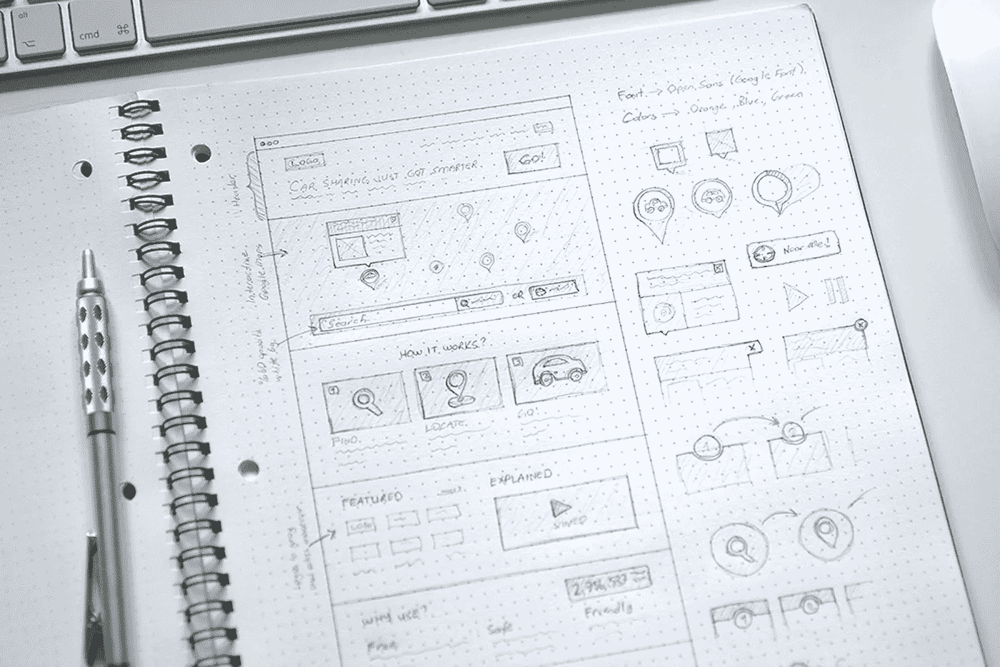
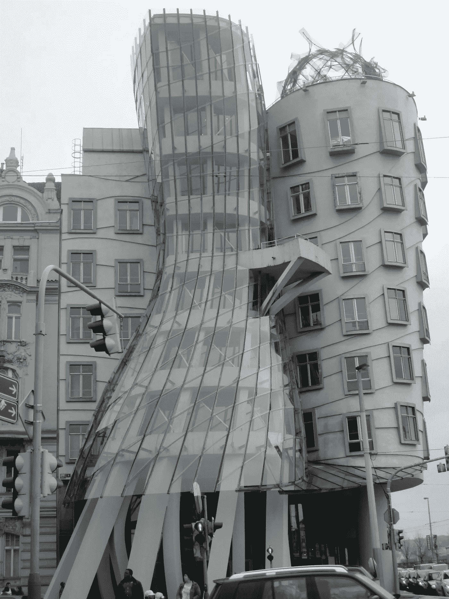
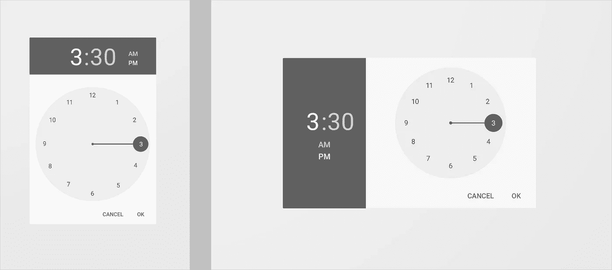

# 如何看待 Web 组件

> 原文：<https://medium.com/hackernoon/how-to-think-about-web-components-9875d599d0ec>

目前，web 组件已经上线。关于模块化 UI 创建、布局结构的组件化以及相关主题，我们已经听得很多了。

事实证明，创建一个组件不仅仅是拥有一个生成 UI 一部分的代码，仅此而已！不要！组件远远不止这些，我会告诉你为什么。

# 首要原则

> 专注—独立—可重用—小型—可测试

我非常喜欢将这一原则应用于 Web 组件。一个组件应该有重点，独特的责任，做一件事，而且做得很好。它必须是独立的和可重用的。创建一个只为一个特定项目工作的组件是没有意义的。

您的组件应该很小，如果它开始增长，尝试创建一个在上下文中有意义的子组件，这样您就可以在需要的时候使用它。它需要是可测试的，这将保证其完美的功能。

# 整体视野

概念:

> **整体的**或**整体的**是一个形容词，对与整体主义相关的事物进行分类，也就是说，试图**从整体和整体上理解现象。**

让我们将这个概念应用到我们的 Web 组件中。一个组件必须有样式— CSS，内容— HTML 和行为— Javascript。当插入到一个上下文中时，让我们称之为“中间”，它需要做它的工作并确保它的功能，而不管它被插入的介质是什么。

如果你有一个名为 **Articles** 的组件，负责呈现文章列表，它可以是另一个 **ArticleItem** 组件，它应该在它插入的任何中间位置执行此操作，无论是在一个节中，还是在页脚中，这个想法是你保证它将正确呈现。但是他的风格呢？你说它需要有风格、内容和行为，如果我把一个**位置:fixed** 作为我的组件的属性，它不会丰富我的 UI 吗？

一个组件必须有自己的视觉特征。它可能有文本颜色、背景颜色、边框，但主要思想是:

> 你的内在风格不能干扰它被插入的环境。

让中间的*说应该如何渲染，左边距***4，下边距 ***5。*** 你的组件不需要有边距，甚至是间距，因为**它不知道谁会使用它或者它会被插入到哪里。重要的是:他需要做好他该做的。******

***他需要尽他的责任。它的内容对其操作至关重要，不应受到包含它的 ***中间*** 的损害。Fr **I** st — **独立。*****

# ***中间——本地和全球***

******

***当你要创建一个组件的时候，你有没有停下来想一想谁会使用它，它会用在哪里？我将客观地定义并举例说明我所说的局部和全局 ***、中间*** 。***

> *****本地中间**:这是你的组件被插入到应用程序的地方。一个**文章**组件可以插入到一个**新闻**组件中，后者可以插入到一个主 **App** 组件中。对于您的应用程序本身，请考虑当地环境。组件、容器等。***
> 
> *****全局中间**:负责接收内容的中间。**显示应用程序的环境。**您的组件必须交付它们的内容，不管它们在哪里被呈现、消费。这是关于响应性、可访问性，并且你必须确保它在全球范围内有效。***

***最后，无论何时创建一个组件，你都需要考虑谁将消费它，谁将使用它，而不仅仅是考虑它将完成什么任务。把你的应用程序想象成一个全局组件，它负责渲染和处理它进入的任何中间层。***

***我保证，用这种方式，在可用性和可访问性方面，创建组件会更令人愉快，会有更令人满意的结果。***

***如果你不能保证最终用户能够访问你的内容，那么你的组件在很短的时间内制作 10000 篇文章是没有意义的，这也是整个网站的主旨。***

# ***表示你的支持***

***掌声表明你有多欣赏我的故事！***

******