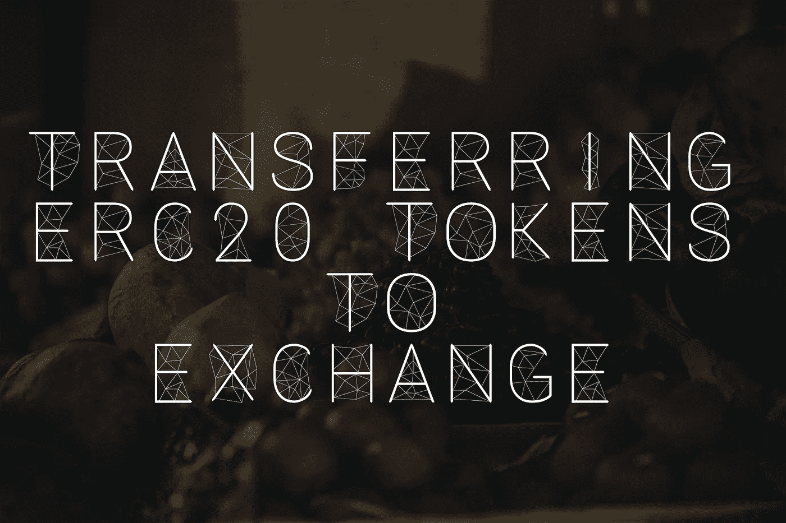
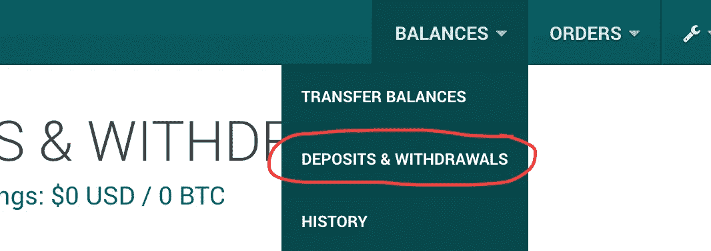
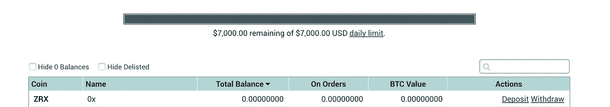
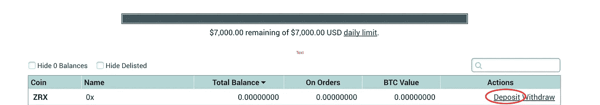
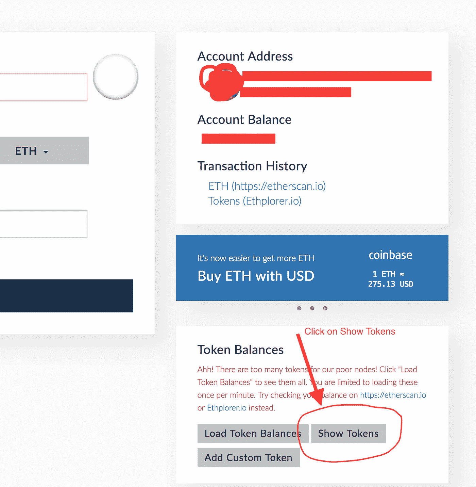
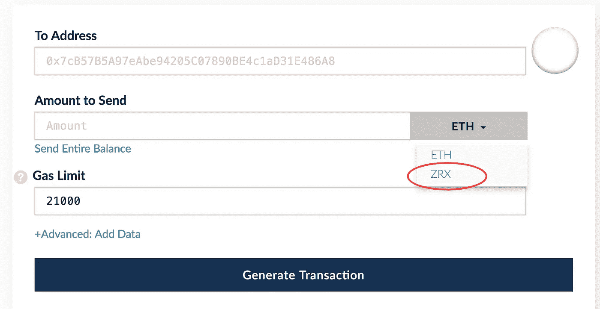
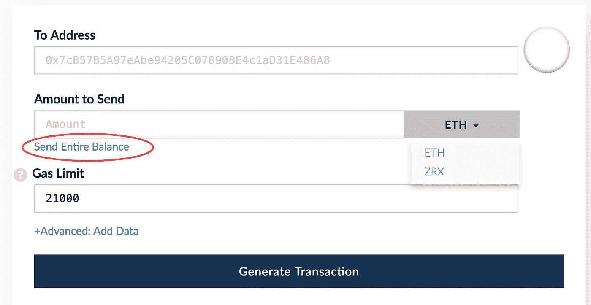
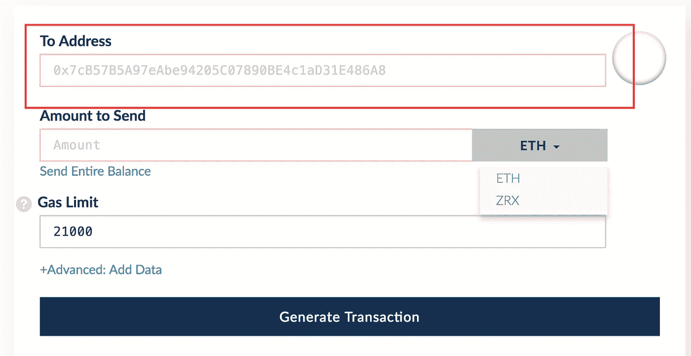
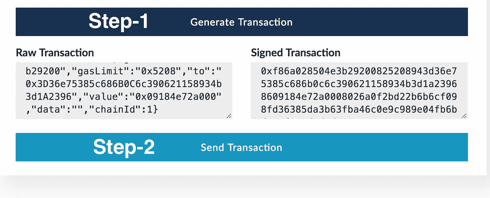

# 将 ERC20 令牌转移到加密货币交易所

> 原文：<https://medium.com/hackernoon/how-to-transfer-zrx-tokens-to-poloniex-70c20704669d>

C 对参与代币销售的人员进行奖励。一旦您参与了代币销售，您将获得代币(分配代币)到您参与的以太坊钱包中。在本文这里，我将以 0xProject token 为例进行说明。这可以是任何其他 ICO，只要颁发的令牌是 ERC20 标准，如 ZRX 或 KickICO 或任何其他令牌。

因此，如果你参加了 0xproject 的代币销售，你将获得你的 ZRX 代币到 Metamask，这也可以在 [MyEtherWallet](https://hackernoon.com/phuck-phishing-be-secure-while-using-myetherwallet-93691775c0d6) aka MEW 上检查。因此，问题也可能是“如何将这些 ERC20 令牌从 MEW 转移到 Poloniex”(以 Poloniex 为例，因为在撰写本文时，它是 ZRX 上市的主要交易所之一)。

**循序渐进指南**

*   登录到 Poloniex
*   转到余额->存款和取款

*   有趣的是，当你按名字排序时，找到 ZRX 也很容易，因为它是从 0 开始的。一旦看到如下图的 ZRX，就需要获取存款地址。

点击表格最后一列 ZRX 令牌(行)中的存款按钮。你应该可以看到一个类似以太坊的地址，你需要把它复制到剪贴板上(Ctrl+C 或者 Command+C)。

*   现在去[https://www.myetherwallet.com](https://www.myetherwallet.com)用储存的私钥解锁你的账户。这将打开您购买 ZRX 代币的钱包。一旦解锁，转到屏幕的右下角，你会看到按钮“加载代币余额”，“显示代币”。

*   点击`Load Token Balances`，一旦完成，点击`Show Tokens`，将列出所有可能与 MyEtherWallet 兼容的 ERC20 令牌。幸运的是，ZRX 以 Z 开始，当你一直向下滚动到最后，它会很容易出现。
*   你现在可以在这里看到你的 ZRX 的余额。
*   一旦你有了你的地址，回来找 MEW(我的钱包)。因为你已经有代币余额，现在你会在`Amount to Send`旁边有一个下拉菜单，显示所有你有余额的代币。Eg: ETH 和 ZRX 如下所示。选择 ZRX 并继续下一步

*   您可以输入要发送到 exchange 的 ZRX 代币数量，或者使用`Send Entire Balance`快速链接来填充您的 ZRX 余额。

*   然后，粘贴(Ctrl+V 或 Command+V)您从 Poloniex 复制的存款地址。要非常小心，并两次、三次检查地址是否与您的 poloniex 地址匹配——如果您复制错误或遗漏了什么，您的代币将永远丢失。

一旦`address`被粘贴，`amount to send`被填充，从下拉菜单中选择`ZRX`。气体值将自动变为 52000 左右，然后点击**生成交易**，然后点击**发送交易**，就这样——它会在底部显示“验证交易”按钮，或者您可以使用您的 poloniex 地址搜索 etherscan.io。

**恐慌时刻**

至少对我来说，这是我第一次将 ERC 代币从 MEW 转移到 Poloniex/Exchange，看到它们被转移到多个地址是一个恐慌的时刻

1.  我的代币从我的新地址转移到波洛涅克斯牌上显示的地址
2.  然后 6 分钟后，他们从那里被转移到其他地址(可能是波洛涅克斯的游泳池)查看此链接[https://etherscan.io/token/ZRX?a = 0 xead 6 be 34 ce 315940264519 f 250d 8160 f 369 fa 5 CD](https://etherscan.io/token/ZRX?a=0xead6be34ce315940264519f250d8160f369fa5cd)
3.  从那里，他们在几分钟后被转移到另一个地址，这时你会在主菜单->余额->历史中看到一个未决的交易

幸运的是，0xproject slack 的人很有帮助，Amir bande Ali[建议上述地址可以是 Poloniex 池，事实证明是这样，这帮助我在等待看到它在 Poloniex 上挂起时保持冷静。](https://medium.com/u/640f45e0f085?source=post_page-----70c20704669d--------------------------------)

这 15 分钟的恐慌过程让我写下这篇文章来帮助别人。

> 关注我的 [Twitter](https://twitter.com/confusedcoin) ，了解关于加密货币&区块链的更新。

如果你觉得这篇文章有用，请按以下地址留下任何金额的小费:

*   BTC:1p 8 zce 4 vubczd 4 evcvfxytyj 9 HP 1 gbe 38 f
*   ETH:0xc 347018 dbfcffba 91872635 AC 4 CFC 0521359 a 420

> 在[https://m.me/confusedcoin](https://m.me/confusedcoin)查看这个加密货币机器人**混淆硬币**，在[www.confusedcoin.com](http://www.confusedcoin.com)了解更多关于**加密货币**和**区块链技术**