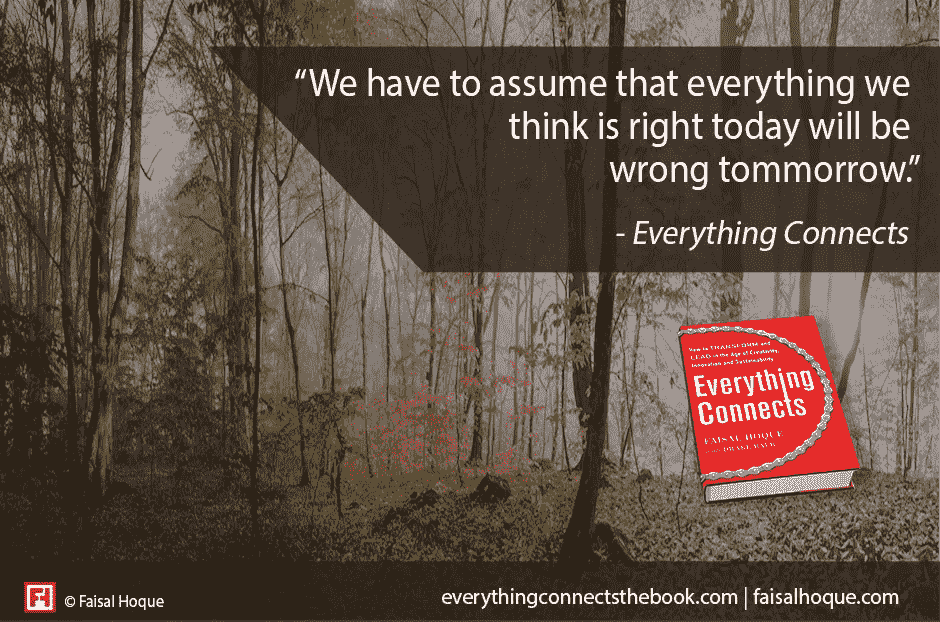

# 如何真正致力于成长心态

> 原文：<https://medium.com/hackernoon/how-to-truly-devote-yourself-to-a-growth-mindset-2ce72978978d>

[Unsplash User: [Alexander Shustov](https://unsplash.com/@alexandershustov)]

## 奉献意味着日复一日与自己保持联系，并以正确的态度对待我们的失败和成功。

虽然我们可能认为创造力、创新和成长是发生在电子表格、幻灯片或生产线上的事情，但成长实际上是发生在我们自身、人与人之间、团队和组织中的事情。

成长是一个人的过程。因此，我们思考工作的方式越人性化，我们在工作中就能做得越好。

如果说我作为一名企业家学到了什么，那就是如果你不能通过自我发现的过程学会与自己联系，你就不能很好地领导别人。自我发现最终是[释放我们内在的天赋](http://www.fastcompany.com/3032005/work-smart/release-your-inner-genius-with-these-5-tips)，为此我们需要投入。

无论是拉里·伯德深夜罚球，还是霍华德·舒尔茨漫步米兰街头，感受咖啡文化，敬业精神在任何领域的专业从业者中都很常见。是一种勤劳的创造力和工匠精神。

## 奉献的艺术

以我对东方哲学的喜爱，我发现只有当奉献变成纪律——纪律变成奉献——我们才能开始领导自己。

在佛教中，虔诚由三个心智发展部分组成，著名的布鲁克林出生的和尚[比丘菩提](http://en.wikipedia.org/wiki/Bhikkhu_Bodhi)在他简明扼要的*中描述了高尚的八正道*。

## 1.正确的努力

不努力，一事无成。正如菩提所写的，每个人都必须找到自己的解脱之道。没有一本书，没有一个老师，没有一个导师，没有一个组织，没有一个信仰体系可以为你把你的作品带到这个世界上来。将你的道路付诸实践需要能量；这就是努力如此重要的原因。

## 2.正念

我们必须直接了解我们的思想。正念冥想允许我们在观察我们的心理活动时得到训练，尽管它不需要坐在垫子上来保持正念。通过密切关注我们的经历——包括我们喜欢和不喜欢的部分——我们能够形成一种源于自身的理解。

藏语中冥想的意思是“熟悉”。如果我们要真实地生活和领导，我们必须非常熟悉我们自己各种颜色的头脑。这是通过日复一日的练习来实现的。

## 3.正确的浓度

专注是统一思想。即使你不冥想，在全神贯注地阅读一本好书，长距离艰苦跑步的兴奋，或者欣赏灿烂的夏日日落的敬畏中，你也可以找到统一的思想。当我们有正确的注意力时，我们的精神能量会变得集中，就像透过放大镜的阳光一样，强烈到足以燃烧。

## 奉献的科学

专家们继续争论学习新东西或改变行为的最佳练习时间和类型。

正如神经科学学会所说，人类大脑通过一个叫做经验或学习依赖可塑性的过程，在一生中保持着修改其结构和功能的能力。过去二十年的发现表明，为了让练习引发学习依赖的大脑变化，练习必须有意义、有动力、有技巧、有挑战性和有回报。

[在文章中并没有多少；《T3》发表在 2009 年的《音乐教育研究杂志》上，德克萨斯大学奥斯汀分校的罗伯特·杜克教授和他的同事们录制了高级钢琴学生练习肖斯塔科维奇协奏曲中一段困难段落的视频，然后根据参与者最终表现的质量对他们进行排名。杜克和他的同事得出结论，最好的钢琴家会立即处理他们的错误。他们确定了每个错误的准确位置和来源，然后一遍又一遍地排练那个部分，直到它被纠正。](https://cml.music.utexas.edu/assets/pdf/DukeEtAl2.pdf)

不管你对哲学或科学的亲和力如何，可以肯定地说，没有刻意的练习，任何人都不会获得成长。这就是奉献的意义所在:这是一种与自己联系的能力，它让我们通过以正确的态度对待失败和成功来日复一日地取得进步。

[专题图片:Unsplash 用户[亚历山大·舒斯托夫](https://unsplash.com/@alexandershustov)

改编自 [***万物互联:如何在创意、创新和可持续发展的时代转型和引领***](http://www.amazon.com/Everything-Connects-Creativity-Innovation-Sustainability/dp/0071830758/ref%3Dsr_1_1?ie=UTF8&qid=1376488798&sr=8-1&keywords=everything+connects%2Bfaisal+hoque) (麦格劳·希尔)作者[费萨尔·霍克](http://www.fastcompany.com/user/faisal-hoque)与[德雷克·贝尔](http://www.fastcompany.com/user/drake-baer)。版权所有 2016 年由费萨尔霍克。保留所有权利。

我是一名企业家和作家。 [SHADOKA](http://shadoka.com/) 等公司创始人。Shadoka 促进企业家精神、增长和社会影响。《万物互联——如何在创意、创新和可持续发展的时代转型和领导》(麦格劳·希尔，2014 年)和《[生存并茁壮成长:弹性企业家、创新者和领导者的 27 种实践](http://survivetothrive.pub/)》(励志出版社，2015 年)的作者。在推特上关注我 [@faisal_hoque](https://twitter.com/faisal_hoque) 。

> [黑客中午](http://bit.ly/Hackernoon)是黑客如何开始他们的下午。我们是阿妹家庭的一员。我们现在[接受投稿](http://bit.ly/hackernoonsubmission)并乐意[讨论广告&赞助](mailto:partners@amipublications.com)机会。
> 
> 如果你喜欢这个故事，我们推荐你阅读我们的[最新科技故事](http://bit.ly/hackernoonlatestt)和[趋势科技故事](https://hackernoon.com/trending)。直到下一次，不要把世界的现实想当然！

