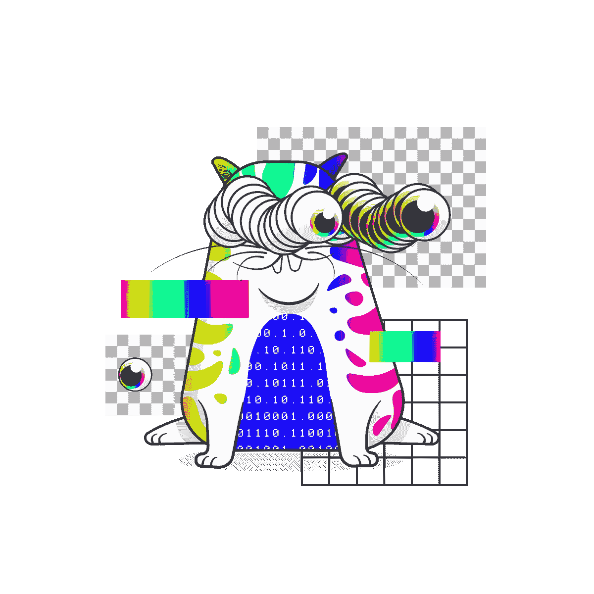

# 如何将 1 只数码猫变成 150 头模拟牛

> 原文：<https://medium.com/hackernoon/how-to-turn-1-digital-cat-into-150-analogue-cows-bc1ddb91845f>

从 [ETHWaterloo](https://ethwaterloo.com/) 出来的最酷(也绝对是最可爱)的东西之一是 [CryptoKitties](https://www.cryptokitties.co/) ，它自我描述为“一个围绕着可繁殖、可收藏、我们称之为 CryptoKitties 的可爱生物的游戏！”

大约一个月前，他们推出了智能合同，我想我应该看看。我发现了一些普通的 bug(代码写得非常好),作为回报，他们给了我这个，我自己的 BugKitty:

(当我看到他们设计的东西时，我笑得前仰后合。干得好，隐猫队。)

大约在同一时间，这款游戏以及这些数码猫咪的价值开始飙升，独一无二的“创世纪猫”(genesis cat)[售价近 250 以太](https://techcrunch.com/2017/12/03/people-have-spent-over-1m-buying-virtual-cats-on-the-ethereum-blockchain/?ncid=mobilenavtrend)——当时约为 10 万美元。

这让我想到了我自己几乎独一无二的猫。他很棒，但是那笔钱可以产生很大的影响。

巧合的是，我一直以来最喜欢的慈善机构 [Worldbuilders](https://worldbuilders.org/) 正在进行一年一度的慈善活动。Worldbuilders 是大胡子奇迹 Patrick Rothfuss 的作品，他不仅是一个不可思议的作者(说真的，去读读他的书吧),还是一个真正善良的人。Worldbuilders 每年举办一次慈善彩票，装满了来自科幻和奇幻作家、出版商和粉丝的捐款(以及许多其他很酷的东西)，并将所有收入捐给国际小母牛组织。

小母牛为贫困家庭提供牲畜和训练，帮助他们自给自足。这里有一篇关于世界建设者博客的好文章，讲述了他们能做的好事。向一个家庭赠送一头小母牛并对其进行必要的训练大约需要 500 美元，但这份礼物足以让整个家庭走上自食其力的道路，并极大地改善他们的状况。

因此，我将我心爱的 BugCat 挂牌拍卖，起价为看似疯狂的 200 以太，降至 25 以太(CryptoKitties 采用荷兰式拍卖，随着时间的推移，价格会降低，直到有人购买它们)。

以太坊的创始团队之一杰夫[表达了一些兴趣](https://twitter.com/jeffehh/status/937343602379907072)，托马斯·克洛维斯[立即说服他](https://twitter.com/GUA/status/937364835112837120)承诺购买它，如果我们能获得足够多的转发——500 条。

于是[我发了](https://twitter.com/nicksdjohnson/status/937393954022150144)，你们都转发了。几个小时后，我们达到了 500 人——对帮助传播消息的每一个人表示无尽的感谢。到那时，杰夫已经上床睡觉了，当它一达到 500，我也上床睡觉了。

早上醒来，BugCat 被卖掉了——但不是卖给杰夫。一个叫“dimsim”的人在夜里用 175 美元买下了他，这使得 BugCat 成为迄今为止第二高价的 CryptoKitty。他们是从所有的转发中了解到 BugCat 的吗？我们可能永远不会知道。杰夫似乎对这个结果出奇地没意见。

175 乙醚在扣除拍卖行费用和交易费用之前，相当于大约 169.1 英镑，按今天的价格计算，大约是 75000 美元多一点——或者按小母牛的价格计算，大约是 150 头(模拟)母牛。

我已经给 Worldbuilders 发了电子邮件，想找出将我们神奇的互联网资金转化为美元的最佳方式，我会在 Twitter 上发布最新进展。

请不要忘记你也可以捐赠——你将帮助一个好的事业，并有机会在他们的抽奖中赢得一些优秀的书籍和游戏。如果你在这里[捐款](https://t.co/ikDUpcYLpQ)，你的捐款将被追踪为来自以太坊社区。把你的以太坊地址留个笔记，我就送你一个 CryptoKitty(优惠有限，送完即止)。

感谢 Jeff、CryptoKitties、Thomas Clowes、笔名“dimsim”以及所有帮助转发的人。