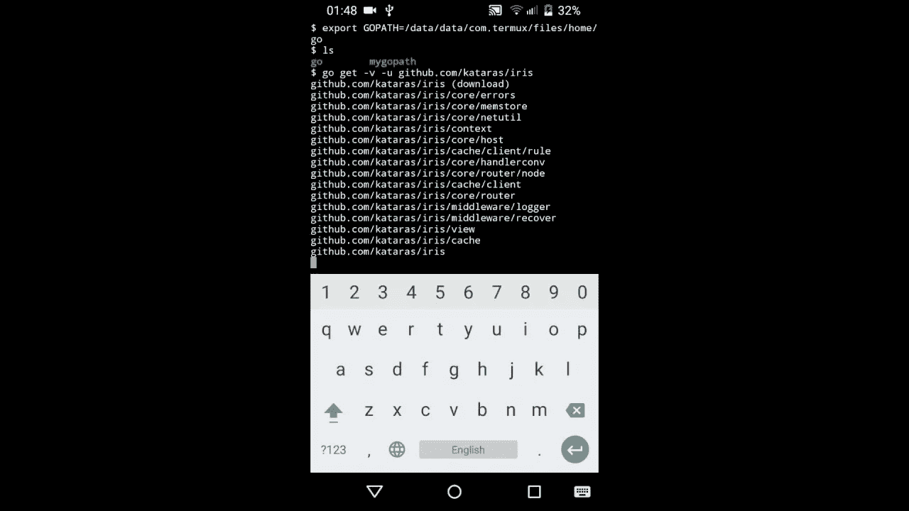

# 如何将 Android 设备变成网络服务器

> 原文：<https://medium.com/hackernoon/how-to-turn-an-android-device-into-a-web-server-9816b28ab199>



[https://www.youtube.com/watch?v=Vs5CScPeMA0](https://www.youtube.com/watch?v=Vs5CScPeMA0)

大家好，

昨天我确实设法从我的 android 手机上提供了我的 web simple 应用程序。通过遵循一些简单的步骤，你也可以做到，这简直太简单了！

首先，我必须说这个实验只在用 [Golang](https://golang.org) 和 Android 版本编写的 [Iris web 框架](http://iris-go.com)下测试和运行。

# 步伐

打开您的 android 设备，按照以下步骤操作。

1.  安装并打开 [termux](https://play.google.com/store/apps/details?id=com.termux)
2.  按顺序执行以下命令

```
$ pkg install git
$ pkg install golang
$ export GOPATH=/data/data/com.termux/files/home/go
$ go get -u -v github.com/kataras/iris
$ cd /data/data/com.termux/files/home/go/src/github.com/kataras/iris/_examples/hello-world
$ go run main.go
```

3.打开您最喜欢的浏览器，导航到
[http://localhost:8080](http://localhost:8080)

对于那些通过观看媒体更好理解的人，我也制作了一个简单的视频教程！

# 就这样，很简单。对吗？

分享你对这篇文章的想法，让我知道你打算用 Go + Iris 构建什么样的应用程序！

> 我们运行的 web 应用程序的完整源代码位于[那里](https://github.com/kataras/iris/blob/master/_examples/hello-world/main.go)。
> 如果您有任何进一步的问题，请随时在下方留言或[与我展开讨论](https://kataras.rocket.chat/channel/iris)。

编辑:我想感谢[开发者和](https://dev.to/kataras/how-to-turn-an-android-device-into-a-web-server)作者分享我的文章，这将是一个漫长的夜晚！