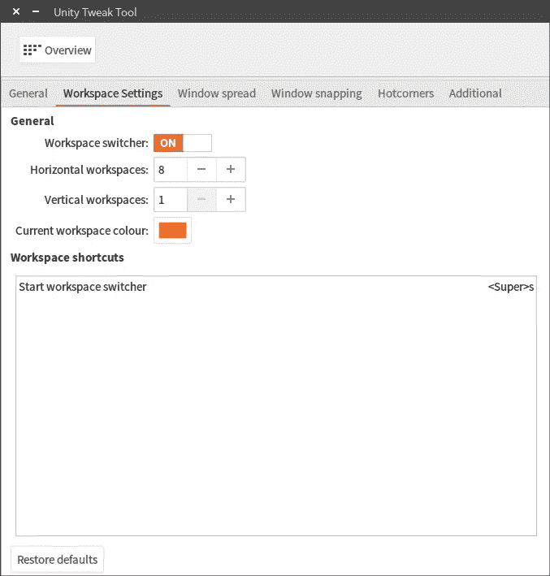
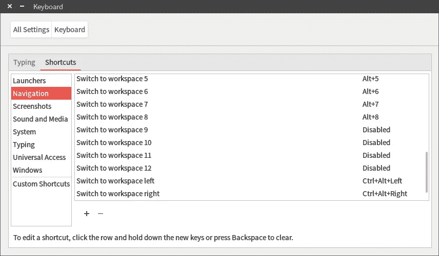
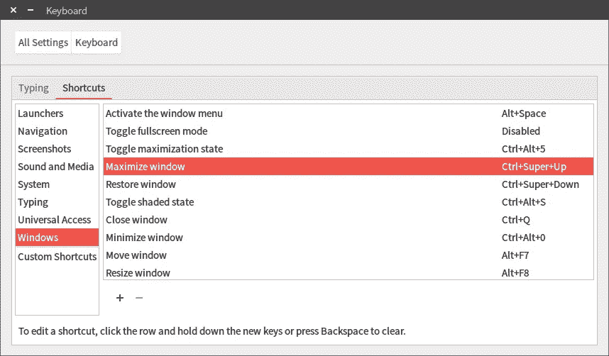
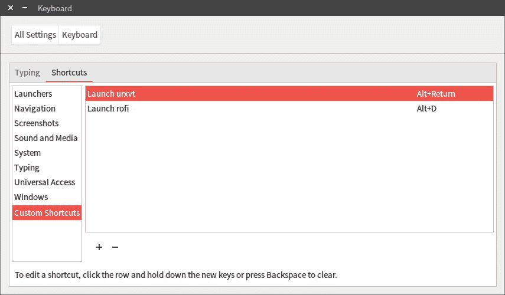
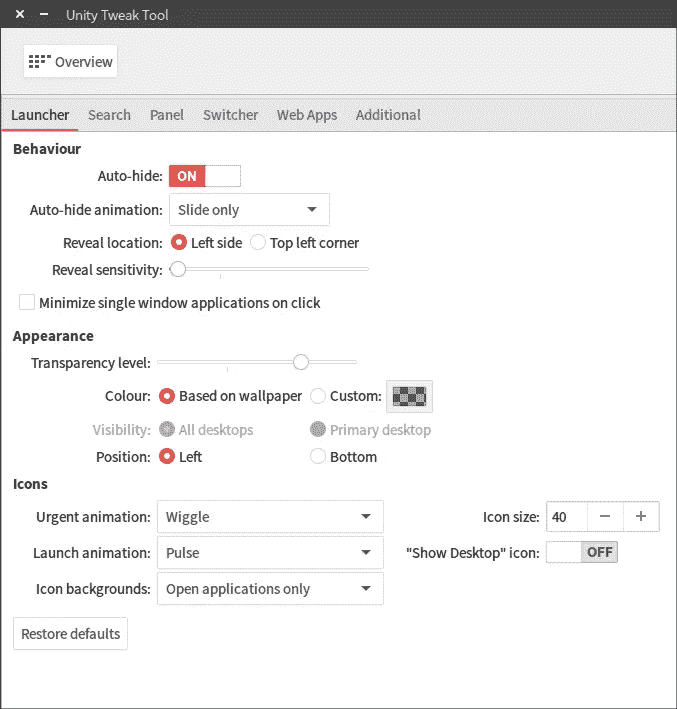
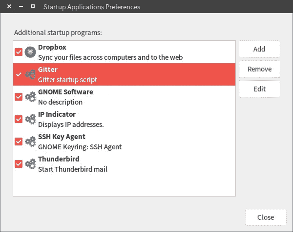
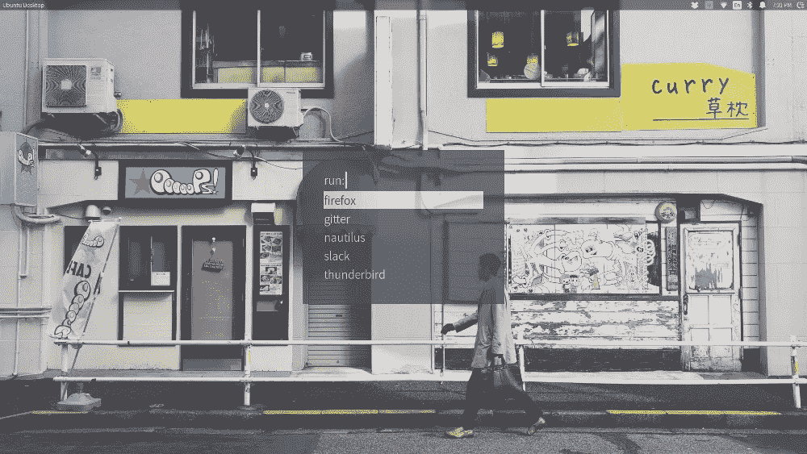
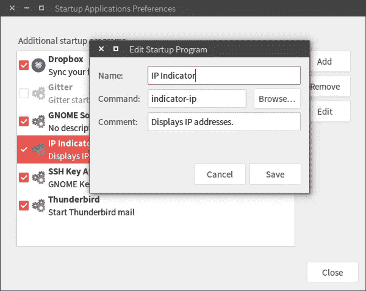
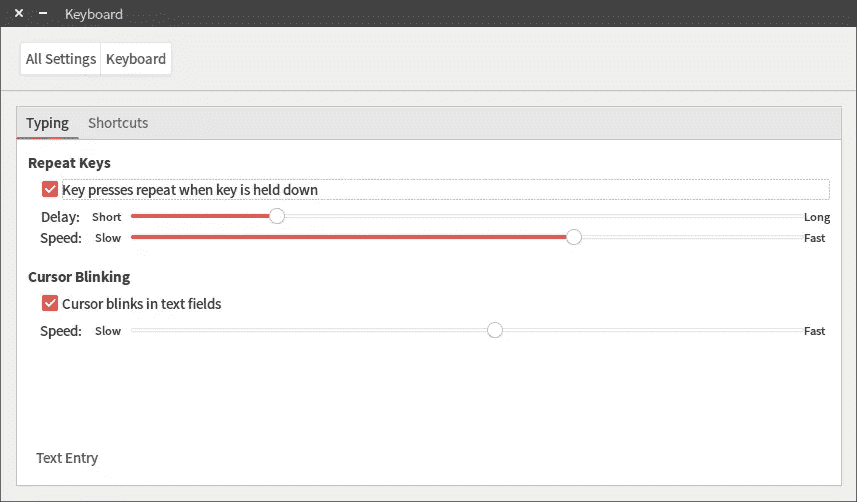

# 我如何把 Unity 变成一个平铺窗口管理器

> 原文：<https://medium.com/hackernoon/how-to-turn-unity-into-a-tiling-window-manager-e915512cd4cf>

*读者您好！这篇文章(以及我所有的文章)的更新版本可以在我的网站上免费获得:*[*Victoria . dev*](https://victoria.dev)*—感谢阅读！*

在我的旧笔记本电脑上使用 i3 作为我的主力窗口管理器的漫长而愉快的经历之后，我决定在我的新笔记本电脑上主要使用 Unity。由于我的 i3 体验，我非常喜欢平铺窗口管理器，然而，在开始使用我的新笔记本电脑之前，配置一切所花费的时间比我想花费在设置上的时间要长。(阅读:就是忍不住花几个小时 ricing。)

不过，我真的迷上了 i3 的功能，需要找到在 Unity 中复制它的方法。谢天谢地，这只需要一些小的调整。对于任何想使用功能全面的桌面环境的人来说，我希望这些调整对你有用。

# 工作区

您可以在 Unity 中创建类似于 i3 中工作区的工作区。

# 设置工作区

**在哪里找到:**
Unity Tweak Tool >工作空间设置

将“水平工作空间”设置为任意数量，将“垂直工作空间”设置为 1。这将允许您通过左右移动来访问空间。



# 快捷键

**哪里找:**系统设置>键盘

# 切换工作空间

**去哪里找:**
系统设置>键盘>导航

您可以设定键盘快捷键，将数字分配给工作区，并让您在它们之间左右移动。



# 四处移动窗口(对齐)

**去哪里找:**
系统设置>键盘> Windows

您可以使用快捷键最大化和恢复窗口。在我的例子中，我将它们分别设置为“Ctrl+Super+Up”和“Ctrl+Super+Down”。



我偶然发现了这个，我不确定它是否列在我找不到的地方。如果我按下“Ctrl+Super”和向左或向右箭头键，我可以将窗口捕捉到屏幕的左半部分或右半部分。

# 自定义快捷方式

**在哪里可以找到:**
系统设置>键盘>自定义快捷键

“自定义快捷键”允许你设置 i3 中缺少的任何快捷键。对我来说最重要的是启动终端和使用 rofi 的快捷方式。



# 丢掉发射器

**在哪里可以找到:**
Unity Tweak Tool>Launcher

打开“自动隐藏”并将“显示灵敏度”设置为零。



# 登录时自动启动程序

**哪里找:**
启动应用程序

类似于将`@reboot`与 Cron 一起使用。



# 不均匀度

拜托，我当然不会把它留在库存里…



# Unity 调整工具

你可以用 Unity Tweak 工具做一些事情。这是我的设置:

**主题** : Numix
**图标** : Numix-circle
**光标** : Paper
**默认字体**:no to Sans CJK JP Light 10
**单空间字体**:Ubuntu Mono Regular
**文档字体** : Sans Regular 11
**窗口标题字体**:no to Sans CJK JP Light 13

# 移除面板(顶部状态栏)阴影

**在哪里可以找到:**
重命名或删除该文件:`/usr/share/unity/icons/panel_shadow.png`

注销并再次登录以重新启动 Unity。

# 面板不透明度

**在哪里可以找到:**
Unity Tweak Tool>Panel>透明度等级

# 其他其他设置

**在哪里可以找到:**
Unity Tweak Tool>Web 应用程序>集成提示关闭，取消选中预授权域

# 自动启动开放虚拟专用网

严格来说，这不是一件统一的事情，但却很有用。

下载所需包:`openvpn`
`network-manager-openvpn`
`network-manager-openvpn-gnome`

从你的控制台页面下载你的`client.ovpn`文件并用`client.conf`重命名。
用第 1 行的用户名和第 2 行的密码创建`keys.txt`文件。(是的，它是纯文本。Ubuntu 的`.Private`加密文件夹是存储它的好地方。)

在`client.conf`文件中:-用您的实际 IP 地址替换“openvpn”的实例-在`auth-user-pass`之后直接添加`keys.txt`文件名，如下所示:

```
auth-user-pass keys.txt
```

将`client.conf`、`keys.txt`均加至`/etc/openvpn`

最后，在`/etc/default/openvpn`中，取消注释`AUTOSTART="all"`

# 在面板中显示 IP 地址

使用一种叫做`indicator-ip`的轻便小工具。

从终端运行`sudo apt install indicator-ip`。

将其添加到启动应用程序以自动运行。



# 如果你有一只猫

也许取消选中此系统设置>键盘框:



希望这有所帮助！回头查看更多提示——当我发现它们时，我会继续更新这篇文章！

有没有可以分享的？让我知道！

*原为发表于*[*Vicki lai . io*](https://vickylai.io/verbose/turn-unity-into-tiling-windows-manager/)*。*