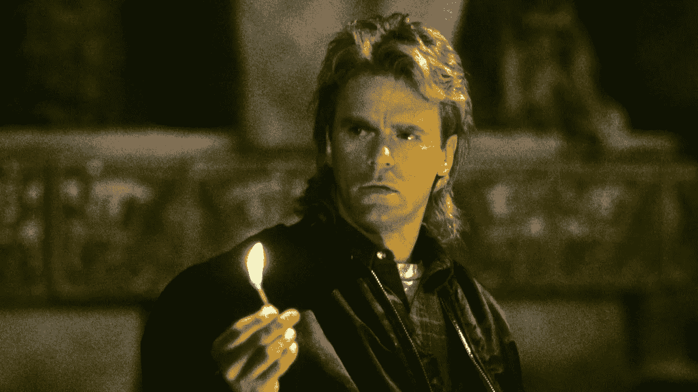

# 如何将你的不足转化为资产

> 原文：<https://medium.com/hackernoon/how-to-turn-your-liabilities-into-assets-409686910ed7>

## 或者如何成为自己生活的主人

“Just think of all the shit I can burn with this one little match.”

如果你最大的不足实际上是你最大的 T2 资产会怎样？如果现在不能拥有或成为你想要或需要的一切迫使你变得更有创造力和独特呢？如果看似负面的环境给了你非凡的天赋呢？

> 简而言之，如果命运召唤你成为自己生活的主宰，那该怎么办？

嗯，确实是。它在召唤我们所有人。这是唯一的出路。我们唯一的选择是感激我们所拥有的，并尽我们所能去做。

像 MacGyver 一样，你不能用你没有的工具拆除炸弹。有时候你只有铁丝网和泡泡糖，如果你不停止抱怨你*没有*的东西，用你*有*的东西来解决这个问题，我们都会死。

为什么？因为稀缺激发创造力。问题创造问题解决者。伤口导致愈合。世界就是这样运转的。

想想看:

*   一些世界上最伟大的企业家在成长过程中身无分文。他们饥肠辘辘，又没什么可损失的。另一方面，在富裕中长大通常(但不总是)是避免冒险和不真正做任何事情的不二法门。
*   **我们许多最伟大的治疗者曾经是最受伤的。托尼·罗宾斯是个又胖又穷的孩子，有一个虐待他的继父，但他继续建立了一个教练帝国。欧普拉在童年和年轻时曾多次遭受性虐待，她将这种痛苦转化为围绕康复建立媒体帝国。在受到启发写下《现在的力量》的前几个月，艾克哈特·托尔感到失落和孤独。**
*   我们一些最有权势的领导人从小就没有父亲。比尔·克林顿和巴拉克·奥巴马都是在没有父亲的情况下长大的。罗纳德·里根和杰拉尔德·福特的父亲都是酗酒成性的人。她们没有哀叹生活中缺乏男性领导，而是培养了一种照顾自己和领导他人的天生能力。
*   我们许多最鼓舞人心的运动员都是残疾人。还在自怨自艾？今年夏天看残奥会。很少有事件能激发更多的敬畏，提醒你我们大多数人是多么幸运。

那么，你“错过了什么？”你坐在那里希望你有什么？要是我再高一点就好了。要是我再瘦一点就好了。要是我父亲相信我的梦想就好了。如果我不是出生在爱达荷…或者斯里兰卡就好了。

无论你遭遇了什么样的悲剧…无论你希望你一直拥有的是什么…无论你还在疗伤…我对你的损失深表遗憾。

但是*这个*是你现在所拥有的一切。如果你想在未来的某个时候有更多的砖块和工具来建造一个更加美好的生活，你需要充分利用你现有的破旧和不完美的砖块。

就像没有月亮的夜晚会让星星看起来更亮一样，有时候没有东西会让我们不太明显的天赋和机会变得更明显。

所以，问问你自己…我的生活让我特别适合做什么？我的故事能激励和治愈谁？我需要学习什么技能来弥补没有东西交给我的情况？宇宙赐予我什么礼物来弥补我在其他地方没有的礼物？

回答这些问题，你将成为自己生活的主宰。

…

# 如果你喜欢这个故事(哪怕是一点点)，请点击下面的小心脏。这将有助于其他人阅读它，对我来说意义重大。

爱德华·苏利文是 LeadWell.co 一家精品教练和培训机构**的创始人兼主教练。LeadWell 在旧金山和纽约设有办事处，帮助领导者及其团队优化绩效，克服发展障碍。他可以通过***联系到 edward@leadwell.co。***

************

> **[黑客中午](http://bit.ly/Hackernoon)是黑客如何开始他们的下午。我们是 AMI 家庭的一员。我们现在[接受投稿](http://bit.ly/hackernoonsubmission)并乐意[讨论广告&赞助](mailto:partners@amipublications.com)机会。**
> 
> **如果你喜欢这个故事，我们推荐你阅读我们的[最新科技故事](http://bit.ly/hackernoonlatestt)和[趋势科技故事](https://hackernoon.com/trending)。直到下一次，不要把世界的现实想当然！**

****