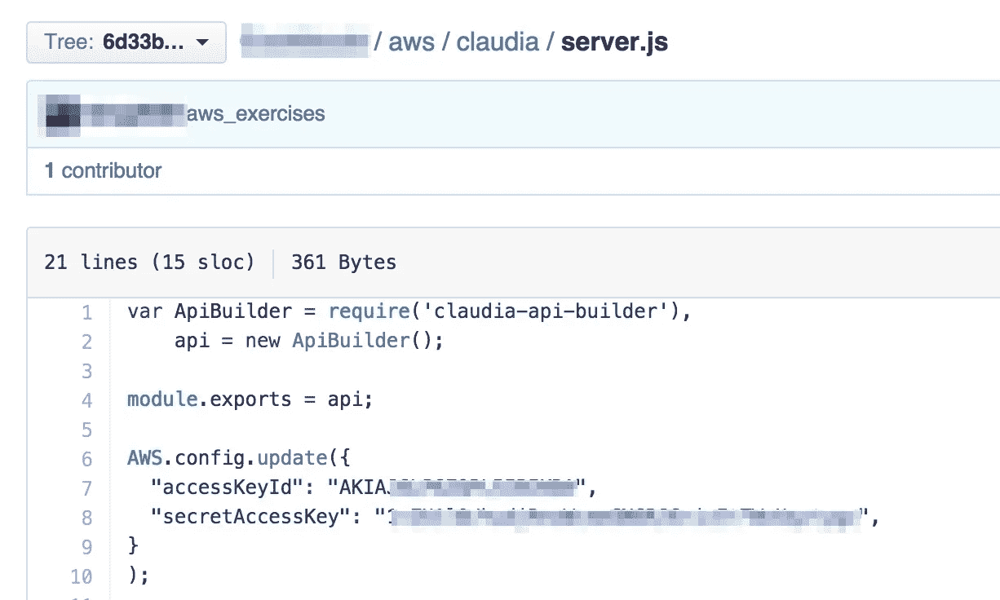

# 如何使用环境变量保持您的密钥安全和可靠！

> 原文：<https://medium.com/hackernoon/how-to-use-environment-variables-keep-your-secret-keys-safe-secure-8b1a7877d69c>


# 为什么？

避免(*意外地*)提交(*暴露*)你的*私钥*、*密码*或其他*敏感细节*(通过在你的脚本中硬编码*)到 [GitHub](https://hackernoon.com/tagged/github) ，通过将它们存储为环境变量。看这个例子*



有一个人把 aws 键推给 github 的故事:

> *意外地*将 API 密钥推送给 GitHub 可能是一个*昂贵/紧张的教训*:[https://www . quora . com/My-AWS-account-was-hacked-and-I-have-a-50-000-bill-how-I-can-reduce-amount-I-need-pay](https://www.quora.com/My-AWS-account-was-hacked-and-I-have-a-50-000-bill-how-can-I-reduce-the-amount-I-need-to-pay)

# 什么是环境变量？

环境变量是一个`KEY=value`对，存储在运行代码/应用程序的本地系统上，可以从代码中访问。

# 怎么会？

请遵循以下步骤:

1.  列出所有*默认的*环境变量

```
$ printenv
```

2.为了存储我们的秘密数据，比如令牌、API 密钥、密码，创建一个名为 **app-env** 的文件

```
export API_KEY="ABDJFdfrpf956irjglkfmgi5kgf"
export TOKEN="213j29rhdfn94htrfuh94" 
```

3.使用 Source 命令将该文件放入本地环境

```
$ source app-env
```

4.现在我们可以在程序中使用这些环境变量，例如在 [NodeJS](https://hackernoon.com/tagged/nodejs) 中:

> Node.js 让您可以访问在您的环境中定义在 **process.env** 全局对象中的变量。

所以我们可以使用 process.env 对象来访问我们的键

```
var api_key = process.env.API_KEY;
```

5.最后将 app-env 添加到。gitignore 所以这个文件被忽略。饭桶

```
app-env
```

这样，我们可以在本地环境中使用我们的密钥和令牌，并且不会将这些敏感数据暴露给 Github 上的其他人。

[](http://bit.ly/HackernoonFB)[](https://goo.gl/k7XYbx)[](https://goo.gl/4ofytp)

> [黑客中午](http://bit.ly/Hackernoon)是黑客们下午的开始。我们是 [@AMI](http://bit.ly/atAMIatAMI) 家庭的一员。我们现在[接受投稿](http://bit.ly/hackernoonsubmission)并乐意[讨论广告&赞助](mailto:partners@amipublications.com)机会。
> 
> 如果你喜欢这个故事，我们推荐你阅读我们的[最新科技故事](http://bit.ly/hackernoonlatestt)和[趋势科技故事](https://hackernoon.com/trending)。直到下一次，不要把世界的现实想当然！

