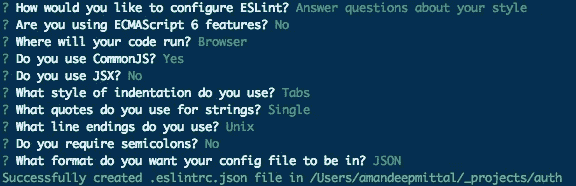

# 如何在 Node.js 应用中使用 ESLint？

> 原文：<https://medium.com/hackernoon/how-to-use-eslint-in-node-js-applications-cc4b2298ce55>

ESLint 是一个开源 JavaScript 林挺实用程序，它可以帮助您克服开发人员的错误，因为 JavaScript 是一种松散类型的语言。在 Javascript 社区中有相当多的选项，比如 JSHint 和 JSCS，用于编码林挺，这篇文章并不是说你不能使用它们。

ESLint 的设计使得所有规则都是完全可插拔的。这是它存在的主要原因之一。它允许开发者创建他们自己的林挺规则。ESLint 官方指南中提供的每个规则都是独立的规则，开发者可以在任何时候决定是否使用特定的规则。

# 安装

*注意*:你必须安装 Node.js 才能通过它的包管理器`npm`访问 ESLint。

对于项目目录的本地安装:

对于工作系统中的全局安装:

ESLint 现在可以通过终端中的`eslint`命令获得。

# 配置

最简单的配置方法是设置一个`.eslintrc` JSON 文件，在那里可以描述所有的林挺规则。

`.eslintrc`的一个例子:

如果您全局安装了 eslint，您也可以使用

其他情况下，如果您已经将它本地安装到一个项目中，您将需要在您的终端中键入:

在这两种情况下，你都会被提示一组基本问题来生成`.eslintrc`文件。

以上提示后生成的文件示例:

关于配置的详细信息，[阅读此处](http://eslint.org/docs/user-guide/configuring)。

# 规则

ESLint 中的规则是单独添加的。默认情况下，不实施任何规则。您必须明确指定规则，然后只有它将被启用林挺进程。

你可以在[官方文档中找到完整的规则列表，点击这里](http://eslint.org/docs/rules/)

在决定包含哪些规则后，您必须设置错误级别。每个误差等级可以定义如下:

*   `0` -关闭规则
*   `1` -打开规则作为警告
*   `2` -将规则作为错误打开

错误和警告的区别在于 eslint 结束时会有一个退出代码。如果发现任何错误，eslint 将以`1`退出代码退出，否则将以`0`退出。如果您是构建步骤中的林挺，这允许您控制哪些规则应该“中断您的构建”，哪些应该被视为警告。

在这里详细了解如何[配置规则。](http://eslint.org/docs/user-guide/configuring#configuring-rules)

# 环境

您正在编写的代码可能适合特定的环境，例如，您可能正在使用 Express Framework (Sinatra)在 Node.js 应用程序中编写 REST API，而该应用程序的前端将在 AngularJS 中构建。两个不同的项目，两个不同的环境，在一个文件中可以有不同的 eslint 配置，即使客户端和服务器在一个项目目录下，该目录被认为是项目的根目录。

是怎么做到的？通过在`.eslintrc`的`"env"`部分设置环境 id 为真。

# 林挺

ESLint 附带一个命令行界面(CLI)来 Lint 你的文件或目录。

生成的输出将按文件分组，并将指定`line:column`号、警告/错误、错误原因以及每个失败的规则名称。

# 使用 ESLint 和你喜欢的编码风格

ESLint 个人不提倡任何编码风格。您可以设置`.eslintrc`文件，使用您喜欢的[样式规则](http://eslint.org/docs/rules/#stylistic-issues)强制编码样式。

您也可以将 ESLint 与样式指南一起使用，例如 [JavaScript Standard Style](http://standardjs.com/) 。你必须使用额外的插件。完整的指南可以在这里找到([https://github.com/feross/eslint-config-standard](https://github.com/feross/eslint-config-standard))。

向`.eslintrc`添加插件:

热门库的一些插件:[Angular](https://www.npmjs.com/package/eslint-plugin-angular)|[React](https://www.npmjs.com/package/eslint-plugin-react)

另一个插件，我发现非常有用的是[每个变量一个变量](https://www.npmjs.com/package/eslint-plugin-one-variable-per-var)只是为了在一个大型/开源项目中保持代码的一致性。

***感谢阅读。如果你觉得这个帖子有用，请点击*T3💚**按钮*这样这个故事就能接触到更多的*读者*。如果你想谈论它，请在***[**Twitter**](https://twitter.com/amanhimself)***或*** [**查看我在 Node.js**](/@amanhimself) ***上的其他文章。*****

想要收到更多像这样的文章吗？订阅我 [**这里**](https://patreon.us17.list-manage.com/subscribe?u=ad4c168a6d5bb975f2f282d54&id=39e959cecd) **。有时，我会向我的订户发送“从未见过”的内容。**

> [黑客中午](http://bit.ly/Hackernoon)是黑客如何开始他们的下午。我们是 [@AMI](http://bit.ly/atAMIatAMI) 家庭的一员。我们现在[接受投稿](http://bit.ly/hackernoonsubmission)并乐意[讨论广告&赞助](mailto:partners@amipublications.com)机会。
> 
> 如果你喜欢这个故事，我们推荐你阅读我们的[最新科技故事](http://bit.ly/hackernoonlatestt)和[趋势科技故事](https://hackernoon.com/trending)。直到下一次，不要把世界的现实想当然！

