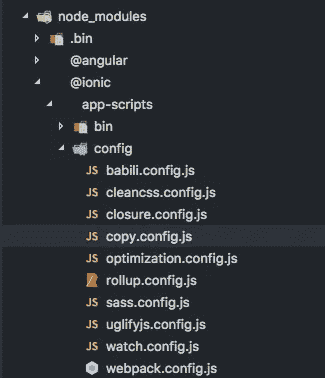
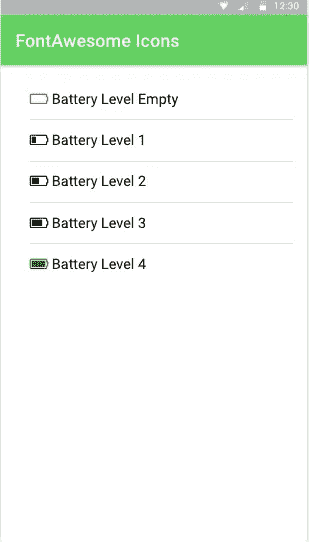

# 如何在 Ionic 应用程序中使用字体 Awesome

> 原文：<https://medium.com/hackernoon/how-to-use-font-awesome-in-an-ionic-application-31638ed3f77d>

在 Ionic 应用程序中使用 FontAwesome 时，有一点令人困惑。要在 Ionic 中包含这个字体库需要一点配置，这个逐步指南将提供这一点。

# 自举离子应用

创建一个新的 Ionic 应用程序，或者您可以按照以下步骤将 FontAwesome 包含在您的 Ionic 应用程序中。什么都不会分解。

现在，安装来自`npm`的 FontAwesome 包，并将其保存在应用程序的依赖项中:

在应用程序的根文件夹中键入以上内容。这将在`node_modules`下添加`font-awesome`文件夹。`--save`选项将把包包含在`package.json`文件的依赖部分中。

# 包括字体

现在转到`src/index.html`文件，在`build/main.css`上方添加下面的`link`标签:

# 添加自定义拷贝脚本

Ionic 包括一个复制脚本文件，当命令`ionic serve`执行时，在构建过程中调用该文件，它负责将特定的和所需的资源从`node_modules`移动到`www`文件夹，例如 ionicons。

该脚本文件的位置在`node_modues`文件夹下:

复制这个文件并粘贴到 Ionic 应用程序根目录下一个名为`config`的新目录中。打开文件，在文件底部添加 fontawesome 条目。

# 在`package.json`中包含自定义复制脚本

我们必须将这个自定义脚本包含在我们的`package.json`文件中，以覆盖我们从中复制原始文件的那个脚本。打开`package.json`文件并添加以下 json 代码:

配置部分就是这样。

# 使用字体真棒

为了在这个或任何 Ionic 应用程序中实现 FontAwesome，我们尝试在预先生成的主页上添加一些字体。

FontAwesome 中有超过 675 个图标可用，我认为 Ionicons 和 FontAwesome 的组合对于一些应用程序来说已经足够了。你甚至可以根据自己的需要设计它们的样式、改变它们的`font-size`和颜色。

## [***Github 资源库完整源代码***](https://github.com/amandeepmittal/ionic-use-font-awesome)

想收到更多像这样的文章吗？订阅我 [**这里**](https://patreon.us17.list-manage.com/subscribe?u=ad4c168a6d5bb975f2f282d54&id=39e959cecd) **。有时，我会向我的订户发送“从未见过”的内容。**

**找我:**

 [## 阿曼·米塔尔·🖖(@阿曼本人)|推特

### 阿曼·米塔尔·🖖的最新推特(@阿曼本人)。# book blogger @ https://t.co/UQvyNf1OTC |开发者| #Nodejs |…

twitter.com](https://twitter.com/amanhimself)