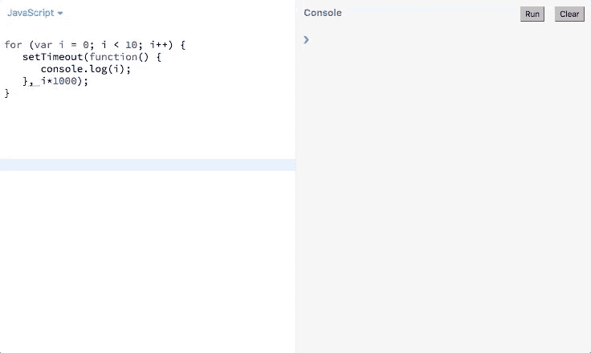
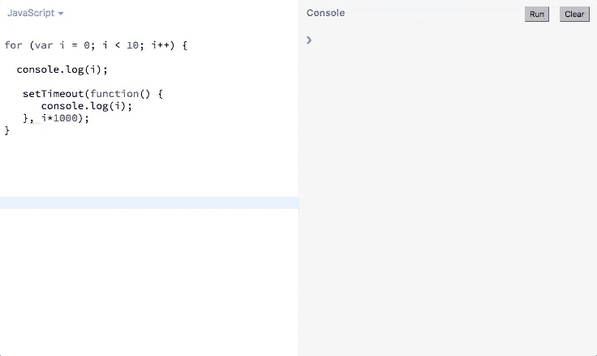
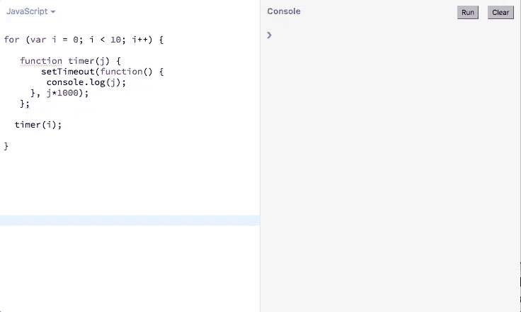

# 如何放心地使用 JavaScript 闭包

> 原文：<https://medium.com/hackernoon/how-to-use-javascript-closures-with-confidence-85cd1f841a6b>

## 使用闭包将是小菜一碟


从凯尔·辛普森的话来看，

> "在 JavaScript 中，闭包就在你周围，你只需要认识并接受它."

当你用 [JavaScript](https://hackernoon.com/tagged/javascript) 写的时候，闭包就这么发生了……不管你是否意识到了。理解闭包以有意地创建它们并利用它们的能力是每个 JavaScript 开发人员都必须解决的挑战；下面就用这篇文章来试试吧。

这里有一个有点学术性的定义，当你看到一个闭包时，它将帮助你理解并识别它:**闭包是指一个函数能够记住并访问外部(封闭)函数的变量，即使该函数在其作用域之外执行。**

> *封闭是指函数能够记住并访问外部(封闭)函数的变量，即使该函数在其作用域之外执行。*

我们稍后再回到 [*范围*](https://hackernoon.com/understand-javascript-variable-scope-with-ease-221a6d41dc43) 概念。现在只需要知道，根据变量在代码中的位置，有些函数可以访问它，有些不能。

现在说说*变量*；您可能已经知道，变量有两个组成部分:名称和值。“变量”这个名字非常清楚地说明了这一点:它的值可以从一个时刻到下一个时刻*变化。但有时，我们需要保留某个时间点的值，以便以后使用。*

在 JavaScript 中，这种情况经常在使用像`setTimeout()`和`setInterval()`这样的函数时遇到。

# `for`循环的例子

让我们以一个用于显示计数器的`for`循环和一个用于延迟函数执行的`setTimout()`函数为例。

查看这个代码片段，您通常会认为它会每秒打印一个数字 0 到 9。事实上，如果您运行这段代码，您会以 1 秒的间隔将 10 打印 10 次:



为什么会出现这种情况？

当 for 循环运行并且`setTimeout()`在未来的某个时间被调用时(在这种情况下，在未来的一秒钟后)，变量`i`的值已经被 for 循环递增到其范围的末端。

在这种情况下，我们需要在给定时间存储和访问变量值，然后再修改它。在每次迭代循环中，我们需要“捕获”相应的`i`副本，并存储起来以备后用。好消息是闭包将帮助我们做到这一点:**在循环的每次迭代中创建一个新的闭包作用域**。

我们将回到这个例子，看看如何给我们的循环添加一个闭包。但是在深入探讨闭包的工作原理之前，让我们绕一小段路，回顾一下为了完全掌握闭包我们需要很好理解的一些重要概念。

## 函数也是变量

函数是一个特殊的变量:您可以给它重新赋值，并将其作为参数传递给另一个函数(这在编写作为回调参数传递的异步函数时很有用)。

## 变量的范围

在函数外部定义的变量可以被该函数访问。它们可以在函数外部修改，也可以由函数本身修改。

在函数内部定义的变量以及传递给函数的参数只能在函数内部访问。

*(欲了解更多范围，请参考*[](https://hackernoon.com/understand-javascript-variable-scope-with-ease-221a6d41dc43)**)**

## *将变量传递给函数*

*当变量作为参数传递给函数时，变量的*值*被复制到参数中。*

# *采取关闭风暴*

*既然我们完成了绕行并回来了，我们准备解决关闭问题。*

*让我们考虑下面的代码:*

*让我们更深入地研究一下这个函数:这里发生了什么？*

*我们定义一个参数`number1`,它将接受传递给函数的变量值。*

*我们在函数 `myFunction`内部定义了一个*函数。在这个嵌套函数中，变量`number1`是可访问的，因为它是在`add`函数之外的父函数`myFunction`中定义的。**

*我们返回了`add`函数，但是我们没有*调用*它。这是什么意思？*

*`myFunction`函数*返回一个函数*:函数`add`。当我将`myFunction`打印到控制台时，会显示该函数的返回结果，该函数是*另一个函数*(`add`函数) :*

*为什么这很重要？因为这意味着我可以给`number1`赋一个值，传递给`myFunction`，这个新的`number1`的值会被存储起来以备后用，那时我就准备好完成作业，调用 add 函数了。*

*闭包最棒的地方在于:**您可以编写具有中间状态的函数，它可以在某个特定的时刻从您的应用程序中捕获数据，然后您可以在另一个更晚的时刻使用这些数据**。使用闭包就像在函数中添加一个“暂停”按钮。当您的应用程序发生变化时(例如，用户的点击事件)，您可以稍后返回，并且仍然能够检索应用程序发生变化之前的数据值。*

*如果没有闭包，JavaScript 将简单地运行所有代码并返回数据的最后一个已知值，没有办法返回到数据具有您现在想要使用的值的时刻。*

*这就是在我们的第一个`for`循环例子中发生的事情:`setTimeout`函数在战争中姗姗来迟。`for`循环的战斗已经结束，当`setTimeout`骑兵到达时，`i`变量早已被赋予 10，这是循环中的最新值，并一直保持到`setTimeout`到达。*

*仍然不相信或不确定何时使用闭包？让我们举个例子，通过烤蛋糕来解释闭包是如何工作的。*

# *烤一个有封口的蛋糕*

*我们将使用此代码，它使用一个函数来烘焙具有不同配料和烹饪温度的蛋糕:*

*`ovenTemperature()`函数是**闭包，是函数**内部的一个函数，在`bakeCake()`函数被调用后的任何时间点都可以被调用。*

*请注意，我们必须采取两个步骤才能在控制台中获得整个日志。如果您运行这段代码并且从不调用`chocolateCake()`或`carrotCake()`，控制台将只打印:*

```
*"chocolate cake : add chocolate to the batter"
"carrot cake : add carrot to the batter"*
```

*您不会得到任何错误，但是函数内部的函数，即闭包，不会运行，也不会完成烘焙蛋糕。*

*还要注意，我可以使用我的`bakeCake()`函数来烤两个非常不同的蛋糕，每一个都是`bakeCake()`的一个单独实例，它会记住自己的`ingredient`参数供以后使用。*

*就像在一个真正的食谱中，仅仅把`ingredient`加入面糊是不够的，你还必须设置正确的`temperature`和烘焙`time`才能得到一个完美的蛋糕。为此，你必须在函数内部调用另一个函数。正如我们在前面使用`add()`函数的例子中看到的，如果这个内部函数没有被调用，外部函数的返回只是另一个函数，等待它被调用的时间，而不是结果值(还没有)。*

*这里，`bakeCake()`函数不会返回“准备烘烤”行，直到你也用两个参数调用了`ovenTemperature()`函数:它被挂起，直到被正确调用。*

*你可以将巧克力放入面糊中，让面糊静置，然后花时间查看你的食谱，确定合适的温度和烘焙时间。可以是一个小时后，你可能要打电话给你妈妈征求意见了，加巧克力的面糊还会在这里，等你下最后的指令。换句话说，任何时候你调用`chocolateCake()`，参数`ingredient`，巧克力，仍然会被包含。*

*那么当我准备好了，我该如何调用这个内部函数呢？我已经打电话给我妈妈，在网上查了每一个食谱，现在让我们一劳永逸地吃完这些蛋糕吧。*

*我已经创建了`bakeCake()`函数的两个实例，并将它们分配给两个不同的变量:`chocolateCake`和`carrotCake`。*

*让我们专注于巧克力蛋糕。`chocolateCake`是一个函数，是`bakeCake`的一个实例，带有一个`chocolate`参数。为了让`chocolateCake`返回“准备烘烤”语句，我只需调用它并传递`ovenTemperature()`函数所需的参数。*

*这意味着在我们为要触发的闭包传递第二组参数之前，不会实现`chocolateCake`。*

*这里为了便于理解，我们首先将`bakeCake("chocolate")`赋给一个变量(`chocolateCake`)，然后将第二个参数传递给这个变量，它也是一个函数。但是如果我们已经知道了食谱的所有要求，我们可以直接去做:*

```
*bakeCake("chocolate")(250, 60);*
```

*用道格拉斯·克洛克福特的话来说，这个实验的最终结果是:*

> *内部函数始终可以访问其外部函数的变量和参数，即使在外部函数返回后也是如此*

# *回到`for`循环示例中的`setTimeout()`*

*现在，我们已经从`bakeCake()`的例子中知道了一切，我们如何修改第一个例子中的代码来添加一个闭包，并让函数打印从 0 到 9 的数字，而不是打印数字 10 十次？(记住 10 是`i`的最后一个已知值:在循环的最后一次迭代中，该函数在控制台中记录 9，然后将这个数字增加 1。*

*让我们实时看看这个函数:*

**

*下面是我们函数的代码:*

*出于比较的目的，我们在循环的每次迭代中为`i`计数器添加了一个简单的`console.log()`，以及一个应该做同样事情的`setTimeout()`函数，这次间隔为 1 秒。*

*从上图中我们可以很容易地看到，`setTimeout()`函数确实以一秒的间隔打印结果，但是`i`的增量已经发生，当`setTimeout()`开始运行时，`i`在循环的每次延迟迭代中都有一个不变的值 10。*

**我们如何摆脱困境？**

*让我们应用到目前为止我们从使用闭包中学到的知识，编写一个`timer()`函数作为`setTimeout()`的外部函数，从这个函数中`setTimeout()`将能够访问`i`的值:*

**

*而且……它起作用了！*

*这里我们声明了一个`timer()`函数，并将`setTimeout()`函数包装在其中。然后，我们在循环的每次迭代中向其传递计数器的确切值，因此在每次迭代中**“关闭】函数内** `**i**` **的值。***

*我们也可以写:*

*在这里，我们声明一个匿名的自调用函数，并在循环的每次迭代中向它传递参数`i`。*

*感谢我们创建的闭包:**我们在给定的循环迭代中捕获了** `**i**` **的值，我们*在函数中关闭了*，将值传递给** `**setTimeout()**` **，然后调用函数**。*

# *结束语*

*前端的闭包可以帮助我们实现很多事情，比如[传递用户点击事件的参数](http://stackoverflow.com/questions/3495679/passing-parameters-in-javascript-onclick-event)或者[克服 google maps API 结果限制](/@lenafaure/how-i-sort-of-got-around-the-google-maps-api-results-limit-1c673e66ef36)。*

*在您成为中级或高级 JavaScript 开发人员的过程中，您将会遇到闭包，现在能够发现它们，有希望使用它们，并理解一些否则没有意义的错误。*

*想了解更多？查看我关于 JavaScript 基础的其他文章:*

*   *[**JavaScript 中的提升:快速指南**](https://hackernoon.com/hoisting-in-javascript-a-quick-guide-cc4d9597bbd7)*
*   *[**轻松理解 JavaScript 变量作用域**](https://hackernoon.com/understand-javascript-variable-scope-with-ease-221a6d41dc43)*
*   *[](https://hackernoon.com/get-your-head-around-this-73c23653b102)**搞清楚“这个”***
*   ***[**掌握 JavaScript**](https://hackernoon.com/grasp-by-value-and-by-reference-in-javascript-7ed75efa1293) 中的“按值”和“按引用”***
*   ***[**JavaScript 中的日期快速手册**](https://hackernoon.com/a-quick-handbook-for-dates-in-javascript-7b71d0ef8e53)***
*   ***[**像老板一样使用 JavaScript 数组**](/@lenafaure/work-with-javascript-arrays-like-a-boss-97207a042e42)***

***我希望您喜欢这篇 JavaScript 闭包的介绍。***

***请随意评论并喜欢这篇文章，以便其他人可以在 Medium 上轻松找到它！***

***[](http://eepurl.com/dvio9L)******[](http://bit.ly/HackernoonFB)******[](https://goo.gl/k7XYbx)******[](https://goo.gl/4ofytp)***

> ***[黑客中午](http://bit.ly/Hackernoon)是黑客如何开始他们的下午。我们是 [@AMI](http://bit.ly/atAMIatAMI) 家庭的一员。我们现在[接受投稿](http://bit.ly/hackernoonsubmission)，并乐意[讨论广告&赞助](mailto:partners@amipublications.com)机会。***
> 
> ***如果你喜欢这个故事，我们推荐你阅读我们的[最新科技故事](http://bit.ly/hackernoonlatestt)和[趋势科技故事](https://hackernoon.com/trending)。直到下一次，不要把世界的现实想当然！***

******