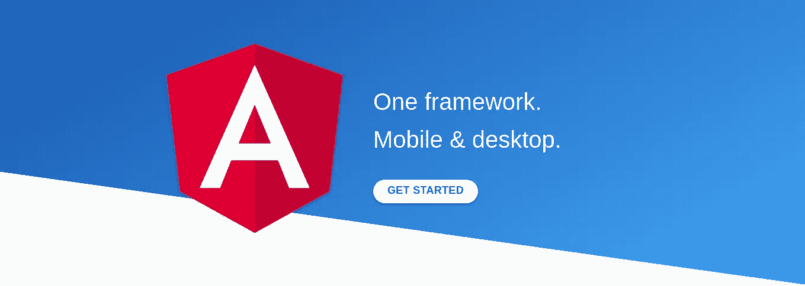

# 如何在 Angular 2+应用中使用 JavaScript 库

> 原文：<https://medium.com/hackernoon/how-to-use-javascript-libraries-in-angular-2-apps-ff274ba601af>



*还记得你在学习 AngularJS(版本 1)的时候，教程一直告诉你不需要在项目中加入 JQuery 吗？这仍然没有改变，你不需要将 JQuery 添加到 Angular 2+项目中，但是出于任何原因，你可能需要使用一些 JavaScript 库，并且你需要知道如何在 Angular 中使用它们。所以，让我们从零开始*

*我将在一个项目中添加* [*下划线. js*](http://underscorejs.org/) *并向您展示它是如何工作的。*

## 1.使用 Angular CLI 创建新项目

如果您的机器上还没有安装 CLI，[安装它](https://cli.angular.io/)，安装后，创建一个新项目(如果您还没有)

```
ng new learning
```

现在你将有一个新的 Angular 项目，名为“**学习**”

## **2。将软件包安装到您的项目中**

转到我们刚刚创建的项目:

```
cd learning
```

使用您首选的软件包管理器来安装您要使用的库；我用`npm`来安装`underscore.js`

```
npm install --save underscore
```

## 3.将库导入 Angular (TypeScript)

我们在用 TypeScript 写代码，我们应该遵循它的规则。打字稿需要懂`underscore.js`

众所周知，TypeScript 是 JavaScript 的类型化超集，可以编译成普通 JavaScript。TypeScript 有自己的语法，函数和变量可以有定义的类型，但当我们要使用外部库(如下划线)时，我们需要为 TypeScript 声明类型定义。

在 JavaScript 中，参数的类型并不重要，在编写代码时不会出现错误，但是 TypeScript 不允许向接受字符串作为输入的函数提供数组。那么问题来了，我们应该重写 TypeScript 中的`underscore.js`并在那里定义类型吗？

当然不是，TypeScript 提供了声明文件 *(*.d.ts)* ，这些文件为 TypeScript 定义了类型并标准化了一个 JavaScript 文件/库。

有些库包括类型文件，你不需要为它们安装 TypeScript 的类型目标。但是如果一个库没有`.d.ts`文件，你需要安装它。

我们只需要找到并导入`underscore.js`类型定义文件。我建议你使用[类型搜索](https://microsoft.github.io/TypeSearch/)来找到你需要的库的声明文件。

在 [Type Sceach](https://microsoft.github.io/TypeSearch/) 中搜索`underscore`，它会将您重定向到[类型/下划线](https://www.npmjs.com/package/@types/underscore)。使用以下命令安装声明文件:

```
npm install --save @types/underscore
```

## 4.将类型声明导入 Angular 应用程序

假设您将在您的`app.component.ts`文件中使用下划线，通过您的 IDE 打开`app.component.ts`，并在文件顶部添加以下代码:

```
import * as _ from 'underscore';/**
* OR simply:
* import 'underscore';
*/
```

组件中 TypeScript 现在可以理解`_`，并很容易地按预期工作。

## 问题:如何使用 TypeScript 和 Angular 中没有类型定义(*.d.ts)的库？

如果`src/typings.d.ts`不存在，则创建，否则打开它，并将您的包添加到其中:

```
declare var yourLibrary: any;
```

在您的类型脚本中，现在您需要通过给定的名称导入它:

```
import * as yourPreferedName from 'yourLibrary';
yourPreferedName.method();
```

## 结论

作为总结，让我们举一个简单的例子来看看`_`的工作示例。打开`app.component.ts`并在`appComponent`类中编写一个`constructor`，它使用下划线`_.last()`函数返回数组的最后一项:

```
...
import * as _ from 'underscore';
...
export class AppComponent {
  constructor() {
    const myArray: number[] = [9, 1, 5];
    const lastItem: number = _.last(myArray); //Using underscore
    console.log(lastItem); //5
  }
}
```

如果你现在打开你的 Angular 应用程序，你会在控制台中看到`5`，这意味着我们可以正确地将`underscore`添加到我们的项目中，并且它像预期的那样工作。

您可以按照相同的步骤将任何 JavaScript 库添加到您的项目中。

您可以关注 [me](/@kermani) 获取更多关于技术和编程的文章