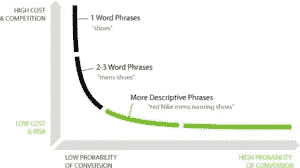
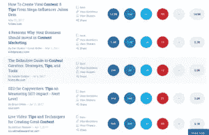

# 如何为假人使用长尾关键词

> 原文：<https://medium.com/hackernoon/how-to-use-long-tail-keywords-for-dummies-ee56d2448e96>

你有没有想过人们是如何在他们新网站的头几个月产生大量流量的？

不，我说的不是付费流量，而是有机流量。只是一个简单的策略，针对所有那些在搜索中有点具体的人。

大多数人用两三个词来搜索，但是也有一些人用一个长词来得到更具体的结果。

短期搜索者大多被利基的顶级网站带走，但如果我说，你可能会得到你的博客休息。

是的，你可以用一个简单的长尾关键词策略得到它们。

让我们更详细地解释一下，10 个人中有 2 个人搜索长尾关键词，如果你设法让某个长尾关键词排名靠前，那么你将获得 20%的流量，让其他网站争夺剩下的 80%(明智之举)。但由于你不是团队中唯一聪明的人，其他人也可能试图锁定你的受众，所以你需要表现得更聪明，制定更好的发展战略。

让我们看看，除了瞄准长尾关键词这个绝妙的主意之外，你还需要什么才能比其他竞争对手的网站发展得更快。

现在问题来了，

# 什么是长尾关键词？

如果你谷歌一下，会有很多定义，但是因为这个指南是给傻瓜看的，所以我会试着给出一个最简单的定义。

长尾关键词至少三个字以上。它们更具体，搜索量比一两个单词长的关键字低。

如何使用长尾关键词
(来源-Neilpatel.com)

# 为什么要用长尾关键词？

如果你不相信我的例子 2 和 10，那么让我们看看使用长尾关键词的其他好处。

# 在搜索引擎上获得更高的排名。

最好的，但是使用一个好的长尾关键词策略，你会在谷歌上获得更高的排名。你一定很讨厌那些在你的领域中搜索次数最多的关键词排名靠前的网站。你将如何与那些拥有比你高得多的 PAs 和 DAs 的人竞争？

你需要比他们更具体一些，把目标锁定在那些搜索次数少的人身上。

使用长期关键词，为他们获得更高的排名，建立自己的受众，最后尝试窃取短期排名。

# 短时间内获得更高的排名。

是的，你没听错。如果你有策略地使用长尾关键词，那么你会在短时间内排名更高。所以如果你有一个新网站，想获得有机流量，就和长尾关键词握手吧。

# 提高 CRO。

如果你是一个电子商务网站的所有者，那么我必须说，一个好的长尾关键词策略是你必须的。长尾关键词可以帮助你提高转化率。

如果人们想买东西，他们会搜索“买一件黑色牛仔夹克”，而不仅仅是“牛仔夹克”。

现在你需要把整个短语“买一件黑色牛仔夹克”作为目标，因为用这些词搜索的人比那些只搜索“牛仔夹克”的人更有可能购买。

# 如何找到长尾关键词？

这是最重要的问题。我希望你相信创造一个良好的长尾关键词策略。现在让我们告诉你如何正确地找到它们。

**寻找正确的关键词，第一招。**

# 谷歌一下。

最简单的一个，谷歌会告诉你正确的长期关键词。

去谷歌主要种子关键字。

假设你正在搜索一个与“内容营销技巧”相关的长尾关键词，当你在谷歌上键入它时，你会得到一个谷歌认为你可能正在搜索的关键词列表。这就是谷歌人工智能(Google AI for you)，你会看到类似“2017 年内容营销技巧”、“创业公司内容营销技巧”等关键词。

谷歌提供的这些关键词的优点是，它们是搜索次数最多的关键词，如果你成功地为它们排名，那么你将获得大量的流量。

**寻找正确的关键词，诀窍二。**

# 再谷歌一下。

这一次，您将再次谷歌种子词。现在滚动到底部。

这些是与我们的种子关键字“内容营销技巧”相关的搜索。

**寻找正确的关键词，诀窍三。**

# 使用 [BuzzSumo。](http://buzzsumo.com)

大多数营销人员建议使用 BuzzSumo 来寻找正确的关键词。

去 BuzzSumo，输入你的种子关键词“内容营销技巧”

现在，您将获得与您的 seed 关键字相关的网络上最多共享内容的列表。

所以你已经得到了与你的种子关键词相关的分享最多的帖子的列表。

我不喜欢的是它让我更加困惑。我不知道为什么当我试图为我的博客文章找到最好的关键词时，它在我的脑海中产生了很多嗡嗡声，但这完全是我的问题，BuzzSumo 是一个毫无疑问的伟大工具。

**寻找正确的关键词，第四招。**

# 使用 [SEMRush](http://semrush.com)

这是我最喜欢的一个，我用这个工具来寻找我的关键字。这个工具不是完全免费的，但是你至少可以用它的免费版本来找到正确的关键词。

转到 SEMRush 并键入 seed 关键字。

这不仅不能帮助你找到一个好的关键词，还会让你找到低容量的关键词。这样你就可以在最短的时间内使用该关键字获得更高的排名。此外，它还会告诉你某个关键词排名靠前的网站，都在一个地方。

现在，如果你想找到更多的关键字，点击查看完整报告。

在免费版中，你只能看到 10 个关键词。

现在，在你的营销策略中，你还需要什么来比其他可能也在使用长尾关键词策略的人发展得更快？

# 如何利用长尾关键词增长你的有机流量？

让我们来看看其他的 SEO 因素，它们会让你的长尾关键词策略脱颖而出。

# 震撼人心的标题-

*   使用“如何”、“为什么”、“最好”、“顶级”等词语。
*   把你的目标关键词放在标题的前半部分。
*   不要太长，但要简短。

# 链接果汁-

内部链接一直是一个很好的 SEO 实践。将你的旧博客链接到你的新博客，但是要真实，不要添加与主题无关的链接。

# 出站链接-

另一个很好的 SEO 实践，使用有更高的 PAs 和 DAs 和没有垃圾邮件分数的出站链接。此外，告诉所有者你已经通过一封甜蜜的私人邮件与他们建立了联系。也许他们会链接回你的，谁知道呢？

# 关键字百分比-

一个很常见的问题，整篇帖子中的关键词百分比应该是多少。如果你问我，我会建议占总字数的 2-3%。如果你认为塞很多东西能帮你排名靠前，那你就错了。不要认为你可以愚弄谷歌，谷歌会因为你填充关键词而惩罚你。

# 图像和视觉内容-

人们倾向于阅读、喜欢和分享那些视觉上更丰富的内容。添加图片、信息图、图表等，让你的帖子更有吸引力。当你使用视觉内容时，在 alt 标签和标题中添加目标关键字，这将有助于你的图像在图像搜索中排名更高。此外，使用无版权的图片，如果你需要使用其他人的图片，请在底部注明出处。

# 社交媒体营销-

现在，如果你完成了你的文章创作，是时候在社交媒体上推广它了。不要仅仅宣传你的文章，还要宣传所有的信息——图表、图像等等。

获得更多的社会参与，从而获得更多的流量。此外，社交媒体参与度也是谷歌排名的因素之一，可能不是直接而是间接影响排名。