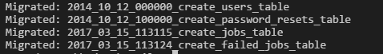
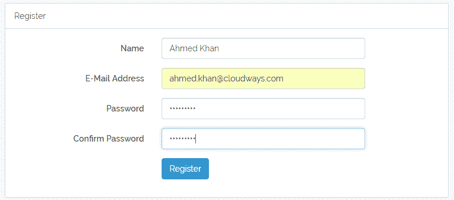
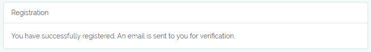
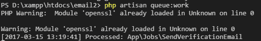
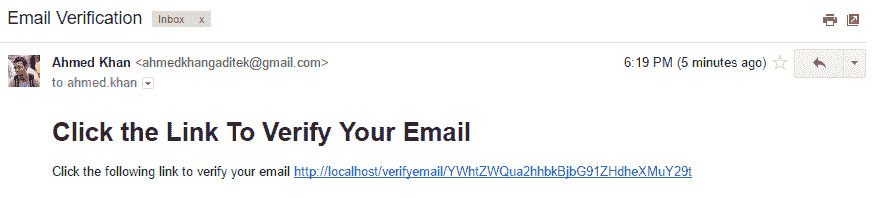
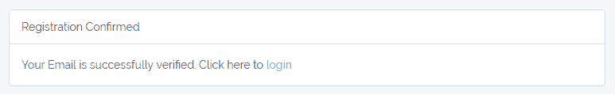

# 如何在 Laravel 5.4 中使用队列进行邮件验证

> 原文：<https://medium.com/hackernoon/how-to-use-queue-in-laravel-5-4-for-email-verification-3617527a7dbf>

今天，我将通过使用集成的 auth RegisterController 演示如何在 Laravel 5.4 中使用队列进行电子邮件验证。此外，我还将向您展示如何将电子邮件发送过程添加到队列中，以使您的应用程序处理速度更快。

在本文中，我将为队列作业使用一个数据库。然而，[你可以使用 Redis](https://www.cloudways.com/blog/redis-for-queuing-in-laravel-5/) 或任何其他驱动程序，如[官方文件](https://laravel.com/docs/5.4/queues)中所定义的。

出于本文的目的，我假设您已经使用以下代码创建了一个 Laravel auth:

```
php artisan make:auth
```

如果没有，现在就创建它。完成后，让我们开始学习教程。

## 摆桌子

让我们从在预先存在的数据库中为用户和队列添加表开始。

## 更新用户表

让我们首先为用户更新现有的迁移文件。打开用户表迁移文件(位于**数据库/迁移**文件夹中)并在其中添加两个新列。一个用于**电子邮件令牌**，第二个用于检查用户是否通过**验证**。以下是**用户**表的更新模式:

```
Schema::create(‘users’, function (Blueprint $table) {$table->increments(‘id’);$table->string(‘name’);$table->string(‘email’)->unique();$table->string(‘password’);$table->tinyInteger(‘verified’)->default(0);$table->string(‘email_token’)->nullable();$table->rememberToken();$table->timestamps();});
```

## 为队列添加表

现在让我们添加队列作业和失败作业的表。为此，运行以下 Artisan 命令:

```
php artisan queue:tablephp artisan queue:failed-table
```

## 迁移表

现在我已经有了所有需要的表，让我们使用下面的 Artisan 命令来迁移它:

```
php artisan migrate
```



一旦命令完成，所有的表都将生成。

## 正在更新。环境文件

我现在将更新。包含邮件和队列驱动程序信息的 env 文件。我将使用 Gmail 发送验证邮件。以下是中的更改。环境文件:

```
QUEUE_DRIVER=databaseMAIL_DRIVER=smtpMAIL_HOST=smtp.gmail.comMAIL_PORT=587MAIL_USERNAME=ahmedkhan27.92@gmail.comMAIL_PASSWORD=MAIL_ENCRYPTION=tlsMAIL_FROM_ADDRESS=ahmedkhan27.92@gmail.comMAIL_FROM_NAME=”Ahmed Khan”
```

注意，我添加了两个新的常量 **MAIL_FROM_ADDRESS** 和 **MAIL_FROM_NAME** ，这样我就不需要每次都指定电子邮件地址了。如你所见，我已经输入了一个 Gmail 地址，验证邮件将从该地址发出。

## 创建邮件和电子邮件验证视图

既然我已经设置了 SMTP 来发送电子邮件，现在是时候创建一个 email 类，它将返回视图和令牌，以便随电子邮件一起发送。运行以下 Artisan 命令创建电子邮件设置:

```
php artisan make:mail EmailVerification
```

一旦命令完成，一个名为 **Mail** 的新文件夹以及 **EmailVerification** 类文件将在 **app** 文件夹中创建。这是我需要发邮件时需要调用的文件。

## 更新 EmailVerification 类

这个类有两个方法。第一个是**构造函数()**，第二个是**构建函数()**，它们将完成大部分工作。它将视图与电子邮件绑定在一起。我将随视图一起发送一个用户令牌，以便可以验证用户。为此，在名为 **$user** 的类中添加一个新的受保护变量:

```
protected $user;
```

现在，在构造函数中添加一个新的 **$user** 参数，并将其传递给类变量 **$user** 。

```
public function __construct($user){//.$this->user = $user;}
```

接下来，更新 **build()** 方法，以便它可以返回一个视图和用户令牌。

```
public function build(){return $this->view(‘email.email’)->with([‘email_token’ => $this->user->email_token,]);}
```

## 创建电子邮件模板

为了创建电子邮件模板，在**视图**文件夹内创建一个名为**电子邮件**的新文件夹，然后在该文件夹内创建一个名为**email.blade.php**的新文件。该文件将包含以下简单模板:

```
<h1>Click the Link To Verify Your Email</h1>Click the following link to verify your email {{url(‘/verifyemail/’.$email_token)}}
```

电子邮件的视图现在已经完成。接下来，我将创建一个新队列，向注册用户发送电子邮件。

## 创建 SendVerficationEmail 队列作业

现在运行以下 Artisan 命令来创建新的队列作业

```
php artisan make:job SendVerificationEmail
```

当该命令完成时，一个名为 **Jobs** 的新文件夹出现在 **app** 文件夹中，同时出现的还有 **SendVerificationEmail** 作业类。我现在将编辑这个文件，以便它可以用来发送电子邮件。

首先在其中添加 Mail 和 EmailVerification 名称空间。

```
use Mail;use App\Mail\EmailVerification;
```

现在创建一个新的受保护变量 **$user** (也是在 EmailVerification 类中创建的)。接下来，在构造函数()中添加一个新参数 **$user** ，并将其值传递给类 **$user** 变量

```
protected $user;public function __construct($user){$this->user = $user;}
```

接下来，我将在 **handle()** 方法中设置电子邮件发送流程。

```
public function handle(){$email = new EmailVerification($this->user);Mail::to($this->user->email)->send($email);}
```

**句柄**函数的作用是创建一个电子邮件验证模板的实例，并将其传递给 mail，以便向用户发送电子邮件。

## 更新授权注册流程

在开始之前，在用户模型的 **$fillable** 数组中添加**‘email _ token’**。

```
protected $fillable = [‘name’, ‘email’, ‘password’,’email_token’];
```

现在打开**RegisterController.php**文件(位于**控制器/授权**文件夹内)。

首先添加以下名称空间:

```
use Illuminate\Auth\Events\Registered;use Illuminate\Http\Request;use App\Jobs\SendVerificationEmail;
```

首先修改 **create()** 方法，在其中添加 email_token。

```
protected function create(array $data){return User::create([‘name’ => $data[‘name’],‘email’ => $data[‘email’],‘password’ => bcrypt($data[‘password’]),‘email_token’ => base64_encode($data[‘email’])]);}
```

对于电子邮件令牌，我使用了用户电子邮件地址的 **base64** 编码。接下来，我在其中添加了以下两个新功能:

```
/*** Handle a registration request for the application.** @param \Illuminate\Http\Request $request* @return \Illuminate\Http\Response*/public function register(Request $request){$this->validator($request->all())->validate();event(new Registered($user = $this->create($request->all())));dispatch(new SendVerificationEmail($user));return view(‘verification’);}/*** Handle a registration request for the application.** @param $token* @return \Illuminate\Http\Response*/public function verify($token){$user = User::where(‘email_token’,$token)->first();$user->verified = 1;if($user->save()){return view(‘emailconfirm’,[‘user’=>$user]);}}
```

我所做的是覆盖 **register()** 父方法，并在其中添加了两行。

```
dispatch(new SendVerificationEmail($user));return view(‘verification’);
```

通过这种方式，电子邮件被发送到队列中，而不是直接登录该用户，我会将他重定向到另一个页面，要求他验证他的电子邮件才能继续。接下来，我创建了一个新的 **verify()** 方法来验证用户及其令牌。接下来，我将创建我在这两个方法中调用的视图。

在**视图**文件夹中创建一个名为【emailconfirm.blade.php】T4 的新文件，并粘贴以下代码。

```
@extends(‘layouts.app’)@section(‘content’)<div class=”container”><div class=”row”><div class=”col-md-8 col-md-offset-2"><div class=”panel panel-default”><div class=”panel-heading”>Registration Confirmed</div><div class=”panel-body”>Your Email is successfully verified. Click here to <a href=”{{url(‘/login’)}}”>login</a></div></div></div></div></div>@endsection
```

在**视图**文件夹中创建另一个名为**verification.blade.php 的新文件。**把下面的代码粘贴进去。

```
@extends(‘layouts.app’)@section(‘content’)<div class=”container”><div class=”row”><div class=”col-md-8 col-md-offset-2"><div class=”panel panel-default”><div class=”panel-heading”>Registration</div><div class=”panel-body”>You have successfully registered. An email is sent to you for verification.</div></div></div></div></div>@endsection
```

此时，代码已经完成，可以使用了。让我们试一试。

在**web.php**文件中添加以下路线供用户验证:

```
Route::get(‘/verifyemail/{token}’, ‘Auth\RegisterController@verify’);
```

## 测试电子邮件验证流程

在命令行中，执行以下命令开始监听队列。

```
php artisan queue:work
```

保持命令行窗口打开，并在另一个选项卡中打开注册页面。填写表格并注册一个新用户。



单击**注册**按钮后，您会发现注册确认页面会快速打开，因为它会被分派到队列中。



现在看看命令行:一个新的作业已经成功处理。



这意味着已经向用户发送了一封电子邮件。



当用户点击链接时，他/她将被验证:



注意:一旦关闭终端，队列将停止工作。如果希望队列继续监听，可以在 Linux 终端中运行以下命令:

```
**nohup php artisan queue:work &**
```

即使您关闭了终端，该命令也将在后台继续运行。或者，您可以[为它安排一个 Cron 作业](https://www.cloudways.com/blog/schedule-cron-jobs-in-php/)，它每分钟运行一次。

## 结论

在本文中，我使用队列和邮件在 Laravel 5.4 中创建了电子邮件验证。我已经更新了一个现有的 **RegisterController** ，它带有一个 Laravel auth。我还创建了一个基本的电子邮件模板，并通过代码验证了用户。请随意添加您的评论，以便进一步讨论。

[](http://bit.ly/HackernoonFB)[](https://goo.gl/k7XYbx)[](https://goo.gl/4ofytp)

> [黑客中午](http://bit.ly/Hackernoon)是黑客如何开始他们的下午。我们是 T21 家庭的一员。我们现在[接受投稿](http://bit.ly/hackernoonsubmission)并乐意[讨论广告&赞助](mailto:partners@amipublications.com)机会。
> 
> 如果你喜欢这个故事，我们推荐你阅读我们的[最新科技故事](http://bit.ly/hackernoonlatestt)和[趋势科技故事](https://hackernoon.com/trending)。直到下一次，不要把世界的现实想当然！

