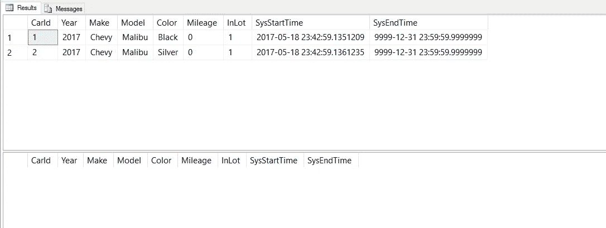
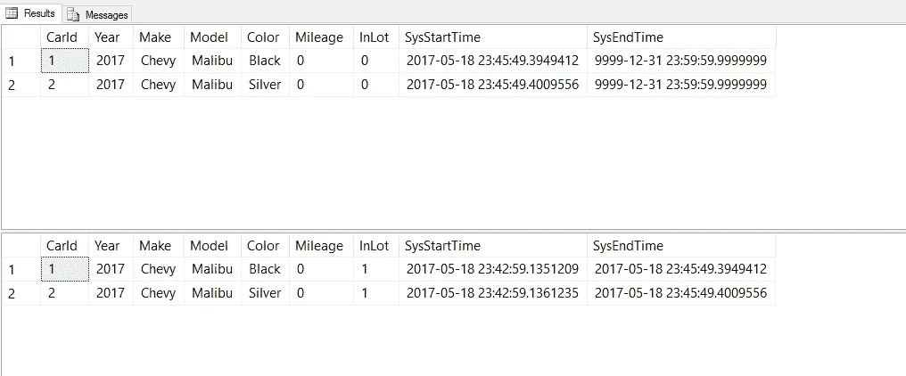
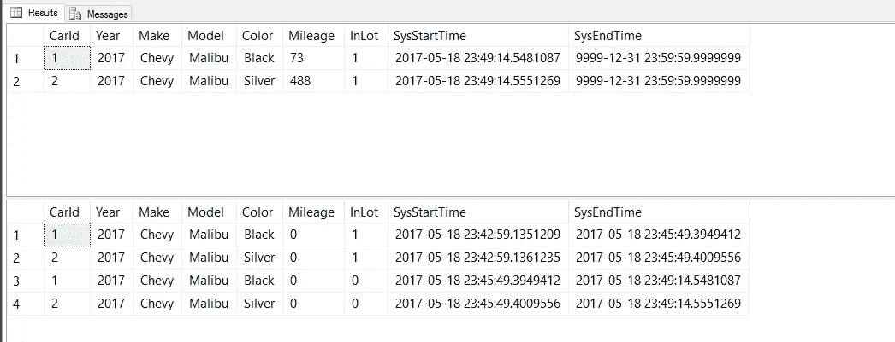
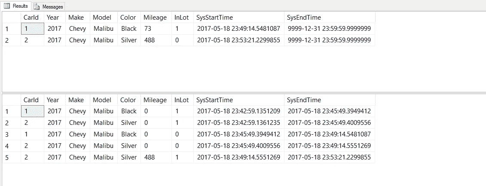
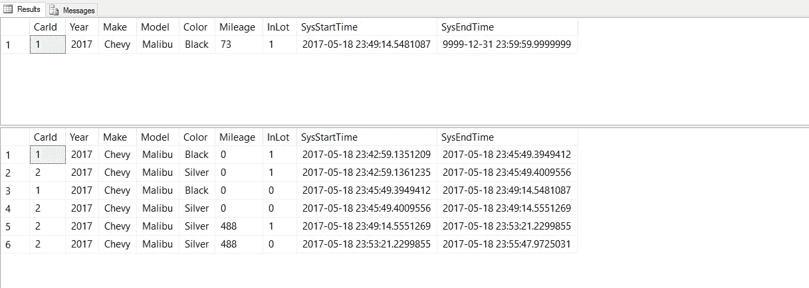
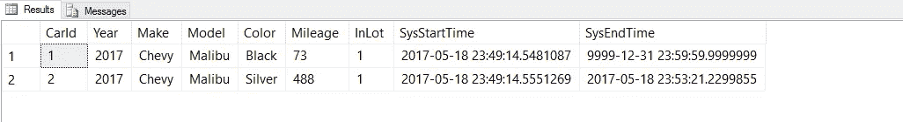
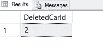

# 如何使用 SQL 时态表进行简单的时间点分析

> 原文：<https://medium.com/hackernoon/how-to-use-sql-temporal-tables-for-easy-point-in-time-analysis-38d43e4ee557>


“[Bordeaux, The Grand Theatre](https://www.flickr.com/photos/stemonx/33365168470/)” by [Stefano Montagner](https://www.flickr.com/photos/stemonx/) is licensed under [CC BY-NC-ND 2.0](https://creativecommons.org/licenses/by-nc-nd/2.0/)

您是否曾经需要查看表*中的数据使用*是什么样子？

如果您有过，那么编写 group-by 语句、嵌套子查询和窗口函数来编写您的时间旅行查询可能需要一段非常紧张的时间。

很抱歉你损失了一天的生产力——我也经历过。

幸运的是， [SQL Server](https://hackernoon.com/tagged/sql-server) 2016 引入了一个新特性，使我们的时间点分析查询易于编写:时态表。

# 时态表？那些和临时表一样吗？

不要让听起来相似的名字欺骗了你:“temporal”<>“temporary”。

时态表由两部分组成:

1.  [时态表](https://hackernoon.com/tagged/temporal-table) —这是包含数据当前值的表。
2.  历史表-该表保存时态表中某个时间点的所有先前值。

在 SQL 的早期版本中，您可能已经使用触发器创建了类似的设置。然而，使用[时态表与此不同](https://docs.microsoft.com/en-us/sql/relational-databases/tables/temporal-tables),因为:

1.  你不需要写任何触发器/存储过程！所有的历史跟踪都是由 SQL Server 自动完成的。
2.  检索数据使用简单的 WHERE 子句，不需要复杂的查询。

# 我想通过使用时态表让我的生活更轻松！拿着我的钱，告诉我怎么做！

你的提议让我受宠若惊，但既然我们是好朋友，我就免费让你知道这些秘密。

首先让我们创建一个时态表。我正在考虑创办一家汽车租赁公司，所以让我们在此之后建立一个模型:

```
IF OBJECT_ID('dbo.CarInventory', 'U') IS NOT NULL 
BEGIN
 -- When deleting a temporal table, we need to first turn versioning off
 ALTER TABLE [dbo].[CarInventory] SET ( SYSTEM_VERSIONING = OFF  ) 
 DROP TABLE dbo.CarInventory
 DROP TABLE dbo.CarInventoryHistory
END
CREATE TABLE CarInventory   
(    
 CarId INT IDENTITY PRIMARY KEY,
 Year INT,
 Make VARCHAR(40),
 Model VARCHAR(40),
 Color varchar(10),
 Mileage INT,
 InLot BIT NOT NULL DEFAULT 1,
 SysStartTime datetime2 GENERATED ALWAYS AS ROW START NOT NULL,
 SysEndTime datetime2 GENERATED ALWAYS AS ROW END NOT NULL,
 PERIOD FOR SYSTEM_TIME (SysStartTime, SysEndTime)     
)   
WITH 
( 
 SYSTEM_VERSIONING = ON (HISTORY_TABLE = dbo.CarInventoryHistory)   
)
```

上面的新表格需要注意的关键点是

1.  它包含一个`PRIMARY KEY`。
2.  它包含两个`datetime2`字段，标有`GENERATED ALWAYS AS ROW START/END`。
3.  它包含了`PERIOD FOR SYSTEM_TIME`语句。
4.  它包含具有(可选)历史表名(`dbo.CarIntventoryHistory`)的`SYSTEM_VERSIONING = ON`属性。

如果我们查询新创建的表，您会注意到我们的列布局是相同的:

```
SELECT * FROM dbo.CarInventory
SELECT * FROM dbo.CarInventoryHistory
```

让我们用全美汽车租赁机构的精选汽车来填满它——雪佛兰 Malibu:

```
INSERT INTO dbo.CarInventory (Year,Make,Model,Color,Mileage) VALUES(2017,'Chevy','Malibu','Black',0)
INSERT INTO dbo.CarInventory (Year,Make,Model,Color,Mileage) VALUES(2017,'Chevy','Malibu','Silver',0)
```



Although we got some unassuming car models, at least we can express our individuality with two different paint colors!

在所有剩余的屏幕截图中，顶部的结果是我们的时态表`dbo.CarInventory`，底部的结果是我们的历史表`dbo.CarInventoryHistory`。

您会注意到，因为我们只为每辆车插入了一行，所以还没有行历史，因此我们的历史表是空的。

让我们通过获得一些客户和出租我们的汽车来改变这种情况吧！

```
UPDATE dbo.CarInventory SET InLot = 0 WHERE CarId = 1
UPDATE dbo.CarInventory SET InLot = 0 WHERE CarId = 2
```



现在我们看到我们的时态表在工作:我们更新了`dbo.CarInventory`中的行，我们的历史表自动更新了我们的原始值*以及这些行在我们的表中存在多长时间的*时间戳。

过了一会儿，我们的客户会归还他们租赁的汽车:

```
UPDATE dbo.CarInventory SET InLot = 1, Mileage = 73  WHERE CarId = 1
UPDATE dbo.CarInventory SET InLot = 1, Mileage = 488 WHERE CarId = 2
```



It’s totally possible for someone to have driven 73 or 488 miles in a Chevy Malibu in under 4 minutes…ever hear the phrase “drive it like a rental”?

我们的时态表显示了我们租赁汽车的当前状态:客户已经将汽车归还给我们的停车场，并且每辆汽车都积累了一些里程。

与此同时，我们的历史表在最后一个`UPDATE`语句之前从时态表中获得了一个行的副本。它会自动为我们记录所有的历史！

继续说，汽车租赁公司的生意很好。我们又有一个客户租了我们的银色 Malibu:

```
UPDATE dbo.CarInventory SET InLot = 0 WHERE CarId = 2
```



不幸的是，我们的第二位顾客遭遇车祸，毁了我们的车:

```
DELETE FROM dbo.CarInventory WHERE CarId = 2
```



The customer walked away from the crash unscathed; the same can not be said for our profits.

随着我们的银色 Malibu 的删除，我们的测试数据是完整的。

现在我们有了所有这些伟大的历史跟踪数据，我们如何查询它呢？

如果我们想回忆两辆车都没有损坏并且我们在赚钱的美好时光，我们可以使用`SYSTEM_TIME AS OF`编写一个查询，向我们展示我们的桌子在过去的那个时候是什么样子:

```
SELECT
 *
FROM 
 dbo.CarInventory
FOR SYSTEM_TIME AS OF '2017-05-18 23:49:50'
```



The good old days.

如果我们想做一些更详细的分析，比如删除了哪些行，我们也可以正常地查询时态表和历史表:

```
-- Find the CarIds of cars that have been wrecked and deleted
SELECT DISTINCT
 h.CarId AS DeletedCarId
FROM
 dbo.CarInventory t
 RIGHT JOIN dbo.CarInventoryHistory h
  ON t.CarId = h.CarId 
WHERE 
 t.CarId IS NULL
```



# C̶o̶l̶l̶i̶s̶i̶o̶n̶结论

即使我的汽车租赁业务没有成功，至少我们能够看到 SQL Server 的时态表如何帮助我们跟踪汽车库存数据。

我希望您能像我第一次看到时态表时一样兴奋，尤其是在使用`FOR SYSTEM_TIME AS OF`进行查询时。需要复杂查询来为某个时间点重建数据的日子已经一去不复返了。

喜欢这篇文章吗？请推荐给它一颗绿色的心💚*下图。*