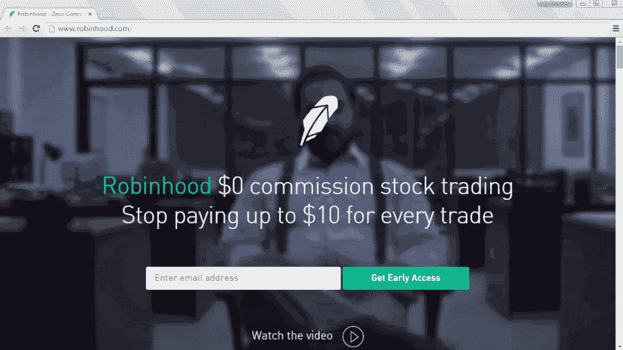
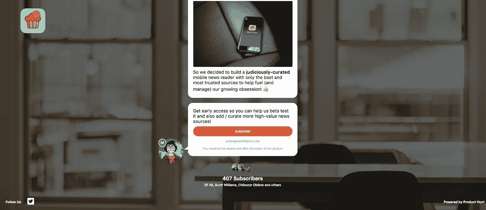

# 如何在发布之前验证产品的假设

> 原文：<https://medium.com/hackernoon/how-to-validate-assumptions-for-your-product-before-you-even-launch-60f195cabd68>

作为一个创造者，最难做的事情之一是快速验证假设，而不投入大量的时间/资源。你很容易把自己(和你的团队)归为一类，因为你对一个想法感到兴奋，并在这个想法背后制造动力，却从来没有和客户交谈过，没有得到反馈，也没有看到人们是否真的感兴趣。

我们最终构建了我们想要的东西，而不是我们的用户。

为了消除这个问题，在早期，你的团队必须接受“[用户第一](/@jaf_designer/designing-digital-products-user-first-bbf6be44ac3a)”的态度来构建产品。你必须把自我扔到门外，让用户来说话。

说起来容易。大多数公司到处都有它的品牌。

**但是很少有人能够成功地倾听用户的意见，并做出人们真正想要的东西。**

当他们发现他们的假设是错误的时候，他们已经花费了太多的时间和金钱来做出正确的改变。

为你、你的团队和你的投资者节省大量时间的一个好方法是拥有一个基本的“发布前页面”,为你的产品收集注册信息。

**为什么？**

即使只是一个简单的登录页面，宣传你的产品的价值主张，也可以帮助你了解人们是否会 a)点击你的页面，b)他们是否有足够的兴趣注册。

**如果人们没有点击，那么你的信息可能就没有吸引力，或者你没有接触到合适的受众。**

创建一个简单的“等候名单”和一个行动号召将有助于你确认对你所宣传的价值的兴趣。

[Robinhood’s](https://robinhood.com/) [Viral Waiting List](https://kickofflabs.com/blog/how-to-setup-a-viral-waiting-list-launch-page-like-robinhood-with-kickofflabs/)

Owlmetrics’ [Blog](https://owlmetrics.com/blog/instagram-tricks-and-features/) on [Instagram Analytics](https://www.forbes.com/sites/johnhall/2017/10/30/top-10-instagram-analytics-tools-you-need-to-check-out/#42623d291f9d)

如果你真的想变得有斗志和聪明…你甚至不需要在启动你的登陆页面的时候就构建好产品(当然这是有风险的)。

使用 [Product Hunt](https://medium.com/u/b8b4445269d0?source=post_page-----60f195cabd68--------------------------------) 的新的“ [Ship](https://www.producthunt.com/ship) ”功能，您可以在几秒钟内创建一个启动页面。

> Ship 使你的产品以正确的方式推出变得容易。我与来自世界各地的制造商和初创公司合作，并向那些认真建造人们想要的东西的人推荐 Ship。埃里克·里斯

这是我的朋友约翰·萨丁顿正在制作的两个例子:

[George](https://www.producthunt.com/upcoming/george) , A To Do List App

[CryptoYum](https://www.producthunt.com/upcoming/cryptoyum), a [Bitcoin Pub](http://thebitcoin.pub) Creation

一旦你有了自己的登陆页面，开始接触你的观众，要求采访他们。

以下是用户访谈的一些最佳实践:

 [## 如何进行用户访谈

### 用户访谈是从用户那里获取信息的好方法，有助于用户体验理解、可用性…

www.interaction-design.org](https://www.interaction-design.org/literature/article/how-to-conduct-user-interviews)  [## UX 研究:如何建立面试指南

### “定性研究”是用来探索用户的原因，意见和动机-建立一个采访指南是一个…

webdesign.tutsplus.com](https://webdesign.tutsplus.com/tutorials/ux-research-how-to-build-an-interview-guide--cms-27856)  [## 如何像专业人士一样进行用户体验研究

### CareerFoundry UX 设计导师 Raven Veal 深入用户体验研究，展示流行的方法和…

careerfoundry.com](https://careerfoundry.com/en/blog/ux-design/how-to-conduct-user-experience-research-like-a-professional/) 

# 祝您的产品发布好运！

你在研究什么新东西吗？你是如何获得牵引力的？