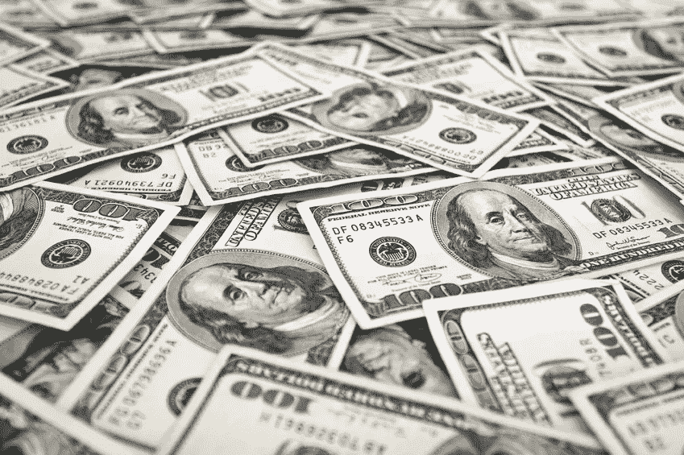
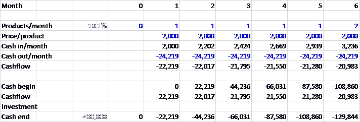
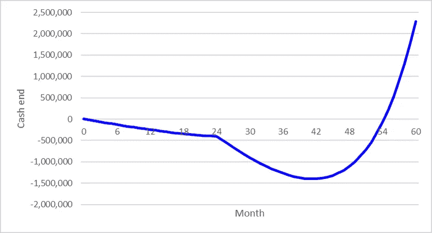
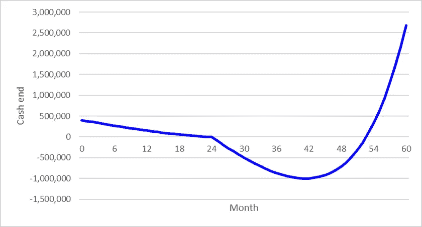
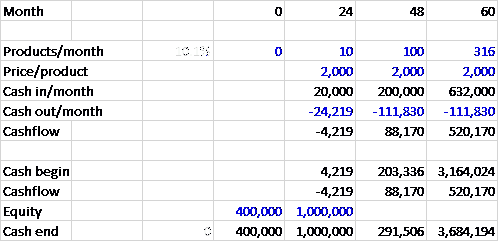
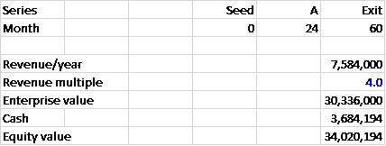
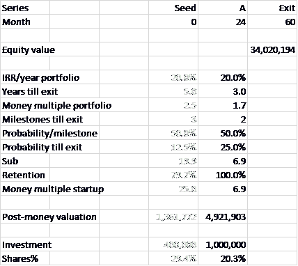
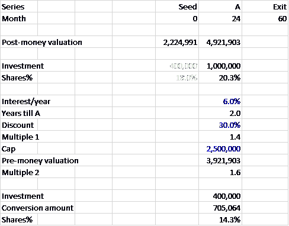
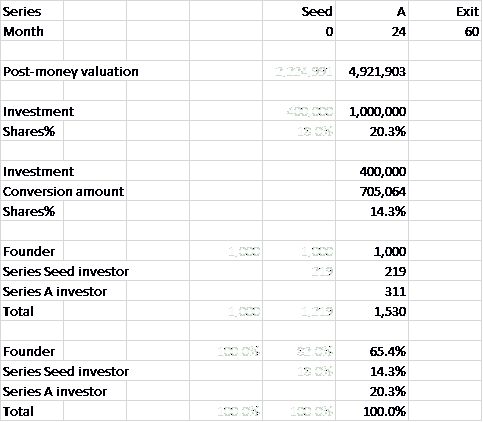
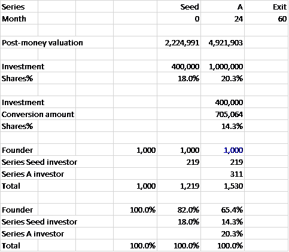

# 给你的敞篷车估价的 44 个步骤

> 原文：<https://medium.com/hackernoon/how-to-value-your-convertible-9faa4057a636>

*做一个* [*敞篷*](https://hackernoon.com/tagged/convertible) *似乎有 2 个理由。第一，法律成本低。好吧。第二，你的估值推迟到下一轮。等等，什么？为什么你想推迟你的估价？你不想知道你要放弃多少股份吗？你不想比较发行股票和做可转换债券吗？*

# **估值:何苦呢？**

你为什么想知道你的估价？因此，你知道在向投资者融资时，你必须放弃多少股份。

假设你想筹集 40 万。假设你的估值是 2，224，991。然后你要把 40 万/ 2，224，991 = 18.0%的股份给投资人。

你可以用股票或可转换债券来筹集这 40 万英镑。

假设你通过做可转换债券来筹集资金。[阅读[如果你发行股票，请阅读](https://hackernoon.com/how-to-value-your-startup-when-raising-series-seed-equity-4ddaf1e5c716)

> 敞篷车不就是打折和/或封顶吗？是的。但是你也可以计算(隐含)估值。

怎么会？

# **步骤 1–7:现金流规划**

## **第一步:规划出 60 个月**

为了简化，只显示了前 6 个月。假设用蓝色表示。计算用黑色表示。

## **第二步:预计产品/月**

你每个月会卖出多少产品？为了简化，显示了四舍五入的数字。计算使用未舍入的数字。

## **第三步:评估价格/产品**

每件产品的价格是多少？

## **第四步:计算月现金收入**

第 1 个月的产品/月份为 1。第 1 个月的价格/产品为 2000。所以第 1 个月的现金入/月等于 1.1 * 2000 = 2000。

## **第五步:估算每月提现金额**

每月的现金支出是多少？

## **第六步:计算现金流**

第 1 个月的月现金收入为 2000。第 1 个月的每月现金支出为-24，219。所以第 1 个月的现金流等于 2，000 + -24，219 = -22，219。

## **第七步:计算现金期末**

0 月末现金为 0。所以第一个月的现金开始等于 0。第一个月的现金流是-22，219。第一个月的权益为 0。所以第一个月的现金余额等于 0 + -22，219 + 0 = -22，219。

# **步骤 8–10:里程碑**

## **步骤 8:定义里程碑**

> 你的[创业](https://hackernoon.com/tagged/startup)何时显著降低风险？假设每月每 10 件产品。

一个非常粗略的经验法则:软件 10 倍，硬件 5 倍。第 0 个月的产品/月份为 0。因此，第一个里程碑等于 0 * 10 = 0 个产品/月。那不行。因此，如果第 0 个月的产品/月份为 0，则在定义里程碑时，暂时假定它为 1。所以里程碑是:

*   1 * 10 = 10 件产品/月
*   10 * 10 = 100 件产品/月
*   100 * 10 = 1000 件产品/月
*   等等。

## **第九步:查找月份/里程碑**

在你的现金流规划中查找每一个里程碑。

你有 3 个里程碑:

*   第 24 个月每月 10 件产品
*   第 48 个月每月 100 件产品
*   因为每月 1，000 件产品超出了 60 个月的范围，所以在第 60 个月使用每月 316 件产品

## **第十步:查投资/轮**

投资前，你的现金余额为负。

实现每个里程碑需要多少钱？

*里程碑 1* 要从第 0 个月的 0 个产品/月到第 24 个月的 10 个产品/月，你需要在第 0 个月筹集 40 万个系列种子。这使你的现金余额保持在 0 或更多。

*里程碑 2* 要从第 24 个月的 10 个产品/月增加到第 48 个月的 100 个产品/月，你需要在第 24 个月筹集 100 万的 A 轮资金。

*里程碑 3
您的现金余额已经等于或大于 0。*

# **步骤 11–12:融资策略**

## **步骤 11:选择系列种子仪器**

你将使用哪种工具作为你的系列种子:股票还是可转换债券？假设你用敞篷车养你的系列种子。[阅读[如果你发行股票，请阅读](https://hackernoon.com/how-to-value-your-startup-when-raising-series-seed-equity-4ddaf1e5c716)

## **步骤 12:选择 A 系列仪器**

假设你用股权筹集了你的首轮融资。

# **步骤 13–17:退出**

## **步骤 13:绘制轮次图**

绘制出上一步中确定的轮次。包括出口。

## **第 14 步:计算收入/年**

第 60 个月的月现金收入为 632，000(来自现金流计划)。所以退出时的收入/年等于 12 * 632，000 = 7，584，000。

## **第十五步:查找收入倍数**

你所在地区和行业的一家公司，营收/年 758.4 万，投资人愿意出多少钱？假设年收入为 4.0 倍(市场数据)。

## **第十六步:计算企业价值**

所以企业价值@退出等于 758400 * 4.0 = 30336000。

## **第十七步:计算股权价值**

第 60 个月的期末现金为 3，684，194(来自现金流计划)。因此，退出时的权益价值等于 30，336，000 + 3，684，194 = 34，020，194。

# **步骤 18–28:首轮股权**

## **第 18 步:查找 IRR/年度投资组合**

A 轮投资者想从他的投资组合中赚多少钱？假设他的投资组合的 IRR/年为 20.0%(市场数据)。

## **第 19 步:计算退出前的年数**

A 轮投资者在(60–24)/12 = 3.0 年后退出。

## **第二十步:计算货币倍数组合**

因此，首轮投资者希望他的投资组合的资金倍数为(1 + 20.0%) ^ 3.0 = 1.7。

## **步骤 21:查找里程碑直到退出**

投资者在退出前有多少里程碑？A 轮投资者在第 24 个月投资 10 个产品/月(来自现金流规划)。所以他在退出前有两个里程碑:

1.  第 48 个月每月 100 件产品
2.  第 60 个月每月 316 件产品

## **步骤 22:估计概率/里程碑**

> 从一个里程碑到下一个里程碑的概率是多少？要么你去，要么你不去。所以对半分。

假设从第 24 个月每月 10 个产品到第 48 个月每月 100 个产品的概率为 50.0%。并且假设从第 48 个月的 100 个产品/月到第 60 个月的 316 个产品/月的概率为 50.0%。

## **步骤 23:计算概率直到退出**

> 所以从第 24 个月的 10 个产品/月得到第 60 个月的 316 个产品/月的概率是 50.0% * 50.0% = 25.0%。

## **步骤 24:计算 sub**

所以 A 轮投资者的 sub(因为没有更好的词)是 1.7 / 25.0% = 6.9。

## **第 25 步:计算留存率**

因为 A 轮之后不再发行股票，投资者保留其初始股份百分比的 100.0%。

## **第 26 步:计算资金倍数启动**

因此，首轮投资者希望你的创业公司的资金倍数为 6.9 / 100.0% = 6.9。

## **步骤 27:计算投后估值**

所以你的创业公司在 A 轮融资中的估值是 34，020，194 / 6.9 = 4，921，903。

## **第 28 步:计算股份%**

投资@ A 轮 100 万(来自现金流规划)。所以你要把 1，000，000 / 4，921，903 = 20.3%的股份送给 A 轮投资人。

# **步骤 29–37:A 系列敞篷车**

## **第 29 步:查询利息/年份**

在转化之前，系列种子投资者每年能获得多少利息？假设他得到 6.0%的利息/年(市场数据)。

## **步骤 30:计算到 A 系列的年数**

系列种子投资者在(24–0)/12 = 2.0 年后转换。

## **第 31 步:查询折扣**

当系列种子投资者将其债务转换为股份时，A 轮估值的折扣是多少？假设他的折现率是 30.0%(市场数据)。

## **步骤 32:计算倍数 1**

所以系列种子投资者可以选择获得 1/(1–30.0%)= 1.4 倍于 A 轮投资者的股份。

## **步骤 33:查找瓶盖**

首轮融资前的估值上限是多少？假设他的上限是 250 万。

## **第 34 步:计算前期估值**

后钱估值@ A 轮是 4，921，903。投资@ A 轮 100 万。所以 A 轮的钱前估值等于 4，921，903–1，000，000 = 3，921，903。

## **第 35 步:计算倍数 2**

所以系列种子投资人也可以选择获得 3，921，903 / 2，500，000 的倍数= 1.6 倍于 A 轮投资人的股份。

## **步骤 36:计算兑换金额**

投资@系列种子 40 万(来自现金流规划)。所以系列种子投资者将 400，000 * (1 + 6.0%) ^ 2.0 * 1.6 = 705.064 转换成股票。

## **第 37 步:计算股份%**

所以你要把 705.064 / 4，921，903 = 14.3%的股份让给系列种子投资人。

# **步骤 38–40:A 系列瓶盖表**

## **第 38 步:查找股份创始人**

当你筹集资金时，你发行新股。创始人有多少股份？假设他(仍然)拥有 1000 股 a 轮股票。

## **步骤 39:计算股份系列种子投资人**

所以系列种子投资人有 1000/(1–14.3%—20.3%)* 14.3% = 219 股。

## **步骤 40:计算 A 轮投资者的股份**

所以 A 轮投资人有 1000/(1–14.3%—20.3%)* 20.3% = 311 股。

# **步骤 41–44:系列种子可转换**

## **第 41 步:查找股份创始人**

创始人有 1000 股@ a 轮所以创始人也有 1000 股@系列种子。

## **第 42 步:Look up 股票系列种子投资人**

系列种子投资人有 219 股@ a 轮。

> 恶作剧的时间到了。假设像创始人一样，系列种子投资者也将因此拥有 219 股@系列种子。

## **第 43 步:计算股份%**

因此，系列种子投资者将拥有 219 / (1，000 + 219) = 18.0%的股份@系列种子。

## **步骤 44:计算投资后估值**

投资@系列种子 40 万(来自现金流规划)。所以你的创业公司的钱后估值@系列种子是 40 万/ 18.0% = 2，224，991。

# **那么你的估值是多少？**

2,224,991.

这就是你用可转换债券融资时对你的初创公司的估值。现在你知道你要放弃多少股份了。现在你可以将发行股票与进行可转换债券进行比较。

感谢奇雷蒂恩·赫本。

*约阿希姆·布雷泽(Joachim Blazer)是《创业估值指南* *的作者。*

> [黑客中午](http://bit.ly/Hackernoon)是黑客如何开始他们的下午。我们是 [@AMI](http://bit.ly/atAMIatAMI) 家庭的一员。我们现在[接受投稿](http://bit.ly/hackernoonsubmission)，并乐意[讨论广告&赞助](mailto:partners@amipublications.com)机会。
> 
> 如果你喜欢这个故事，我们推荐你阅读我们的[最新科技故事](http://bit.ly/hackernoonlatestt)和[趋势科技故事](https://hackernoon.com/trending)。直到下一次，不要把世界的现实想当然！

