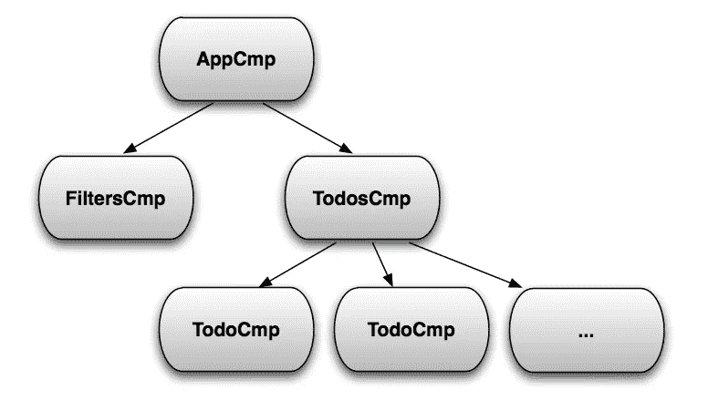

# 如何在 Angular2 中用 Sass 编写原子(设计)CSS

> 原文：<https://medium.com/hackernoon/how-to-write-atomic-css-with-sass-in-angular2-a18a7661f7ff>

更新:我已经[打算](https://hackernoon.com/tagged/meaning)写一篇后续文章，但是还没有时间。要点是，如果你从未经历过原子阶段，那么 CSS 的原子[设计](https://hackernoon.com/tagged/design)可能是一个可怕的想法。如果您想要更深入的解释或澄清，请发表评论。不管是哪种情况，我都会把这篇文章留给后人。

*这篇文章的主要目标是回顾编写原子 css 的所有步骤和一些陷阱。我们将使用 sass 和 angular2。*

# 什么是原子 CSS？

*这在技术上不是*[*atomic-css*](http://acss.io/)*，而是 CSS 写在*[*atomic web design*](http://bradfrost.com/blog/post/atomic-web-design/)*。前者只是更容易写。*

编写 CSS 有许多不同的风格和设计模式，每一种都有自己的优点和缺点。今年早些时候，我有幸与之共事的最好的首席开发人员之一向我介绍了原子 CSS(T21)的概念，我完全爱上了它。不幸的是，他已经不在了。他在一个更好的地方…谷歌。

以原子方式编写 css 的一个主要好处是，最终你将不必再编写任何 css(无论如何这是目标)。这有点言过其实，但是这个想法是，只有非常特殊和高度定制的元素才需要新的 css。

原子 CSS 的基本概念是你有一个属于一个属性和值对的类，这些被称为原子。

```
.height20 {
  height: 20px;
}
```

当你需要一个新的高度时，你只需要为它增加一个新的等级。

```
.height30 {
  height: 30px;
}
```

嘣。就是这样。你甚至可以更进一步，将这些类缩写为“h20”和“h30”。

有些人会反对简洁，而赞成更加语义化。这是一个相当固执己见的话题，在这里由你做出选择，但一旦做出选择，就要坚持下去！一致性是关键。

这似乎有点太乏味了。我不想坐在这里，写出每一个我可能用到的高度。那会有几十到几百行。我成为一名开发人员是因为我很懒，让我们看看我们能做些什么。

# 萨斯/SCSS

用 Sass 自动生成这些类非常简单。

```
// heights.scss// This is our iteratable list of key/value pairs
$heights: (
  6: 0.375rem,
  10: 0.625rem,
  11: 0.688rem,
  18: 1.125rem
);// We loop through our list and use the key as the name
// and the value is used as the val.
[@each](http://twitter.com/each) $name, $val in $heights {
  .h#{$name} {
    height: #{$val};
  } .min-h#{$name} {
    min-height: #{$val};
  }
}// heights.compiled.css
.h6 {
 height: 0.375rem;
}
.h10 {
 height: 0.625rem;
}
.h11 {
 height: 0.688rem;
}
.h18 {
 height: 1.125rem;
}
.min-h6 {
 min-height: 0.375rem;
}
.min-h10 {
 min-height: 0.625rem;
}
.min-h11 {
 min-height: 0.688rem;
}
.min-h18 {
 min-height: 1.125rem;
}
```

原子 CSS 的一个巨大好处是它将维护从样式表转移到模板中。如果你需要改变页面上的一些间距问题，那么你可以编辑页面 html，而不是 css。

最终，你将创建足够多的原子，不再需要编写任何 css。

# 分子

一组常用的原子叫做分子。分子实际上不是任何新的代码，它只是重复类名的模式。卡片分子可以分为以下几类:

```
<div class=”width-250 height-100 font-size-16 padding-5"></div>
<!- or if you want to be terse ->
<div class=”w250 h100 f16 p5"></div> 
```

也就是说:

```
{
  width: 250px;
  height: 100px;
  font-size: 16px;
  padding: 5px;
} 
```

这乍一看似乎很冗长，可能很难习惯，但是如果您只需要一个与其他的`. card '稍微不同的`. card ',它就消除了必须为`. card '创建另一个自定义类的问题。

# 角度 2

如果你从来没有玩过 angular2，那么这里有一些关于 css 的快速信息。

在 angular2 中，有一种叫做分量的东西。该应用程序从一个主/根组件开始，然后所有其他组件都是该根组件的后代。



Image taken from Victor Svakin’s article: [CHANGE DETECTION IN ANGULAR 2](https://vsavkin.com/change-detection-in-angular-2-4f216b855d4c#.a9lqubahp)

每个组件都可以附加一个样式表，它将被绑定到该组件的范围。如果 *FiltersCmp* 有一个 css 类叫做*。隐藏*那么 *TodosCmp* 将不会知道那个类。所以你可能会问自己，当我们所有的 css 都绑定到某个组件时，我们怎么能有全局样式呢？我们希望我们的风格是全球性的，而不是绑定到一个特定的组件范围。

有两种方法可以让我们的原子风格全球化。最简单的方法就是让 angular 来处理它。首先，我们将 scss 包含在 *AppCmp* 中，然后我们将 *@Component()* 装饰器的*封装*属性设置为*视图封装。无*。这会告诉 angular2，我们不希望这个组件对这些样式有贪婪和占有欲。我们希望它与它的所有后代/兄弟姐妹/祖先分享它，使它本质上是全球性的。

```
import { Component, ViewEncapsulation } from ‘[@angular/core](http://twitter.com/angular/core)’;[@Component](http://twitter.com/Component)({
  selector: ‘app’,
  templateUrl: require(‘./app.component.html’),
  styles: [
    require(‘./app.main.scss’)
  ],
  encapsulation: ViewEncapsulation.None
}) 
```

现在，困难就在这里。Angular2 在运行时将 *<样式>* 标签直接注入头部。起初看起来并不坏，但是一旦你开始进入服务器端渲染和 SEO 优化，你就会开始意识到在你的 index.html 中 120，000 行 css 是一个坏主意，尽管这可能是真的也可能不是真的。我不是 SEO 专家。

幸运的是，还有另一种方法。我们可以编译我们的 scss 并将其提取到一个单独的 main.css 文件中，然后将其包含在我们的 html 中。

# 编译和提取

有一些不同的构建工具，比如[吞咽](http://gulpjs.com/)和[咕噜](http://gruntjs.com/)。[在我看来，Webpack](https://webpack.github.io/) 可能是最简单的，进入门槛相当低。为此，我将使用 webpack2，但这也可以在 webpack1 中轻松完成。

Webpack 运行于一个 *webpack.config.js* 文件。在那个配置文件中，我们告诉它寻找某些文件，在我们的例子中是 scss 文件，然后用一些加载器处理它们。加载器只是一个对文件进行转换或操作的花哨术语，本质上是插件，但它们是 webpack 生态系统中最重要的部分。

创建一个 *app.main.scss* 作为你的 *app.component.ts* 的兄弟，然后 *@import* 你所有的其他 scss 文件到这个文件中。确保从所有组件装饰器中移除*样式*属性。然后再加一个*require(’。/path/to/app.main.scss')* 在您的 *client.ts* 中，这将确保 webpack 检测到该 scss 文件，并按照我们期望的方式处理该文件。

*有一个问题是，既然你将这些其他的 scss 文件导入到 main.app.scss 中，那么其他 scss 文件中的相对路径必须相对于 main . app . scss。*

scss 需要首先转换成 css，所以我们将通过 [sass-loader](https://github.com/jtangelder/sass-loader) 来传输它。我们将只测试/寻找我们的 *app.main.scss* 文件。所有其他 scss 文件应该导入到 *app.main.scss* 中，加载程序不需要直接知道它们。

```
module.exports = {
  module: {
    rules: [
      { test: /app\.main\.scss/, loader: ‘sass-loader’ }
    ]
  }
} 
```

现在我们的 scss 是 css，但是在这一点上 webpack 仍然不知道如何处理 css。我们将不得不添加一个 css 加载器。这个加载器还解析所有的 url 源，并将它们放在。/dist 文件夹，如果你有合适的文件加载器或者只使用[文件加载器](https://github.com/webpack/file-loader)。

```
module.exports = {
  module: {
    rules: [
      {
        test: /app\.main\.scss/,
        loaders: [
          {
            loader: ‘css-loader’,
            options: {
              importLoaders: 1
            }
          },
          ‘sass-loader’
        ]
      }
    ]
  }
}
```

既然这样，让我们也添加 [postcss](https://github.com/postcss/postcss) 吧，因为我们想在 css 中添加浏览器特有的前缀。

将该文件放在项目的根目录下。它所做的就是告诉 postcss 我们想要使用一个 autoprefixer，并且我们的目标是浏览器的最后 6 个版本。它会自动将`-moz-`、`-webkit-`和`-ms-`前缀应用到需要的地方。

```
// postcss.config.js
const autoprefixer = require(‘autoprefixer’);module.exports = {
  plugins: [
    autoprefixer({
      browsers: [‘last 6 versions’]
    })
  ]
}
```

在当前设置下，webpack 将处理我们所有的 SCS，并将其转换成一个 css 字符串。但是这个字符串对我们没有用，除非它在一个文件里。我们需要做的最后一件事是将编译后的 css 提取到我们的。/dist 文件夹作为它自己的文件。

```
const ExtractTextPlugin = require(“extract-text-webpack-plugin”);module.exports = {
  module: {
    rules: [
      {
        test: /app\.main\.scss/,
        loaders: [
          ExtractTextPlugin.extract({
            loader: ‘exports-loader?module.exports.toString()’
          }),
          {
            loader: ‘css-loader’,
            options: {
              importLoaders: 2
            }
          },
          ‘postcss-loader’,
          ‘sass-loader’
        ]
      }
    ]
  },
  plugins: [
    new ExtractTextPlugin({
      filename: ‘assets/css/main.css’,
      allChunks: true
    })
  ],
  output: {
    path: ‘./dist/client’,
    filename: ‘assets/[ext]/[name].[ext]’
  }
} 
```

现在你知道了。(几乎)完整的 webpack.config，用于从原子 scss 文件中提取完全编译的 css。当然，需要加载器来传输 angular2 类型脚本源文件，但这超出了本文的范围。

[](http://bit.ly/HackernoonFB)[](https://goo.gl/k7XYbx)[](https://goo.gl/4ofytp)

> [黑客中午](http://bit.ly/Hackernoon)是黑客如何开始他们的下午。我们是 [@AMI](http://bit.ly/atAMIatAMI) 家庭的一员。我们现在[接受投稿](http://bit.ly/hackernoonsubmission)，并乐意[讨论广告&赞助](mailto:partners@amipublications.com)机会。
> 
> 如果你喜欢这个故事，我们推荐你阅读我们的[最新科技故事](http://bit.ly/hackernoonlatestt)和[趋势科技故事](https://hackernoon.com/trending)。直到下一次，不要把世界的现实想当然！

[](https://goo.gl/Ahtev1)