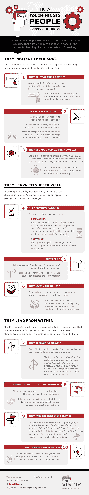

# 意志坚强的人如何茁壮成长

> 原文：<https://medium.com/hackernoon/how-tough-minded-people-thrive-ab8c77b74d4>

[Image: Unsplash User [Todd Diemer](https://unsplash.com/@todd_diemer)]

## 意志坚强的人很有韧性。“弹性”这个名词源自拉丁语“resiliens”“反弹，反冲**”**

作为一种性格特征，韧性是一个人从不幸、疾病或抑郁中快速恢复的心理能力。

对大多数人来说，生活最终会扔给我们一个大球。像数百万人一样，我也经历过不幸。我在孟加拉国长大，目睹了战争、饥荒和非人的贫困。作为一名企业家、技术专家和作家，我面临过许多专业和个人的失败和拒绝。我必须变得坚强，学会适应的艺术，才能生存下来，然后茁壮成长。

意志坚强的人发展出一种心智能力，使他们在逆境中能够轻松适应，像竹子一样弯曲而不是折断。他们拥有一系列强大的特征。

请允许我在这里分享其中的一些:

***信息图用***[***Visme***](http://www.visme.co/)***制作。***

版权所有 2016 年由费萨尔霍克。保留所有权利。

[专题图片:Unsplash 用户[托德·迪默](https://unsplash.com/@todd_diemer)

我是一名企业家和作家。 [SHADOKA](http://shadoka.com/) 等公司创始人。Shadoka 促进企业家精神、增长和社会影响。《万物互联——如何在创意、创新和可持续发展的时代进行变革和领导》(麦格劳·希尔，2014 年)和《生存与发展:富有弹性的企业家、创新者和领导者的 27 种实践》(励志出版社，2015 年)。在推特上关注我。*免费使用* [*万物互联*](http://app.everythingconnectsthebook.com/login.php) *领导力 app 和* [*生存茁壮*](http://app.survivetothrive.pub/login.php) *弹性 app。*

> [黑客中午](http://bit.ly/Hackernoon)是黑客如何开始他们的下午。我们是 [@AMI](http://bit.ly/atAMIatAMI) 家庭的一员。我们现在[接受投稿](http://bit.ly/hackernoonsubmission)并乐意[讨论广告&赞助](mailto:partners@amipublications.com)机会。
> 
> 如果你喜欢这个故事，我们推荐你阅读我们的[最新科技故事](http://bit.ly/hackernoonlatestt)和[趋势科技故事](https://hackernoon.com/trending)。直到下一次，不要把世界的现实想当然！

