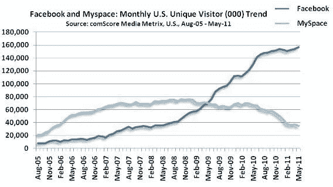
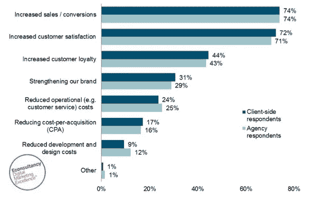

# UX 是增加销售的正确途径

> 原文：<https://medium.com/hackernoon/how-ux-is-the-right-way-to-increase-sales-d3672b8c9896>

UX，或称用户体验，是每个初创企业和公司都有的术语。有些人像灰姑娘一样对待它，而另一些人认为它是他们业务的核心原则。

你们公司需要吗？最大的错误是相信你的网站和产品的现状是好的。

UX 旨在改善你的产品(或网站)的各个方面。任何事情都可以改进，任何事情都应该改进——这就是 UX。

在本帖中，我们将讨论什么是用户体验，以及为什么用户体验对你的业务很重要——需要用户体验的最大证据是[专业市场上 UX 专家的激增](http://blog.usabilitytools.com/33-ux-directors-to-follow/)。

# 什么是 UX，我应该如何理解它？

用户体验是用户直接接触产品的体验。[正如 UX 的先驱 Jakob Nielsen 和 Don Norman 所指出的](https://www.nngroup.com/articles/definition-user-experience/)，它关注与产品接触的所有方面，无论是通过公司还是它提供的服务。它的目的是优化这些体验，以便让接收者完全满意。

最大的警示故事是 Myspace 的故事。一旦脸书开始增长，他们很快在 2009 年达到同样的用户数量。

2010 年是脸书给 Myspace 致命一击的一年——怎么击的？

Myspace 的创始人 Chris DeWolfe 表示，他们只是专注于扩大用户群和改善用户体验。甚至他们邀请贾斯汀·汀布莱克来推广他们品牌的营销计划也没有任何帮助。是的，UX 打败了营销。

品牌网站是目前与客户或顾客沟通的主要形式。B2B 或 B2C 行业的企业必须反过来尽可能优化它们，这样它们才能产生最好的结果。

> 优化网站的用户体验是成功企业的决定性因素。

# UX 将如何帮助我提高销售额？

尽管这是一个令人惊讶的说法，但 UX 确实增加了销量——如果做得有效的话。

亚马逊[通过向已经浏览过的商品添加产品推荐，使他们的销售额增加了 29%](http://fortune.com/2012/07/30/amazons-recommendation-secret/) (高达惊人的 128.3 亿美元)。这种增强体验的功能是我们今天所了解和尊重的业务的决定性方面。

据一些分析师称，由于这个 UX 诞生的功能，亚马逊的转化率甚至增加了**高达 60%。那真是令人难以置信。**

[Econsultancy 2013 年的早期报告称](https://econsultancy.com/uk/reports/user-experience-survey-report)几乎四分之三(74%)的企业相信用户体验对提高转化率和销售额非常重要。72%的人声称 UX 也提高了客户满意度。

# 高客户满意度对我的业务有多大帮助？

一句古老的格言，高满意度等于高报酬。我们总是将这一真理藏在脑海深处，但满意的客户很难纳入我们的 KPI。

然而，高客户满意度会增加客户保持率。客户的 LTV 随着转化率的增加而增加。

在 [UsabilityTools](http://usabilitytools.com/) ，我们认为网站和企业的用户体验不仅重要—**它绝对至关重要。这就是为什么我们提供工具来记录用户在网站上的活动。所有这些都是为了更好地了解他们的行为，尽一切努力帮助他们从你的业务中受益，并转化为销售。**

[我们的一个客户 GetBadges](http://blog.usabilitytools.com/getbadges-how-removing-a-cta-increased-conversions-by-40/) 的注册页面转化率很低。他们连接了我们的工具，并收集了用户活动的记录。

在观看了几段录像后，Getbadges 注意到一种模式——用户点击了一个放置错误的按钮，该按钮刷新了页面并删除了个人注册信息。这使得用户沮丧地离开了网站。

**GetBadges 注意到了他们的错误并移除了按钮——这导致寄存器增加了 40%**。一个简单甚至愚蠢的改变会对你的网站产生巨大的影响。

以下是 inboundmarketingagents.com 收集的一些推文，展示了关于 UX 的有用数据:

*   在 UX 投资的每 1 美元可以为你的企业带来高达 100 美元的回报。— [@UXmotel](http://twitter.com/UXmotel)
*   1 秒钟的响应让用户对内容保持兴趣，从而提高转化率，减少放弃。— [@SmashingMag](http://twitter.com/SmashingMag)
*   87%的财富 500 强公司在其主页上有一个容易找到的搜索栏。— [@GoGulf](http://twitter.com/GoGulf)
*   85%的 UX 问题可以通过 5 个用户的测试来解决。— [@UltraLinx](http://twitter.com/UltraLinx)
*   近四分之三(73%)目前没有进行用户体验测试的公司将在未来 12 个月内进行用户体验测试。—[@经济咨询](http://twitter.com/eConsultancy)
*   57%的用户表示，他们不会推荐一家移动网站设计不佳的企业。— [@Google](http://twitter.com/Google)
*   47%的网站有一个清晰的行动号召按钮，用户只需 3 秒或更短时间就能看到。–[@ Gog lobe](http://twitter.com/GoGlobe)
*   越来越多的移动应用使用智能手机传感器来知道你在哪里，你在做什么，使设备能够为用户提供高度个性化的好处。— [@Scobleizer](http://twitter.com/Scobleizer)
*   超过 90%的人(95%)同意“良好的用户体验才有意义”这一说法。–[@经济咨询](http://twitter.com/eConsultancy)

# UX 值得出境吗？

UX 间接影响了商业的许多其他领域——从品牌形象到销售过程。

通常，对外销售过程可能会持续几个月——潜在客户访问产品网站是理所当然的。这就是神奇的地方，[因为顾客更有可能购买展示精美的产品](http://www.bryaneisenberg.com/what-makes-people-buy-20-reasons-why/)。

但是，吸引力有两个维度:有意识的和无意识的。产品是根据视觉吸引力有意识地选择的。然而，无意识的吸引力来自产品的潜在体验——这就是 UX 的全部。

此外，潜在客户很可能在购买前试用产品。许多网站在这个阶段失败，因为有时[很难注册](http://usabilitytools.com/)。当然，还有许多其他原因可能对你的客户获取过程不利。

你想仅仅因为你的网站有问题而冒高辍学率的风险吗？我不这么认为。

# 结论

用户体验是一个正在慢慢侵占所有业务方面的领域。它的主旨是尽可能让用户或客户感到愉快。这是基于高满意度导致高销售额的假设。理应如此。

独自优化一个网站可能会很困难——这就是为什么 UX 设计师在全球许多公司找到了自己的位置。然而，小企业可以从观察用户的行为开始。[了解他们做错了什么](http://usabilitytools.com/)并加以改进——这才是真正的赚钱之道。

最初发布于 [RightHello 博客](http://righthello.com/blog/)。