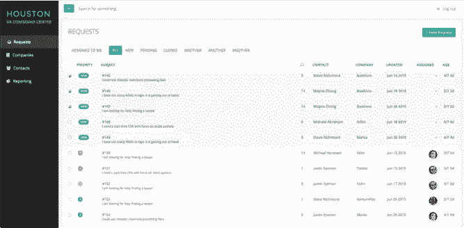
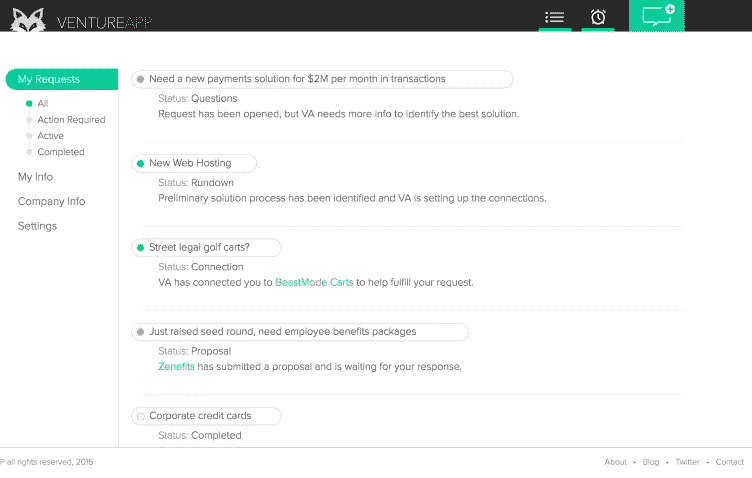

# 我们如何从一个电子邮件地址发展到产品市场适合和 583 家公司

> 原文：<https://medium.com/hackernoon/how-ventureapp-grew-from-an-email-address-to-product-market-fit-and-583-companies-693af0f87d0e>

最近在 VENTUREAPP，我们的第 500 家[企业](https://hackernoon.com/tagged/business)加入了我们的平台，本着[透明](https://hackernoon.com/tagged/transparrency)的精神，这是我们的创始价值观之一，我们希望分享我们如何使用精益发展策略来寻找产品市场契合度并发展我们的平台。

对于那些刚接触 VENTUREAPP 的人来说，我们是一个 B2B 市场，为初创公司和小型企业提供服务，帮助他们联系服务提供商、供应商和专家，帮助他们处理业务的各个方面。

**电子邮件第一的创业公司**

2015 年上半年，我一直在密切关注 Product Hunt 令人难以置信的成功增长，并注意到他们似乎有着令人难以置信的纪律，并专注于有条不紊地快速对他们的平台进行小的增量更改，这似乎总是为用户增加价值。正因为如此，我开始调查他们的产品运营，我看到了 Product Hunt 的创始人 Ryan Hoover 关于电子邮件优先创业公司的博客文章。你可以通过电子邮件测试某些产品概念的想法引起了我的共鸣，因为我和 [Greg](http://twitter.com/sliggity) 、 [Kevin](http://twitter.com/kmccarth) 在 Streetwise 工作期间，做了很多关于电子邮件的工作，知道每天向用户的收件箱传递价值的力量。

所以在五月底，我们把 request@ventureapp.com 作为我们公司可以提出要求的第一个地方。那一周我们收到了 5 个请求，然后我们就去参加比赛了。

**添加即时增量值**

通常，早期阶段的公司对他们的产品有宏伟的愿景，这不一定是一件坏事，但如果没有短期内专注于交付增值，这些宏伟的愿景很少会实现。自从我们“发布”让公司提交请求的电子邮件以来，我们将收到的前 5 个请求视为一个信号，我们一直非常谨慎地直接基于用户行为和反馈来构建这种体验。我们没有做出任何宏大的假设，也没有投入到无法快速衡量的大型项目中。像大多数成功的精益方法一样，在短距离冲刺中增加增量价值已经成为游戏的名字。

**产品进化**

为了了解这种围绕增加价值的理念是如何发挥作用的，最好能看到并理解我们做出的具体产品决策。以下是推出电子邮件地址以来的时间表:

1.**请求管理**
在 6 月和 7 月，随着请求不断涌入，Gmail 收件箱不足以管理请求的情况很快变得明显起来。在 Desk 和 Zendesk 之间来回切换之后，我们的第一步是在 Salesforce 的票务系统 Desk.com(sales force)上建立一个账户。最初，这还不错，但是一张票可以存在的阶段是有限制的，所有的售票系统似乎都强迫一家公司这么做(不知道为什么，巨大的交易破坏者)。除了产品的许多其他笨拙的方面之外，我们知道，对于我们来说，要真正绘制整个 B2B 商务图并为每个业务需求提供正确的解决方案(我们的使命)，我们需要构建技术来以我们自己的方式管理公司的请求。所以我们的第一个开发项目是构建一个简单的仪表板来管理请求，我们称之为“休斯顿”

Houston 1.0

很快，我们能够改善那些提交请求的用户体验，因为我们从一个杂乱的电子邮件收件箱变成了一个有组织的系统，在这个系统中，我们按阶段监控请求。此外，这与用户和公司管理直接相关，因为它允许我们为每个公司组织请求信息，使我们更好地了解公司对他们未来提交的任何请求的需求。

在 7 月决定建立我们自己的内部平台后，我们在 8 月中旬推出了休斯顿，这是迄今为止我们部署时间最长的项目。

6 月 VENTUREAPP 上的公司总数= 22
7 月 VENTUREAPP 上的公司总数= 67

2.**7 月和 8 月，随着一些用户开始提交多个请求，很明显，企业需要一种方法来管理他们的请求，并通过 VENTUREAPP 跟踪他们的对话。为了解决这个问题，我们创建了一个非常简单的产品，基本上是一个接收请求的收件箱，我们在 9 月 1 日推出了这个产品。**

V.5 of our web platform

不幸的是，尽管使用电子邮件功能的公司越来越多，但这个第一版并没有为我们的许多用户解决一个重大问题，而且使用率很低。

8 月 VENTUREAPP 上的公司总数= 105

3.**不要构建什么**
由于我们为网络平台推出的 MVP 的使用率很低，我们在 9 月份的大部分时间里都在确定我们需要开发哪些功能来适应产品市场，同时将开发工作集中在为休斯顿构建我们的内部分析上，我们知道为了成为一家数据驱动型公司，我们需要这些功能。经营一家初创公司最困难的部分之一是决定不做什么，我们在早期就做出了一些关键的决定，这些决定是关于我们最终没有建立起来的某些想法。首先，我们有一套专注于风投的功能，风投是我们的推荐来源，但我们最终没有建立这些功能。虽然一些风投是很好的合作伙伴，但我们发现，在很多情况下，我们直接收购他们投资的公司比合作更有效。因此，为这个用户群进行构建将会是一种功能蠕变。我们做出的另一个重要决定是，不要构建分组功能，使公司能够以分组的形式接收来自某些供应商的报价。虽然该应用第一版的使用率很低，但人们很容易对如何吸引公司采取短视的观点，但最终我们知道这一功能将是某种 B2B“交易”功能集，这不是我们正在解决的问题的核心。

9 月 VENTUREAPP 上的公司总数= 164 家

4.**网络平台 v1.0**
在我们发现网络平台的第一个版本并没有提供与纯电子邮件体验不同的价值后，我们收集了所有来自用户的反馈，以确定后续要构建的功能。我们需要给人们使用网络平台的理由。我们不断从人们那里收到三条非常明确的反馈:1)我不知道我可以要求什么 2)我想知道其他人在要求什么 3)我希望能够直接回复来自网络的请求。毫不奇怪，当你告诉人们“我们会帮助你解决任何商业问题！”对于从哪里开始，他们感到有点不知所措。此外，如果我们在 VENTUREAPP 为每个请求进行手动连接，我们的平台将永远无法扩展。为了提供解决方案，我们需要开发一种技术，将公司及其需求与合适的供应商和专家联系起来。我们社区的集体智慧将永远远比我们的团队聪明。为了解决这些问题，我们构建了一些非常简单的功能，并于 10 月 26 日部署。首先，我们构建了一个“流行请求”的静态列表，它立即增加了请求/注册用户的数量，作为一个典型请求的小指南，帮助人们开始。其次，我们建立了一个“网络”页面，公司和供应商可以在这里看到其他人在平台上提出了什么请求。这使得公司可以了解其他企业是如何使用 VENTUREAPP 的，供应商也有能力帮助解决我们可能没有通过电子邮件通知他们的请求。我们还为每个请求构建了一个名为“Refer”的小功能，允许任何人向供应商或专家推荐请求。非常令人惊讶的是，这个特性已经成为我们平台上最重要的特性之一。

10 月 VENTUREAPP 上的公司总数= 248 家

5.**磨利锯子**我最喜欢的风险投资博主之一马克·苏斯特写了一篇名为[闪亮新事物的危险](http://www.bothsidesofthetable.com/2013/08/20/the-perils-of-shiny-new-objects/)的文章。特别是，当我思考产品开发时，有一句话是我试图在我自己和我的队友脑海中牢记的:

*“是什么成就了 Instagram，一个 B 的 Instagram？或者 DropBox。或者最近 WhatsApp 取得了巨大的、不可阻挡的成功？当许多公司追逐特性、功能、集成、平台、玩具、会议时，这些公司悄悄地磨快了锯子。”*

这对我来说并不容易，因为我喜欢考虑全局，当涉及到产品优先排序时，我可以超越我的滑雪板。当你有一个正在工作的内核时，保持耐心是非常重要的，并且要进行小的增量改进，而不是开发大量的新特性集、旋转等等。

因此，在推出新的网络平台 1.0 版后，我们对产品和我们的内部系统休斯顿进行了许多增量更改，包括:

–更好的注册漏斗
–改进我们的内部分析，跟踪用户参与度并连接到我们的 CRM
–改进休斯顿的请求管理，允许我们向请求添加更多数据
–将“热门请求”更改为一组更强大的模板化请求(如财务请求、营销请求等)。)
–Slack 整合，任何公司都可以在 Slack 中创建一个 VENTUREAPP 工作室，只需给我们发消息就可以提交请求

11 月 VENTUREAPP 上的公司总数= 352
12 月 VENTUREAPP 上的公司总数= 446

6.**绘制 B2B 商务图**
随着我们的公司数量持续增长，我们正在朝着绘制全球 B2B 商务图并为任何业务需求提供解决方案的终极目标迈进。例如，一月份的重点是我们收到的用户反馈——用户要求更多关于平台的背景信息。也就是说，他们想要更多关于请求的信息，他们想要更多关于他们在请求中接洽的公司和供应商的信息。为了解决这个问题，我们为公司和供应商添加了一个精简的配置文件，现在我们为每个请求添加了必填字段，以便供应商可以获得有关预算、时间表等更好的信息。提交请求的建议时。虽然这些项目似乎会对我们更接近我们的使命产生重大影响，但我们仍有很长的路要走，还有很多事情需要解决。我们认为，应用于这些计划的小增量过程将使我们获得成功。

一月份 VENTUREAPP 上的公司总数= 583

*对我们的平台好奇？报名很简单&查看* [*这里*](http://ventureapp.com/signup) *。*

> [黑客中午](http://bit.ly/Hackernoon)是黑客如何开始他们的下午。我们是 [@AMI](http://bit.ly/atAMIatAMI) 家庭的一员。我们现在[接受投稿](http://bit.ly/hackernoonsubmission)，并乐意[讨论广告&赞助](mailto:partners@amipublications.com)机会。
> 
> 要了解更多信息，请[阅读我们的“关于”页面](https://goo.gl/4ofytp)、[在脸书上点赞/给我们发消息](http://bit.ly/HackernoonFB)，或者简单地说， [tweet/DM @HackerNoon。](https://goo.gl/k7XYbx)
> 
> 如果你喜欢这个故事，我们推荐你阅读我们的[最新科技故事](http://bit.ly/hackernoonlatestt)和[趋势科技故事](https://hackernoon.com/trending)。直到下一次，不要把世界的现实想当然！