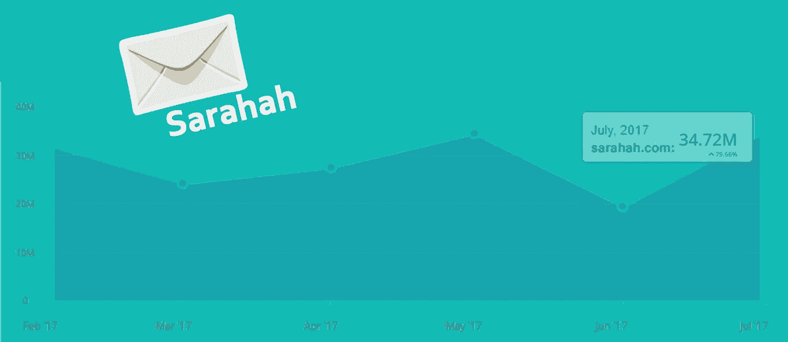
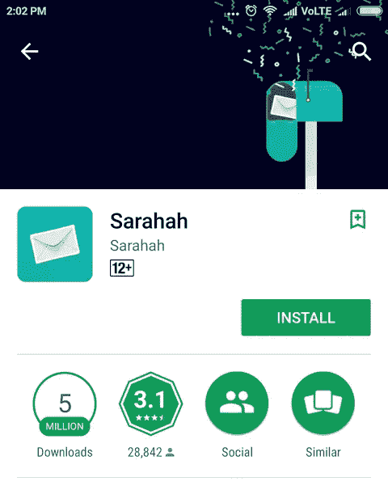
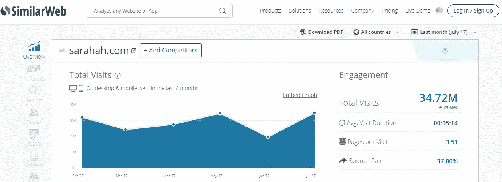
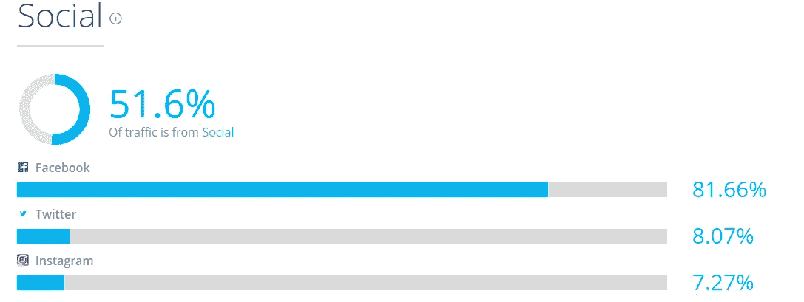

# 病毒式传播是如何运作的:看看萨拉哈最近的胜利

> 原文：<https://medium.com/hackernoon/how-virality-worked-for-sarahah-e056adaca300>

如果你没有睡在石头下，你的虚拟社交世界此刻应该被“萨拉哈”包围。莎拉迅速走红。即使你不使用它，你在社交媒体上的朋友也会发布一些有趣的消息，淹没你的[脸书](https://hackernoon.com/tagged/facebook)或推特信息。在深入细节之前，让我们先来看看关于 Sarahah 的一些基本信息。

# 萨拉哈是什么？

Sarahah 是一款匿名消息应用，旨在从你认识的人那里获得建设性的反馈。

根据应用程序制造商 Zain al-Abidin Tawfiq 的说法——与你的朋友一起，Sarahah 通过发现你的优势和需要改进的领域来帮助你；让你的朋友对你诚实。

**USP** :现在为了帮助诚实，萨拉哈给发信息的人一个麝香，即匿名。因此，没有失去友谊的恐惧，有人可以说出他们的想法，可以帮助其他人纠正一些事情，或者只是可以透露他们的感受，或者只是分享一些好的想法。

# 萨拉哈是如何工作的？

这个想法是，你注册后，将你个人资料的链接发送给任何你希望得到反馈的人，即使这意味着在网上公开发布，然后任何有这个链接的人都可以匿名向你提供反馈。

# Sarahah 的使用统计

## 应用统计

自 2017 年 2 月初上线至 2017 年 8 月，该应用仅在 Google Play 中的下载量就超过了 500 万次。接下来是 iOS(苹果不提供下载统计数据)，我们预计它也将有数百万用户。这意味着已经有超过 500 万到 700 万人从应用程序中寻求关于自己的反馈。

Google play has 5 million downloads for Sarahah

Similarweb 显示，在 7 月份的前一个月，它收到了近 3500 万次访问。

当我们给出反馈时，反馈会转到网站上，如果我们去掉主域名的总访问量，即 23.5%，我们会得到大约 2600 万次子域名的访问量，从而得到 2600 万次反馈**。**

# 为什么有人在用 Sarahah？

## 渴望了解我们自己

我们想知道人们对我们的看法。这和我们在学校和大学结束的时候给我们的朋友送 slam 书是一个道理。我们中的一些人真的不在乎别人怎么说我们。但是这个数字非常非常低。即使我们可能不关心外面的大众，但是相当多的人确实想听到我们亲密的朋友的消息。

## FOMO 因子

除了我们喜欢这个想法，对错过的恐惧也是萨拉哈成长的一个很好的因素。当我们看到大量的人选择做某事，并且分享一些结果时，这些结果是有趣的，怀旧的，好的或者鼓舞人心的。我们想试试。我们中的一些人很想尝试一下。

我们想随波逐流，我们想品味潮流。

> 最后，我们无法抗拒了解人们对我们真实感受的诱惑。

## 消极的自动消除

当在社交媒体上分享收到的消息时，没有人分享艰难的，坏的，伤害的，秘密的。我们谁也没想到会是这样。即使我们准备好接受消极的建设性批评，事情总是不够有建设性，导致像 Yak Yak 这样的网络欺凌，它被永久关闭。

社交平台上其他人分享的好的、有趣的、幽默的信息自动消除了应用程序的缺点，增加了选择加入。

## 高病毒商

由于上述因素，萨拉哈的病毒系数非常高。

> 病毒系数是一个数字，它告诉你现在的用户平均给你带来了多少用户。

对于 Sarahah 来说，我们可以从我们所看到的情况中假设，向一个人提供反馈的人也选择加入并分享他们圈子中的链接，以获得下一个人的反馈。

## 与人接触

萨拉哈没有我们的朋友是不完整的。尤其是那些今生与我们相遇的人。当我们寻求反馈时，我们会让其他人加入平台，他们在提供反馈的同时会第一次与平台互动。然后他们明白这个东西是多么有趣，反过来选择它，循环继续。

如果你看到下面的图片，你会看到有多少人从社交网站来到 Sarahah 网站，他们中的大多数人会根据我们朋友分享的链接提供反馈。众所周知，我们的朋友大多来自脸书，它贡献了社交媒体领域 82%的流量。

## 创造病毒循环的努力

作为一个应用程序开发人员，如果你看到 Sarahah，你不必给你的用户任何特权来分享给朋友。你甚至不必告诉他们，如果他们的朋友和他们在一起有多好。甚至你也不必要求他们在社交媒体上分享，相反，这是心流的一部分。如果你想得到反馈，你必须分享。

它是关于创造每个人都想亲手做的东西。它是关于创造能唤起情感的东西。萨拉哈出色地完成了任务。

—

***关于作者***

Ranit Sanyal 是设计驱动开发工作室**的联合创始人。**

*这篇文章最初出现在 [RE 博客](http://www.redelegant.com/blog/virality-works-look-inside-recent-triumph-sarahah/)*

**如果你喜欢这篇文章，请点击* **💚** *这样别人也可以享受了:)**