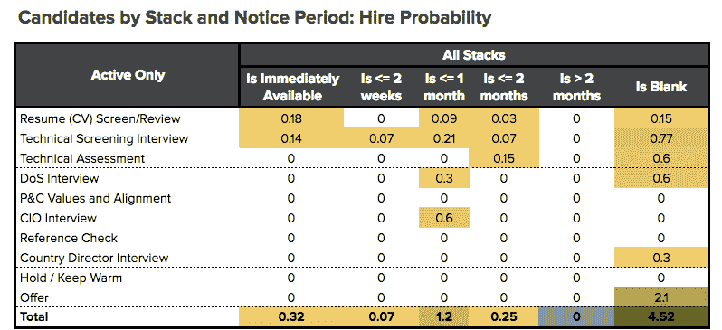
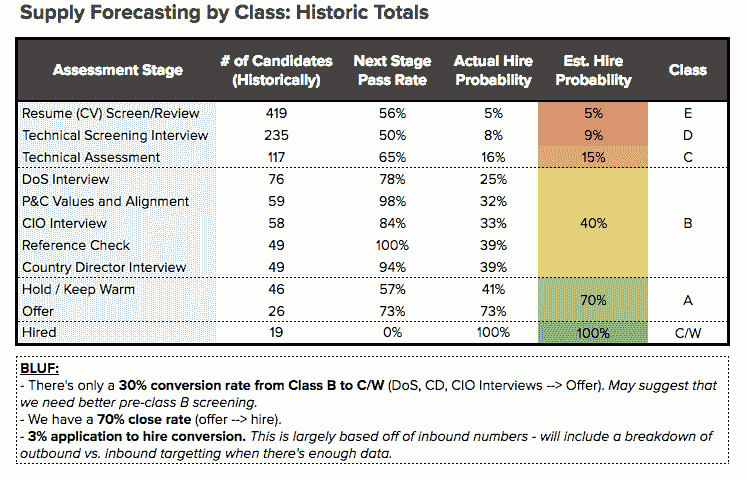
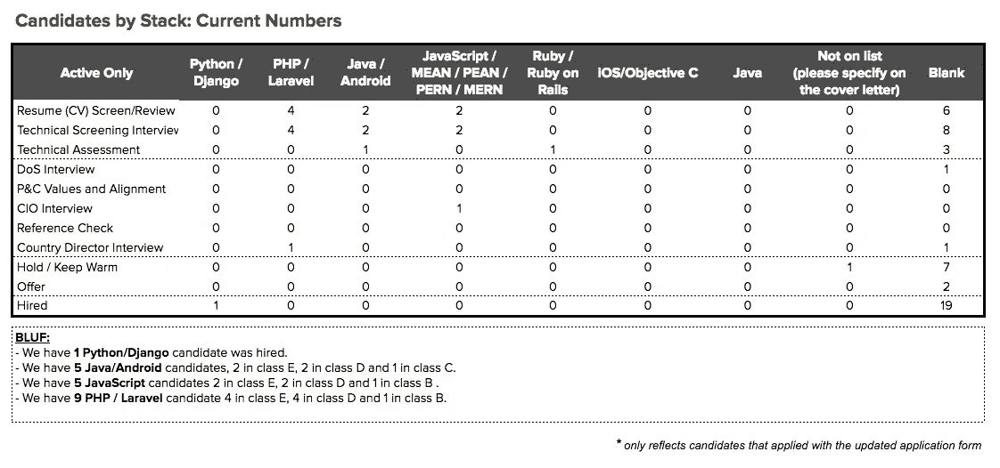
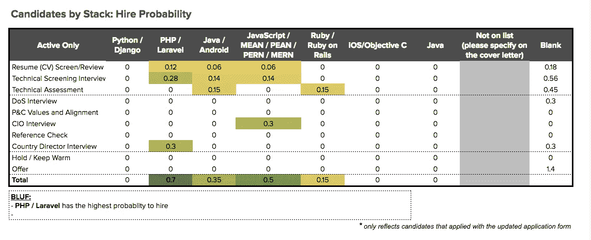
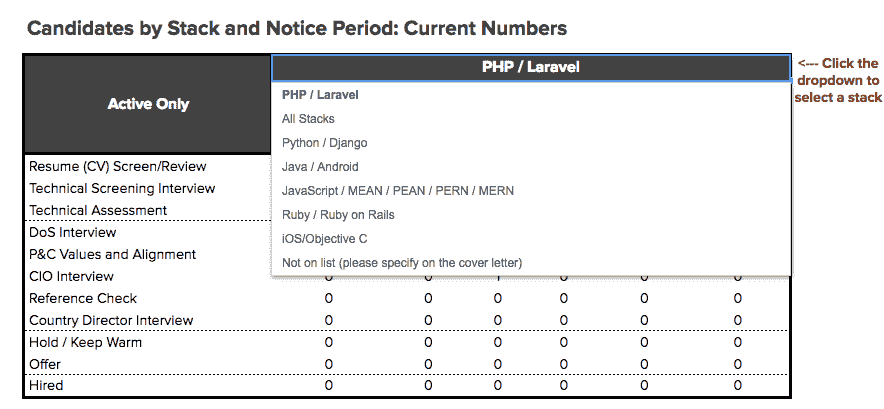
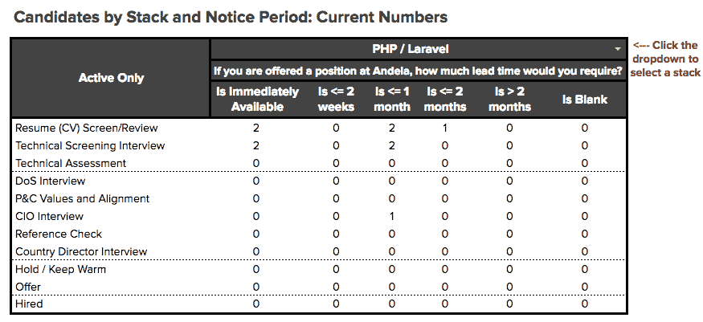

# 人员分析:我们如何将高级开发人员招聘速度提高了 233%

> 原文：<https://medium.com/hackernoon/how-we-accelerated-our-senior-developer-hiring-by-233-57a46ecd8723>

*这篇文章将带你了解* [*安德拉*](https://andela.com/about-us/) *，一家将领先的技术公司与来自非洲各地技术中心的优秀软件开发人员联系起来的公司，是如何从在 60 天内雇佣 3 名高级软件开发人员发展到在 30 天内雇佣 10 名高级软件开发人员的。*

**人员分析:**在[安德拉](https://andela.com/)我们受到人员分析**的推动。**我们认识到，招聘不一定要保密——你可以通过组织良好的数据获得有用的见解。我们一贯的目标是雇佣和支持非洲大陆的顶尖技术专家。为了实现这一点，我们需要建立一些系统，让我们知道自己做得如何，以及我们需要做些什么来更好地吸引顶尖人才。在这种情况下，我们需要在短时间内增加组织中高级开发人员的数量，以支持我们开发人员社区中其他人的学习。

**招聘系统:**为了在短时间内招聘到这些顶级软件开发人员**，**我们使用 [Google](https://hackernoon.com/tagged/google) 表单建立了一个系统，我们相信人们可以利用这个系统。在一个由 4 部分组成的框架中，我们将带您了解这个系统:

*   **第一部分:定义雇佣概率**——这一部分将介绍如何使用历史数据来计算在管道中雇佣申请人的可能性。
*   **第二部分:跟踪特定角色的候选人状态**——这一部分简要概述了我们如何将谷歌表单与我们的招聘系统相集成。
*   **第三部分:计算期望值** —这一部分将带你了解如何计算聘用活跃申请者的概率。
*   第四部分:制定有时间限制的决策——这一部分提供了关于如何根据期望的属性计算概率的见解。

# **第一部分:定义雇佣概率**

*   **我们使用来自申请人跟踪系统(-ATS)的历史数据**来了解每个阶段有多少百分比的候选人有可能被聘用。
*   我们创建了类来理解某个人被雇佣的可能性。我们把这些四舍五入到最接近的十分之一。
*   **我们认为招聘流程的变化**是基于进入下一阶段的可能性。这种逐步预测分析有助于提高招聘过程的效率。

**第二部分:跟踪特定角色的候选人状态**

*   **我们使用谷歌表单中的实时和定期更新与我们的 ATS** 集成。
    ***实时更新*** *是使用一个温室附加组件——温室报告连接器——来链接温室报告和谷歌表单。* ***定期更新*** *被发送到带有温室候选出口和公式的 Google Sheets。这需要手动刷新/更新数据。*
*   **我们根据最重要的特征进行分类，**是角色、堆栈、恢复交付时间还是我们想要显示的任何其他属性。我们需要根据申请人的突出地位和在[安德拉](https://hackernoon.com/tagged/andela)恢复简历的准备时间，预测申请人在申请流程中不同阶段的概率。

# **第三部分:计算期望值**

*   我们将概率乘以候选人的数量，这样我们就可以看到每个阶段有多少人在特定的堆栈下。
*   我们用它来预测 stack 会雇佣多少人。

# **第四部分:做出有时限的决定**

*   **我们展示了三个维度:**雇佣时间，雇佣角色，以及可能被雇佣的人数。我们使用这三个指标，因为我们相信它们对我们的业务增长最有影响。
    ***三维 Google Sheets:****使用一个数据验证-下拉菜单让人们切换第三个轴。一个三维表格用于显示基于三个不同变量的数据，在我们的例子中是应用阶段、堆栈和恢复交付时间。*
*   **我们将“所有堆栈”作为一个维度:**这包含在我们的下拉菜单中，我们使用“if & countif -formula”来计算当前数字。

# **结果:**

*   **已证实的效率和成果的提高:**在使用这些系统之前，我们已经在 60 天内雇佣了 3 名高级软件开发人员。我们在实施这些系统后的 30 天内雇佣了 10 名员工。招聘人数增加了 233%，而时间减少了 50%。

**加入我们**如果你有兴趣了解更多关于 Andela 如何利用人员分析的信息，请留下评论