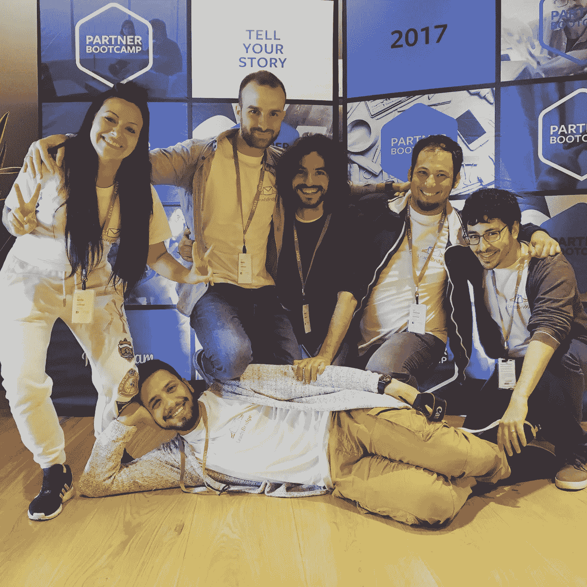
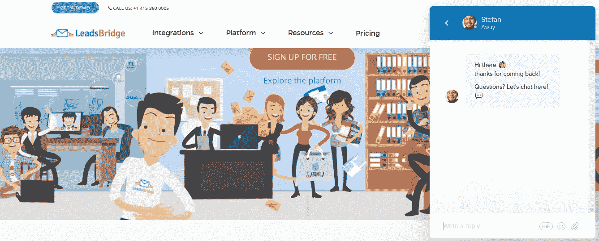
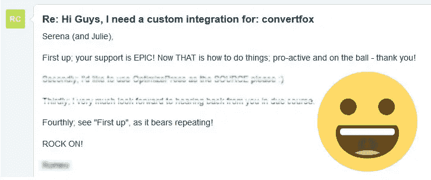

# 我们如何在 12 个月内将我们的创业公司提升到 100 万美元(你也可以做到)。

> 原文：<https://medium.com/hackernoon/how-we-bootstrapped-our-startup-to-1m-in-12-months-and-you-can-too-dad55578062c>

我对网上的一些人很不满。

很多次，我听到科技行业的人建议其他企业家向投资者要钱来启动……*up*。

别误会，*我明白了。*

在某些情况下，投资者是启动大项目的唯一途径，但我坚信大多数创业公司真的可以靠自己成功，并通过首先销售来验证他们的想法(对我来说，这是唯一真正的验证)。

我总是让自己负责让球滚动起来，你猜怎么着？

我又做了*。或者更好，我们在 LeadsBridge 再次这样做，这是一家帮助公司创造更多线索的初创公司。*

*LeadsBridge 是作为一个副业项目诞生的，是另一家已经开始赚钱的创业公司的副产品。*

*但是仅仅过了 100 天，我们意识到它的命运远不止如此。*

*所以我们全力以赴。*

**

*Some of our amazing team members! :)*

*创业是一回事。规模是另一回事。缩放部分很难。*极其艰苦*。*

*所以我想在这里分享我们的故事，帮助所有勇敢的创业者，他们想继续他们的梦想，即使没有投资者。*

*以下是我们用来在短短 12 个月内使 LeadsBridge 达到 100 万美元的 11 个策略，它们也能帮助你的创业。🚀*

## ***1)对讲销售聊天***

*[对讲销售聊天](https://www.intercom.com/live-chat)确实从其他聊天系统中脱颖而出。他们精心制作了最好的非侵入式聊天，但仍然是一个引人注目的工具，每天都给我们的销售团队带来线索。*

**

*在过去，我试过 Zopim，它也很好，因为你可以开始和你的网站访问者实时聊天。但我们发现它有点垃圾，比对讲机更不“真实”。*

*[**然而，要建立一个好的团队，雇佣人才是不够的**:他们必须有正确的动力来推动项目向前发展。](https://medium.com/u/7ca8972daf76#leadsbridge.</figcaption></figure>
</figure>
</figure>
</figure>
</figure>
 *[你在开玩笑吗？真的吗？支持是客户幸福的关键？](https://medium.com/u/7ca8972daf76#leadsbridge.</figcaption></figure>
 
> *[加油斯特凡你可以做得更好。](https://medium.com/u/7ca8972daf76#leadsbridge.</figcaption></figure>
</figure>
</figure>
</figure>
</figure>
 *"我们会在 72 小时内回复每一封邮件."*

*我不愿意相信。*

*许多初创公司因为糟糕的客户支持而将整个业务置于严重的风险之中。*

*一个好的客户支持有三个基本的信念，应该是你的客户幸福团队的圣经:*

*   *在客户说“*我很好，谢谢*”之前，不要关闭票据。*
*   *永远不要说:“*我帮不了你*”。不惜一切代价想办法。*
*   *快点。客户的时间是宝贵的，如果你不理他们，你会失去大量的客户。*

**

*An example of what great customer support means.*

*如今，等待长达 3 天的时间来回复客户的请求*简直是漫长的等待。**

*我并不是说每个人都应该提供实时聊天，尽管这是一个艰难的承诺，但总是要努力做得更好。*

*观察 Wpengine 中屡获殊荣的客户支持[，并通过阅读](https://wpengine.com/our-difference/service-and-support/)[帮助童子军团队](https://medium.com/u/fa62fdcc8ea3?source=post_page-----dad55578062c--------------------------------)的博客[学习如何正确地做这件事](https://www.helpscout.net/blog/)。*

***11)抢走别人的观众***

*我已经谈到了内容营销如何帮助我们获得新客户，以及跟踪由此产生的转化是多么重要。*

*但是有一件事我之前没有说，但对 LeadsBridge 来说非常重要:我们不仅仅在我们的博客中发布内容，**我们在我们的舒适区之外扩展它**。*

*事实上，在网络上，在新闻网站上，在有影响力的人的博客上，或者在你认为“*这个网站/博客对我的产品有很好的受众*”的任何地方传播大量内容是很关键的。在某种程度上，这就像是从别人那里“偷走”观众。😄*

*LeadsBridge 目前在网络上发布了 80%的内容，这给了我们获取新受众的巨大力量，并使业务不断扩大。*

*如今，创造好的内容是昂贵的，既困难又耗时。*但是值得*。*

*利用它的最好方法是把它发布在你已经知道有很多潜在的人对你的工作感兴趣的地方。*

## ***结论***

*经营一家初创公司极其困难，每天都要花很多时间。*

*不过也是难以置信的*奖励*。🙌*

*从专业角度来说，这是我梦寐以求的最好的事情之一，因为这是一个丰富的学习、成长和超越舒适区的机会。*

*这是我一生都不会忘记的旅程。*

*所以，如果你是一个梦想家，像我和我们在 LeadsBridge 的团队一样努力工作，并且你试图自己启动你的项目，而不是等待投资者给它类固醇，我想告诉你:*

> *你可以用你自己的力量做到。我们就是活生生的例子。*

***干杯！**🍻*

**

**故事作者:* **斯特凡德斯**。*

*—*

*如果你喜欢这个故事，请为我们鼓掌！我们很感激。谢谢大家！*

**