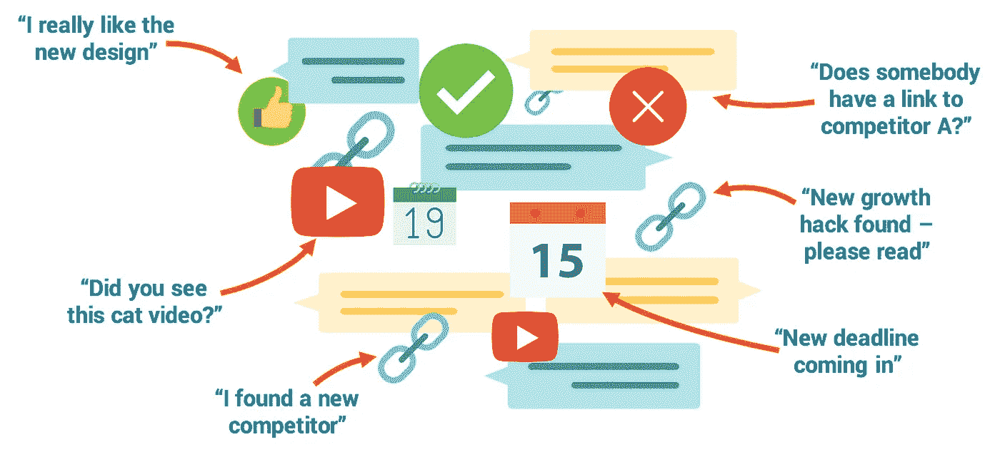
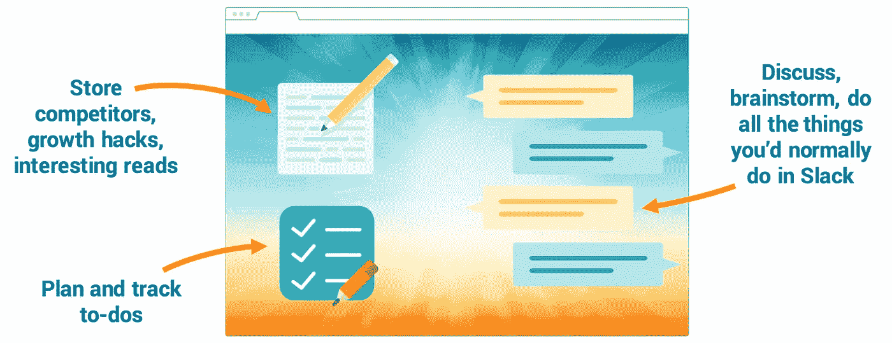

# 我们如何偶然建立了一个(非常小的)松散的竞争对手

> 原文：<https://medium.com/hackernoon/how-we-build-a-slack-competitor-by-accident-b2935dd2064d>

## 我们开始轻松地计划一次公路旅行，并为自己建立了一个项目管理工具

在 2016 年年中充满希望的 Alpha 发布后，当决定转向哪个方向时，我们问自己最需要的是什么。正如我们在本帖中所描述的，这将是一个简单的工具来帮助我们计划每年的假期、朋友和家人的聚会、生日等等。我们的 [JayPads](https://jaypad.de/) 的基本功能是分离相关的事实和信息(寻找日期，谁带什么，谁开车去哪里等等。)从不断增长的 blabla，特别是群聊——看每一个猫的视频。我们通过回复策划单身派对的时候，所有的连锁邮件至今仍困扰着我们，我们不能谈论这些。

> 我们通过回复策划单身派对的时候——所有的连锁邮件至今仍困扰着我们

因此，我们开始帮助我们在这些规划场景中保持理智，由于 Trello 没有实现我们需要的沟通和讨论，我们选择 Slack 作为我们的主要信息和协作中心。这就是乐趣开始的时候。

This was our “information hub” during the first months of working in team [JayPad](https://jaypad.de/).

我记得每天使用搜索功能来获取不久前发布的重要信息。Slack 很快变成了这个不断增长的有机讨论的坟墓，里面有 URL、pitchdecks、想法、待办事项和截止日期。这是两人一组。事后看来，这是一场噩梦——我们正在讨论一个竞争对手，并决定其相关性，同时相信这些信息会以某种方式神奇地永远可用的普遍说法。事实并非如此。

> Slack 很快变成了这个不断增长的有机讨论的坟墓，里面有 URL、pitchdecks、想法、待办事项和截止日期

直到对我们的派对计划工具的筹备环境进行了两个星期的积极测试后，我们才第一次注意到，我们已经直观地从使用 Slack 作为项目管理和协作的手段转变为我们自己的 [JayPads](https://jaypad.de/) 。我们认为我们的单一讨论通道和补充内容板的框架比人类已知的最伟大的协作软件更适合我们的需求，其中单一连续讨论的结果将被存储在内容板中。

Our solution is a very simple tool which separates relevant content from ever-growing blabla.

因此，可以说，我们偶然发现构建一个聚会策划器给了我们构建聚会策划器所需要的协作工具。在我们看来，管理一个项目，比如一个两人创业项目或其他项目，很可能不会从使用一个通用的协作解决方案中受益，并且需要一个非常简单的工具。我们需要的只是一个结果、事实和信息的仓库，以及一个开发这些结果的渠道。相关内容和一般讨论的分离。

如果你对此感兴趣:我们在产品搜索上很有特色:[https://www.producthunt.com/posts/jaypad](https://www.producthunt.com/posts/jaypad)来加入讨论吧——我们很想听到你的反馈。

> [黑客中午](http://bit.ly/Hackernoon)是黑客如何开始他们的下午。我们是 [@AMI](http://bit.ly/atAMIatAMI) 家庭的一员。我们现在[接受投稿](http://bit.ly/hackernoonsubmission)并乐意[讨论广告&赞助](mailto:partners@amipublications.com)机会。
> 
> 如果你喜欢这个故事，我们推荐你阅读我们的[最新科技故事](http://bit.ly/hackernoonlatestt)和[趋势科技故事](https://hackernoon.com/trending)。直到下一次，不要把世界的现实想当然！

