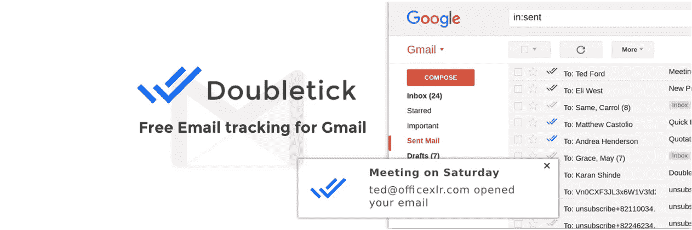
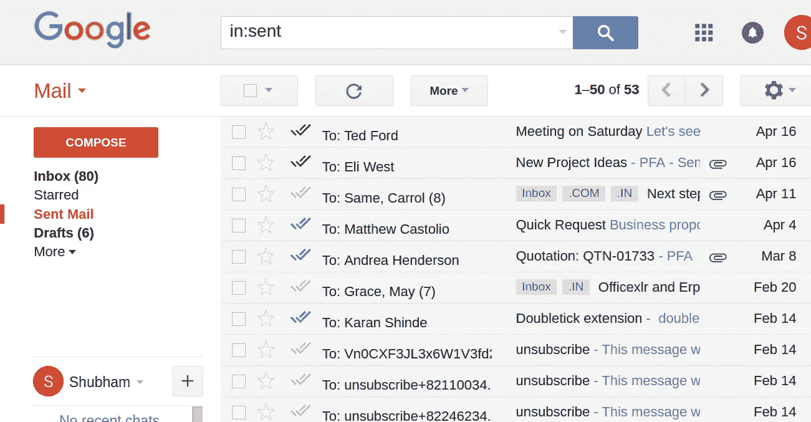

# 我们如何为销售团队构建电子邮件跟踪解决方案

> 原文：<https://medium.com/hackernoon/how-we-built-an-email-tracking-solution-for-our-sales-team-7cef5d0bd930>

Doubletick Email Tracking Cover

我们在 Officexlr 为我们的销售团队尝试了许多不同的电子邮件跟踪解决方案来跟踪我们的潜在客户，但没有一个能够与 [Gmail](https://hackernoon.com/tagged/gmail) 无缝集成，我们发现自己现在使用两个不同的应用程序来完成一个简单的任务。

# 无法与 Gmail 无缝集成

使用另一个应用程序来查看被跟踪邮件的状态导致了[生产力](https://hackernoon.com/tagged/productivity)的损失，而且这些解决方案并不便宜。

# 令人不舒服的帐户权限

大多数可用的电子邮件跟踪解决方案需要对您的 Gmail 帐户拥有完全的读、写、修改权限，这对企业来说太难了，我们对此感到很不舒服。

# 我们决定建立自己的电子邮件跟踪器！

因此，我们决定建立一个电子邮件跟踪解决方案，它将在收件箱中显示电子邮件的状态，并且几乎自动运行，不需要任何 Gmail 帐户许可

# Doubletick 就这样诞生了！

Sample Inbox of a Doubletick User

Doubletick 不需要 Gmail 帐户权限，可以无缝集成到 Gmail 中。一切都发生在客户端，没有敏感信息被传输回我们的服务器。

# 我们在 Doubletick 中包含的功能

1.  无限制的电子邮件跟踪
2.  实时打开通知
3.  在您的“已发送”邮箱中获得双重复选标记
4.  链接跟踪*(即将推出)*
5.  仪表板*(即将推出)*

目前 doubletick 免费提供无限时间的无限邮件，但包含了*“通过 Doubletick 发送”*的品牌。要删除此品牌，我们提供一个付费计划，每年***【24】美元。***

# *立即下载，免费的*

*从 Chrome 网上商店下载或访问[https://doubletick.co](https://doubletick.co)了解更多信息。*

*我们真的很自豪能够建立一个简单而高效的电子邮件跟踪解决方案，它帮助了我们的销售团队，我们希望它也能帮助其他人。给 Doubletick 一个机会，并给我们您宝贵的反馈！*

******

> *[黑客中午](http://bit.ly/Hackernoon)是黑客如何开始他们的下午。我们是 [@AMI](http://bit.ly/atAMIatAMI) 家庭的一员。我们现在[接受投稿](http://bit.ly/hackernoonsubmission)，并乐意[讨论广告&赞助](mailto:partners@amipublications.com)机会。*
> 
> *如果你喜欢这个故事，我们推荐你阅读我们的[最新科技故事](http://bit.ly/hackernoonlatestt)和[趋势科技故事](https://hackernoon.com/trending)。直到下一次，不要把世界的现实想当然！*

**