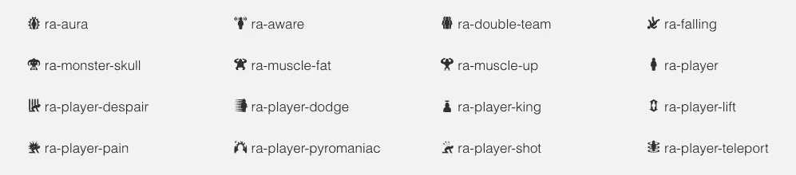

# 我们如何创造 RPG 真棒

> 原文：<https://medium.com/hackernoon/how-we-created-rpg-awesome-c33198cf4a84>

当 [@nagoshiashumari](https://github.com/nagoshiashumari) 和我( [@idmontie](https://github.com/idmontie) )着手创建一个易于使用的字体库时，我们没有意识到寻找、管理和组织所有的[图标](https://hackernoon.com/tagged/icons)以便开发者可以在他们的网站上使用它们会有多少工作量。我们的目标是创建一个字体库，提供酷 RPG 和游戏相关的图标。



A fantasy themed font and CSS toolkit.

像 Font Awesome 这样的库非常酷。您可以在项目中获得漂亮的可缩放图标，而不必包含图像或 SVG。你所需要的只是一个字体和一个破折号。你给自己找到了一些令人惊叹的图标。

我们真的很喜欢使用字体 Awesome 是多么容易，并且有漂亮的、可缩放的图标，你可以将它们嵌入到你网站的文本中。这就是激励我们把 RPG 做得牛逼的原因；但是有一些更适合游戏的图标。

RPG Awesome 是一个 CSS 字体库，工作起来就像 Font Awesome 一样，但是带给你的是 RPG 和游戏主题图标。

# 生成 CSS

当您将 Font Awesome 的 CSS 样式表添加到文档中时，您真正做的只是添加字体规则，告诉浏览器您的字体文件在哪里。这很容易做到，更难的是创建这些字体文件:

```
@font-face {
  font-family: 'RPGAwesome';
  src: url("../fonts/rpgawesome-webfont.eot?v=0.1.0");
  src: url("../fonts/rpgawesome-webfont.eot?#iefix&v=0.1.0") /* ... */;
  font-weight: normal;
  font-style: normal;
}
```

CSS 更繁琐的部分是为字体中的所有字符生成所有的类:

```
.ra-axe:before {
  content: "";
}
```

# 创建字体

在我们考虑创建类名到字体中字符的完整映射之前，我们需要找到一些好的 SVG 来使用。幸运的是,@ [nagoshiashumari](http://github.com/nagoshiashumari) 找到了[game-icons.net](http://game-icons.net/)，有着惊人的 [CC BY 3.0](https://creativecommons.org/licenses/by/3.0/) 牌照。这使得我们可以根据任何目的改编他们的作品，只要我们适当地注明出处。

@nagoshiashumari 精心策划了他们的 SVG 档案。许多图标需要清理，其中一些需要扔掉。最终，她找到了 495 个可用的象形文字，包括在字体中。

为了创建使用图标所需的字体文件和映射，我们将所有的 SVG 添加到一个 [IcoMoon.io](http://icomoon.io) 项目集中。这个工具可以让我们快速地将数百个 SVG 转换成一种字体。对我们来说更好的是，这个在线工具生成了字体字符和类名之间的映射！

你可以在这里看到字体中使用的所有原始 SVGs:[nagoshiashumari/RPG-awesome-raw](https://github.com/nagoshiashumari/rpg-awesome-raw)。

# 出版

最后，现在我们有了字体和 CSS，我们可以发布它了！

首先，我们决定将所有代码开源到 Github，这样其他人就可以帮助我们改进字体库并建议新图标！

然后，我们根据要求添加了对不同包管理器的支持。我们给[鲍尔](https://bower.io/docs/config/)、 [NPM](https://www.npmjs.com/package/rpg-awesome) 、[流星](https://atmospherejs.com/nagoshi/rpg-awesome)加了 RPG 牛逼。

如果你想帮助改进字体，阅读更多关于入门的内容，或者表示支持，那么请查看我们的 [Github Repo](https://github.com/nagoshiashumari/Rpg-Awesome) ！

感谢阅读！如果你喜欢这篇文章，请在胶囊猫博客上阅读更多内容。

[](http://bit.ly/HackernoonFB)[](https://goo.gl/k7XYbx)[](https://goo.gl/4ofytp)

> [黑客中午](http://bit.ly/Hackernoon)是黑客如何开始他们的下午。我们是 AMI 家庭的一员。我们现在[接受投稿](http://bit.ly/hackernoonsubmission)并乐意[讨论广告&赞助](mailto:partners@amipublications.com)机会。
> 
> 如果你喜欢这个故事，我们推荐你阅读我们的[最新科技故事](http://bit.ly/hackernoonlatestt)和[趋势科技故事](https://hackernoon.com/trending)。直到下一次，不要把世界的现实想当然！

