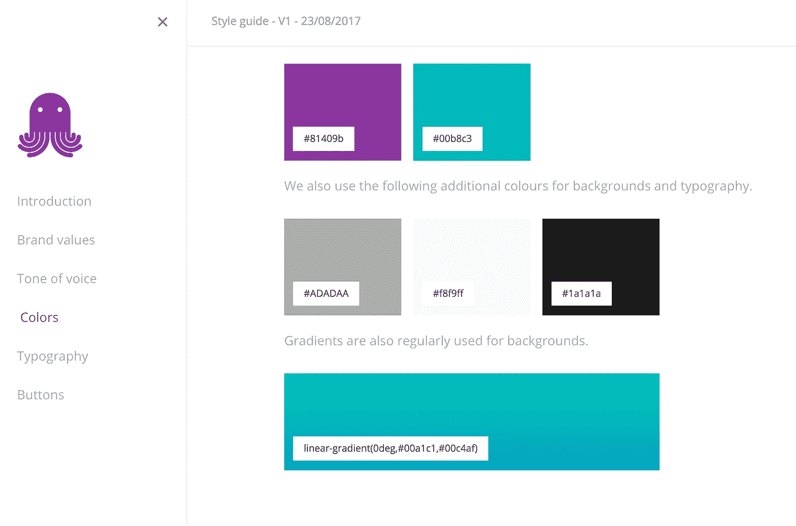
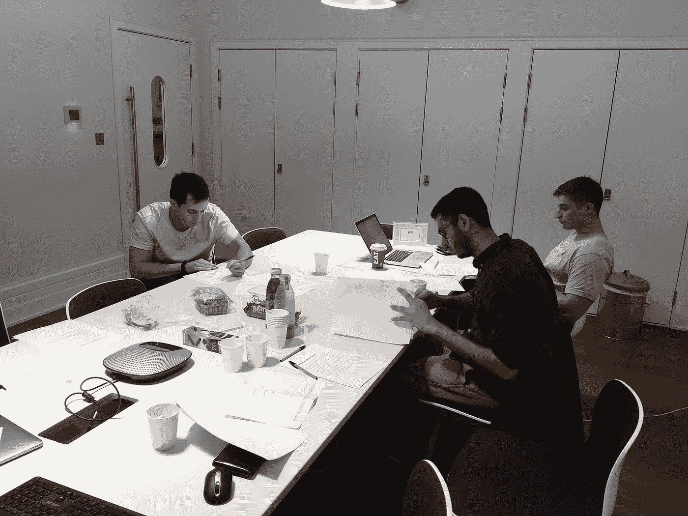
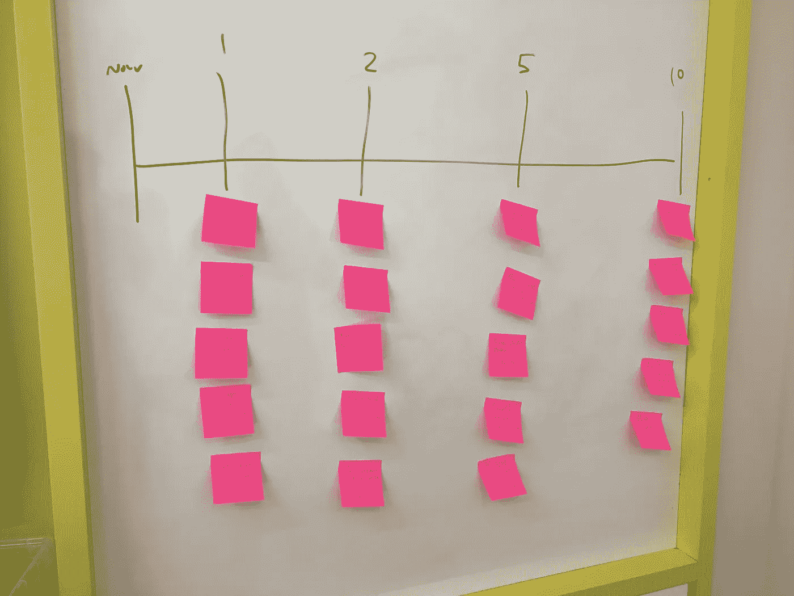
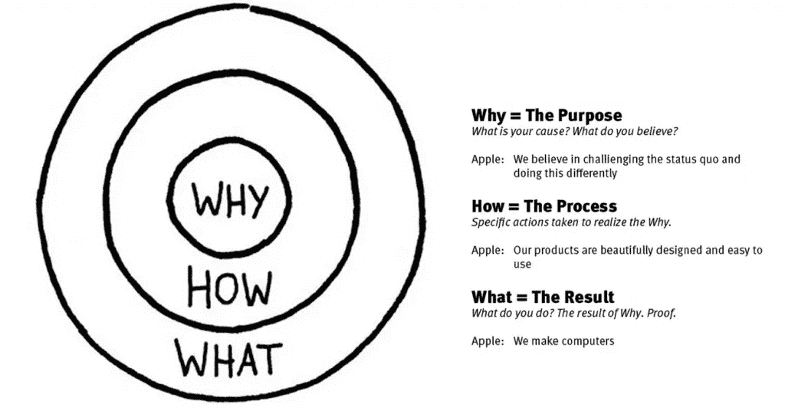
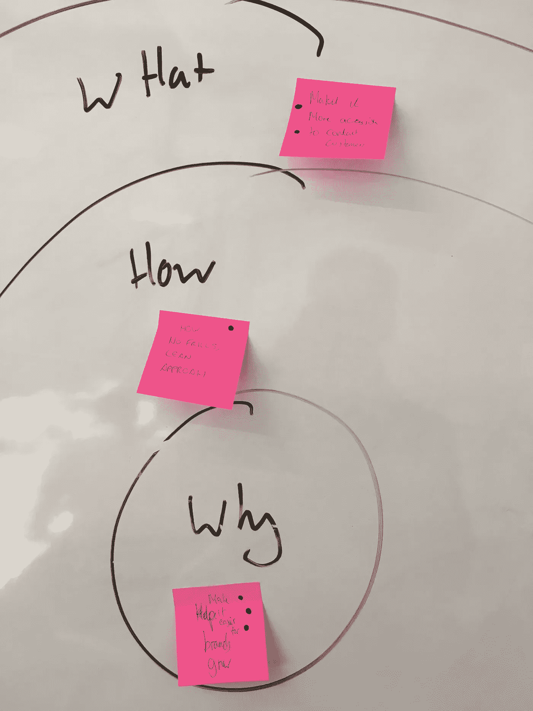
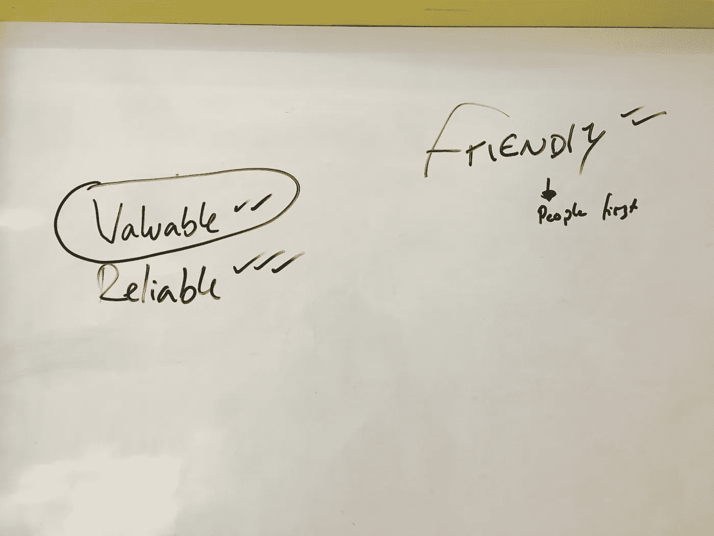
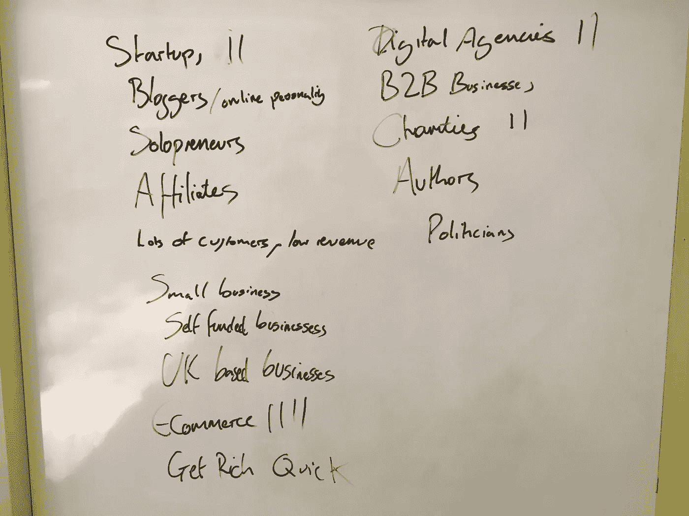

# 我们如何将 EmailOctopus 定义为品牌

> 原文：<https://medium.com/hackernoon/how-we-define-emailoctopus-as-a-brand-522423847850>

4 年前，当我们编写第一行代码时，我们没有想到会有今天的局面，成千上万的客户已经发送了超过 16 亿封电子邮件。与传统企业不同，网络创业公司通常不会制定商业计划，也不会邀请市长在盛大的揭幕仪式上削减繁文缛节。他们成长和迭代——通常没有定义他们作为一个品牌是谁，他们想去哪里，或者他们为什么要做生意。

Our style guide following the brand sprint

在 EmailOctopus，我们有一个抽象的品牌概念和一个共同的、模糊的目标。但是我们从来没有真正作为一个团队讨论过它，我们当然也从来没有把它写下来。随着我们重新[设计](https://hackernoon.com/tagged/design)网站并撰写更多博客文章，对我们是谁以及我们想成为谁的共同理解比以往任何时候都更重要。

现在是一个 5 人团队，感觉是时候真正搞清楚 EmailOctopus 代表什么了，我们在团队外出日采用了以下流程。这一天的特色是一个上午严肃的品牌聊天，几场友好的飞镖游戏和几杯饮料，发生在上周。这是事情的经过，以及它看起来的样子。

# 品牌会议

我们以全体会议开始了新的一天，讨论业务的发展方向和我们的短期路线图。你可能已经猜到了“全员”这个词，每个人都会参加——从我们的营销实习生哈姆扎，到联合创始人加雷思，他在企业中扮演的角色更多的是顾问。

我们每个月都开全体会议。这样做可以确保每个人都在同一页上，并理解我们的短期目标。在内部，我们对整个团队的表现非常开放——通过 Slack 更新定期分享 MRR(每月经常性收入)和收购的客户等指标。全体会议为回答团队可能提出的任何更深入的问题提供了一个机会，例如，在这次会议上，我们准备了对所有用户现场行为的分析，让团队深入了解正在使用哪些功能、用户使用平台的频率以及哪些类型的用户正在使用 EmailOctopus。通过分享这些见解，整个团队可以在接下来的一个月里对我们正在进行的工作做出重要贡献。

Preparing for the team meeting

全体讨论结束后，我们进入了围绕电子邮件的讨论。我们是 [GV Sprint](http://www.gv.com/sprint/) 流程的忠实粉丝，我们利用他们的[品牌 Sprint](https://library.gv.com/the-three-hour-brand-sprint-3ccabf4b768a) 为我们的品牌讨论增加了一些结构。根据品牌冲刺的指导方针，我们指定了一名决定者(乔纳森)、主持人(汤姆)和拍照者(哈姆扎)。

# 10 年路线图

这就是我们在 10 年后看到的 EmailOctopus。我们定期展望未来 6 个月或 1 年，所以花些时间思考和想象 10 年后我们会在哪里是一个有趣的练习。

在每隔 1 年、2 年、5 年和 10 年写下我们自己的愿景后，我们讨论它们。我们的短期、1 年和 2 年目标都非常相似。将客户数量增加两倍，增加额外功能，并扩展到其他类似领域，如短信或 Facebook Messenger 营销。这并不奇怪，因为我们经常谈论短期目标。

All our ideas on the whiteboard for where we want to be at certain points in time

然而，在 5 年和 10 年的时候，我们的视野变得略有不同。一些人希望出售业务，另一些人则希望控制电子邮件营销行业。在乔纳森做出最后决定之前，我们花了整整 15 分钟讨论我们认为我们可能会在哪里。

# 什么，怎样，为什么

《什么，怎样，为什么》是根据西蒙·西内克的《黄金圈》改编的。你可以在这里观看他的视频[，解释这个概念。但简而言之，西内克认为，你需要知道你为什么从事商业(并谈论它)。苹果公司就是最好的例子，他们的“为什么”口号是“我们相信挑战现状，以不同的方式做这件事。”简而言之，当一家公司有强烈的动机时，顾客就会购买该产品。](https://www.youtube.com/watch?v=l5Tw0PGcyN0)

这个练习最重要的部分是为什么。“什么”和“如何”只是你目前解决更大问题的方式。考虑到这一点，我们都写下了我们的答案，贴在黑板上，然后花了大约 10 分钟的时间讨论 EmailOctopus 的内容和方法。

Our Golden Circle

当我们谈到“为什么”时，我们花了一点时间。详细讨论每个人的想法，了解我们每个人在 EmailOctopus 的动机。经过坦率的讨论，我们最终决定买两张票。决定在 EmailOctopus，我们的存在是为了“让品牌更容易成长”，目前我们通过“无装饰、精益的方法”发送电子邮件来做到这一点。

# 前三个值

品牌价值观总让人感觉有点公司化。财富 500 强公司贴在墙上，永远被忽视的东西。然而，价值观也有其重要性。它增加了“为什么”的色彩，并可以帮助我们在许多不同的情况下决定我们的方法；在招聘、与客户打交道或处理内部冲突时。

The EmailOctopus brand values after voting

同样，我们写下了我们各自的价值观，并在白板上各写了 3 个。有了一个大约 15 个的列表，我们在乔纳森最终决定什么是最终价值之前开始讨论它们。在所有这些练习中，决策者起着关键作用——虽然在我们的案例中，乔纳森考虑了每个人的意见，但重要的是不要过度讨论许多要点。如果我们花几个小时讨论每一点，冲刺就会失败——毕竟骆驼是由委员会设计的马。有一个决策者可以大大加快这个过程，并确保我们相互冲突的观点不会失控。以下是我们在 EmailOctopus 中决定并在日常生活中考虑的价值观。

1.  我们提供价值
2.  我们是可靠的
3.  我们很友好

# 前三名观众

这要求我们分析哪些群体对 EmailOctopus 最重要。作为一个电子邮件营销平台，我们确实被各种各样的个人使用——从个人博客一直到大型跨国唱片公司。在这个练习中，我们分析了谁的观点对 EmailOctopus 最重要——同样，我们在投票(并决定)前 3 名之前，记下了我们自己的每个答案。

A list of all the potential audiences the team though of

最后两个练习是更传统的品牌练习。如果你曾经和品牌顾问一起工作过，你可能也做过类似的事情。首先，我们必须在“个性滑块”上描绘出 EmailOctopus 的个性。我们考察了一些可以与我们的品牌联系在一起的极端个性:精英/大众吸引力、严肃/俏皮、传统/反叛、朋友/权威、成熟&经典/年轻&创新。我们再次记录并投票——幸运的是，在这种情况下，我们发现我们对自己在天平上的位置感觉非常相似，都希望比香奈儿类型的品牌更有趣、更具破坏性、更好玩。我们的定位类似于谷歌。

Jonathan and Hamzah positioning EmailOctopus on the personality sliders

最后一个练习是一个 2×2 矩阵，在这个矩阵中，我们将自己与 Mailchimp、Constant Contact 和 Campaign Monitor 等竞争对手区分开来。矩阵有两个轴——现代-经典，前卫-保守，我们开始绘制 EmailOctopus 与上述其他品牌的对比图。尽管对我们的竞争对手在图表上的位置有一些分歧，但我们都同意 EmailOctopus 的立场。

# 收尾工作

会议结束后，接下来是团队建设。没有什么比一些饮料、食物和飞镖更能让一群人聚在一起了。所以我们就去了拐角处的飞行俱乐部。这一天我们发现了汤姆隐藏的天赋——飞镖。

LET’S PLAY DARTS!!!

# 想跑自己的品牌冲刺？

你的[初创公司](https://hackernoon.com/tagged/startup)正在成长还是即将经历一次巨大的重新设计？听起来可能很可怕，但我无法推荐定义你的价值观和共同目标的重要性。我们使用下面这篇中型文章作为我们一天的基础，做了一些小的调整以更好地适应我们。

[https://library . gv . com/the-three-hour-brand-sprint-3c cabf 4b 768 a](https://library.gv.com/the-three-hour-brand-sprint-3ccabf4b768a)

冲刺总共花了不到 3 个小时，我们是在办公室外面的一个外部会议室(在[哈克树肖尔迪奇](https://www.huckletree.com/book-meeting-room#))完成的。在我们自己的常规工作场所之外做这件事给了团队一些时间，让他们真正从日常任务中抽身出来，专注于更大的图景。

# 我们简单的品牌指南

第二天，我们整理了一份非常简单的外部品牌指南文件，重点介绍了我们的价值观、我们的语气以及构成 EmailOctopus 品牌的颜色。我们使用开源的巨大的公司风格的 guid 来形成这个的基础，可以在下面看到:

[https://three hearts digital . github . io/emailctopus-style guide/](https://threeheartsdigital.github.io/emailoctopus-styleguide/#!colors)

*原载于*[*blog.emailoctopus.com*](https://blog.emailoctopus.com/how-we-define-emailoctopus-as-a-brand/)