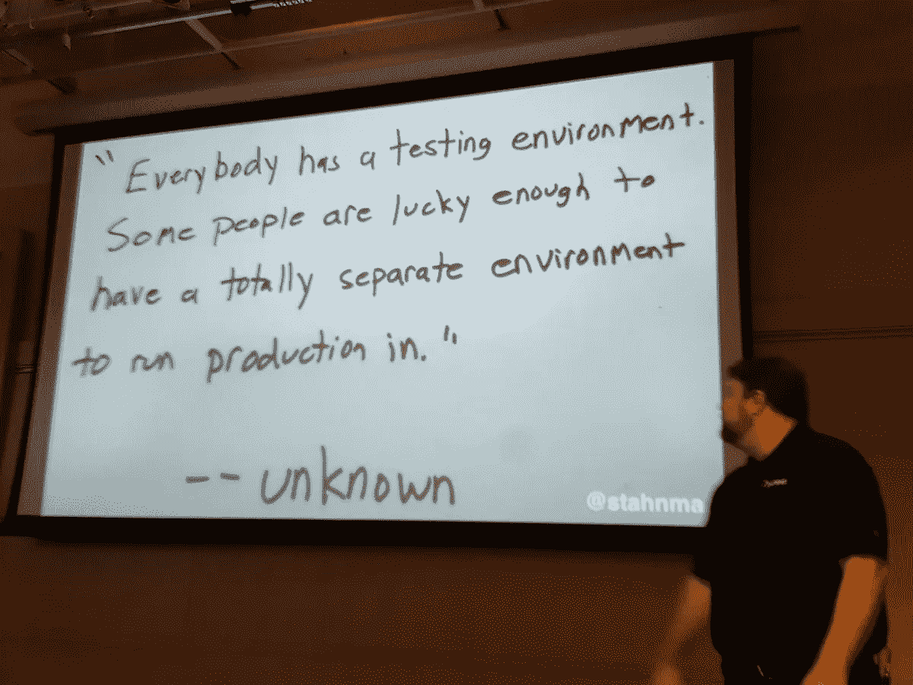
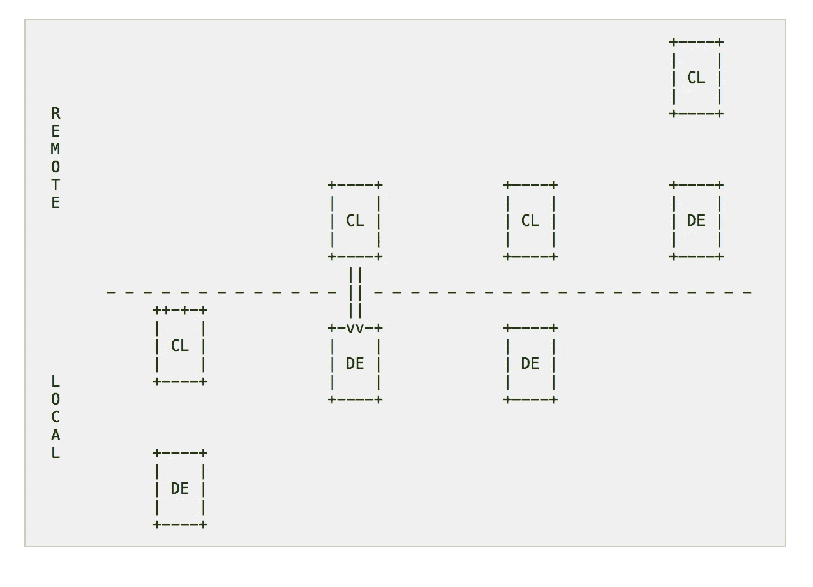

# 我们如何在分布式系统中开发

> 原文：<https://medium.com/hackernoon/how-we-develop-in-and-with-distributed-systems-66c71e918735>

分布式系统很难。在分布式系统中开发更加困难。

*有什么难的？*首先，我们要处理两个方面:

*   下图中的集群， **CL** ，也就是分布式系统本身比如 DC/OS 或者 [Kubernetes](https://hackernoon.com/tagged/kubernetes) 或者 Spark 或者 Kafka。
*   开发环境，可以是从 vi/Emacs 到 IntelliJ 思想的任何东西。

Fundamental options for developing in and with distributed systems.

从开发人员的角度来看，我们要做的第二个区分是本地和远程。本地意味着:在我的机器上运行。远程意味着:在云中的某个地方运行(或者是的，在你的数据中心，欢迎来到 2017 年；)

现在让我们看一下四个基本选项:

## 一级

CL 和 DE 都是本地的。例子有 K8S [minikube](https://github.com/kubernetes/minikube) 、DC/OS [流浪汉](https://dcos.io/docs/1.8/administration/installing/local/)和 [Docker Compose](https://docs.docker.com/compose/) 。

从开发人员的角度来看，这种方法的优点是:

*   网上的东西是免费的，我想玩多久就玩多久。
*   完全在我的控制下。

缺点是:

*   实际上无法涵盖分布式系统的所有情况，比如网络延迟(或者，在最坏的情况下，分区)或时钟偏差。人们有时会忘记分布式计算的谬误，但是不管你是否听说过，这些问题仍然存在。
*   没有真正的规模。嗯，只是垂直的。通常还必须通过将代码部署到(真实的)分布式开发/测试环境中来补充。

## 第二类

CL 和 DE 位于人们期望的位置。CL 通过代理或 VPN 对 de 可用。一个例子是[DC/操作系统隧道](https://dcos.io/docs/1.8/administration/access-node/tunnel/)。

从开发人员的角度来看，这种方法的优点是:

*   可以快速迭代和部署/测试真实的东西。
*   在我的机器上，我只需要运行 DE。

缺点是:

*   需要在线连接，因此离线开发要么非常有限，要么根本不可能。
*   由于隧道/代理的限制，某些边缘情况可能不被支持。

## 第三类

在分离方面与类 II 相同，但是为了测试服务，需要在 CL 中实际部署它。这是许多环境中常见的设置，有或没有 [CI/CD 管道](https://www.youtube.com/watch?v=cnIfSrMxgyE)。

从开发人员的角度来看，这种方法的优点是:

*   这是真货。这是所见即所得，尽可能完整。

缺点是:

*   和第二类一样，它需要连通性，离线开发肯定是不可能的。
*   迭代起来可能会超级慢。您可能需要等待 5 分钟或更长时间来部署新版本的服务。

## IV 类

CL 和 DE 都是远程的。称之为*基于 Chromebook 的开发*或其他什么，但实际上，在这种设置下，没有任何东西运行你的机器。虽然我多年前就写过这个话题，但我认为总的来说，我们还没有到那一步。这一类的例子有 [Google Cloud Shell](https://cloud.google.com/shell/docs/) 和 [Cloud9](https://c9.io/) 。

从开发人员的角度来看，这种方法的优点是:

*   无论我在哪里，无论我去哪里，我都有现成可用的东西；没有本地设置/依赖关系。
*   无论是从系统还是团队的角度来看，它的规模都非常大。

缺点是:

*   默认为始终在线。你不能为了**任何事情**下线。
*   您对您的数据几乎没有控制权(==代码和构建工件)，并且在您的 de 的可用性方面依赖于其他人。

选什么？我不知道你的偏好，你的用例，你的团队规模，你的行业，你的监管要求，你的预算，…你懂的。就我个人而言，我相信我们将在未来 5 到 10 年内过渡到第四级。目前，我主要使用第二类设置:它结合了分布式系统的真实性和(必要的)迭代速度，如果你喜欢，你可以在这里看一个具体的例子。

> [黑客中午](http://bit.ly/Hackernoon)是黑客如何开始他们的下午。我们是阿妹家庭的一员。我们现在[接受投稿](http://bit.ly/hackernoonsubmission)并乐意[讨论广告&赞助](mailto:partners@amipublications.com)的机会。
> 
> 如果你喜欢这个故事，我们推荐你阅读我们的[最新科技故事](http://bit.ly/hackernoonlatestt)和[趋势科技故事](https://hackernoon.com/trending)。直到下一次，不要把世界的现实想当然！

