# 我们如何使用 iBeacons 和 Sonos 为我们的工作室提供 w we 风格的入口

> 原文：<https://medium.com/hackernoon/how-we-gave-our-studio-wwe-style-entrances-using-ibeacons-and-sonos-92dd2f54983>

## 为了纯粹的娱乐价值而使用未来科技的技术损耗

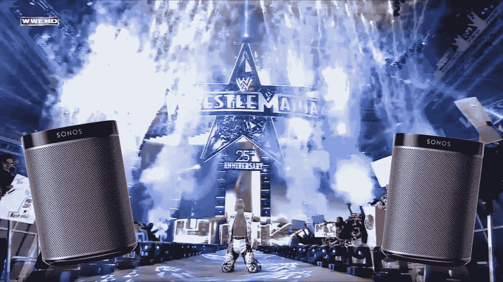

你好！您来到这里的目的可能只是想亲自尝试一下源代码，并不真正关心像这样冗长的戏剧性故事。

*如果你是这些人中的一员，请随意跳转到*[***CBRumblr repo***](https://github.com/ComboStudio/CBRumblr)*(用于前端)和*[***CBRumblrAPI repo***](https://github.com/ComboStudio/CBRumblrAPI)*(用于后端)开始。我喜欢认为这两者都是证据确凿的，但是* [***这里有一个让你开始的指南***](https://github.com/ComboStudio/CBRumblr/wiki/Setting-up-Rumblr) *。*

The Tea Building, Shoreditch, London. Where our story begins.

和大多数人一样，我们的故事从茶楼的二楼开始，在靠近入口处的一张小桌子旁，我们称之为 Combo HQ。

我们的小型创业工作室 [**Combo**](https://www.combostudio.co) ，最近承担了一个相当大的项目，让我们可以花一些时间探索信标。问题是，实际上[学习](https://hackernoon.com/tagged/learning)的来龙去脉简直是一种挑战。

我们得到了来自 [**Wayfindr**](https://www.wayfindr.net) 的优秀员工的大力支持，但我们想亲自动手。

我们想突破自己的极限。

我们想知道这些蓝牙坏男孩到底能做什么。

# 世界摔跤娱乐

I don’t even know who this is, but he must be a pretty big deal to have all that money spent on pyrotechnics for him

**还记得 WWE 吗？**

…老实说，我不知道。

嗯，反正不是特别好。我的“经验”完全来自玩 Playstation 游戏。回过头来看，我大概大部分时间都在做自己的自定义玩家和入口。

随着最近殡葬承办人的退休登上头条 ，我想起了联合会。

我手指发痒，扫视了一下工作室的地板。一盏灯塔笨拙地挂在工作室大门上。刺耳的音乐。

我受到了启发。

是时候重温旧时光了。

是时候成为我梦寐以求的摔跤手了。

# 这个计划

我抓起笔和纸，开始疯狂地涂鸦。不到一分钟后，我对我所设想的事情将如何运作有了一个大致的概念:

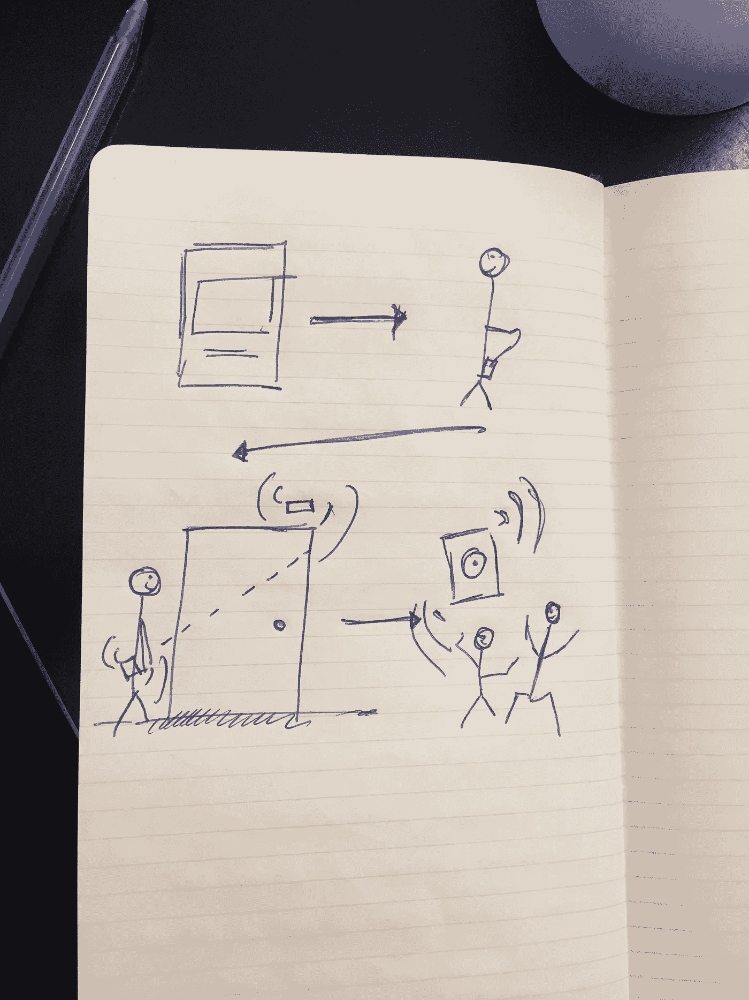

1.  用户(或*摔跤手*)可以使用应用程序选择他们的入场音乐。或者网页。或者某种好看的 UI。
2.  当用户在录音室入口的范围内时，应用程序会提示他们选择的曲目并开始播放。
3.  人们会回头。人们会张大嘴巴。用户可以伸缩(这是可选的)。

哼。似乎相当简单。

# Sonos:发现自己深陷 XML 有效载荷的喜悦

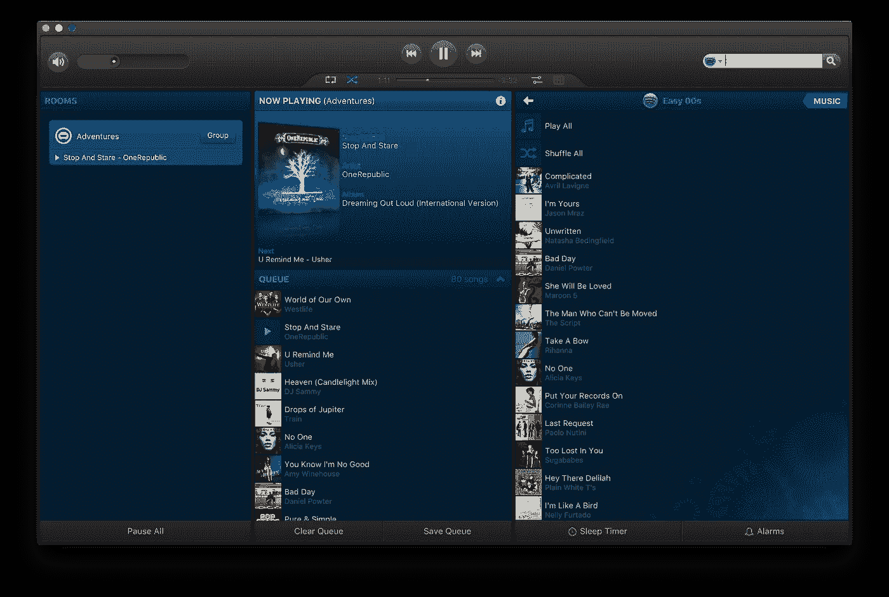

Some seriously huge tunes in that queue.

我很快就跨越了第一个障碍。我曾愚蠢地认为 Sonos 系统会有某种可访问的 API——但事实证明我大错特错了。

尽管如此，我不会被吓倒。我启动了 **Wireshark** ，一个小小的数据包嗅探显示，从 Mac 客户端发送的所有流量都被放在神秘的 XML 有效载荷中。

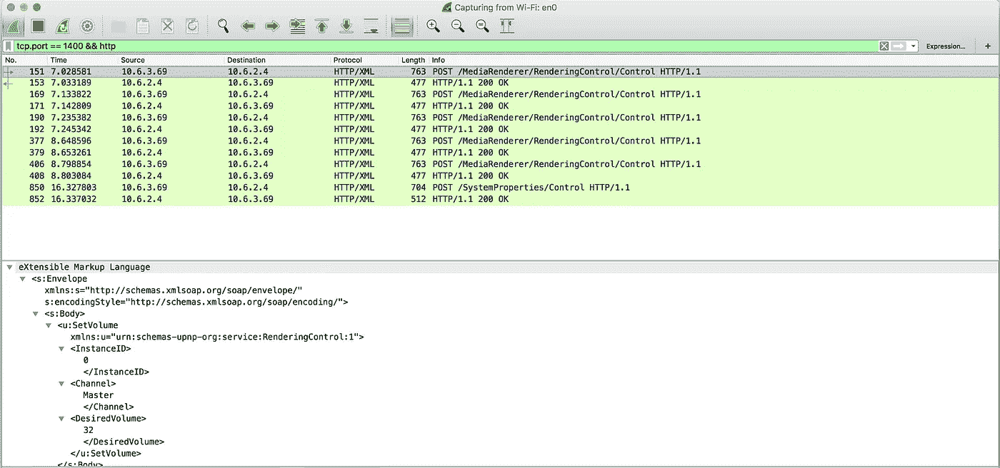

Huh.

令人欣慰的是，快速搜索在 GitHub 上找到了一个名为 [**sonos**](https://www.npmjs.com/package/sonos) 的优秀包，由令人愉快的 [**Ben Evans**](https://twitter.com/bencevans) 组装而成(干杯，Ben)。

就这样，我克隆了我的 ES6 样板，启动 Sublime，开始工作。

对图书馆文件的快速浏览帮助我把事情分解了一些:

1.  将 Spotify 曲目 ID 从客户端传递到服务器。
2.  在网络上找到 Sonos 实例。
3.  如果它可以找到一个，连接到它，并排队轨道。
4.  跳到下一首曲目。
5.  **玩！**

嗯，这看起来相当简单…

…然而，一旦我咬紧牙关，我最终在 **play** 方法上遇到了随机的 500 个错误，这些错误似乎来自 Sonos 响应本身。

在翻查过 [**无休无止的 GitHub 一期又一期**](https://github.com/bencevans/node-sonos/issues/142) 之后，偶尔会发出沮丧的咕哝声，我恍然大悟:

这只是一个小实验。时间相当短。

继续干吧。

我发现我可以将音轨添加到 Sonos 队列的*开始*处(位置 1)，跳转到那个位置，然后从那里开始播放，而不是在当前正在播放的东西之后播放。

我还发现我需要执行一个额外的步骤；**先选择队列**。如果队列不是活动的(例如，Sonos 正在播放一个广播电台)，我们需要切换到队列，然后才能添加我们的入场音乐。

哦，为了好玩，我加入了*另一个*额外步骤——在曲目开始播放前将音量调到 60%。🤙

**稍后快速修改代码:**

我设置了路线，发出了请求，然后就搞定了。

[**最后的倒计时**](https://www.youtube.com/watch?v=9jK-NcRmVcw) 在一个寒冷的周四下午，在茶馆的二楼胜利地响起。

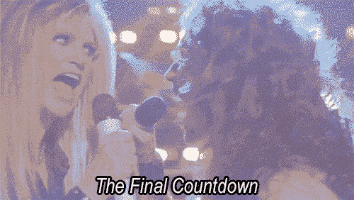

我胜利地举起双手，扫视了一下这一小群满脸不满的人，他们正伸手去拿耳机，并把它塞进耳垂里。

我决定将未来的胜利严格保密。

# 灯塔

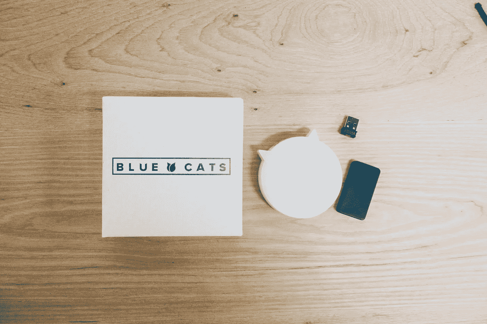

对于这个项目的客户端，我认为一个 iOS 应用程序最适合这个项目。

为什么？

嗯，Swift 是我们的面包和黄油，我们热衷于创建一个类，它可以被抽象并用于未来使用信标的应用程序。

首先，我拿了一包信标。我选择了蓝猫乐队，主要是因为阿克塞尔在《寻路者》**对他们大加赞赏，但也因为他们有杀手级的支持。(为了支持这一点，他们实际上把设备亲手送到了工作室，并亲自进行了演示，这太不可思议了)。**

*****趣闻:*** *我买了这些之后发现* [***我其实可以用另一部 iPhone 当“灯塔”***](http://blog.passkit.com/configure-iphone-ibeacon-transmitter/) *。诅咒我冲动的“加入篮子”扳机指。***

**买了信标，准备好服务器终端，我再次拿起我的鲜红色笔记本，开始为应用程序草拟一个粗略的行动计划。**

1.  **用户(摔跤手)启动应用程序**
2.  **注册预编程信标**
3.  **选择一首歌曲**
4.  **关闭应用程序**
5.  **用户(摔跤手)将手机放在口袋里**
6.  **走近门**
7.  ****用户(摔跤手)获得他们应得的 WWE 风格入口****

**根据我对信标的了解，这感觉很合理。**

# **在这种情况下，iBeacon API 最终不如预期的合理**

**事实证明，iBeacon API 给了你很大的自由来处理信标——但是我做了一个*噩梦*来浏览它们的文档。**

**对我来说，这份拷贝给人的感觉过于专业，甚至连一个简单的例子都很费力。**

**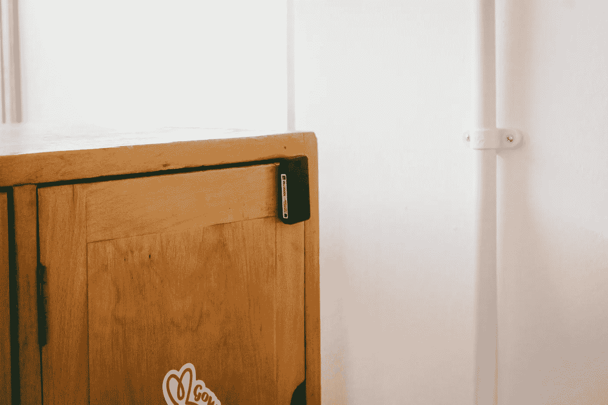**

**With overwhelming documentation, not even my strategic beacon placement could save me now.**

**尽管如此，我还是挺过来了。**

**我学到了很多东西，我不想在这篇文章中过多地谈论信标——所以如果你热衷于听我的学习，我已经在信标和 iOS [**上写了我所有的想法，就在这里**](/@Sam_Piggott/hacking-with-ibeacons-what-i-wish-id-known-475968f790f7) 。**

**不幸的是，另一个路障。**

**这一次，我意识到在后台触发服务器可能比我想象的要复杂。**

**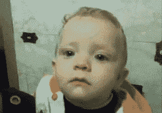**

**mfw making this discovery**

**虽然我可以在**dideterminestate**委托方法*(当在后台发现信标时触发)*中成功地发出一个 URL 请求，但我想只在我们就在门旁边时触发它，并测量信号强度(正如我一分钟前提到的大信标分解中所列举的那样)，您需要*测距*，而不是监视信标。**

**当然，要做到这一点，应用程序需要在前台。因此，我最终决定在前台进行信标扫描。**

**没什么大不了的。**

**感觉流程在技术上非常合理，是时候把一些设计放在一起了。我在大约 5 分钟内匆匆画了些草图…**

**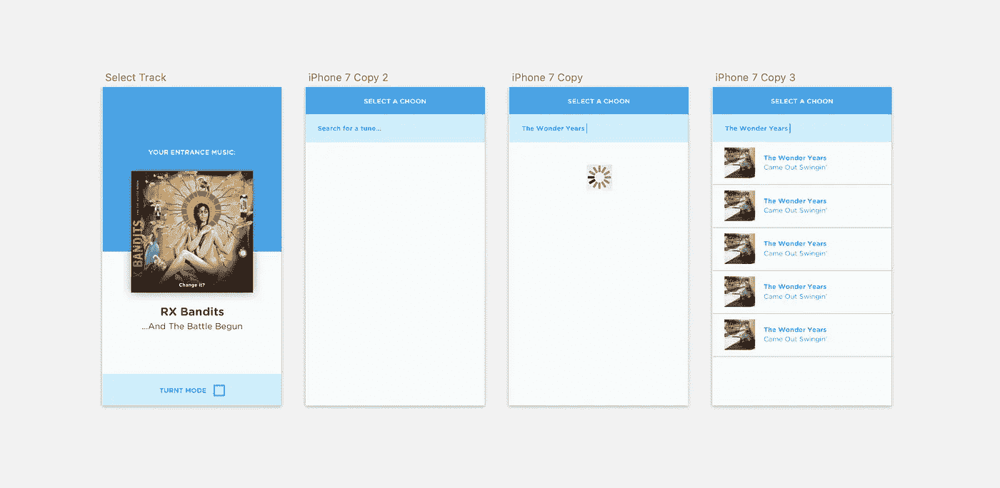**

**Whilst we’re here, if you’ve not listened to this RX Bandits tune, [you absolutely owe it to yourself to give it a try.](https://www.youtube.com/watch?v=Mq0j2Ot1NHo)**

**…然后得出结论说它看起来很可怕。**

**而是招了 [**柯蒂斯**](http://www.twitter.com/curtis_free) 的专家设计技能来替我拼凑。**

**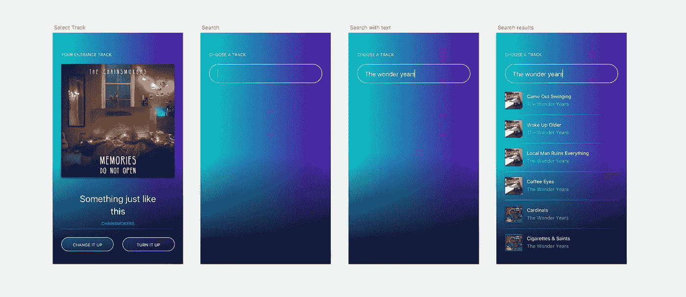**

**That gradient, tho.**

**啊。*好多了。***

**设计完成后，我将上面提到的逻辑整合到抽象的控制器中，深入研究了 VFL 和 UIView.animate()，让应用看起来焕然一新。**

**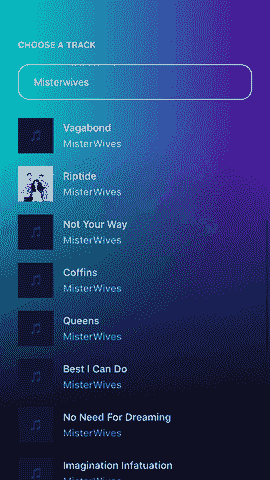**

***That transition tho.***

# **Spotify 集成**

**信标被分类。服务器已排序；我们就快到了。**

**我唯一没有解决的难题实际上是获取歌曲 id，我将把这些歌曲 id 推送到 Sonos。**

**值得庆幸的是，Spotify 的 Web API 使用起来绝对轻而易举，为了保持整洁，我想我会在服务器端完成所有 Spotify 解析和重新建模，以从交付给设备的有效负载中剔除脂肪。**

# **就这样…**

**我将 npm 运行产品推入终端。**

**我在 Xcode 上点击了 **Command+R** 。我饱受战争摧残的 iPhone 6 焕发了生机，启动了闪闪发光的“rumb lr”iOS 应用程序。**

**我们的第一位测试者，尊敬的 Marco Martignone 选择了 AC/DC 的《黑色归来》作为他的开场音乐。**

**当我们等待的时候，他从二楼的门消失了，我们的呼吸受到了诱惑…而且，嗯…**

**…只能说这个小片段比我能更好地讲述了这个故事。**

# **结束语**

**信标是 ***辉煌好玩的*** 。**

**是的，它们非常适合这样的玩具——但是真正让我们兴奋的是它的潜力。信标可以(也应该！)用在不可思议的情况下造福他人(就像前面提到的 [**Wayfindr**](http://www.wayfindr.net) )。**

**最后，将源代码“公开”对我们来说也是一件大事。**

**如果没有我们在 GitHub 上发现的一些开源 repos 的惊人帮助，我们所取得的许多知识都是不可能的，因此我们非常高兴通过在我们的 GitHub 上开源 [**前端**](https://github.com/ComboStudio/CBRumblr) 和 [**后端**](https://github.com/ComboStudio/CBRumblrAPI) 源代码来增加这些知识。**

**有了这个，我们希望通过加入我们在这个愚蠢的小项目中的学习，我们可以帮助将指针向前移动一点，看看灯塔的未来会是什么样子。**

**最重要的是，我们正在努力抽象我们从将这个小产品放入一个包装类中获得的知识，以使导航信标监控和测距的复杂水域变得更加容易。**

**开源并不是我们之前在 Combo 做过的事情，但它很令人兴奋——只要它能在某个地方帮助某个人；我们也渴望继续做下去。**

**我们也喜欢认为我们所做的可能会让某个沉闷的办公室里的某个人脸上露出笑容——所以请给我发一封电子邮件，告诉我们你是否已经使用了这个方法，并且从中得到了一些乐趣，地址是[**sam@combostudio.co**](mailto:sam@combostudio.co)**。****

************

> **[黑客中午](http://bit.ly/Hackernoon)是黑客如何开始他们的下午。我们是这个家庭的一员。我们现在[接受投稿](http://bit.ly/hackernoonsubmission)并乐意[讨论广告&赞助](mailto:partners@amipublications.com)机会。**
> 
> **如果你喜欢这个故事，我们推荐你阅读我们的[最新科技故事](http://bit.ly/hackernoonlatestt)和[趋势科技故事](https://hackernoon.com/trending)。直到下一次，不要把世界的现实想当然！**

****