# 我们如何通过影响力营销在 24 小时内获得 30 万用户，并在应用商店中排名第一

> 原文：<https://medium.com/hackernoon/how-we-got-300k-users-in-24-hours-and-reached-1-in-the-app-store-c997a8f83756>

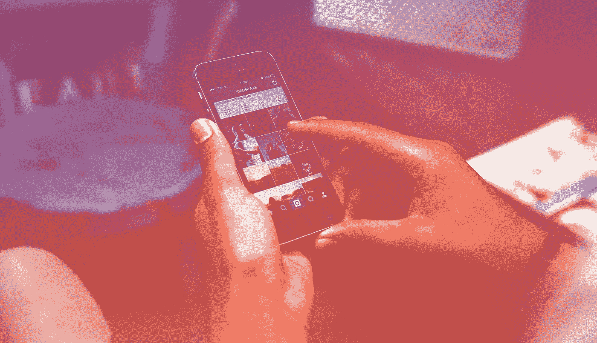

# 零阶段:简介

我们非常擅长构建病毒式的应用程序。在过去的 9 个月里，我们推出了 11 款应用，拥有**400 万用户**。无论如何，我们还没有掌握应用程序的艺术，但我们已经学到了很多，并决定将其付诸实践。

***我们想轰轰烈烈地结束 2016 年。*** 我们的目标是打造终极病毒应用，在[营销](https://hackernoon.com/tagged/marketing)上花费不到 2000 美元，然后看看会发生什么…

# 第一阶段:人口统计

在这个人人都自称为增长黑客的世界里，“病毒”这个词已经成为陈词滥调，失去了所有的意义。但是我们想做一些实际上是病毒式的东西。

策划任何病毒式活动的关键是逆向工程。看看你点燃火焰的渠道，无论是新闻渠道，社交媒体影响者，还是其他选择。考虑到这一来源的人口统计和人们最有可能分享这一内容的渠道(即口头传播、facebook 帖子、标记朋友)，假设随着分享呈指数级增长，这一人口统计将如何扩大(或*模糊*)。这个终端人口统计，或者我称之为最小粒度人口统计，是在病毒式分享发生后你的大规模受众。这就是你为之构思的人。

我也是 [**Coast9**](http://twitter.com/c9) 的创始人，这是一个有影响力的营销平台，专门为品牌提供可扩展的媒体购买解决方案。我们知道这是我们将花费 2000 美元营销预算的地方。所有 Coast9 影响者的观众总体上描绘了一幅相当准确的画面，描绘了我们的*最小粒度人口统计——***Z 世代** *:*

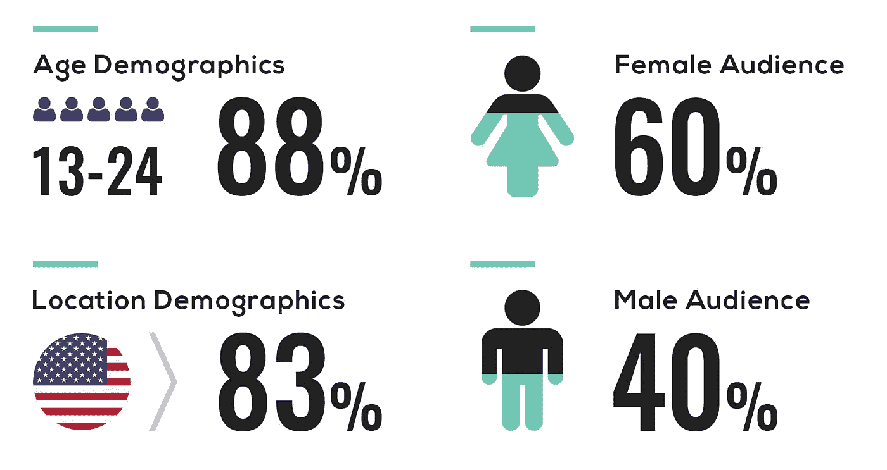

Copyright © Coast9 2016 — C9 Media Kit Material

# 第二阶段:想法

**社交媒体上应用病毒式传播的头号因素是社交证明**，所以这就是头脑风暴的开始。翻阅我的笔记本，我发现了去年这个时候我注意到的一个社会趋势:

凭借泰勒·斯威夫特、赛琳娜·戈麦斯、克里斯蒂亚诺·罗纳尔多和无数其他名人的帖子，2015 年 T2 最佳九人组 Matsumura Yusuke 获得了惊人的人气。所有这些帖子本质上都是来自有影响力的人的免费 T4 本土广告，他们通常会为一个赞助的帖子收取数十万美元。

搜索应用商店证明了对这个细分市场的竞争是可以轻易超越的，我的研究表明，在 2015 年底，2015bestnine.com 每天的浏览量超过了 100 万。无论如何，这是一个打包在应用程序中比打包在网站中更有意义的概念。**我们已经找到了获胜的想法。**

我们已经着手为 Z 一代构建终极病毒式应用程序，还有什么比利用现有的**社交媒体趋势更好的方法呢？这种趋势依赖于受影响者启发的周期性波动的社会证据而蓬勃发展。**

# 第三阶段:应用程序

我们最初想把这个应用叫做*九*。这是一个简单、时尚、有品牌的名字。也就是说，直到我们发现 Yusuke Matsumura 还开发了一个名为玖的产品，这是一个受 Tinder 启发的 Instagrammers 匹配应用程序。所以我们改名叫*九强*。

我花了两个小时整理了一些用户界面概念，并设计出了一个流畅的设计。然后，我们在 Swift 开发了该应用程序，几天后，我们在应用商店现场直播！和

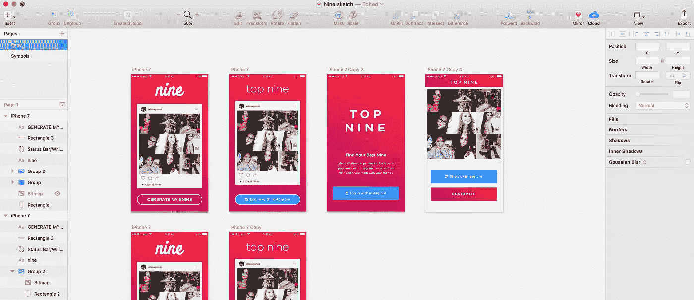

## 发展说明:

1.  最初，我们要求用户在应用程序中验证他们的 Instagram 帐户，以生成他们的前九名 *(* 参见上面的实体模型 *)* 。我们删除这个是为了减轻任何安全顾虑*。*事后看来，如果我们没有改变这一点，我们可能就不会成功。通过要求认证，我们将特别失去有机参与的超级用户。
2.  我们增加了一个*视频拼贴* *功能*作为奖励，但是回头看，那是浪费时间。这是一个不受欢迎的功能，而且会对我们的服务器造成很大的负担。

## 应用商店优化(ASO)

我不是 ASO 专家，但理解基础知识至关重要。ASO 主要有两个可控因素:您的**关键词**和**标题**。

**关键词:**添加关键词标签前一定要做*关键词研究*。有无数的付费工具可以帮助，但我通常只使用应用商店本身。

*   去应用商店搜索与你的领域相关的关键词。使用 App Store 的自动填充功能来确定搜索量并选择相关关键词。如果我在 App Store 里搜索‘最佳九’，可以提取 *top，Best，Nine，instagram，photos，2016* 作为重要关键词。

**标题:**始终确保你的标题中包含关键词。在您的应用程序名称后添加连字符或长破折号，以适应任何附加关键字。确保语言仍然流畅自然，否则你的应用程序可能会被拒绝。

*   我们最初的标题是“【Instagram 前九名——Pic 拼贴&视频制作人。”我们天真地认为我们可以排在“图片拼贴”和“视频制作”这两个极度饱和的细分市场。我们已经将我们的名字改为“【Instagram 的前九名——2016 年最佳”，希望在“最佳九名”中排名第一(目前排名第二)，并选择一些关键词，包括 2016 年。

# 第三阶段:推进

我们在这个项目上的主要财务限制是 2000 美元的最大营销预算。我们通过 [Coast9](http://twitter.com/c9) 只花了**1693.66**美元。出于测试目的，我们与一些 Twitter 影响者进行了一些不同的活动，但 Instagram 上的主要推动力是直接的。

我们付钱给有影响力的人，让他们把自己的前九名发布到 Instagram feed 和 story 上。我们要求他们在标题中提及“九大应用”:

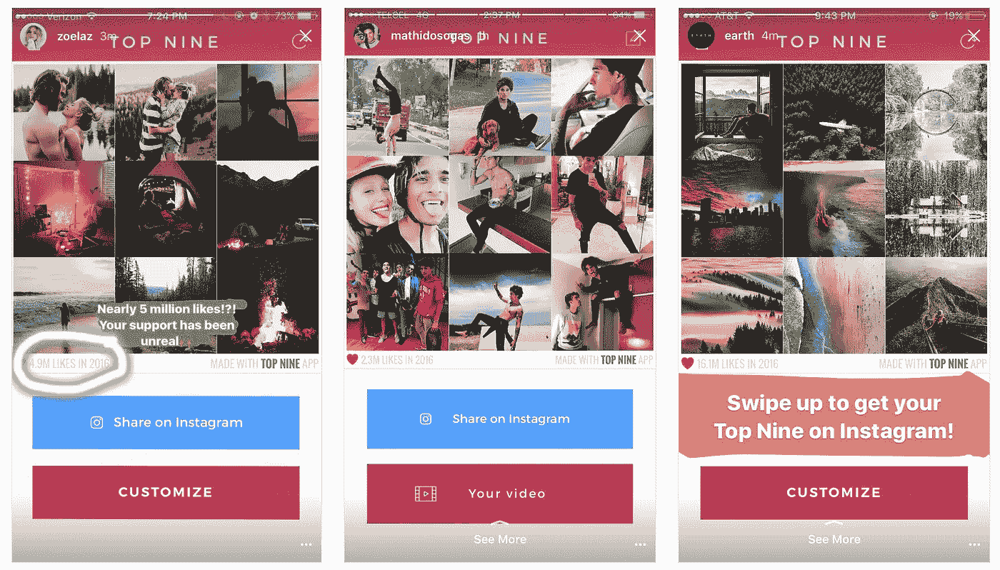

Verified influencers can add links to their Instagram stories. Followers simply follow instruction to swipe up to “See More” and they’re automatically redirected to the link — or in our case, the Top Nine app in the App Store

## 这是广告花费的结果:

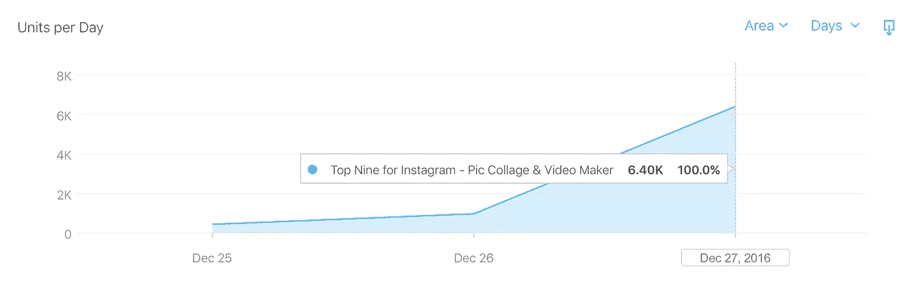

Units per Day = Number of users who installed Top Nine

## 有趣的信号。尽管第二天广告支出从近 1700 美元降至 0 美元，但新用户数量仍稳定在 6000 万左右:

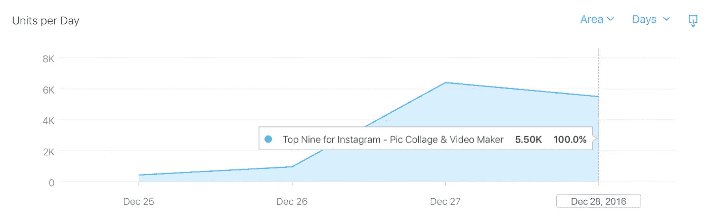

## 然后事情变得令人兴奋…

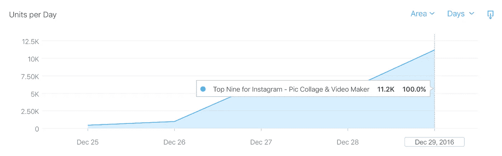

## 然后轰隆隆地响了起来…

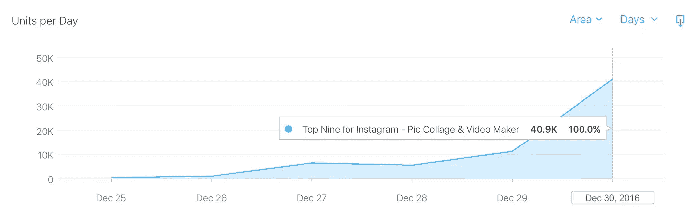

# 第四阶段:浪潮

NYE 的早晨，我们点击了免费应用中的**趋势搜索**和 **#150:**

下午，*‘最佳九人’*、*‘insta gram 最佳九人’*也上了热门搜索。我们一直在排名中上升，直到午夜过后不久，我们在美国排行榜上占据了第 **#9** 的最终位置。我们甚至到达了瑞典、芬兰和拉脱维亚。

## 发生了什么事？前九名爆炸了。

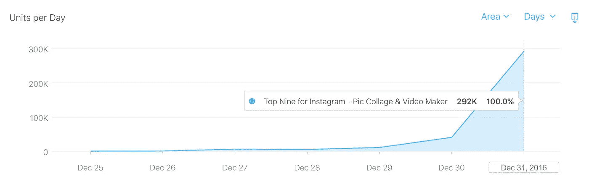

On NYE, Top Nine hit trending search, #9 overall on the US charts, and #1 overall in Latvia, Finland, and Sweden.

## 我们最初的 6400 名用户在 5 天内变成了 356000 名📈

# 为什么我们会火起来？

借助社交媒体和我们的病毒钩的联合力量，我们已经将自己带入了一个指数曲线。

像病毒一样传播就像玩马里奥赛车。还记得增速器吗？如果你没有开过足够多的车，你就没有足够的动力去赢得比赛。病毒式传播也有速度助推器，如果你没有达到足够的速度，你就不会有启动指数增长所需的动力。

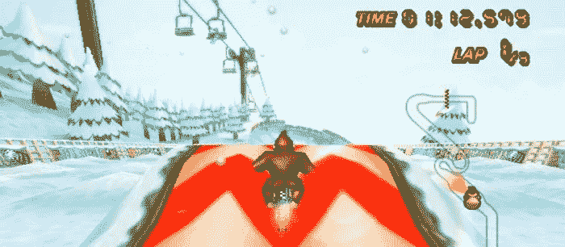

我把这些速度加速器叫做*。病毒钩将人们拉进 ***病毒环*** ，病毒环创造了更多的钩，将更多的人拉进这个环，以指数方式持续下去。*

## *我们的病毒挂钩是什么？*

1.  *Instagram 用户分享的前九个帖子——最初是通过我们的 [Coast9](http://twitter.com/c9) 活动获得的用户。*
2.  *用三个关键词点击趋势搜索。*
3.  *在应用商店排行榜中的排名。*
4.  *超级用户或名人的有机股票。*

*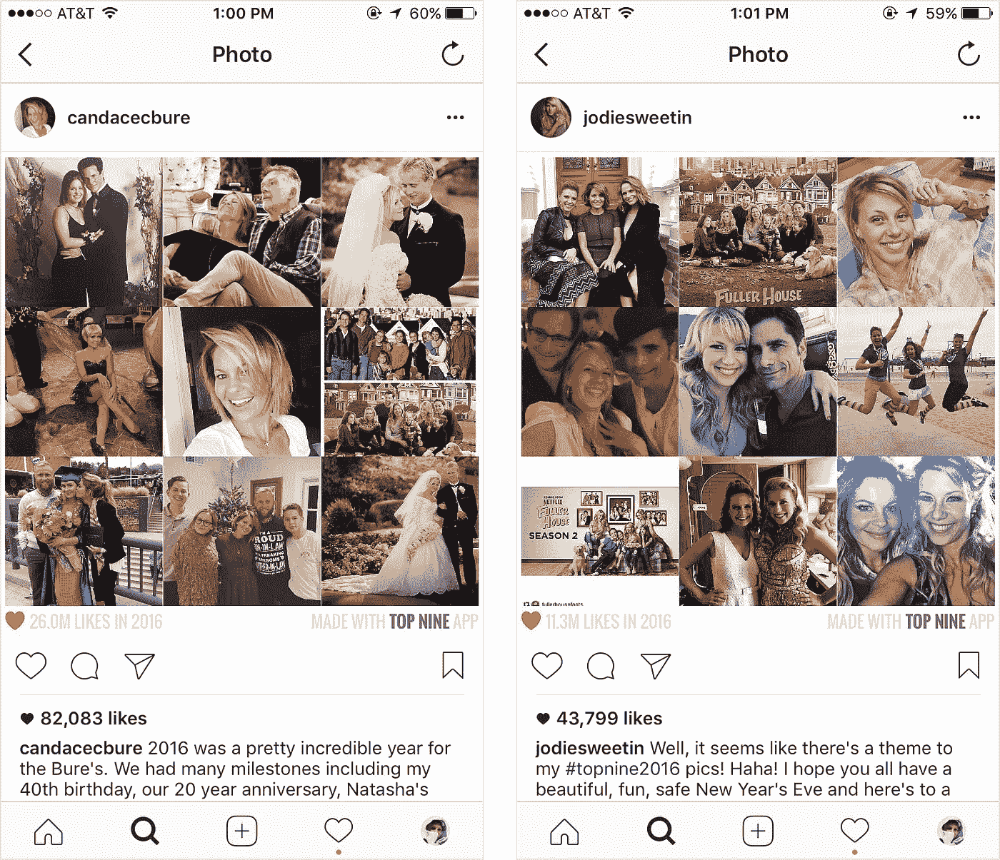*

*Organic Top Nine posts made by Candace Bure and Jodie Sweetin from the show Full House.*

*我们的**第一个挂钩**是*实际上是*一个挂钩的原因是因为我们在帖子上加盖了用 Top 9 App 制作的*。没有这一点，帖子就不会把用户拉进来，因为这种趋势和我们的应用程序之间没有任何关联。**

*我们还决定显示用户在 2016 年所有照片中获得的赞总数，而竞争对手只显示用户在他们的前九张照片上获得的赞总数。通过向用户显示所有照片的总数，我们能够提高他们的自我意识，增加他们分享他们最喜欢的九张照片的可能性。*

# *最后的话*

*我们想轰轰烈烈地结束 2016 年。 我们的目标是打造终极病毒式应用，在营销上花费不到 2000 美元……我们做到了！*

*我想不出更好的方式来结束 2016 年，并进入新的一年。*

# *感谢阅读！如果你喜欢这篇文章，请点击下面的*心形*，并随意发表评论。*

## *想了解更多关于 Coast9 的信息吗？通过[推特](http://twitter.com/9th)或[电子邮件](mailto:andy@coast9.com)联系我。*

**大声喊出来给我在 Beta Labs 的伙伴们，*[*Kevin Natanzon*](https://twitter.com/kevntz)*[*Charly Vega*](https://www.linkedin.com/in/carlosvegameyer)*！非常感谢*[*Tiffany Zhong*](https://twitter.com/tzhongg)*帮助编辑我的第一篇中帖。***

** [## 安迪(@ 9 号)|推特

### 安迪的最新推文(@ 9 号)。21.在纽约创造事物。@地球的馆长。@c9 创始人。测试实验室的创始人…

twitter.com](https://twitter.com/9th) 

> [黑客中午](http://bit.ly/Hackernoon)是黑客如何开始他们的下午。我们是 [@AMI](http://bit.ly/atAMIatAMI) 家庭的一员。我们现在[接受投稿](http://bit.ly/hackernoonsubmission)，并乐意[讨论广告&赞助](mailto:partners@amipublications.com)机会。
> 
> 如果你喜欢这个故事，我们推荐你阅读我们的[最新科技故事](http://bit.ly/hackernoonlatestt)和[趋势科技故事](https://hackernoon.com/trending)。直到下一次，不要把世界的现实想当然！

**