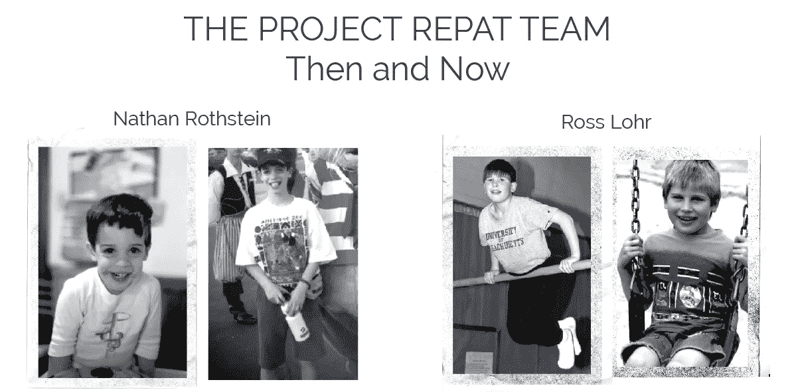
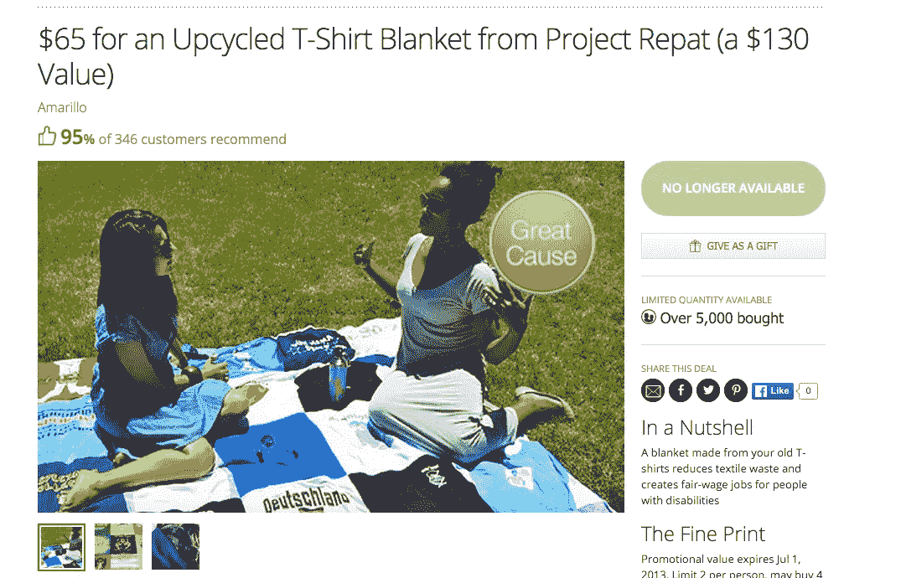
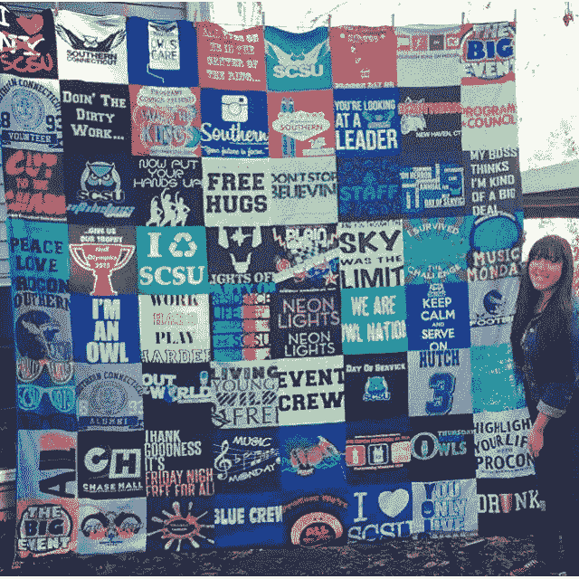
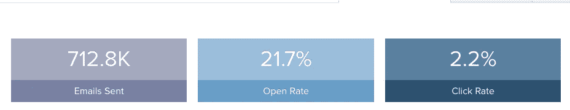

# 我们如何在 2015 年实现 400 万美元的销售额

> 原文：<https://medium.com/hackernoon/how-we-got-to-4million-in-sales-in-2015-e3792692b858>

经营企业没有正确的方法。有成千上万本关于营销、销售和人事管理的书籍的原因之一是，我们都指望企业家群体找出如何改进的方法。虽然从错误中学习是有帮助的，但是反思什么是有效的也是重要和有用的。

以下是我们如何在 2015 年实现 400 万美元销售额的[项目 Repat](http://projectrepat.com)——仅用了整整三年的时间。

*(罗斯·洛尔编辑——我们的生意能够运转的唯一方式)*

Before we became t-shirt quilt salesman

**与闪购分手**

每个电子商务企业都有一个周期性的组成部分。圣诞节让人们购物更多，而销售额在一月份可能会突然下降。自 2013 年以来，我们在 1 月和 2 月安排了一次闪购，这有助于我们保持业务。在假日季节(第四季度),我们的生产合作伙伴增加了，他们的每周产量也增加了，但在新年，人们购物减少了。闪电销售有助于保持生产合作伙伴的活力，但似乎没有办法维持与假期相同的水平。2015 年 2 月，我们回到 Living Social，跑了一个月的交易，卖了 5000 左右的代金券。这很好，但不是游戏规则的改变者。相比之下，我们在 2014 年夏天卖出了 14，000 张代金券。看来我们已经挖掘出了闪购。

Our groupon from Jan 2013

近年来，有一种普遍的购物趋势，即购物者远离 Groupon、Living Social、Fab 和 Gilt Groupe 等日常交易网站，以不同的方式购物。虽然闪购在金融危机后的几年里非常成功，但亚马逊 prime 已经改变了顾客在线购物的方式。当我们在 2015 年 2 月进行最后一次闪购时，我们注意到客户一直在等待第二次闪购，而不是直接从我们的网站购买。这违背了使用闪购作为客户获取工具的目的，因为他们的费用如此之高。当我们第一次推出我们的公司时，收支平衡并使用 Living Social 作为发现工具是有意义的，但前提是人们直接从我们的网站进行第二次购买。当我们问 Livingsocial 他们能否给我们新客户和回头客的数据时，他们告诉我们他们不能。

我们不仅看到了交易成功率的下降，而且我们无法准确判断哪些客户是第一次发现我们，而不是使用闪购网站而不是我们自己的网站进行第二次购买。这是一个主要问题，当 Living Social 要求做另一笔交易时，我们拒绝了。虽然 flash 销售是一家新兴公司获取客户的绝佳工具，但为了进一步发展我们的业务，我们不得不放弃 flash 销售。放弃你最大的获取方法是很艰难的，但是我们不得不放下拐杖独自行走，这样我们才能向前冲刺。

**脸书广告。代理与内部。**

98% of our facebook content is user generated

没有闪购，我们去哪里寻找新客户？谷歌不允许我们去追逐“蓝海市场”——那些符合我们客户特征的客户，但不一定知道他们是我们的客户。只有一小部分美国人在谷歌上搜索“t 恤被子”，花在更普通的搜索词(如“毕业礼物”)上的广告没有给我们带来好的回报。电子邮件营销运作得非常好，但是只有 10-15%的名单打开了电子邮件，只有不到 1%的收件人购买了电子邮件，唯一的增长方式就是扩大我们的名单。

2014 年，我们开始尝试在 F [acebook](http://facebook.com/projectrepat) 上增加帖子，并注意到带有少量赠品的帖子表现非常好。我们写道，“在下面的评论区提到某人，他有太多的 t 恤来赢得免费的 t 恤被子。”这给了人们分享帖子的动力，所有的评论给了我们更多的有机流量。如果一个帖子开始做得很好，这意味着在 30 分钟内有几十条评论，我们会通过在广告背后投入资金来推动它。

这是脸书在辅助轮上的广告，但是当我们还在骑三轮车的时候，脸书的广告仪表板就已经认可了。在我们的广告支出结束后，我们获得了更多有趣的数据，并尝试了一个名为 Sprucemail 的第三方营销平台。这是一个软件即服务(SaaS)，让我们能够将我们的电子邮件列表纳入我们的脸书广告。我们可以重新定位我们自己的[脸书](http://facebook.com/projectrepat)名单，然后使用脸书社交图来确定我们的目标客户，以扩大我们的名单。他们的说法是，你的邮件列表中只有一小部分人会打开你的邮件，但更多人会更频繁地查看脸书。如果我们发起一个电子邮件活动，Sprucemail 会在脸书上找到我们的电子邮件订户，并向他们展示广告。

我们试用了 Sprucemail，发现我们的销售额激增。我们认为，如果我们聘请了这方面的“专家”——或者至少是我们认为是专家的人——我们就可以投放更好的广告，从而提高我们的投资回报率。我们取消了 Sprucemail，并向代理商支付了我们在脸书总支出的一定比例。我们希望有大量的“新点击”——或新的流量进入我们的网站——然后在重新瞄准这些新点击时有很高的转化率。该机构告诉我们，他们可以做得比别人好得多，我们试图自己做只是浪费时间。

每天他们都会花几个小时来微调每一个脸书广告，试图向我们展示他们的系统有多有效，我们总是会听到几天后，这个系统会工作得更好。他们请来了搜索引擎优化和脸书广告专家，并不断改变和修改广告，但我们没有看到同样的网络流量。我们希望扩大受众，更关心广撒网，而不是尽可能降低每次收购的成本(CPA)。这就是引进顾问的问题所在。他们太关心如何尽可能有效地使用我们的钱来显示最低的 CPA，以至于他们没有关注我们希望他们做的事情——尽可能地增加网络流量。他们知道我们是根据销售额和支出来衡量他们的，他们担心如果他们在新流量上花了很多钱，却没有看到销售额的立即增长，我们就看不到他们的价值。

与我们合作的机构并没有什么特别的问题——更多的是模型的问题。脸书广告平台旨在尽可能简单易用。他们希望没有大量营销预算的小企业花更多的钱使用脸书，而不是花钱聘请顾问，然后顾问再花这笔钱。如果你必须为投放广告*和*付费，你在广告上的花费会更少。因此，脸书创造了一个非常简单的广告平台产品。这对脸书和使用它的小企业来说是好事，但对行业顾问来说却是坏事。一旦我们发现我们可以在没有广告代理的情况下运行我们想要的广告，我们就可以投入更多的资金。

我们希望尽可能多的在线访问者的原因是，我们知道更多的流量来到我们的网站意味着更多的人看到我们的重定向广告。这些广告是人们点击我们的网站后会在他们的新闻订阅中看到的。回到我们的网站就像轻轻一推。他们在考虑产品，但也许他们只是需要一张优惠券来实际购买。

当代理商看到我们的月销售额仅仅依靠脸书广告并没有显著增加时，他们增加了一个积极的电子邮件活动。我们一直是经常发电子邮件的人——我们知道我们有一个人们觉得有用的产品，也许只是需要更多的提醒来购买。该机构为促进我们的销售所做的最伟大的事情是展示了月末多封电子邮件弹幕的有效性，使我们的月销售额从 20 万美元增加到 27.5 万美元。5 月的最后几天，我们开始每天赚取 2 万美元的收入，并且有一个到期日。它模仿了闪购的运作方式——有折扣代码的时间限制，效果非常好。这不是火箭科学，只是基本的电子商务营销，而且非常有效。

**专注于电子邮件营销**

Our Klaviyo dashboard. We sent a lot of emails!

在 2015 年上半年，我们看到了脸书作为广告平台的力量。我们付钱来锁定我们的客户，脸书会把愿意购买或注册的访问者带到我们的电子邮件名单上。没有什么比这更有效的了。我们尝试了 adroll、pinterest、reddit、twitter 和其他网站上的横幅广告，但没有什么能像脸书一样带来流量。

今年第一季度，我们通过弹出窗口询问您的电子邮件，收集了大约 10，000 封新邮件。如果你在我们的网站上停留几秒钟，就会出现一个弹出窗口。这是一个标准的做法，但是直到我们实现了一个退出弹出窗口，我们才看到我们的列表急剧扩大。

退出弹出窗口的工作方式类似于常规弹出窗口，但是它不会出现，直到有人将鼠标悬停在我们的站点上点击退出。在最后一刻，客户会在离开前看到节省 20%的优惠。截至 5 月底，我们仅在一个月内就收集了近 10，000 封电子邮件，我们开始注意到一种模式。如果我们每天向脸书支出投入几千美元，我们每天会收到 300-600 封新邮件。其中一些人会立即购买，但我们的大多数新订户在购买前需要 5-10 封电子邮件。这是在 facebook 上重新锁定他们，并通过电子邮件频繁提醒他们的组合。再说一次，这不是大规模的商业合作，而是简单而有效的营销。

在我们业务的早期使用的快速销售使我们沉迷于 10 万美元的巨大销售日，但我们的新公式开始导致许多天获得 2-3 万美元的收入，当我们发出一封带有截止日期和优惠券代码的电子邮件时。这不是最耀眼的营销努力，但它奏效了。我们能够将公式归结为:(脸书花费)+(退出弹出菜单)+ ( [klaviyo](http://klaviyo.com) 分段电子邮件营销)= 11 月份 70 万美元，12 月份 30 万美元——导致假日期间销售额达到 100 万美元，实现了去年假日销售额翻一番的目标。我们已经找到了如何增加网站流量和获取电子邮件的方法，这带来了更多的销售。更重要的是，通过与我们一起购物，我们的顾客今年回收了 100 多万件 t 恤，并在美国创造了近 50 个就业岗位。

> [黑客中午](http://bit.ly/Hackernoon)是黑客如何开始他们的下午。我们是 [@AMI](http://bit.ly/atAMIatAMI) 家庭的一员。我们现在[接受投稿](http://bit.ly/hackernoonsubmission)并乐意[讨论广告&赞助](mailto:partners@amipublications.com)机会。
> 
> 如果你喜欢这个故事，我们推荐你阅读我们的[最新科技故事](http://bit.ly/hackernoonlatestt)和[趋势科技故事](https://hackernoon.com/trending)。直到下一次，不要把世界的现实想当然！

