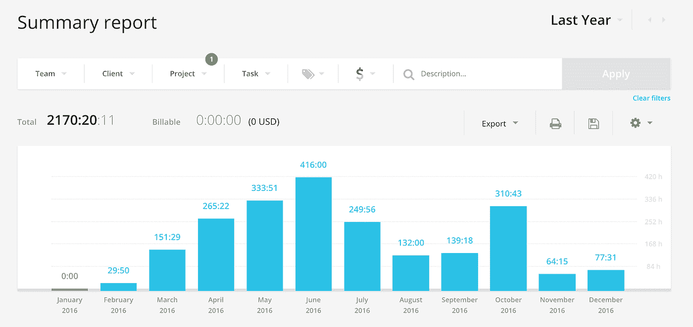
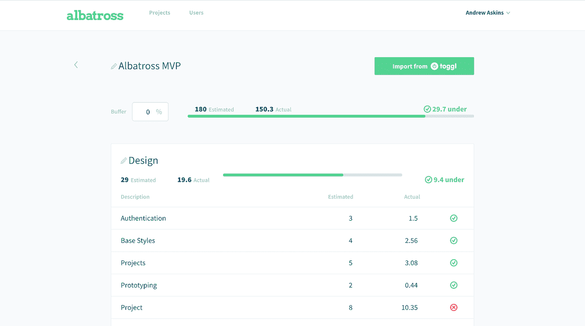
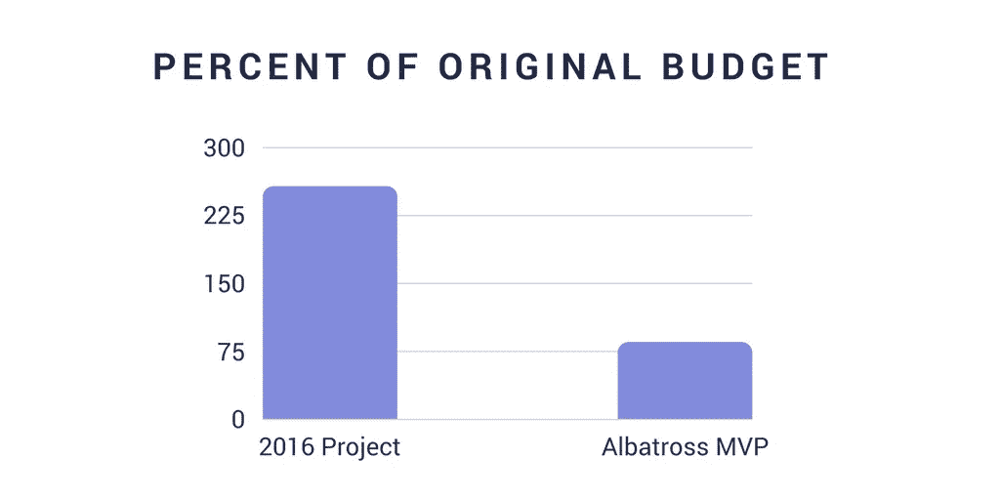
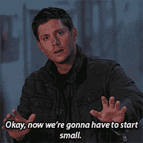
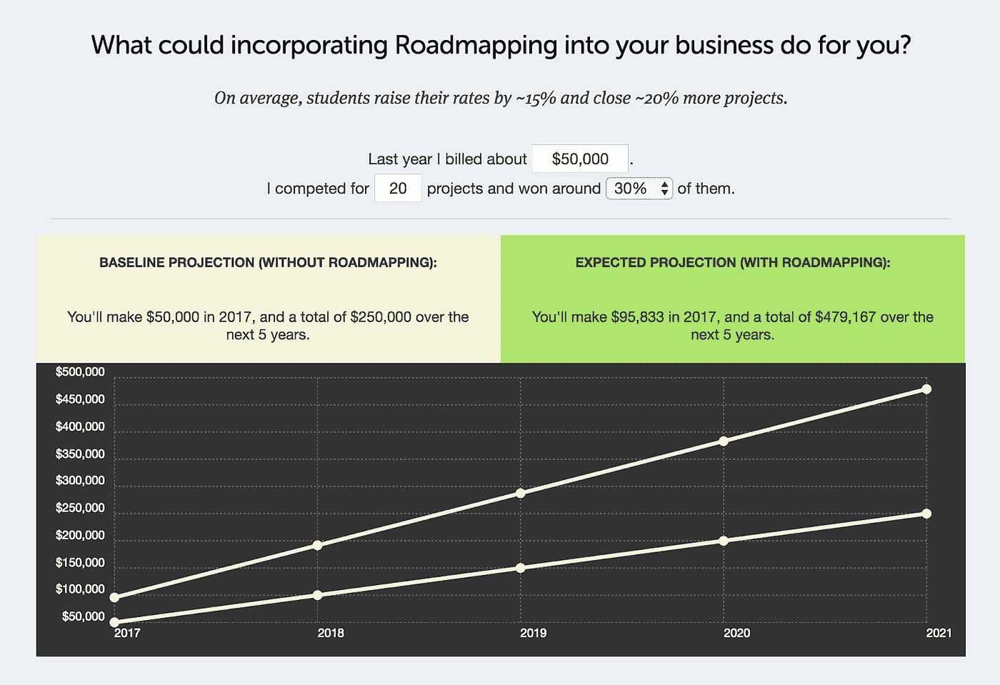
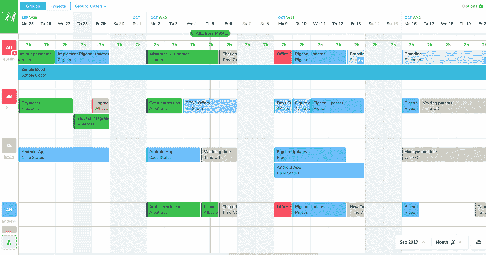
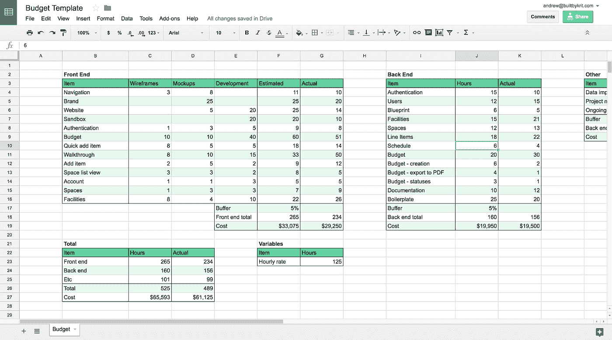

# 我们如何将工程估算提高 1082%

> 原文：<https://medium.com/hackernoon/how-we-improved-our-engineering-estimates-by-1082-4f31d3063a28>

## 不，那不是印刷错误

恐惧和压力令人心痛。我想不出别的，这是所有的消费。没有办法放松，让我忘记它。

我说服了我的一个好朋友和他的新未婚夫搬到查尔斯顿，这样他就可以为我们工作了。我们几个月前才搬到那里，在这个过程中增加了我们的开支。而且公司的钱快要用完了。

情况变得如此糟糕，以至于我们在办公室的白板上倒数剩下的日子。**这个数字日复一日地不断下降，直到最后，我们还剩 20 天就完全没有现金了。**

我想知道我微薄的积蓄能给我们买多少跑道。开立信用额度合理吗？去借债来维持生意？我要告诉大家什么？

我们以前失败过一次，但我们通过成为一家开发店让公司活了下来。**这将是真正的失败。**这将意味着我们投入数千小时的业务将面临死亡。

# 事情怎么会发展到这一步？

有许多引导我们到我们现在的位置。首先，我们陷入了一个典型的陷阱，即只关注工作，而不关注业务推广。我们都是技术型创始人，所以很容易被技术迷住而忽略了业务。

**但是最大的问题？我们的估计有多不准确。那年早些时候，我们接手了有史以来最大的两个项目。我们的上一个项目已经进行了几个星期，所以我们决定把它们都作为固定投标项目。**

这次我们的估计不仅仅是有点偏差。两者相差超过 100%。换句话说，我们在两个项目上都*大大*少收了费用。

我们估计的更大的项目需要 842 个小时，这是我们当时接手的最大的项目。最后的记录是 2170 小时。这比预算超出了 157%,也就是最初预算的 257%。

Our hours from Toggl

几乎要了我们命的项目最终救了我们。虽然我们已经超过了时间表，但我们的客户仍然对这项工作感到兴奋。他想投资一个新的大型功能集。这给了我们度过年底所需的生命线。

我们发誓再也不会陷入那种境地了。在过去的 6 个月里，我们一直致力于改进我们的评估流程。我们一直在尝试不同的方法，调整和测试我们能做的一切。

**结果呢？我们最新的项目在 30 小时内完成，占预算的 14.5%。**

Our estimated hours vs our actual hours for building the [Albatross](https://getalbatross.com?src=medium) MVP. Shown in Albatross. Meta.

**准确率提高 1，082.76%。**换句话说，我们的估计准确度提高了 10 倍。这是一个很小的样本量，但趋势正在朝着正确的方向发展。

> **5 种创建更精确工程估算的方法**

# **1 .从小处开始**

坐下。我将要告诉你的将会令人瞠目结舌…

**较小的项目更容易估算。**

不仅较小的项目更容易评估，而且**当你着手一个小项目时，其数量会更少。**

令人震惊，我知道。我们为创建更好的估计而采取的第一步是从更小的开始。

这并不意味着客户必须放弃他们宏大的愿景。这只是意味着我们将项目分解成尽可能小的部分，专注于更快的交付。

这是精益创业和敏捷开发的经典格言。这不仅有利于您的估计，也有利于您的业务。

**我们不再承担 2000 小时的项目了。**我们仍然接受相同的客户，但我们帮助他们找到如何缩小初始范围的方法。

我们最初对[信天翁 MVP](https://getalbatross.com?src=medium) 的估计是 180 小时。之前的项目是 380 小时。**我们在这个部门还有工作要做，但是从小处着手是最容易做出更准确估计的方法之一。**

# **2 .发现/范围界定流程负责人**

很长一段时间以来，我一直在考虑以某种方式对发现和范围界定过程收费。然后，在 2016 年 12 月，我参加了布伦南·邓恩(Brennan Dunn)的《路线图》T18 课程，最终我被说服改变我的方式。

**对范围界定项目收费是一个微妙的转变，但也是一个强大的转变。**这有助于剔除不太想和你合作的客户，让你成为一名时间宝贵的专家。

对我们来说，它也改变了我们对创建估算的想法。之前，我们会匆忙完成估算。现在，我们可以慢慢来。我们仍然少收这些课程的费用，因为它们更多的是一种销售工具。但是现在，我们可以证明花足够的时间来做出准确的估计是合理的。

**我们从在几个小时内创建评估，到花费 20 多个小时进行评估。**我们现在还将客户纳入范围界定过程，这意味着他们可以控制预算，而且在我们开始之前，我们都非常清楚范围。

我们首先花时间去了解客户、他们的业务和他们的目标。然后，我们与客户一起确定项目范围。我们列出了他们可能想要的每一项功能，然后我们开始将功能抽离出来，并与他们一起研究如何从小处着手。

几天后，我们的团队将绘制接口草图，并绘制高级 API 架构。经历这个过程可以确保前端和后端在同一个页面上。

有时候，设计中有一个特性我们需要估计更多的时间。如果不勾画出我们的想法，就不可能为此做计划。后端也一样。

你可以在这里阅读更多关于这个过程的发现部分。

T **他这里的外卖是你抓紧时间做的估计没错**。如果你实际上没有考虑所有相关的元素，你怎么可能希望准确呢？

# **3。建立问责制**

为了让你的估计更准确，你还必须在项目期间努力坚持下去。

以前，很难判断我们何时落后。这使得寻求帮助变得困难，项目也很容易偏离轨道。我们试图通过多种方式增加更多的责任来解决这个问题。

## *更详细的时间表和更短的里程碑*

我们已经开始使用[团队周](https://teamweek.com/)来跨项目安排我们所有的时间。

我们设定每周或每两周一次的里程碑。**当你的里程碑是“iPhone 应用”时，很难知道你已经偏离了轨道，直到为时已晚。团队的其他人也很难知道你在哪里。**

我们一直在努力设定更好的里程碑，改进我们的日程安排。这是我们团队周现在的样子:

*Note: Simple Booth is a maintenance project. We fix bugs as they come in. Milestones are overkill for that project.*

## *每日和每周站立*

我们已经实施了每日和每周站立练习。嗯……大部分是。我们仍然不擅长做每周站立，有时会错过每天的站立。

如果你需要的话，每日站立练习给你一个寻求帮助的机会，并为每个人建立责任感。每周站立是一个好方法，可以确保你在更高的水平上，调整你的未来计划，并看看你需要调整哪些流程。

我们在 4 点钟做倒立，因为我们都在不同的时间到达，我们喜欢这种灵活性。最近，我们发现在 slack 中写它们是很好的。它给了你一个回头看其他人在做什么的地方。

## *将你在项目中的实际时间与你的预计时间进行比较*

自从[咨询](https://hackernoon.com/tagged/consulting)以来，我们一直用 [Toggl](https://toggl.com/) 追踪我们的时间。但是在很长一段时间里，我们的时间条目没有组织。这意味着**我们可以看到我们的总时间，但是我们不知道我们是否在某些方面落后了。**

这也使得我们很难在项目结束时回头看看我们的估计在哪里(稍后会有更多的介绍)。

我们并不真正了解项目的进展情况。

这必须改变。

我们开始根据我们分解估算的方式来跟踪我们的时间。如果我们估计身份验证的后端时间，我们将在 Toggl 中使用一个后端标记，并为条目提供身份验证的描述。

然后，我们在 Google Sheets 中创建了一个电子表格。在这个电子表格中，我们添加了带有估计小时数的估计行项目。在每个周末，我们从 Toggl 中取出我们的时间，并将它们添加到一个实际的列中。

这被证明是丢失的部分。第一次，我们还是有点超出预算，但提前两周完成了项目。

把我们所有的时间加起来还是很笨拙，但是我们的洞察力就像白天和黑夜一样。它非常强大。

该电子表格看起来是这样的:

> 你可以在这里找到一份[副本](https://docs.google.com/spreadsheets/d/1OQjiHEbahS1UM_Fgnt5gXevZHTTtP2FqjNATjSYl610/edit?usp=sharing)。将其复制到您的驱动器，并在您的下一个项目中使用。

# **4。持续警惕范围蔓延**

**范围蠕变是任何地方工程团队的敌人。范围蔓延将保证你的估计是错误的，所以你必须不断地与之斗争。没有任何一个解决范围蔓延的方法，但是这些技巧帮助了我们:**

## *范围界定会议*

我们之前谈到的范围界定会议有助于确保我们与客户保持一致。如果你是一个内部团队，这意味着让所有利益相关者参与到范围界定过程中。

## *跟踪实际工时与预计工时*

我们新的跟踪流程使发现范围蔓延变得更加容易。我们只是根据我们的估计来跟踪时间。如果它不适合那些桶中的一个，它就是范围蔓延。

## *定期与客户沟通*

如果你让你的客户参与到设计过程中，当事情超出范围时，就更容易指出来。然后你可以和他们讨论是否值得扩大范围。如果他们决定是这样，那么他们就不应该对估价的增加感到惊讶。

Don’t do the creep. It’s not a good look.

我们在这里写了更多关于这个[的内容。](https://builtbykrit.com/blog/avoiding-the-creep-how-to-keep-scope-creep-out-of-your-projects)

# **5。回顾**

回顾是一个强大的工具，但是很多团队都忘记花时间去做。这让你有机会和你的团队一起检查，看看他们对这个项目的感觉，以及看看数据，看看什么是对的，什么是错的。

**俗话说，“不学历史的人注定要重蹈覆辙。”**作为一个团队，你需要了解自己的历史，并注重从中学习。

> "那些不记得过去的人注定要重蹈覆辙。"乔治·桑塔那亚

我们改编了**咳*偷*咳** [这个模板](https://docs.google.com/document/d/1V3M5ZuEaGAQdv6GzMVRjjtzwkeHwuXz1qtC_Z0Diqyo/edit?usp=sharing)用于从我们不可思议的项目经理朋友 [Laura Bosco](https://twitter.com/lauraebosco) 和她的团队在[靶场](http://ran.ge/)举行回顾会。

确保在回顾过程中做好笔记。当你创建下一个评估时，参考这些笔记。

使用第 4 点中的电子表格，在回顾中获得更详细的数据视图。

当你做评估时，最后一个建议是:永远要有一个缓冲。你是人，有些事情你会想念的。

这个缓冲用什么做，众说纷纭。我们通常会增加 10%，但许多商店会将他们的估计值乘以 1.5 或 2。坚持 10%,如果范围定义明确，你熟悉技术，并且你对自己对抗范围蔓延的能力有信心。否则，尝试使用更大的缓冲区。

这里的关键词是实验，你应该使用回顾来回顾为什么你的估计是错的，并努力减少你需要的缓冲。

**外卖**

*   从小处着手——较小的项目更容易评估。
*   在您的发现和范围界定过程中花费足够的时间。确保你确实很好地掌握了你所估计的。如果你是这方面的代理人。
*   在你的团队中建立责任感，这样你在开始后就能坚持你的估计。通过更短的里程碑、定期会议和更好地处理你的数据来做到这一点。
*   您必须时刻警惕范围蔓延！永远不要停止为正义而战。
*   举行回顾会。花点时间记下你在一个项目中学到了什么，并确保你的整个团队都有机会消化它。
*   包括一个缓冲——我们通常做 10%。

我们正在开发一个工具来帮助您创建更准确的工程估算。**用** [**信天翁**](https://getalbatross.com?src=medium) **提高你的利润，重新掌控你的时间。**

MVP 是我们过去使用的时间跟踪电子表格的超级强大版本。随着它的发展，我们将做更多的工作来帮助您利用您的数据创建更好的评估。

前 14 天免费试用。价格将于 10 月 20 日上涨。