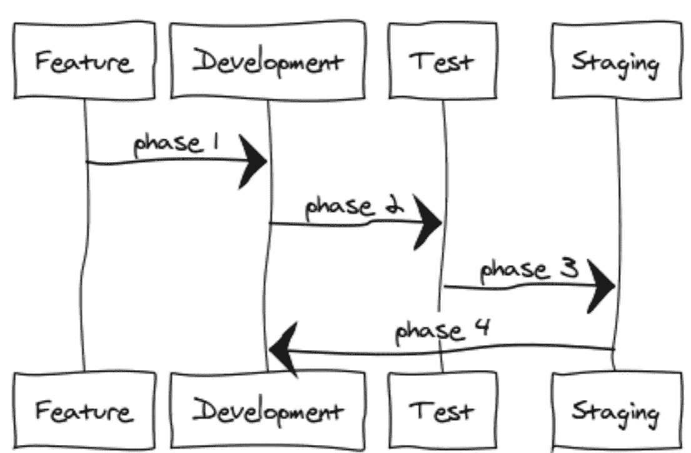
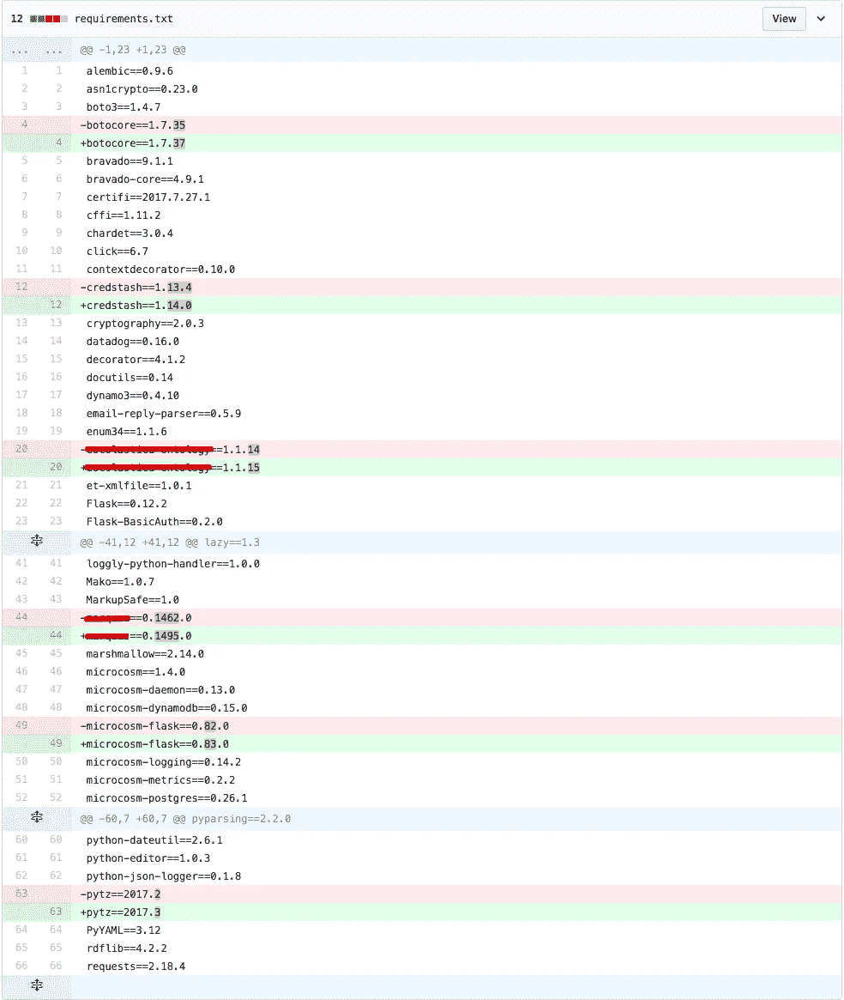

# 我们如何保持 45 个以上微服务之间的依赖关系新鲜

> 原文：<https://medium.com/hackernoon/how-we-keep-dependencies-fresh-across-45-microservices-1d526e1efce2>

在这篇文章中，我将告诉你我们在 [Globality](https://www.globality.com/en-us/) 使用的方法，来保持 45 个以上微服务之间的依赖关系。

# 我们的服务

我们有 45 个以上的内部微服务，其中 99%是用 [Python](https://hackernoon.com/tagged/python) 编写的。我们有一个名为`microcosm,` 的内部框架，它允许组件和服务的快速约定-配置连接。

你可以在 Github 链接中查看所有与微观世界相关的项目

# 问题是

如果你从事一个中型以上的项目，无论是单一的项目还是你所知道的微型服务，随着时间的推移，依赖关系会变得陈旧。

您停止升级依赖项的版本，因为该过程太复杂且太容易出错。

# 解决方案

Globality branching

在上面的图表中，您可以看到每个项目在分支周期中经历的所有阶段。

该流程 100%自动化，由 CI 和内部脚本驱动。

那么，让我们来看一下每个过程

# 第一相

`develop`在每次合并特征分支后，分支将在配置项上构建。

在这个阶段，我们解锁所有的依赖项。实质上是将`.`放在`requirements.txt`文件中。这迫使构建使用所有新的依赖项，升级服务的所有次要/主要版本。

在我们的`setup.py`中，我们使用`>=`。这意味着我们总是只有**最低* *版本。

## 我们发现了什么？

在这一阶段，我们通常会发现一个完全损坏、无法安装、崩溃等的依赖关系…

我们通常还会发现我们的某个服务出现了故障，然后会对此进行调查。

通常，如果我们需要修改代码，就在这个阶段，而且通常是最小的，因为它是增量完成的。

# 第二相

`develop`分支是基础，我们检查出一个`release/2017.xx.yy`分支。

在此期间，我们解锁所有的依赖项(与第一阶段相同)。

一旦解锁并安装了所有依赖项，我们就将这些依赖项`freeze`到一个`requirements.txt`文件中，并将其**提交* *回存储库。

这是我们项目中的一个例子。(为了清楚起见，我删除了内部库名)。

由于我们使用 [docker](https://hackernoon.com/tagged/docker) 容器(带有定制的内部分层解决方案)，我们确保我们测试的是将进入试运行(以及最终生产)的相同版本。

一旦依赖关系被锁定，它们就不会在该分支上重新打开

# 第三阶段

在第 3 阶段，我们将`release/2017.xx.yy`分支标记到它自己的标记上。该标记将使用 CI 自动部署到登台。

在这个过程中，我们只验证 pip 是完整的，我们不安装依赖项。

如果没有满足所有的需求(意味着我们需要安装一些东西)，构建将会失败并警告工程师。

# 第四阶段

在第 4 阶段，我们将标签合并回 develop，这个过程继续。

# 保持新鲜

保持您的依赖关系新鲜，可以确保您了解所有依赖关系都使用的安全修复和安全漏洞。

它确保您的所有项目都使用最新的内部库。

像我们这样自动化这个过程可以减轻压力。作为一名工程师，你不需要考虑它，CI 上的一切都是自动化的。

从 QA 的角度来看，您知道如果某样东西在一个环境中工作，它在另一个环境中也会工作。如果有东西坏了，那不是在底层基础设施中，而是在应用程序代码中。你不需要担心`cryptography`在你脚下升级了。

# 摇滚起来。