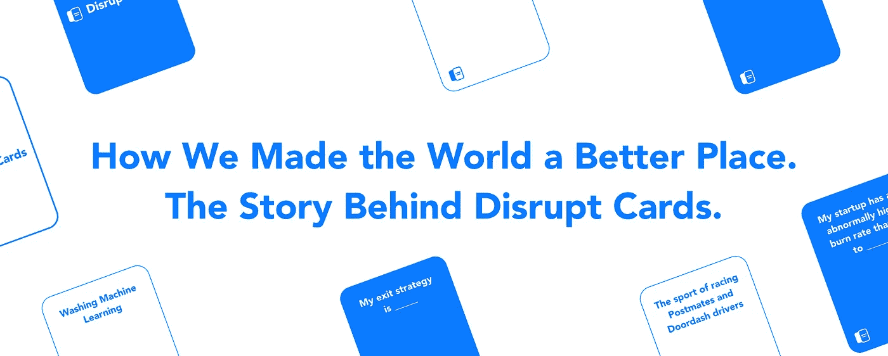
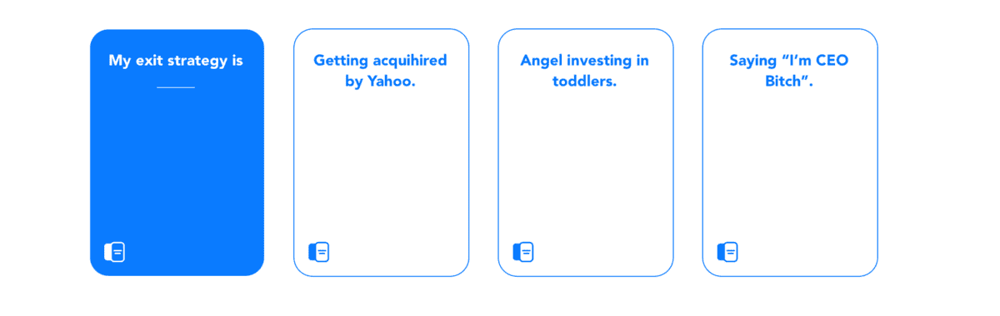
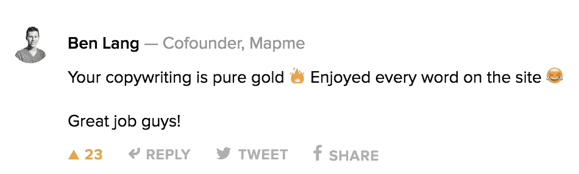
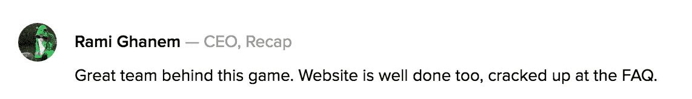
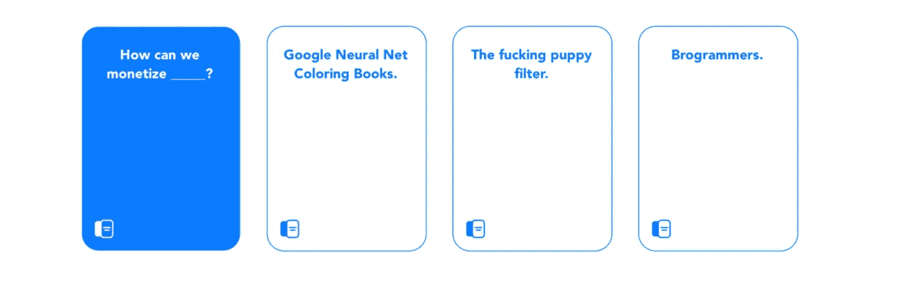

# 我们如何推出产品搜索的顶级游戏之一

> 原文：<https://medium.com/hackernoon/how-we-launched-one-of-the-top-games-on-product-hunt-c9d945ea2309>

## [打乱牌的故事](http://disrupt.cards)

*Originally Published on* [*Startup Grind*](/startup-grind/how-we-launched-one-of-the-top-games-on-product-hunt-e4c181142d07)

去年，我有了一个想法，为科技领域的人创造一个多人大声笑的卡牌游戏，这个游戏与普通人已经玩过的非常流行的多人大声笑的卡牌游戏非常相似。

这么说吧，成功建造[扰乱卡](http://disrupt.cards/)简直是个奇迹。无论是我们的 Airpods 在通话过程中断开连接，还是 Sunrise 关闭了，所以我们无法计划任何站立会议，从一开始就对我们不利。

我唯一有机会建造这个东西的方法就是拥有一个杀手团队。Snapchatting 之后(千禧一代都这样，对吧？)[我认识的两个](https://twitter.com/jeremymaluf)最有才华的学校[辍学者](https://twitter.com/danielsing3r)，当然，重读我在《零对一》上记下的彩色编码笔记，我们不知何故对这个想法聚集了足够的(错误和[贾斯汀·坎](https://medium.com/u/97ddc24c01db?source=post_page-----c9d945ea2309--------------------------------)启发)信心。

2016 年 10 月 4 日，在视觉探索的几个星期后，我们的小项目在[产品搜索](https://medium.com/u/b8b4445269d0?source=post_page-----c9d945ea2309--------------------------------)上被那个著名的[标签人](https://twitter.com/chrismessina)优雅地搜索到，并且起飞了！

> 我们收到了超过 1000 张[的投票](https://www.producthunt.com/games/disrupt-cards)，在我们的网站上有成千上万的浏览量，并且成为了[有史以来产品搜索排名前五的游戏之一。](https://www.producthunt.com/search/posts/games?)

我们的父母真的真的很自豪，因为我们在电脑上输入的所有东西都产生了“有用”的东西。

*什么？怎么会？为什么？*

玩笑归玩笑(当你拿到扰乱卡盒的时候，你会得到很多包装整齐的卡片)，我们从制作这个游戏中学到了很多。现在是我给你一些在发布日取得成功的提示的部分，所以开始吧！

## 你可以在这里购买游戏

# 为发布日做准备的 5 件事

## (这是一个列表条，所以你知道我们是认真的)

## 1.测试你的假设

我们在早期非常努力地做的一件事是测试我们对游戏的每一个假设。我们认为我们做的东西会很有趣，但是我们知道只有一种方法可以确定。

所以我们开始疯狂地测试我们的假设。这张卡好笑吗？你认为什么配色方案最合适？名字好听吗？我们的领域应该是什么？你明白了，对自己的工作持批评态度。

一旦你确定了你的假设，自然的进展就是找出你可以向谁寻求反馈。大家的看法重要吗？谁的意见最重要？

很容易从朋友、家人、认识你的人那里得到肯定的反馈。这被称为便利偏差；在测试你的假设时，这是你想要避免的众多影响之一。其他包括整群抽样，在这种情况下，你会因为与你交谈的人缺乏多样性而增加偏见，还有群体思维，在这种情况下，你的结果会受到群体心态的影响。

我们通过询问那些我们知道会对我们的游戏持批评态度的人来解决这个问题。记者、技术人员、工程师、设计师、学生等。

奇怪的是，人们一直想玩它。这就是我们如何知道这个游戏必须建立。

## 2.想想加速不可避免的

引用埃隆·马斯克(Elon Musk)的话来谈论一个简单的纸牌游戏很奇怪，但请相信我，这句话帮助塑造了我对商业的思考方式。虽然听起来很悲观，但“加速不可避免的事情”是考虑开发产品的一个好方法。

练习很简单，想想未来。人们一致认为，未来将与现在大不相同。这取决于我们这些“企业家”，找出这种差异是什么，然后勇往直前，创造这种差异。

我们做到了这一点，即使是以最小的方式，通过创建一个我们相信未来会存在的纸牌游戏，不管我们是否创建了它。如此自信，以至于我们打赌，如果我们加速未来，我们将会创造一个胜利的、令人难忘的游戏。

## 3.创造一个声音

一个“热闹的纸牌游戏”最好是有趣的。我们将这一挑战铭记于心，并以讽刺的口吻围绕我们品牌的每一个方面。人们喜欢它。

需要注意的重要一点是，我们在整个品牌中一直保持这种基调。从我们的推文到要复制的电子邮件，我们坚持人们喜欢的东西，这就是讽刺。见鬼，我甚至在这篇博文的前半部分都停留在这种语气中。

为你的品牌建立一个声音，虽然肯定有风险，但这是突出和令人难忘的最好方法之一。

## 4.制作新闻资料袋

制作一个新闻资料袋，就像[和我们的](https://drive.google.com/drive/folders/0Bz_tdXaWzwO1eVdfUGhzeHRVb2c?usp=sharing)，是你时间上的一个小投资，却可以有很大的帮助。在 drive 或 dropbox 文件夹中，保留一些主要信息非常重要。理想情况下，您应该包括:

*   几张图片/gif

*   一页纸讲述你的故事(谁，什么，哪里，什么时候，为什么)
*   您的联系信息

新闻资料袋背后的想法是，你想让记者尽可能容易地获取你的故事。你想提供所有的资源和数字资产，一个随机的人会需要制作一个关于你的故事。

## 5.尽情享受吧

当然，当你在构建一个有趣又可笑的纸牌游戏时，这可能会更容易，但要确保你在建立自己的公司时也很开心。

创业很辛苦。凌晨 2 点的夜晚很难熬。赔钱很难受。创造事物的那些部分并不好玩。所以当事情没有按计划进行时，很容易对自己和他人感到失望。事实是事情从来不会按计划进行。

是的，如果你想让你的长远目标成功，你必须做出牺牲。但是不，创业不一定要毁掉你的生活。所以，确保你喜欢你正在做的事情，因为如果你不喜欢，你应该问问自己到底为什么要做这件事？

> 今天可以买[扰乱卡](http://disrupt.cards/)。非常适合企业家、想要成为企业家的人、工程师、设计师、咖啡店、共同工作空间、昂贵的风投办公室、生日礼物、结婚礼物等等。

*你可以在* [*乔丹戈宁*](http://www.jordangonen.com/) *或者* [*推特*](https://twitter.com/jrdngonen) 上找到我

## 给联合创作人[丹尼尔·辛格](https://twitter.com/danielsing3r)和[杰里米·马鲁夫](https://twitter.com/jeremymaluf)