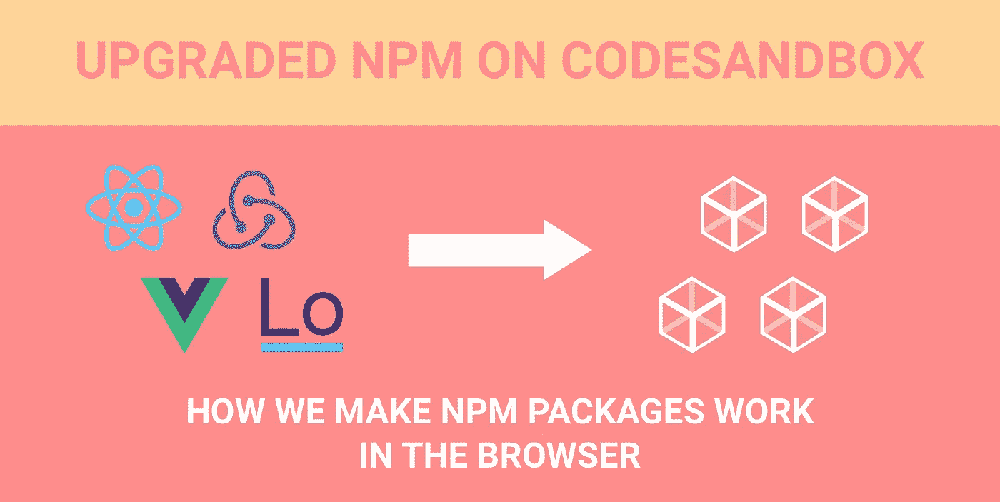
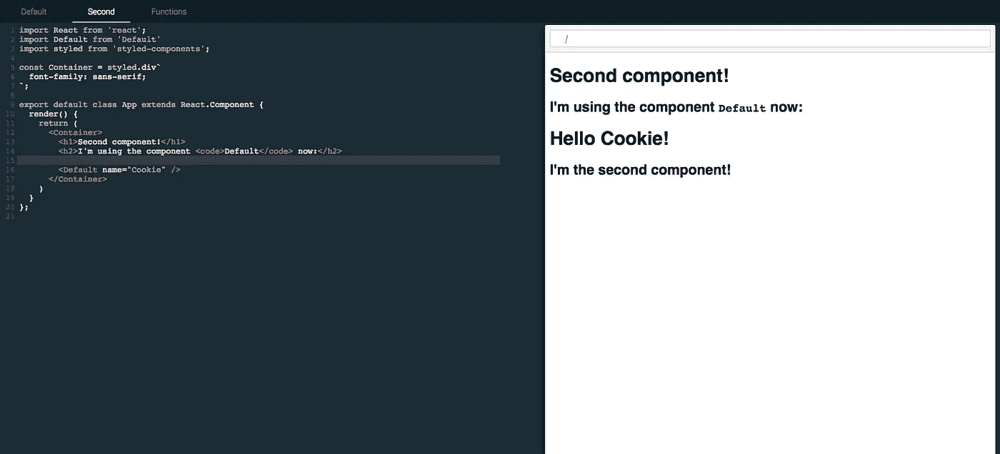
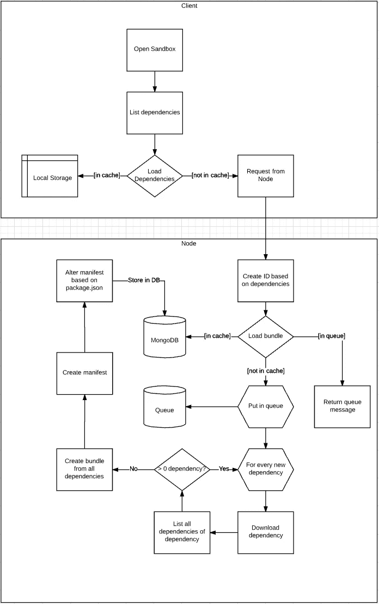
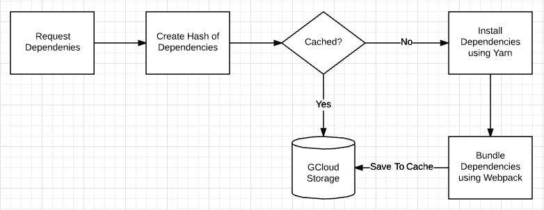
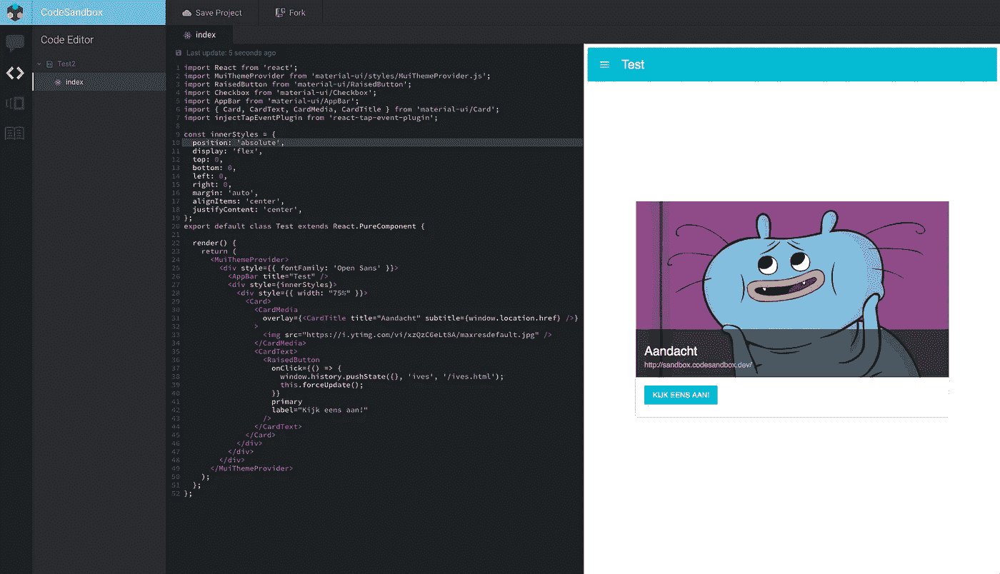
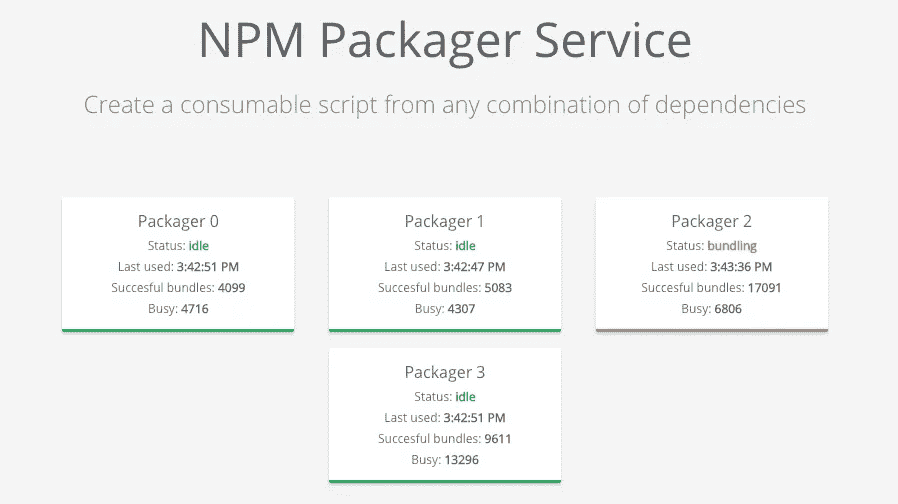
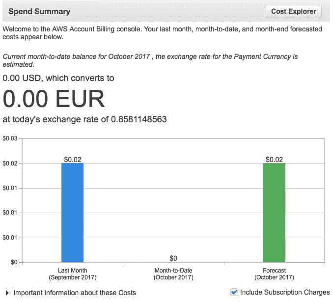
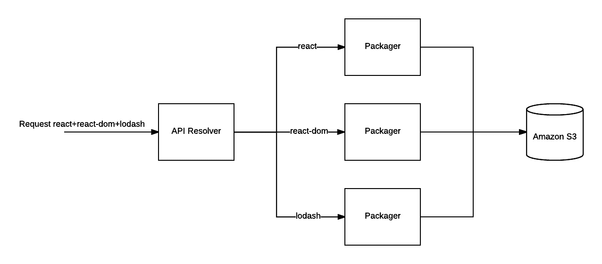
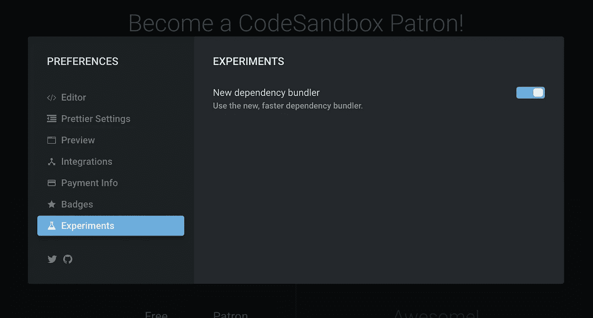

# 我们如何让 npm 包在浏览器中工作

> 原文：<https://medium.com/hackernoon/how-we-make-npm-packages-work-in-the-browser-announcing-the-new-packager-6ce16aa4cee6>

在 CodeSandbox 的初始开发期间，我总是将 npm 依赖支持排除在范围之外。我以为在浏览器里安装一个任意的，随机数量的包是不可能的，甚至想想都让我大脑堵塞。

如今，npm 支持是 CodeSandbox 最具定义性的特性之一，所以我们成功地让它工作了。它需要多次迭代才能在任何场景下工作，我们进行了多次重写，即使现在我们仍然可以改进逻辑。我将解释 npm 支持是如何开始的，我们现在有什么，以及我们还可以做些什么来改进它。

# 第一版

我真的不知道如何解决这个问题，所以我从一个非常简单的 npm 支持版本开始:

The absolute first version, importing styled-components and React (25 Nov 2016)

这个版本的 npm 支持非常简单。这甚至不是真正的 npm 支持，我只是在本地安装了依赖项，并用已经安装的依赖项来阻止每个依赖项调用。当然，这绝对不能扩展到 400，000 个不同版本的包。

尽管这个版本不太好用，但看到我至少能够让两个依赖项在沙盒环境中工作，还是令人鼓舞的。

# 网络包版本

我对第一个版本相当满意，我认为它足以满足一个 MVP(code sandbox 的第一个版本)。我认为如果不施展魔法，安装任何依赖项都是不可能的。直到我偶然发现了 https://esnextb.in/的 T2。它们已经支持来自 npm 的任何依赖，您只需在 package.json 中定义它们，它就神奇地工作了！

这对我来说是一个重要的学习时刻。我从来不敢给予适当的国家预防机制支持，因为我认为“这是不可能的”。只有在看到它的“可能性”的活生生的证据后，我才开始投入更多的思考。在放弃这个想法之前，我应该先探索一下可能性。

所以！我开始思考如何解决这个问题。天哪，我把它弄得太复杂了。我的第一个版本不适合我的大脑，所以我必须画一个图表:

The first idea, probably wrong even

这种过于复杂的方法有一个优点:实际实现比预期的要容易得多！

我了解到 [Webpack DLL 插件](https://webpack.js.org/plugins/dll-plugin/)能够捆绑依赖项，并生成一个带有清单的 JS 包。这份清单是这样的:

每个路径都映射到一个模块 id。如果我需要`react`,我只需要打电话给`dll_bundle(3)`,我就会得到反馈！这对于我们的用例来说是完美的，所以我开始打字，想出了这个实际的系统:

The source of the service can be found here: [https://github.com/CompuIves/codesandbox-bundler](https://github.com/CompuIves/codesandbox-bundler). This service also contains code to publish any sandbox to npm (really cool), we scrapped this feature later on.

对于打包程序的每个请求，我会在`/tmp/:hash`中创建一个新的目录，运行`yarn add ${dependencyList}`，然后让 webpack 捆绑。我会把这个新包保存在 gcloud 上，作为一种缓存方式。比图简单多了，主要是因为我用 yarn 代替了安装依赖项，用 webpack 代替了捆绑。

当你加载一个沙箱时，我们首先要确保在评估之前我们有清单和捆绑包。在评估期间，我们将为每个依赖项调用`dll_bundle(:id)`。这工作得非常好，我得到了我的第一个具有适当的 npm 依赖的版本！

Whoop! We got material-ui and react running dynamically! (24 Dec 2016)

这个系统仍然有很大的局限性。它不支持不在 Webpack 依赖图中的文件。这意味着例如`require('react-icons/lib/fa/fa-beer')`不会工作，因为依赖项的入口点根本不需要它。

不过，我确实发布了这个版本的 CodeSandbox，并联系了[WebpackBin](https://webpackbin.com)[Christian Alfoni](https://medium.com/u/d4ec01100893?source=post_page-----6ce16aa4cee6--------------------------------)的作者。我们使用了一个非常相似的系统来支持 npm 依赖性，我们也有同样的限制。因此，我们决定联合力量，建立**终极**包装机！

# 带有条目的 Webpack

“终极”打包程序保留了与我们之前的打包程序相同的功能，除了 [Christian](https://medium.com/u/d4ec01100893?source=post_page-----6ce16aa4cee6--------------------------------) 创建了一种算法，可以根据文件的重要性将文件添加到包中。这意味着我们手动添加入口点，以确保 Webpack 也会捆绑这些文件。在对这个系统进行了大量的调整之后，我们让它可以在任何(？)组合。所以你能够要求反应图标，以及 css 文件🎉。

新系统还得到了架构升级:我们有一个 dll 服务作为负载平衡器和缓存。然后，我们有多个打包程序进行捆绑，这些打包程序可以动态添加。

Packager teamwork!

我们想让每个人都可以使用打包服务。这就是为什么我们建立了[一个网站](http://webpack-dll-prod.herokuapp.com)来解释这项服务是如何运作的，以及你如何利用它。这被证明是一个巨大的成功，我们甚至在 [CodePen 博客](https://blog.codepen.io/2017/08/11/using-resources-npm-codepen/)中被提及！

这个“终极”包装器仍然有一些限制和缺点。随着我们变得越来越受欢迎，成本呈指数增长，我们通过包*组合进行缓存。*这意味着如果你添加了依赖项，我们必须重新捆绑你的整个包组合。

# 走向无服务器

我一直想尝试这种叫做“[无服务器](https://martinfowler.com/articles/serverless.html)”的酷炫技术。使用无服务器，你可以定义一个函数，这个函数将根据请求执行，它将加速运行，处理请求，然后在一段时间后自行终止。这意味着您有非常高的可伸缩性:如果您有 1000 个并发请求，您可以立即启动 1000 台服务器。这也意味着您只需为服务器实际运行的时间付费。

无服务器听起来非常适合我们的服务:它不是全时运行的，我们需要高并发性，以防同时有多个请求。所以我开始急切地使用一个名为[无服务器](https://serverless.com/)的框架。

转换我们的服务进行顺利(感谢无服务器！)，2 天内就有了工作版。我创建了三个无服务器函数:

1.  元数据解析器:该服务将解析版本和对等依赖，并请求打包器功能。
2.  打包者:这个服务将完成依赖项的实际安装和捆绑
3.  丑化者:负责异步丑化生成的包。

我把新服务和旧服务放在一起运行，效果非常好！我们每月的预计成本为 0.18 美元(相比之下为 100 美元)，我们的响应时间缩短了 40%到 700%。

This felt sooooo good

几天后，我开始注意到一个限制:一个 lambda 函数只有 500MB 的最大磁盘空间，这意味着一些依赖组合无法安装。这是一个交易破坏者，我不得不回到绘图板。

## 无服务器重访

几个月后，我为 CodeSandbox 发布了一个新的 bundler 。这个捆绑器非常强大，允许我们轻松地支持更多像 Vue 和 Preact 这样的库。通过支持这些库，我们得到了一些有趣的请求。例如:如果您想在 Preact 中使用 React 库，您需要将`require('react')`别名为`require('preact-compat')`。对于 Vue，你可能想把`@/components/App.vue`解析到你的沙盒文件中。我们的打包程序不会为依赖项这样做，但是我们的打包程序会。

那时我开始想，我们也许可以让浏览器捆绑器来做实际的打包工作。如果我们只是将相关的文件发送到浏览器，我们会让捆绑器进行依赖项的实际捆绑。这应该会更快，因为我们不是评估整个包，只是评估它的一部分。

这种方法有一个很大的优势:我们将能够独立地安装和缓存依赖项。我们可以在客户端合并依赖文件。这意味着，如果您在现有依赖项的基础上请求一个新的依赖项，我们只需要为新的依赖项收集文件！这将解决 AWS Lambda 的 500MB 限制，因为我们只安装了一个依赖项。我们也可以将 Webpack 从打包程序中删除，因为打包程序现在唯一的责任是找出哪些文件是相关的并发送它们。

We parallelize the packaging of the dependencies

*注意:我们也可以删除打包程序，从 unpkg.com 动态请求每个文件。这可能比我的新方法还要快。我决定仍然保留打包程序(至少对于编辑器来说)，因为我想提供离线支持。这只有在你随身携带所有相关文件的情况下才有可能。*

## 它在实践中是如何工作的

当我们请求依赖项的组合时，我们首先检查这个组合是否已经存储在 S3 上。如果它不在 S3 上，我们从 api 服务请求组合；该服务为每个依赖项独立地请求所有打包程序。我们一拿回 200 OK，就再次请求 S3。

打包程序使用 yarn 安装依赖项，并通过遍历入口点目录中所有文件的 AST 找到所有相关文件。它搜索 require 语句并将它们添加到文件列表中。这是递归发生的，所以我们得到一个依赖图。`react@latest`的输出示例如下:

# 优势

## 节省成本

我已经部署了新的包装两天前，我们支付了高达 0.02 美元的那两天！这是为了建立缓存。与每月 100 美元相比，这是一笔巨大的节省。

## 更高的性能

现在，您可以在 3 秒钟内获得任何组合的新依赖关系组合。对于旧系统，这有时需要一分钟。如果组合被缓存，你将在 50 毫秒内通过快速连接得到它。我们在世界各地使用 Amazon Cloudfront 缓存依赖项。我们的沙箱也运行得更快，因为我们现在只为您的沙箱解析和执行相关的 JS 文件。

## 更多灵活性

我们的 bundler 现在可以像处理本地文件一样处理依赖关系。这意味着我们的错误堆栈跟踪现在更清晰了，我们现在可以包含来自依赖项的任何文件(比如。scss，。vue 等。)而且我们很容易支持别名之类的东西。它的工作方式就像依赖项是本地安装的一样。

# 释放；排放；发布

两天前，我开始使用新的打包程序以及旧的打包程序，以建立缓存。它已经缓存了 2000 种不同的组合和 1400 种不同的依赖关系。我想在实际迁移之前广泛测试新版本。您可以通过在您的首选项中启用它来尝试它！

*还有，如果你对出处感兴趣，可以在这里找到:***。现在很乱，我来清理一下，给它一个 README.md 等。未来一周。**

## *去无服务器！*

*无服务器给我留下了深刻的印象，它使服务器的可扩展性和管理变得异常简单。唯一让我无法使用无服务器的是非常复杂的设置，但是 serverless.com 的人做出了这个孩子的游戏。我非常感谢他们的工作，我确实认为无服务器是许多不同应用形式的未来。*

## *将来的*

*我们仍然可以在很多方面改进系统，我渴望探索动态请求嵌入和离线保存的需求。这是一个很难保持的平衡，但应该是可能的。我们也可以开始在浏览器中独立缓存依赖项，这取决于浏览器允许什么。在这种情况下，当访问具有不同依赖组合的新沙箱时，有时甚至不需要下载新的依赖。我还将进一步探索依赖性解决方案，新系统可能会出现版本冲突，我想在全面上线之前解决这个问题。*

*尽管如此，我对新版本非常满意，继续为 CodeSandbox 开发新的东西！*

**如果你对 CodeSandbox 感兴趣，我们 90%开源！最活跃的是* [*这里的*](https://github.com/CompuIves/codesandbox-client) *。**