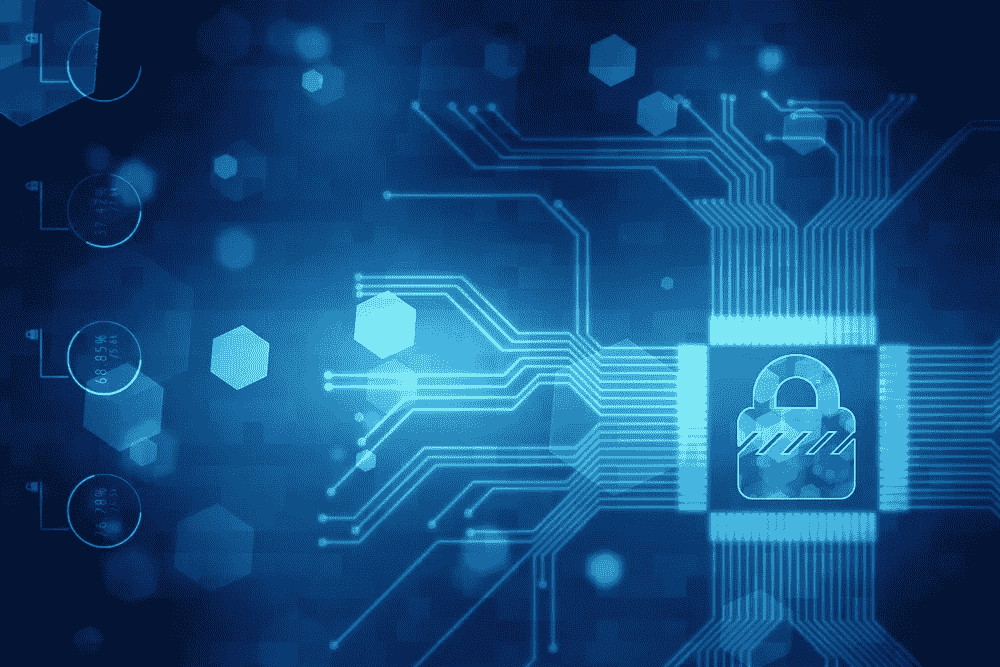

# 我们可能会看到区块链如何用于改善公共安全

> 原文：<https://medium.com/hackernoon/how-we-might-see-blockchain-used-to-improve-public-safety-632c4856addb>

锁链开始进入公众的意识，但普通人可能不知道它到底有多少用途。

我们仍在许多领域探索其潜在的帮助，但我今天想把重点放在公共安全上。这是一个有很多问题需要考虑的问题，但也是一个我们有很大改进空间的问题。我将告诉你一些我认为[区块链](https://hackernoon.com/tagged/blockchain)可以真正发挥作用的领域。其中一个领域就是枪支管制。

我知道我刚刚失去了一些人。

但是在这里请原谅我，因为这是一个复杂的话题，值得仔细研究。我知道这是一个热点问题，但这并不意味着我们不应该谈论它。

所以让我们从这里开始，继续前进。

# **帮助防止枪支暴力**

尽管争论仍在激烈进行，许多美国人互相争论，但我们中的大多数人确实同意应该对枪支进行常识性的管理。问题在于制定和执行这些规定。一旦我们开始谈论它们，一系列的问题就会出现。我们需要更多的法规吗？我们现在能不能更好地执行记录在案的东西？这是一个需要更多关注的心理健康问题吗？

我不会假装区块链有所有的答案。归根结底，这只是一种技术。我们有责任在不侵犯我们的权利和隐私的情况下，制定保护我们安全的法规。但是区块链可以帮忙。

区块链已经被用于供应链，以帮助跟踪药品等产品的移动。它可能会以类似的方式作用于枪支。跟踪枪支购买及其跨州流动，并作为一个不公开披露的分散账本，都在区块链的可能性范围内。

在最近发生在德克萨斯州萨瑟兰斯普林斯的枪击案中，枪手一开始就不应该有枪。他因家庭暴力被记录在案。但它从未被输入系统。在这种情况下，区块链可以提供帮助。另一个可实现的目标可能是为那些不应该拥有枪支的人建立一个私人的、但可核实的账本。家庭暴力定罪或精神疾病诊断可能会引发一种反应，自动将他们列入“禁止购买”名单，这一切都是通过区块链。

# **通过数据打击犯罪**

区块链不一定只用于追踪枪支。我说不上人们对我刚刚提出的建议会有什么反应。但是如果它们对你来说太具侵略性，区块链还有其他方法来争取公共安全。

不久前我在波士顿参加一个会议，我和另一个与会者就这个话题进行了一次有趣的对话。他们希望创建一个基于区块链的解决方案，可以跟踪城市的犯罪模式，甚至更好地在各方之间传输数据。大多数城市的追踪和数据共享现状并不好。城市中有些地区和社区不能或不愿共享数据，这让我们都不太安全。

这是区块链真正可以大放异彩的领域——在预防性使用案例中。你可以获取犯罪统计数据和模式，你可以汇总这些数据，这样警察就有了巡逻的数据源。我们拥有的数据越多，机器[学习](https://hackernoon.com/tagged/learning)就可以开始分析这些数据，并提供基于证据的解决方案。

对于那些担心隐私和侵犯我们权利的人来说，这可能是一条更有吸引力的途径。

# **政府领养**

问题不是*如果*政府机构将开始使用区块链用于公共安全用途，而是*何时*。我和这些机构谈过区块链的用途，我可以告诉你，他们正在调查。但是实施不会一蹴而就。

这可能是一件好事。因为他们实际上是从保护隐私和公共利益的角度来看待这个问题的。就我个人而言，我真的很重视我的隐私，我也确实担心区块链会被利用，但我认为我们现在正朝着正确的方向前进。我认为明智的做法是花些时间来弄清楚如何将实施与我们的公民自由和隐私权结合起来。

就像我说的，区块链只是一种技术。当然，这是一个重要的工具，但归根结底，它仍然是我们选择如何使用的工具。我们现在需要开始考虑这些问题，因为大规模采用即将到来，我们需要在前进的过程中规划出一条路线。