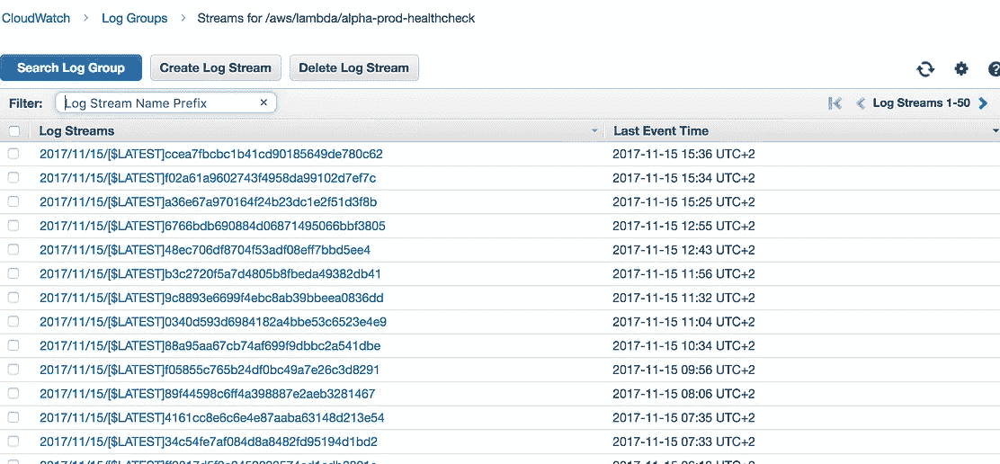
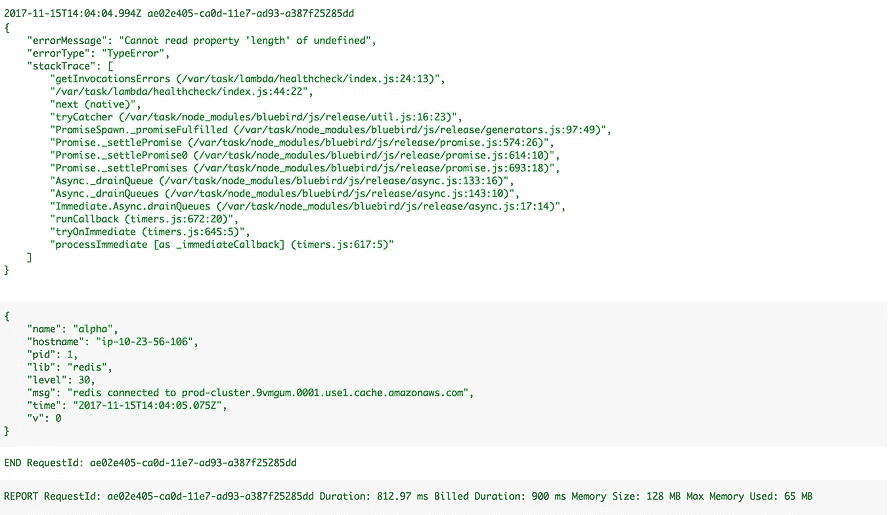
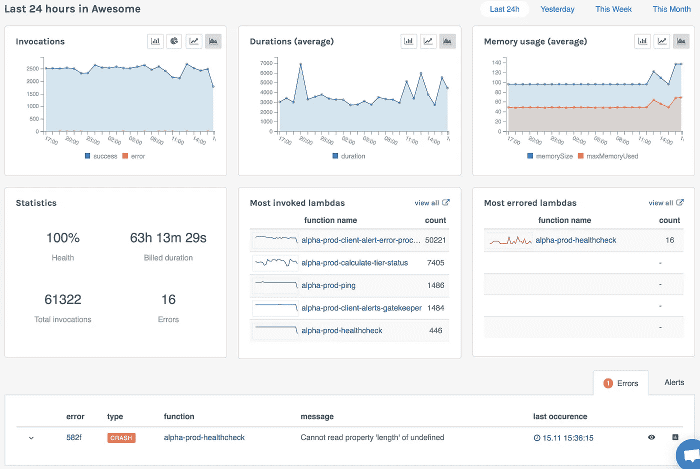
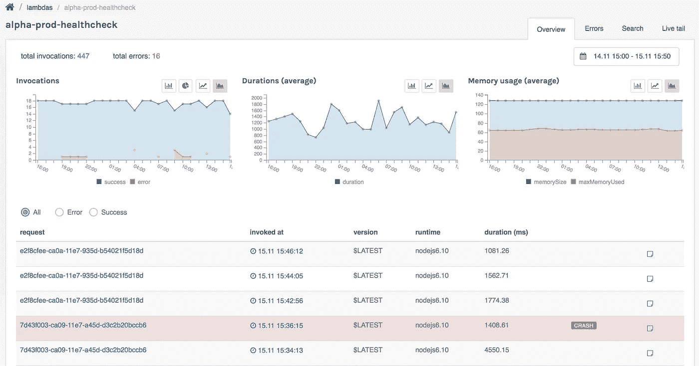
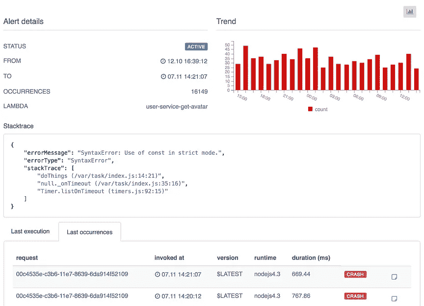
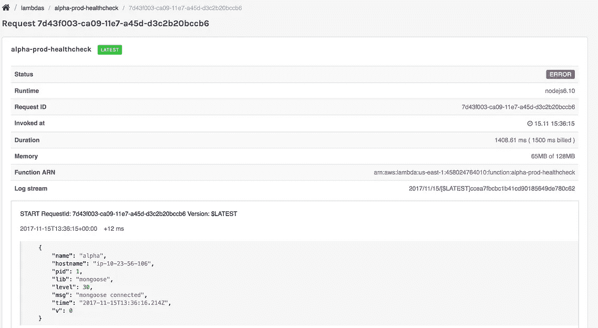
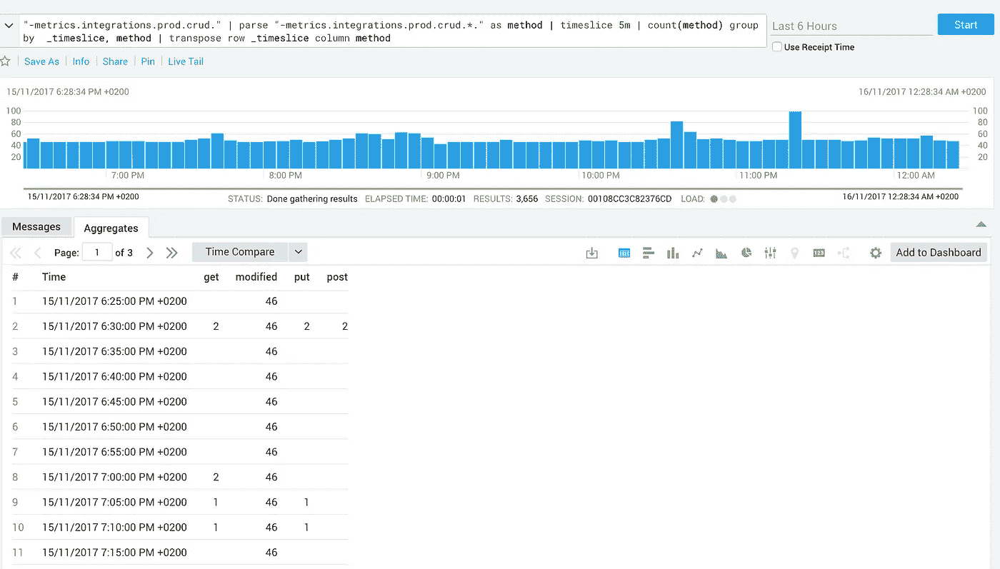
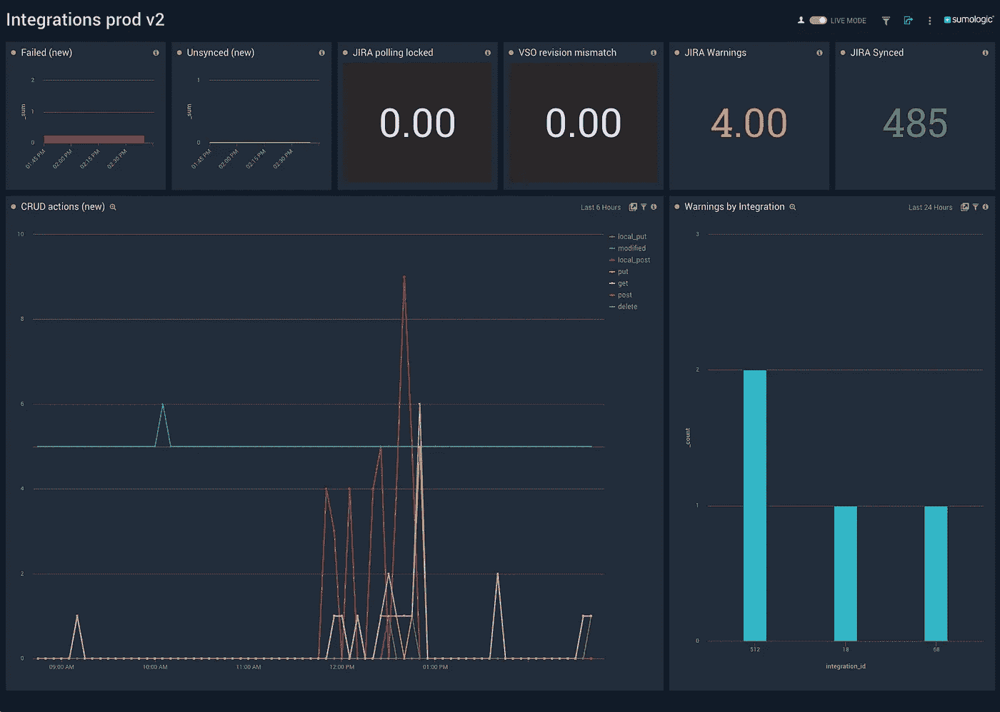

# 我们如何监控具有数百种功能的无服务器应用

> 原文：<https://medium.com/hackernoon/how-we-monitor-serverless-apps-with-hundreds-of-functions-d0f1fa938d1e>


在过去的两年里，我将大部分时间和精力放在构建无服务器应用程序上。高潮？我和我的朋友创建了[**dash bird**](https://dashbird.io/monitor-aws-lambda)**——一个针对 AWS Lambda** 的监控和错误警报服务。在开始 [Dashbird](https://hackernoon.com/tagged/dashbird) 之前，我们在 test lio——一家众包 QA 公司中构建了无服务器解决方案。今天，这两种服务都大量使用 Lambda 函数。

在无服务器中有很多领域我都想涉及，但是我将把重点放在房间里的大象上:**监视和洞察 Lambda 函数**。我认为这是无服务器领域最大的问题之一，同时也是我认为我的专业知识最有影响力的领域。

# 弄清楚监控…

当采用无服务器时，我们不得不重新设想获取和显示应用程序指标的方法。我们希望保持我们的功能简洁明了——没有第三方代理和包装。我们还希望一切都可以通过**单一仪表板**观察到——这是现有 APM 所缺乏的功能。最重要的是，我们希望能够找到并**深入调用级数据**，包括日志和上下文，以便在出现问题时排除故障并调试代码。

今天，我可以说，我们已经非常接近这一可见性水平，我想分享一下我的经验以及我们是如何实现这一目标的。

# 从日志中获取一切！

分析日志是收集信息的一种非常有效的方式，没有什么是你不能做的。但是有了 Lambda，你可以把它带到一个全新的水平。

让我解释一下。

CloudWatch 根据功能、版本和容器组织日志，而 Lambda 为每次调用添加元数据。此外，日志中还包括运行时和容器错误。当然，您可以记录任何自定义指标，并将其转换为时间序列图。不过，这不是 CloudWatch 的工作。



Log Stream history of a Lambda function.

# 让我们来分析一下。

一般来说，监控一个应用程序有两个角度。**系统指标**(如延迟、错误、调用和内存使用量)**业务** **分析**，如注册或发送电子邮件的数量。

技术性能指标和错误检测非常普遍，这也是 Dashbird 的初衷——一种即插即用的监控服务。

然而，业务指标因服务而异，需要定制的方法。我们为此选择的武器是 SumoLogic，但是您也可以使用其他服务，如 Logs.io 等。

让我们首先处理系统指标…

# 是时候真正了解你的兰姆达斯了

我们构建了 [Dashbird](https://dashbird.io) 来了解无服务器架构的技术指标。它通过实时收集和分析 CloudWatch 日志来工作。

对于所有好的监控服务，在一个屏幕上获得一个概览是很重要的。主页就是为此而设计的。它包括所有调用的概述，最活跃的功能，最近的错误和系统健康。它应该告诉你**你是否在哪里有问题。**



从那里，你可以进入 Lambda 视图并单独分析每个函数。

## 时序指标允许优化

这个视图使开发人员能够判断延迟和内存使用情况。我们使用它来优化功能，通过调整配置的内存来匹配实际使用情况，从而提高成本效益。或者，通过增加更多的内存来加速端点[也是有用的。](https://serverless.zone/my-accidental-3-5x-speed-increase-of-aws-lambda-functions-6d95351197f3)



对于故障排除和修复问题，我们依赖日志中的故障识别。根据我们的经验，这种方法正好适合 Lambda 函数。

以下是一些原因:

*   **超时永远不会到达警报服务，**因为在库有时间发送警报之前，执行就被低层杀死了。
*   **配置故障永远不会到达报警服务**，因为执行会在容器启动时停止。
*   **盲点少。**有些功能你预计不会失败，所以你没有为它们添加提醒。尽管有时他们还是会失败。
*   **Stacktraces 将连接到执行日志**，这意味着我们知道崩溃前发生了什么。



Here’s what debugging looks like 😎.

# 我应该记录什么？

故事并没有在这里结束。不管那些花哨的图表，我还是发现自己对发生的事情一无所知，尽管我不愿意承认。仅仅一个堆栈跟踪可能不足以理解失败执行的细节(尤其是 Node.js 的模糊跟踪)。为此，我们开发了一些登录 Lambda 函数的约定。

## 我们总是注销:

*   **事件对象** ( **省略敏感信息**如密码、信用卡详细信息等)
*   **错误和异常**(如果你*尝试…捕捉*一个错误，添加一个 *console.log(error)* )
*   **一切看起来可疑的事情**(花了几个小时调试你的代码，却发现一个远程端点改变了它的响应体 *)*
*   **具有商业价值的事件**(这些事件会在一分钟内出现在定制的仪表板上)

# 收集业务指标

商业分析遵循同样的基本思想。我们选择的武器是 [SumoLogic](https://sumologic.com) 。

> SumoLogic 是一个用于日志管理和时间序列度量的机器数据分析服务。

这项服务的伟大之处在于它能够用几乎任何东西来构建定制的仪表板。设置和 Dashbird 有点不同，但是一样棒。这里有一个 [lambda 函数](https://github.com/SumoLogic/sumologic-aws-lambda/tree/master/cloudwatchlogs)，它订阅一个日志组并将日志发送给服务😎。

# 构建自定义指标仪表板

自定义指标中没有太多的约定和共同点，因此我们将通过一个示例来演示这一点。

我将演示我们如何为集成服务收集指标。这项服务的任务是在问题追踪账户之间同步问题(想想 JIRA 和阿萨纳)。我们希望记录所有针对客户端问题跟踪器的 CRUD 操作。

为此，让我们在每次发出此类请求时添加一个日志行:

```
console.log(`-metrics.integrations.${env.STAGE}.crud.${method}`);
```

现在，我们有能力将这些事件转化为时间序列指标。让我们对此进行查询…

```
"-metrics.integrations.prod.crud." | parse "-metrics.integrations.prod.crud.*" as method | timeslice 5m | count(method) group by  _timeslice, method | transpose row _timeslice column method
```

看看我们得到了什么…



不错！将它添加到您的仪表板中。

## **现在让它看得见。**

对于任何仪表板，一目了然是很重要的。仪表板的经验法则是，如果有问题，你需要在 5 秒钟内说出来。我们试图用数量来表示失败，用时间序列度量来表示预期事件。这是我们集成服务仪表板的最终结果。



这项工作仍在进行中，因为我们正在测试不同的信息显示方式。

# 结论

Lambda 的短命、并行和高度可伸缩性迫使我们不断创新。前面提到的方法帮助我们将清晰和可见性带入我们的无服务器系统，我已经看到它对其他团队产生了类似的效果。这两个工具都有免费版本，所以您可以很容易地试用它们。

*PS。如果你有其他想法或者想分享你在监测领域的工作，请在评论中告诉我。*