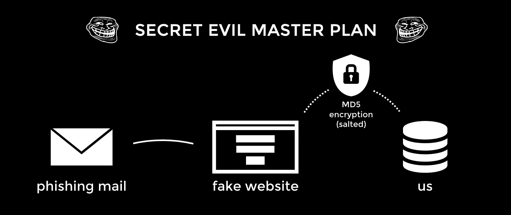
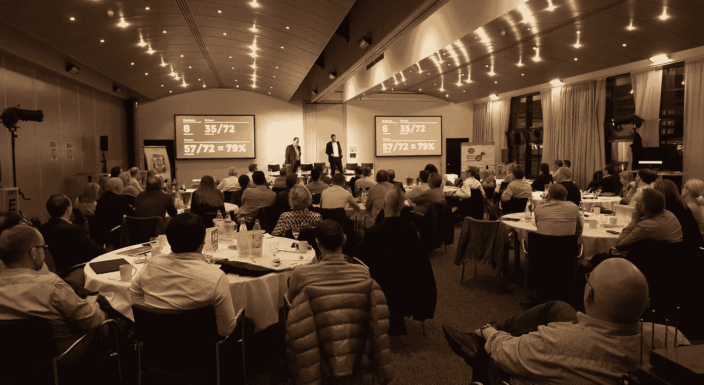
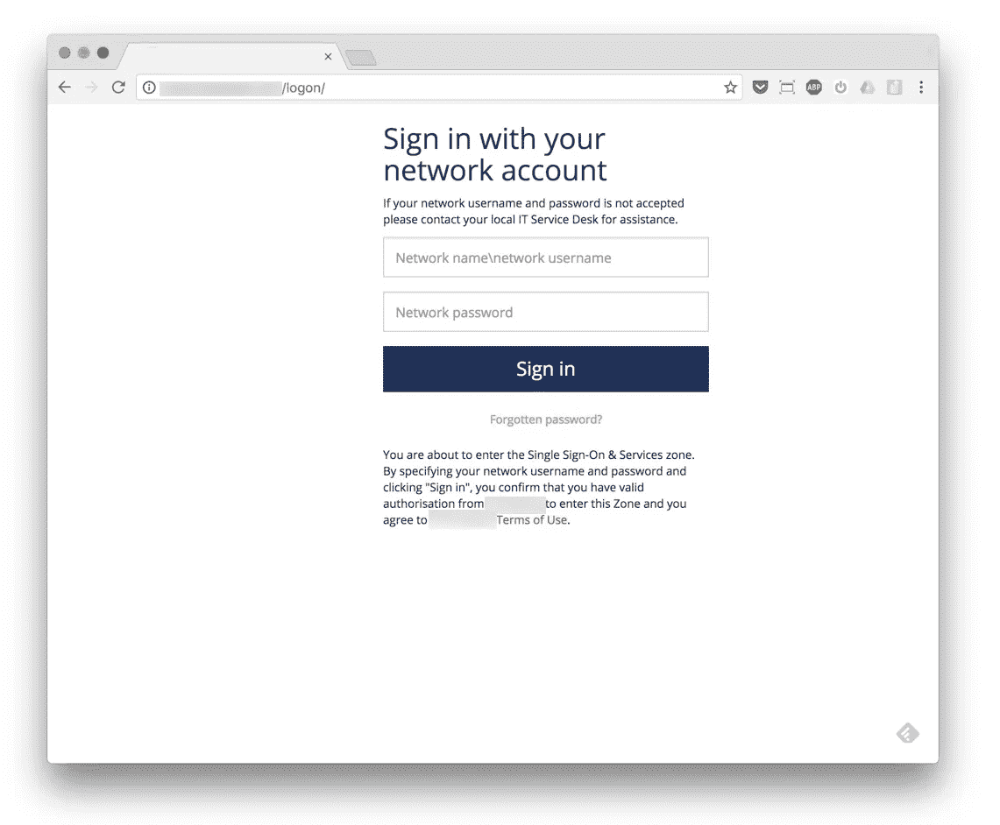
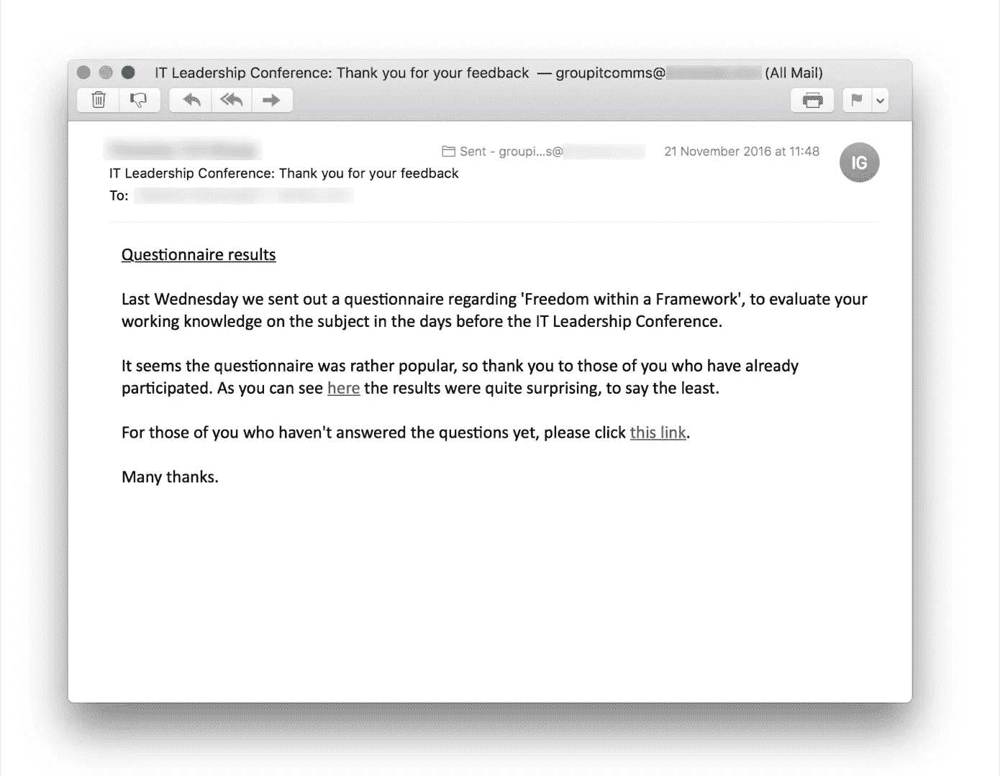
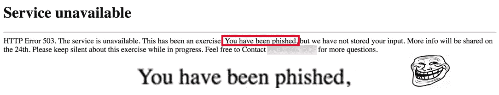
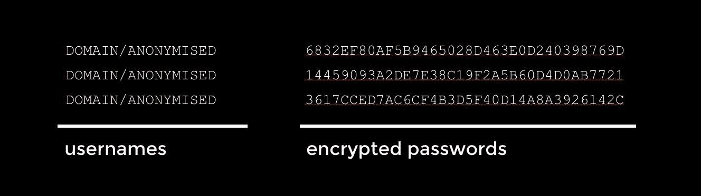
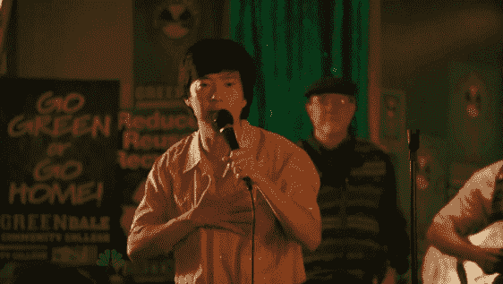

# 我们如何从一家 200 亿欧元的公司窃取 79%的密码

> 原文：<https://medium.com/hackernoon/how-we-phished-a-20-billion-euro-company-out-of-79-of-their-passwords-4baf54ebc65f>

31337 pseudo-evol master plan. GG, EZ

*免责声明:
我们是被* ***要求*** *这样做的，* ***加密了*** *(并加盐)的敏感数据，从来没有看到、拥有或存储过任何非加密的敏感数据，而且我们还有一些* ***内助*** *。我们大声为* ***鼓掌*** *这个来自本公司的倡议，安全，就像标点符号和适当的语法一样，至关重要。*

一家年营业额高达 200 亿欧元的行业领先企业要求我们为他们在德国汉诺威举行的 IT 运营管理/信息安全会议做一些特别的事情。

> *信息安全*、*有时简称为* InfoSec *、i* ***s 防止对信息*** *进行未经授权的访问、使用、披露、破坏、修改、检查、记录或销毁的做法。*

# 钓鱼他们的用户名和密码，许多下巴掉了。

在舞台上，我们透露已经成功骗走了大多数与会者的用户名和密码，导致他们睁大眼睛，大口喘气。

Me, bringing the good news to the collective worldwide IT management (pic: [Rudolf van der Ven](https://medium.com/u/871f23737abe?source=post_page-----4baf54ebc65f--------------------------------))

下面是我们如何通过四个简单的步骤(一种相当常见的方法)做到这一点的:

## 1.我们注册了一个域名，很容易被当成他们自己的域名

*   从发送电子邮件
*   并建立一个假网站来获取他们的证书

大概花了我们 7 分钟，花了 10 美元。
我们在**德国**(托管网站)建立了一个 VPS，以防止防火墙和协议被触发。聪明的女孩。

## 2.我们构建了一个单页页面，看起来像他们的登录页面

Anonymized version of the login screen, which of course had branding and bells

这就是内部信息的帮助所在——我们收到了一张**默认登录页面**的截图，我们基本上尽可能地重建了它，并把它放在了假域名上。

一个小时，也许两个小时的工作。没什么大不了的。

## 3.我们给他们发了一封电子邮件，里面有两个假冒网站的链接

我们的内线给了我们一份目标名单。(这通常是通过社会工程或某人使用 CC 而不是 BCC 来实现的。)

我们给他们发了一封邮件，“提醒他们要填写一份调查”，链接到我们的假登录屏幕两次，使用默认的蓝色链接，你只需要点击一下就可以了。

这封邮件没有图像，没有任何花哨的东西，只有文字和两个链接。

CLICK ALL THE THINGS <o/

## 4.我们在舒适的浴缸里找到了用户名和密码

每次有人试图登录时，我们的脚本都会获取用户名和密码，并显示一个“默认”**错误页面**。

有趣的是:错误**清楚地表明**他们被钓鱼了(为了不引起任何恐慌)，但是没有人敲响任何警钟。谁会读错误。

*更多的免责声明:在存储密码之前，我们(加盐)散列了密码，所以我们从未得到或看到任何真实的凭证，而且几乎不可能解密加盐的散列。记住:加密它们比仅仅存储明文花费我们更多的精力***。**

**

*Anonymized representation of the information we grabbed.*

# *结果是:79%的密码在 72 小时内被破解。*

**

*The slide from the picture above*

> *这是一个惊人的 79%的成功率，
> 对于一些人来说，坦率地说，几乎不费吹灰之力。*

**

*所以**要小心**，很容易被骗走您的凭证，真正心怀不轨的攻击者可能会造成各种破坏:*

*工业间谍、安全漏洞、巨大的恶意软件攻击、赎金要求，这些只是每年让公司损失数十亿欧元、美元或金钱的几个例子。*

# *我能帮什么忙？*

*给我发封邮件。*

******

> *[黑客中午](http://bit.ly/Hackernoon)是黑客如何开始他们的下午。我们是这个大家庭的一员。我们现在[正在接受投稿](http://bit.ly/hackernoonsubmission)，并乐意[讨论广告&赞助](mailto:partners@amipublications.com)机会。*
> 
> *如果你喜欢这个故事，我们推荐你阅读我们的[最新科技故事](http://bit.ly/hackernoonlatestt)和[趋势科技故事](https://hackernoon.com/trending)。直到下一次，不要把世界的现实想当然！*

**